```python
!pip install --upgrade -q gspread

import pandas as pd

from google.colab import auth

auth.authenticate_user()

import gspread
from oauth2client.client import GoogleCredentials


def get_sheet(title, sheet_name):
  gc = gspread.authorize(GoogleCredentials.get_application_default())
  return gc.open(title).worksheet(sheet_name)
```

## 자료의 요약 시트 불러오기


```python
# 자료의 요약에 있는 특정 시트를 불러옵니다. 
# 1번 row(가로! 행!)를 0번 인덱스로 읽어오는데,
# 0번 인덱스를 컬럼으로 지정해 주도록 했습니다. (제목줄이니까!)
# 그러면 스프레드시트에서 봤던 것 처럼 데이터 프레임이 생성됩니다. 
def get_df(sheet_name):
  sheet = get_sheet('자료요약', sheet_name)
  
  #Create dataframe from the sheet
  rows = sheet.get_all_values()
  
  df = pd.DataFrame.from_records(rows)
  
  df.columns = df.iloc[0]
  df = df.reindex(df.index.drop(0))
  return df


```


```python
sheet = get_sheet('자료요약', '혈액형')

rows = sheet.get_all_values()
df = pd.DataFrame.from_records(rows)
  
df.columns = df.iloc[0]
df = df.reindex(df.index.drop(0))


```

## plotnine 설치하기


```python
!pip install plotnine
```

    Requirement already satisfied: plotnine in /usr/local/lib/python3.6/dist-packages (0.3.0)
    Requirement already satisfied: scipy>=1.0.0 in /usr/local/lib/python3.6/dist-packages (from plotnine) (1.1.0)
    Requirement already satisfied: matplotlib>=2.1.0 in /usr/local/lib/python3.6/dist-packages (from plotnine) (2.1.2)
    Requirement already satisfied: patsy>=0.4.1 in /usr/local/lib/python3.6/dist-packages (from plotnine) (0.5.0)
    Requirement already satisfied: numpy in /usr/local/lib/python3.6/dist-packages (from plotnine) (1.14.5)
    Requirement already satisfied: mizani>=0.4.1 in /usr/local/lib/python3.6/dist-packages (from plotnine) (0.4.6)
    Requirement already satisfied: statsmodels>=0.8.0 in /usr/local/lib/python3.6/dist-packages (from plotnine) (0.8.0)
    Requirement already satisfied: pandas>=0.21.0 in /usr/local/lib/python3.6/dist-packages (from plotnine) (0.22.0)
    Requirement already satisfied: six in /usr/local/lib/python3.6/dist-packages (from plotnine) (1.11.0)
    Requirement already satisfied: cycler>=0.10 in /usr/local/lib/python3.6/dist-packages (from matplotlib>=2.1.0->plotnine) (0.10.0)
    Requirement already satisfied: pyparsing!=2.0.4,!=2.1.2,!=2.1.6,>=2.0.1 in /usr/local/lib/python3.6/dist-packages (from matplotlib>=2.1.0->plotnine) (2.2.0)
    Requirement already satisfied: python-dateutil>=2.1 in /usr/local/lib/python3.6/dist-packages (from matplotlib>=2.1.0->plotnine) (2.5.3)
    Requirement already satisfied: pytz in /usr/local/lib/python3.6/dist-packages (from matplotlib>=2.1.0->plotnine) (2018.5)
    Requirement already satisfied: palettable in /usr/local/lib/python3.6/dist-packages (from mizani>=0.4.1->plotnine) (3.1.1)
    


```python
!pip show plotnine
```

    Name: plotnine
    Version: 0.3.0
    Summary: A grammar of graphics for python
    Home-page: https://github.com/has2k1/plotnine
    Author: Hassan Kibirige
    Author-email: has2k1@gmail.com
    License: GPL-2
    Location: /usr/local/lib/python3.6/dist-packages
    Requires: six, pandas, numpy, patsy, mizani, scipy, statsmodels, matplotlib
    Required-by: 


```python
import pandas as pd 
import numpy as np
print(pd.__version__)
print(np.__version__)
```

    0.22.0
    1.14.5
    


```python
from plotnine import * # 시각화 도구인 plotnine import

#불필요한 warnings을 찍지 않기 위해 import해왔습니다.

import warnings
warnings.filterwarnings('ignore')

%config InlineBackend.figure_format = 'retina'

!apt -qq -y install fonts-nanum > /dev/null
import matplotlib.font_manager as fm
fontpath = '/usr/share/fonts/truetype/nanum/NanumBarunGothic.ttf'
font = fm.FontProperties(fname=fontpath, size=9)

from plotnine import *
import plotnine

```

    
    WARNING: apt does not have a stable CLI interface. Use with caution in scripts.
    


## 혈액형


```python
df_blood = get_df('혈액형')
print(df_blood.shape)
df_blood.tail(3)

```

    (22, 1)
    


<div>
<style scoped>
    .dataframe tbody tr th:only-of-type {
        vertical-align: middle;
    }

    .dataframe tbody tr th {
        vertical-align: top;
    }

    .dataframe thead th {
        text-align: right;
    }
</style>
<table border="1" class="dataframe">
  <thead>
    <tr style="text-align: right;">
      <th></th>
      <th>혈액형</th>
    </tr>
  </thead>
  <tbody>
    <tr>
      <th>20</th>
      <td>B</td>
    </tr>
    <tr>
      <th>21</th>
      <td>A</td>
    </tr>
    <tr>
      <th>22</th>
      <td>A</td>
    </tr>
  </tbody>
</table>
</div>


```python
df_blood.info()
```

    <class 'pandas.core.frame.DataFrame'>
    Int64Index: 22 entries, 1 to 22
    Data columns (total 1 columns):
    혈액형    22 non-null object
    dtypes: object(1)
    memory usage: 352.0+ bytes
    


```python
df_blood
```


<div>
<style scoped>
    .dataframe tbody tr th:only-of-type {
        vertical-align: middle;
    }

    .dataframe tbody tr th {
        vertical-align: top;
    }

    .dataframe thead th {
        text-align: right;
    }
</style>
<table border="1" class="dataframe">
  <thead>
    <tr style="text-align: right;">
      <th></th>
      <th>혈액형</th>
    </tr>
  </thead>
  <tbody>
    <tr>
      <th>1</th>
      <td>A</td>
    </tr>
    <tr>
      <th>2</th>
      <td>A</td>
    </tr>
    <tr>
      <th>3</th>
      <td>B</td>
    </tr>
    <tr>
      <th>4</th>
      <td>AB</td>
    </tr>
    <tr>
      <th>5</th>
      <td>O</td>
    </tr>
    <tr>
      <th>6</th>
      <td>AB</td>
    </tr>
    <tr>
      <th>7</th>
      <td>O</td>
    </tr>
    <tr>
      <th>8</th>
      <td>A</td>
    </tr>
    <tr>
      <th>9</th>
      <td>O</td>
    </tr>
    <tr>
      <th>10</th>
      <td>B</td>
    </tr>
    <tr>
      <th>11</th>
      <td>AB</td>
    </tr>
    <tr>
      <th>12</th>
      <td>O</td>
    </tr>
    <tr>
      <th>13</th>
      <td>AB</td>
    </tr>
    <tr>
      <th>14</th>
      <td>A</td>
    </tr>
    <tr>
      <th>15</th>
      <td>A</td>
    </tr>
    <tr>
      <th>16</th>
      <td>AB</td>
    </tr>
    <tr>
      <th>17</th>
      <td>A</td>
    </tr>
    <tr>
      <th>18</th>
      <td>O</td>
    </tr>
    <tr>
      <th>19</th>
      <td>B</td>
    </tr>
    <tr>
      <th>20</th>
      <td>B</td>
    </tr>
    <tr>
      <th>21</th>
      <td>A</td>
    </tr>
    <tr>
      <th>22</th>
      <td>A</td>
    </tr>
  </tbody>
</table>
</div>


## 한글폰트 사용하기


```python
#한글이 깨져보이는 것을 해결하기 위해 한글폰트를 사용해야 합니다.
#여기에서는 나눔바른 고딕을 사용하도록 합니다. 
# 이때 폰트가 로컬 컴퓨터에 설치되어 있어야해요.(코드가 다르다.
#fontproperties=font로 해줘야함. )
# 나눔고딕을 무료로 사용할 수 있는 폰트입니다.
# 한글을 사용하기 위해서는 ggplot에서 theme에 폰트를 지정해 주면됩니다.

(ggplot(df_blood)
 + aes('혈액형')
 + geom_bar(fill='green')
 + ggtitle('혈액병별 인원 수')
 + theme(text=element_text(fontproperties=font),
        axis_text_x=element_text(rotation=60))
)

```


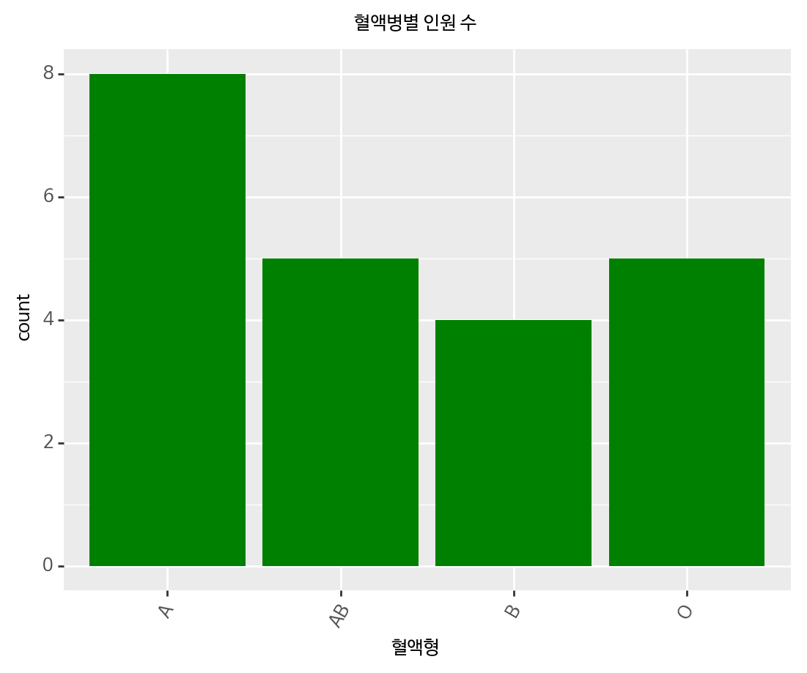


    <ggplot: (-9223363278386151157)>


```python
df_blood_group = df_blood.groupby('혈액형').size()

df_blood_group.plot.pie()

```


    <matplotlib.axes._subplots.AxesSubplot at 0x7f73d69412b0>


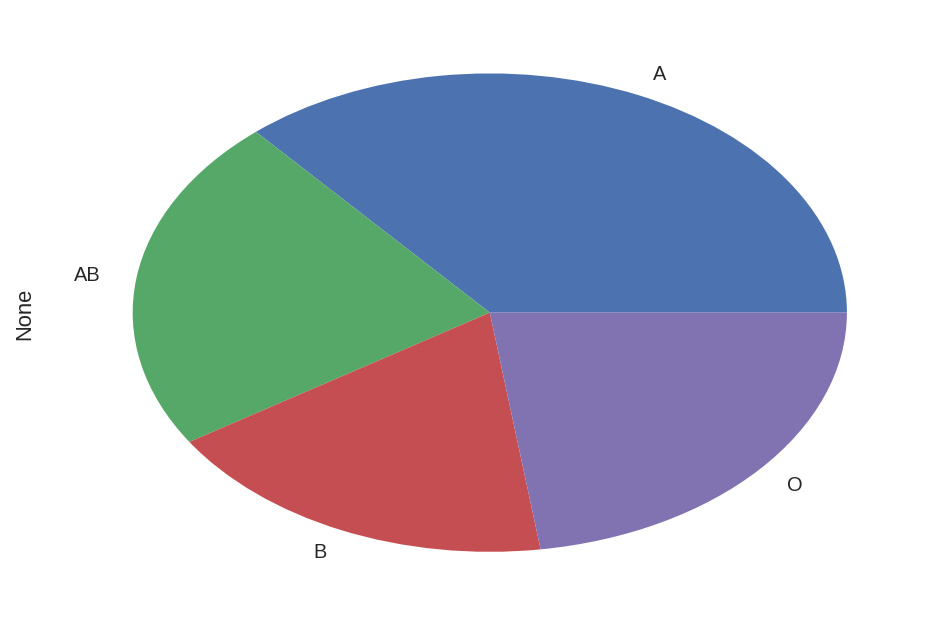


## 파레토 그림 - 화장지 불량률


```python
df_paper = get_df('화장지 불량률')
print(df_paper.shape)
df_paper.tail(3)
```

    (50, 1)
    


<div>
<style scoped>
    .dataframe tbody tr th:only-of-type {
        vertical-align: middle;
    }

    .dataframe tbody tr th {
        vertical-align: top;
    }

    .dataframe thead th {
        text-align: right;
    }
</style>
<table border="1" class="dataframe">
  <thead>
    <tr style="text-align: right;">
      <th></th>
      <th>화장지 불량 종류</th>
    </tr>
  </thead>
  <tbody>
    <tr>
      <th>48</th>
      <td>구멍뚫림</td>
    </tr>
    <tr>
      <th>49</th>
      <td>찢어짐</td>
    </tr>
    <tr>
      <th>50</th>
      <td>구멍뚫림</td>
    </tr>
  </tbody>
</table>
</div>


```python
df_paper.describe()
```


<div>
<style scoped>
    .dataframe tbody tr th:only-of-type {
        vertical-align: middle;
    }

    .dataframe tbody tr th {
        vertical-align: top;
    }

    .dataframe thead th {
        text-align: right;
    }
</style>
<table border="1" class="dataframe">
  <thead>
    <tr style="text-align: right;">
      <th></th>
      <th>화장지 불량 종류</th>
    </tr>
  </thead>
  <tbody>
    <tr>
      <th>count</th>
      <td>50</td>
    </tr>
    <tr>
      <th>unique</th>
      <td>6</td>
    </tr>
    <tr>
      <th>top</th>
      <td>찢어짐</td>
    </tr>
    <tr>
      <th>freq</th>
      <td>23</td>
    </tr>
  </tbody>
</table>
</div>


```python
from matplotlib import pyplot as plot
```


```python
import numpy as np
```


```python
df_paper.set_index('화장지 불량 종류').cumsum()
```


<div>
<style scoped>
    .dataframe tbody tr th:only-of-type {
        vertical-align: middle;
    }

    .dataframe tbody tr th {
        vertical-align: top;
    }

    .dataframe thead th {
        text-align: right;
    }
</style>
<table border="1" class="dataframe">
  <thead>
    <tr style="text-align: right;">
      <th></th>
    </tr>
    <tr>
      <th>화장지 불량 종류</th>
    </tr>
  </thead>
  <tbody>
    <tr>
      <th>크기 불량</th>
    </tr>
    <tr>
      <th>찢어짐</th>
    </tr>
    <tr>
      <th>구멍뚫림</th>
    </tr>
    <tr>
      <th>찢어짐</th>
    </tr>
    <tr>
      <th>잘못접혀짐</th>
    </tr>
    <tr>
      <th>찢어짐</th>
    </tr>
    <tr>
      <th>찢어짐</th>
    </tr>
    <tr>
      <th>기타</th>
    </tr>
    <tr>
      <th>찢어짐</th>
    </tr>
    <tr>
      <th>구멍뚫림</th>
    </tr>
    <tr>
      <th>구멍뚫림</th>
    </tr>
    <tr>
      <th>찢어짐</th>
    </tr>
    <tr>
      <th>찢어짐</th>
    </tr>
    <tr>
      <th>찢어짐</th>
    </tr>
    <tr>
      <th>구멍뚫림</th>
    </tr>
    <tr>
      <th>찢어짐</th>
    </tr>
    <tr>
      <th>구멍뚫림</th>
    </tr>
    <tr>
      <th>잘못접혀짐</th>
    </tr>
    <tr>
      <th>구멍뚫림</th>
    </tr>
    <tr>
      <th>기타</th>
    </tr>
    <tr>
      <th>찢어짐</th>
    </tr>
    <tr>
      <th>찢어짐</th>
    </tr>
    <tr>
      <th>찢어짐</th>
    </tr>
    <tr>
      <th>구멍뚫림</th>
    </tr>
    <tr>
      <th>찢어짐</th>
    </tr>
    <tr>
      <th>구멍뚫림</th>
    </tr>
    <tr>
      <th>찢어짐</th>
    </tr>
    <tr>
      <th>찢어짐</th>
    </tr>
    <tr>
      <th>두께불량</th>
    </tr>
    <tr>
      <th>찢어짐</th>
    </tr>
    <tr>
      <th>찢어짐</th>
    </tr>
    <tr>
      <th>찢어짐</th>
    </tr>
    <tr>
      <th>기타</th>
    </tr>
    <tr>
      <th>구멍뚫림</th>
    </tr>
    <tr>
      <th>구멍뚫림</th>
    </tr>
    <tr>
      <th>두께불량</th>
    </tr>
    <tr>
      <th>찢어짐</th>
    </tr>
    <tr>
      <th>잘못접혀짐</th>
    </tr>
    <tr>
      <th>찢어짐</th>
    </tr>
    <tr>
      <th>구멍뚫림</th>
    </tr>
    <tr>
      <th>구멍뚫림</th>
    </tr>
    <tr>
      <th>구멍뚫림</th>
    </tr>
    <tr>
      <th>찢어짐</th>
    </tr>
    <tr>
      <th>구멍뚫림</th>
    </tr>
    <tr>
      <th>찢어짐</th>
    </tr>
    <tr>
      <th>기타</th>
    </tr>
    <tr>
      <th>크기 불량</th>
    </tr>
    <tr>
      <th>구멍뚫림</th>
    </tr>
    <tr>
      <th>찢어짐</th>
    </tr>
    <tr>
      <th>구멍뚫림</th>
    </tr>
  </tbody>
</table>
</div>


```python
import matplotlib.pyplot as plt
```


```python
import numpy as np
```


```python
! pip install pareto
```

    Requirement already satisfied: pareto in /usr/local/lib/python3.6/dist-packages (1.1.1.post3)


```python
import pareto as pr
```


```python
fig, axes = plt.subplots(2, 2)
```


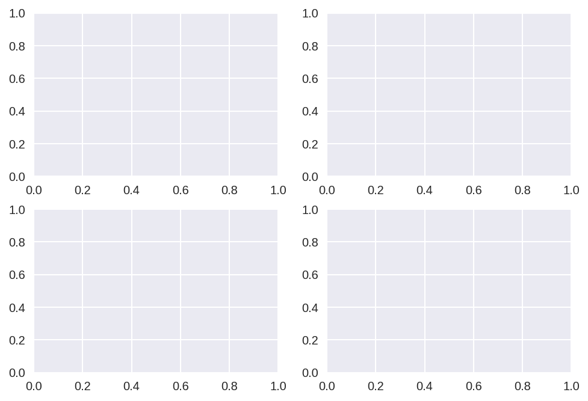


```python
df_paper.groupby('화장지 불량 종류').size().plot(kind='Bar',title='화장지불량종류')
```


    <matplotlib.axes._subplots.AxesSubplot at 0x7f73d674e1d0>


## 조선왕


```python
df_king = get_df('조선왕')
print(df_king.shape)
df_king.tail() 
#조선왕의 상위 5개의 데이터를 가져옵니다. 
```

    (27, 3)
    


<div>
<style scoped>
    .dataframe tbody tr th:only-of-type {
        vertical-align: middle;
    }

    .dataframe tbody tr th {
        vertical-align: top;
    }

    .dataframe thead th {
        text-align: right;
    }
</style>
<table border="1" class="dataframe">
  <thead>
    <tr style="text-align: right;">
      <th></th>
      <th>name</th>
      <th>life</th>
      <th>period</th>
    </tr>
  </thead>
  <tbody>
    <tr>
      <th>23</th>
      <td>순조</td>
      <td>44</td>
      <td>34</td>
    </tr>
    <tr>
      <th>24</th>
      <td>헌종</td>
      <td>22</td>
      <td>15</td>
    </tr>
    <tr>
      <th>25</th>
      <td>철종</td>
      <td>32</td>
      <td>14</td>
    </tr>
    <tr>
      <th>26</th>
      <td>고종</td>
      <td>67</td>
      <td>43</td>
    </tr>
    <tr>
      <th>27</th>
      <td>순종</td>
      <td>52</td>
      <td>4</td>
    </tr>
  </tbody>
</table>
</div>


```python
df_king.info()

```

    <class 'pandas.core.frame.DataFrame'>
    Int64Index: 27 entries, 1 to 27
    Data columns (total 3 columns):
    name      27 non-null object
    life      27 non-null object
    period    27 non-null object
    dtypes: object(3)
    memory usage: 864.0+ bytes
    


```python
df_king.describe()
```


<div>
<style scoped>
    .dataframe tbody tr th:only-of-type {
        vertical-align: middle;
    }

    .dataframe tbody tr th {
        vertical-align: top;
    }

    .dataframe thead th {
        text-align: right;
    }
</style>
<table border="1" class="dataframe">
  <thead>
    <tr style="text-align: right;">
      <th></th>
      <th>name</th>
      <th>life</th>
      <th>period</th>
    </tr>
  </thead>
  <tbody>
    <tr>
      <th>count</th>
      <td>27</td>
      <td>27</td>
      <td>27</td>
    </tr>
    <tr>
      <th>unique</th>
      <td>27</td>
      <td>24</td>
      <td>21</td>
    </tr>
    <tr>
      <th>top</th>
      <td>광해</td>
      <td>56</td>
      <td>2</td>
    </tr>
    <tr>
      <th>freq</th>
      <td>1</td>
      <td>2</td>
      <td>3</td>
    </tr>
  </tbody>
</table>
</div>


```python
df_king['life'] = df_king['life'].astype(int)
df_king['period'] = df_king['period'].astype(int)

df_king.describe()

#data type변경이후 count, mean, min/max, 사분위수를 알 수 있다. 
```


<div>
<style scoped>
    .dataframe tbody tr th:only-of-type {
        vertical-align: middle;
    }

    .dataframe tbody tr th {
        vertical-align: top;
    }

    .dataframe thead th {
        text-align: right;
    }
</style>
<table border="1" class="dataframe">
  <thead>
    <tr style="text-align: right;">
      <th></th>
      <th>life</th>
      <th>period</th>
    </tr>
  </thead>
  <tbody>
    <tr>
      <th>count</th>
      <td>27.000000</td>
      <td>27.000000</td>
    </tr>
    <tr>
      <th>mean</th>
      <td>46.111111</td>
      <td>19.259259</td>
    </tr>
    <tr>
      <th>std</th>
      <td>16.678714</td>
      <td>15.383789</td>
    </tr>
    <tr>
      <th>min</th>
      <td>16.000000</td>
      <td>1.000000</td>
    </tr>
    <tr>
      <th>25%</th>
      <td>33.000000</td>
      <td>5.500000</td>
    </tr>
    <tr>
      <th>50%</th>
      <td>48.000000</td>
      <td>15.000000</td>
    </tr>
    <tr>
      <th>75%</th>
      <td>56.000000</td>
      <td>29.500000</td>
    </tr>
    <tr>
      <th>max</th>
      <td>82.000000</td>
      <td>52.000000</td>
    </tr>
  </tbody>
</table>
</div>


```python
df_king.isnull().sum()

#결측치를 보고 싶을 때 널값을 구한다. 
```


    0
    name      0
    life      0
    period    0
    dtype: int64


```python
df_king.std() 
#표준편차보기
```


    0
    life      16.678714
    period    15.383789
    dtype: float64


```python
#평균값만 보기
df_king.mean()
```


    0
    life      46.111111
    period    19.259259
    dtype: float64


```python
df_king.max()
```


    0
    name      효종
    life      82
    period    52
    dtype: object


```python
#재임기간 중 최대
df_king['period'].max()
```


    52


```python
# 왕들의 수명.
df_king['life'].plot()
```


    <matplotlib.axes._subplots.AxesSubplot at 0x7f73d6b4aa58>


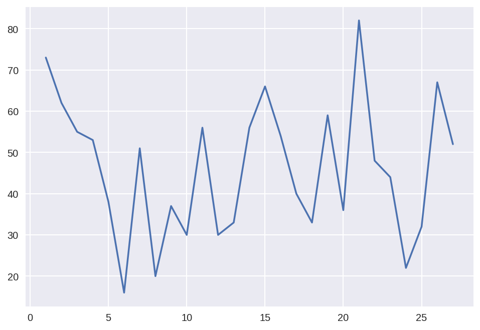


```python
df_king['period'].hist(stacked=True, bins=10)

# 재임기간 히스토그램
```


    <matplotlib.axes._subplots.AxesSubplot at 0x7f73d6aaa2e8>


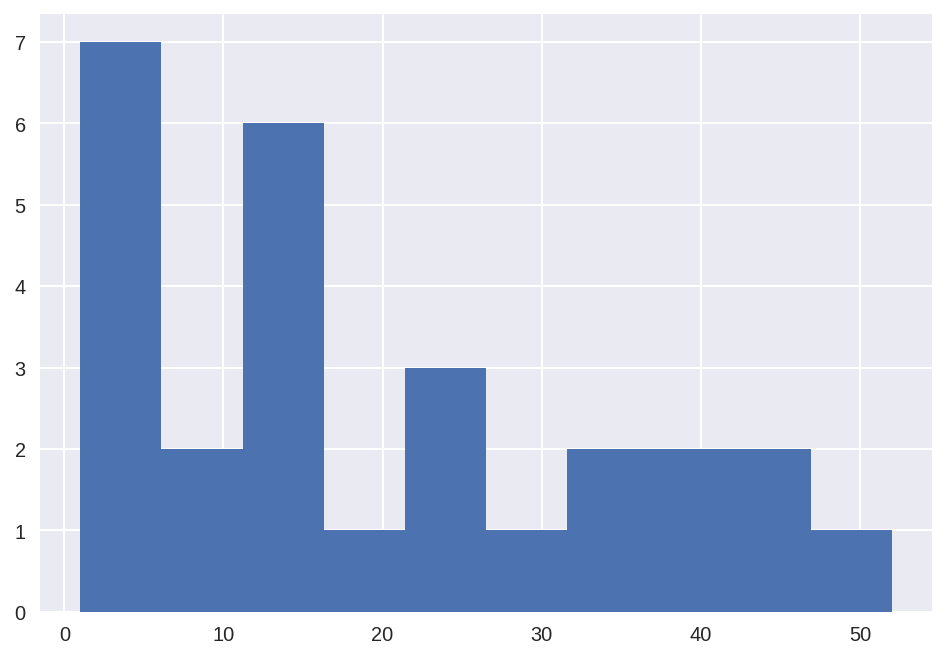


## 타이타닉


```python
df_titanic = get_df('타이타닉')

print(df_titanic.shape)
#상위 5개의 데이터를 가져옵니다.
df_titanic.head()

```

    (101, 2)
    


<div>
<style scoped>
    .dataframe tbody tr th:only-of-type {
        vertical-align: middle;
    }

    .dataframe tbody tr th {
        vertical-align: top;
    }

    .dataframe thead th {
        text-align: right;
    }
</style>
<table border="1" class="dataframe">
  <thead>
    <tr style="text-align: right;">
      <th></th>
      <th>Class</th>
      <th>생존여부</th>
    </tr>
  </thead>
  <tbody>
    <tr>
      <th>1</th>
      <td>crew</td>
      <td>no</td>
    </tr>
    <tr>
      <th>2</th>
      <td>3등급</td>
      <td>no</td>
    </tr>
    <tr>
      <th>3</th>
      <td>crew</td>
      <td>no</td>
    </tr>
    <tr>
      <th>4</th>
      <td>crew</td>
      <td>no</td>
    </tr>
    <tr>
      <th>5</th>
      <td>1등급</td>
      <td>yes</td>
    </tr>
  </tbody>
</table>
</div>


```python
df_titanic.columns
```


    Index(['Class', '생존여부'], dtype='object', name=0)


```python
df_titanic.describe()
```


<div>
<style scoped>
    .dataframe tbody tr th:only-of-type {
        vertical-align: middle;
    }

    .dataframe tbody tr th {
        vertical-align: top;
    }

    .dataframe thead th {
        text-align: right;
    }
</style>
<table border="1" class="dataframe">
  <thead>
    <tr style="text-align: right;">
      <th></th>
      <th>Class</th>
      <th>생존여부</th>
    </tr>
  </thead>
  <tbody>
    <tr>
      <th>count</th>
      <td>101</td>
      <td>101</td>
    </tr>
    <tr>
      <th>unique</th>
      <td>4</td>
      <td>2</td>
    </tr>
    <tr>
      <th>top</th>
      <td>crew</td>
      <td>no</td>
    </tr>
    <tr>
      <th>freq</th>
      <td>36</td>
      <td>54</td>
    </tr>
  </tbody>
</table>
</div>


```python
df_titanic['Class'].value_counts()
```


    crew    36
    3등급     33
    2등급     19
    1등급     13
    Name: Class, dtype: int64


```python
df_titanic['생존여부'].value_counts()
```


    no     54
    yes    47
    Name: 생존여부, dtype: int64


```python
#그룹별 생존여부 
df_no = df_titanic[df_titanic['생존여부'] == 'no']
df_no.head()

```


<div>
<style scoped>
    .dataframe tbody tr th:only-of-type {
        vertical-align: middle;
    }

    .dataframe tbody tr th {
        vertical-align: top;
    }

    .dataframe thead th {
        text-align: right;
    }
</style>
<table border="1" class="dataframe">
  <thead>
    <tr style="text-align: right;">
      <th></th>
      <th>Class</th>
      <th>생존여부</th>
    </tr>
  </thead>
  <tbody>
    <tr>
      <th>1</th>
      <td>crew</td>
      <td>no</td>
    </tr>
    <tr>
      <th>2</th>
      <td>3등급</td>
      <td>no</td>
    </tr>
    <tr>
      <th>3</th>
      <td>crew</td>
      <td>no</td>
    </tr>
    <tr>
      <th>4</th>
      <td>crew</td>
      <td>no</td>
    </tr>
    <tr>
      <th>8</th>
      <td>3등급</td>
      <td>no</td>
    </tr>
  </tbody>
</table>
</div>


```python
#등급별 생존하지 못한 승객 수 

df_no.groupby('Class').size().plot(kind='bar')
```


    <matplotlib.axes._subplots.AxesSubplot at 0x7f73d6e72a58>


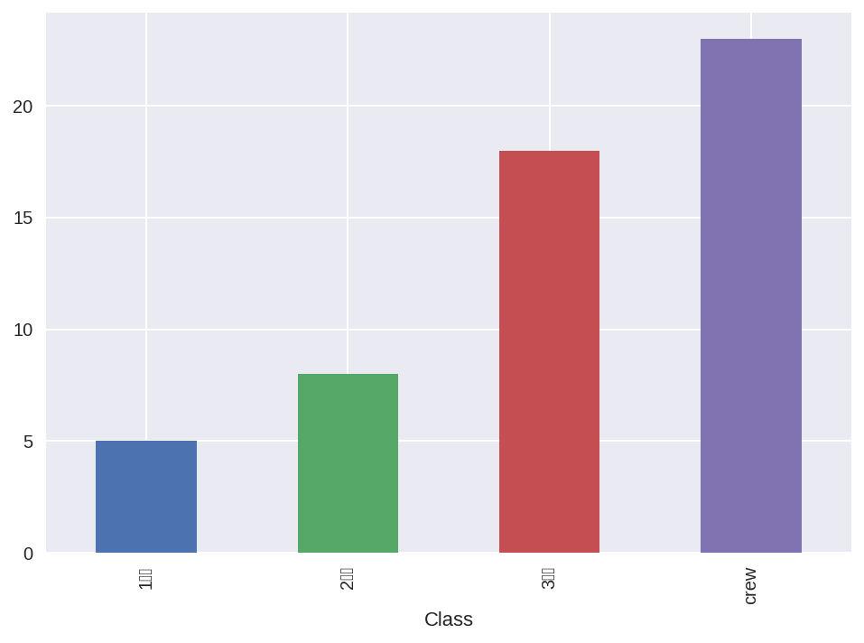


## GNP


```python
df_gnp = get_df('GNP')
df_gnp.head()
```


<div>
<style scoped>
    .dataframe tbody tr th:only-of-type {
        vertical-align: middle;
    }

    .dataframe tbody tr th {
        vertical-align: top;
    }

    .dataframe thead th {
        text-align: right;
    }
</style>
<table border="1" class="dataframe">
  <thead>
    <tr style="text-align: right;">
      <th></th>
      <th>국가</th>
      <th>GNP대비 교육비 지출 비율</th>
    </tr>
  </thead>
  <tbody>
    <tr>
      <th>1</th>
      <td>한국</td>
      <td>4.4</td>
    </tr>
    <tr>
      <th>2</th>
      <td>일본</td>
      <td>4</td>
    </tr>
    <tr>
      <th>3</th>
      <td>미국</td>
      <td>5.3</td>
    </tr>
    <tr>
      <th>4</th>
      <td>타이완</td>
      <td>5.7</td>
    </tr>
    <tr>
      <th>5</th>
      <td>캐나다</td>
      <td>7.6</td>
    </tr>
  </tbody>
</table>
</div>


```python
df_gnp.describe()
```


<div>
<style scoped>
    .dataframe tbody tr th:only-of-type {
        vertical-align: middle;
    }

    .dataframe tbody tr th {
        vertical-align: top;
    }

    .dataframe thead th {
        text-align: right;
    }
</style>
<table border="1" class="dataframe">
  <thead>
    <tr style="text-align: right;">
      <th></th>
      <th>국가</th>
      <th>GNP대비 교육비 지출 비율</th>
    </tr>
  </thead>
  <tbody>
    <tr>
      <th>count</th>
      <td>8</td>
      <td>8</td>
    </tr>
    <tr>
      <th>unique</th>
      <td>8</td>
      <td>8</td>
    </tr>
    <tr>
      <th>top</th>
      <td>일본</td>
      <td>5.4</td>
    </tr>
    <tr>
      <th>freq</th>
      <td>1</td>
      <td>1</td>
    </tr>
  </tbody>
</table>
</div>


```python
df_gnp.info
```


    <bound method DataFrame.info of 0     국가 GNP대비 교육비 지출 비율
    1     한국             4.4
    2     일본               4
    3     미국             5.3
    4    타이완             5.7
    5    캐나다             7.6
    6     영국             5.2
    7   이탈리아             5.4
    8  말레이시아             5.5>


```python
 #gnp 대비 교육비 지출 비율 그래프 그리기 위해 dtype을 float으로 바꿔줌. 
  
  df_gnp['GNP대비 교육비 지출 비율'] = df_gnp['GNP대비 교육비 지출 비율'].astype(float)
  df_gnp.mean()                                 
 
```


    0
    GNP대비 교육비 지출 비율    5.3875
    dtype: float64


```python
df_gnp.plot(kind='bar',x ='국가', y ='GNP대비 교육비 지출 비율') 
```


    <matplotlib.axes._subplots.AxesSubplot at 0x7f73d68e4080>


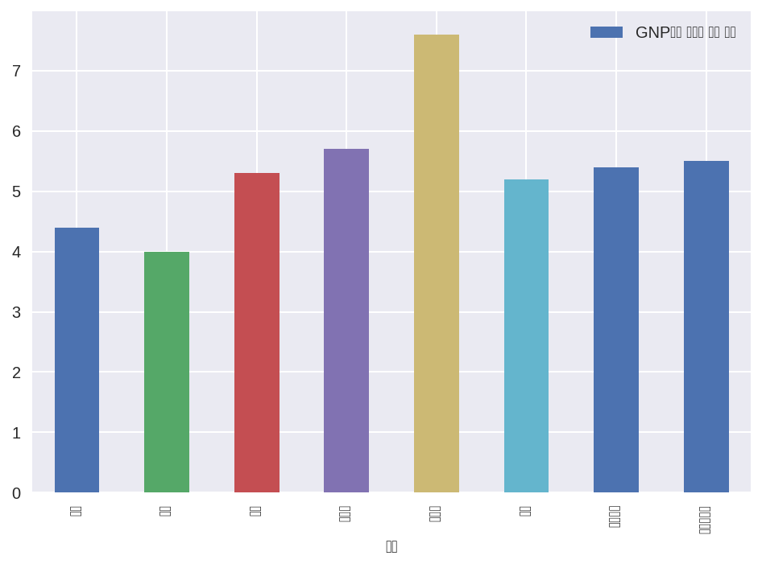


## 집값


```python
df_realest = get_df('집 값')
df_realest.head()
```


<div>
<style scoped>
    .dataframe tbody tr th:only-of-type {
        vertical-align: middle;
    }

    .dataframe tbody tr th {
        vertical-align: top;
    }

    .dataframe thead th {
        text-align: right;
    }
</style>
<table border="1" class="dataframe">
  <thead>
    <tr style="text-align: right;">
      <th></th>
      <th>도심&amp;외각</th>
      <th>주택가격</th>
    </tr>
  </thead>
  <tbody>
    <tr>
      <th>1</th>
      <td>outer</td>
      <td>24</td>
    </tr>
    <tr>
      <th>2</th>
      <td>outer</td>
      <td>21.6</td>
    </tr>
    <tr>
      <th>3</th>
      <td>outer</td>
      <td>34.7</td>
    </tr>
    <tr>
      <th>4</th>
      <td>outer</td>
      <td>33.4</td>
    </tr>
    <tr>
      <th>5</th>
      <td>outer</td>
      <td>36.2</td>
    </tr>
  </tbody>
</table>
</div>


```python
df_realest.tail()
```


<div>
<style scoped>
    .dataframe tbody tr th:only-of-type {
        vertical-align: middle;
    }

    .dataframe tbody tr th {
        vertical-align: top;
    }

    .dataframe thead th {
        text-align: right;
    }
</style>
<table border="1" class="dataframe">
  <thead>
    <tr style="text-align: right;">
      <th></th>
      <th>도심&amp;외각</th>
      <th>주택가격</th>
    </tr>
  </thead>
  <tbody>
    <tr>
      <th>502</th>
      <td>inner</td>
      <td>22.4</td>
    </tr>
    <tr>
      <th>503</th>
      <td>inner</td>
      <td>20.6</td>
    </tr>
    <tr>
      <th>504</th>
      <td>inner</td>
      <td>23.9</td>
    </tr>
    <tr>
      <th>505</th>
      <td>inner</td>
      <td>22</td>
    </tr>
    <tr>
      <th>506</th>
      <td>inner</td>
      <td>11.9</td>
    </tr>
  </tbody>
</table>
</div>


```python
# 도심, 외각 집값 평균
df_realest['주택가격'] = df_realest['주택가격'].astype('float')
df_realest.groupby('도심&외각').mean()
```


<div>
<style scoped>
    .dataframe tbody tr th:only-of-type {
        vertical-align: middle;
    }

    .dataframe tbody tr th {
        vertical-align: top;
    }

    .dataframe thead th {
        text-align: right;
    }
</style>
<table border="1" class="dataframe">
  <thead>
    <tr style="text-align: right;">
      <th></th>
      <th>주택가격</th>
    </tr>
    <tr>
      <th>도심&amp;외각</th>
      <th></th>
    </tr>
  </thead>
  <tbody>
    <tr>
      <th>inner</th>
      <td>20.027668</td>
    </tr>
    <tr>
      <th>outer</th>
      <td>25.037945</td>
    </tr>
  </tbody>
</table>
</div>


```python
df_realest.groupby('도심&외각').hist()
```


    도심&외각
    inner    [[AxesSubplot(0.125,0.125;0.775x0.755)]]
    outer    [[AxesSubplot(0.125,0.125;0.775x0.755)]]
    dtype: object


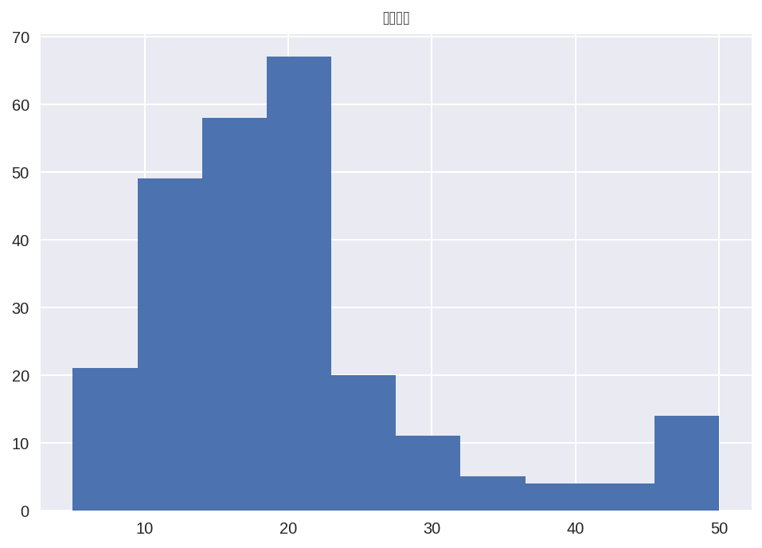


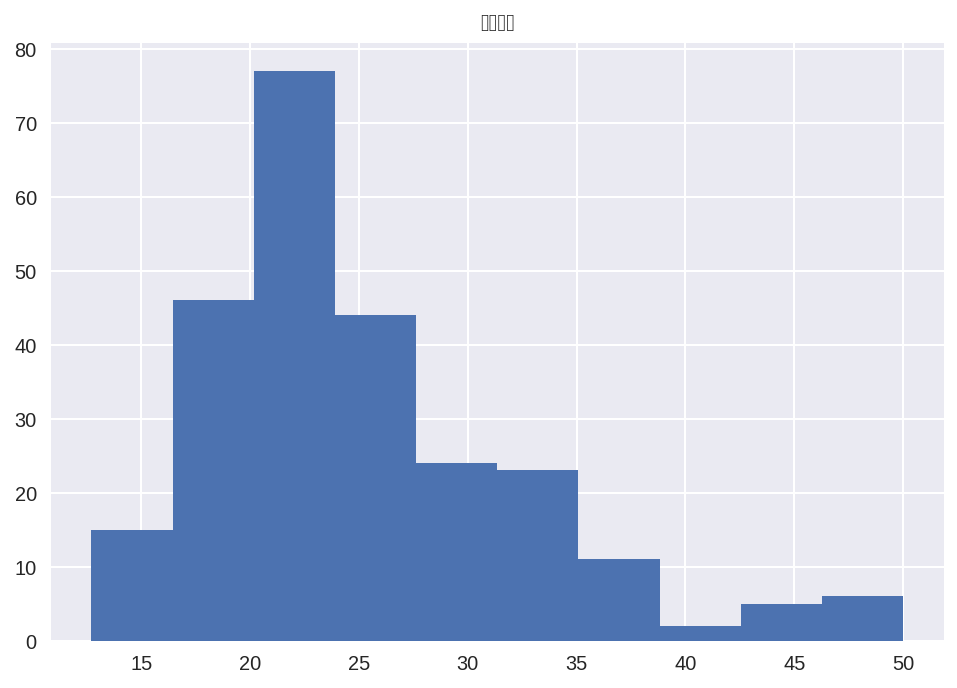


```python
(ggplot(df_realest, aes(x='도심&외각', y='주택가격', fill='도심&외각'))
 + geom_boxplot()
 + labs(y='주택가격', x='도심&외각', title='집 값')
 + theme(text=element_text(family='NanumBarunGothic'))
)
```


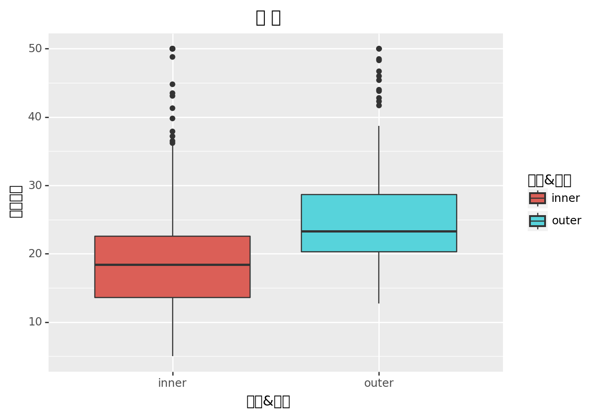


    <ggplot: (8758468431245)>


## 포유류


```python
df_mammal = get_df('포유류')
df_mammal.head()
```


<div>
<style scoped>
    .dataframe tbody tr th:only-of-type {
        vertical-align: middle;
    }

    .dataframe tbody tr th {
        vertical-align: top;
    }

    .dataframe thead th {
        text-align: right;
    }
</style>
<table border="1" class="dataframe">
  <thead>
    <tr style="text-align: right;">
      <th></th>
      <th>몸무게</th>
      <th>뇌무게</th>
    </tr>
  </thead>
  <tbody>
    <tr>
      <th>1</th>
      <td>3.385</td>
      <td>44.5</td>
    </tr>
    <tr>
      <th>2</th>
      <td>0.48</td>
      <td>15.5</td>
    </tr>
    <tr>
      <th>3</th>
      <td>1.35</td>
      <td>8.1</td>
    </tr>
    <tr>
      <th>4</th>
      <td>465</td>
      <td>423</td>
    </tr>
    <tr>
      <th>5</th>
      <td>36.33</td>
      <td>119.5</td>
    </tr>
  </tbody>
</table>
</div>


```python
df_mammal['몸무게'] = df_mammal['몸무게'].astype('float')

df_mammal['뇌무게'] = df_mammal['뇌무게'].astype('float')
```


```python
import math

log_brainweight = []
log_bodyweight = []

for bdw in df_mammal['몸무게']:
    log_bodyweight.append(math.log(bdw))
    
for brw in df_mammal['뇌무게']:
    log_brainweight.append(math.log(brw))
```


```python
plt.scatter(df_mammal['몸무게'], df_mammal['뇌무게'])
```


    <matplotlib.collections.PathCollection at 0x7f73d6656710>


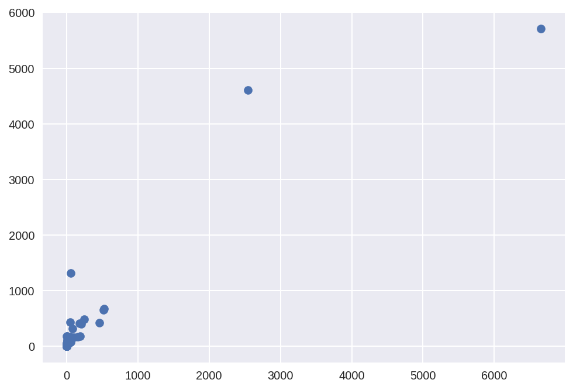


```python
df_mammal['몸무게로그'] = log_bodyweight
df_mammal['뇌무게로그'] = log_brainweight
```


```python
df_mammal.head()
```


<div>
<style scoped>
    .dataframe tbody tr th:only-of-type {
        vertical-align: middle;
    }

    .dataframe tbody tr th {
        vertical-align: top;
    }

    .dataframe thead th {
        text-align: right;
    }
</style>
<table border="1" class="dataframe">
  <thead>
    <tr style="text-align: right;">
      <th></th>
      <th>몸무게</th>
      <th>뇌무게</th>
      <th>몸무게로그</th>
      <th>뇌무게로그</th>
    </tr>
  </thead>
  <tbody>
    <tr>
      <th>1</th>
      <td>3.385</td>
      <td>44.5</td>
      <td>1.219354</td>
      <td>3.795489</td>
    </tr>
    <tr>
      <th>2</th>
      <td>0.480</td>
      <td>15.5</td>
      <td>-0.733969</td>
      <td>2.740840</td>
    </tr>
    <tr>
      <th>3</th>
      <td>1.350</td>
      <td>8.1</td>
      <td>0.300105</td>
      <td>2.091864</td>
    </tr>
    <tr>
      <th>4</th>
      <td>465.000</td>
      <td>423.0</td>
      <td>6.142037</td>
      <td>6.047372</td>
    </tr>
    <tr>
      <th>5</th>
      <td>36.330</td>
      <td>119.5</td>
      <td>3.592644</td>
      <td>4.783316</td>
    </tr>
  </tbody>
</table>
</div>


```python
plt.scatter(df_mammal['몸무게로그'], df_mammal['뇌무게로그'])
```


    <matplotlib.collections.PathCollection at 0x7f73d6634438>


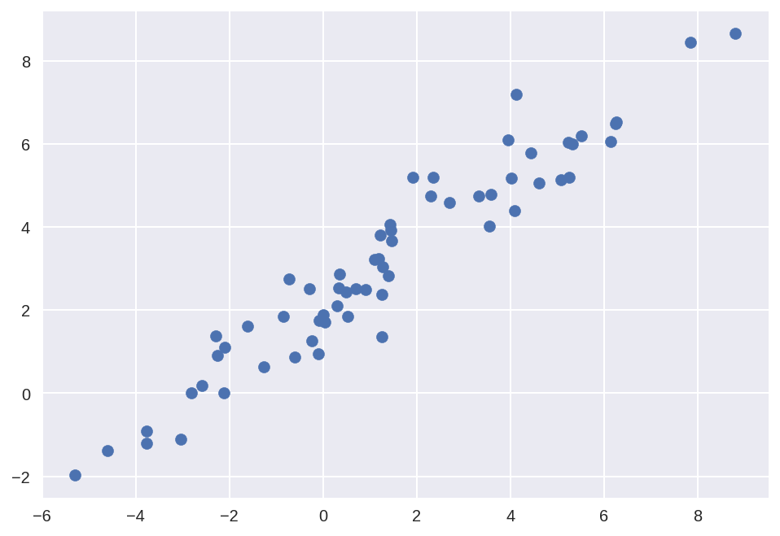

