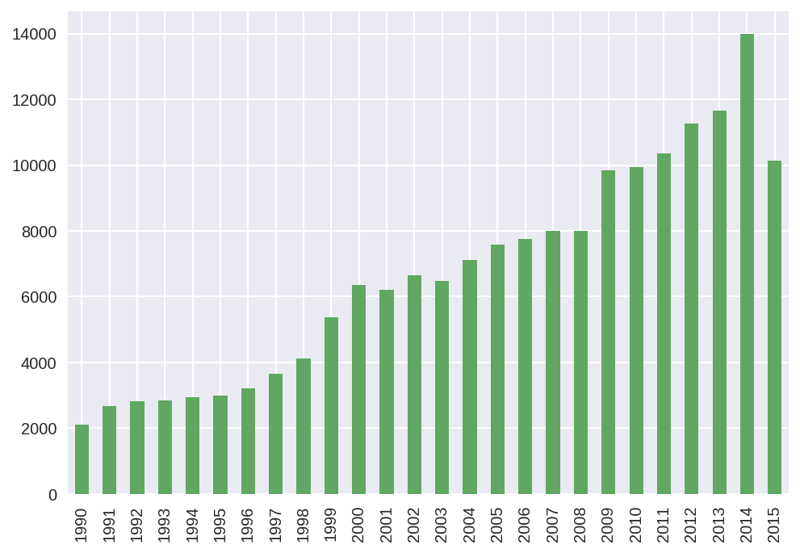
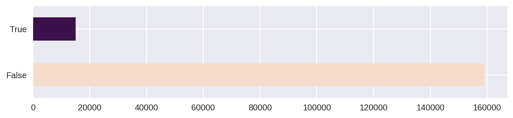
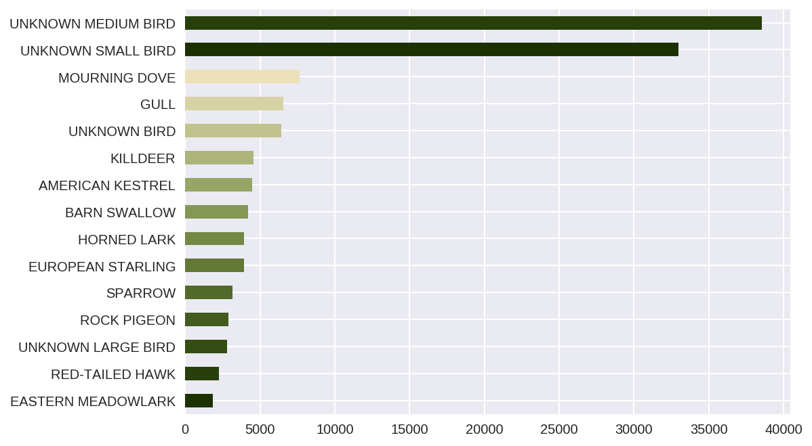
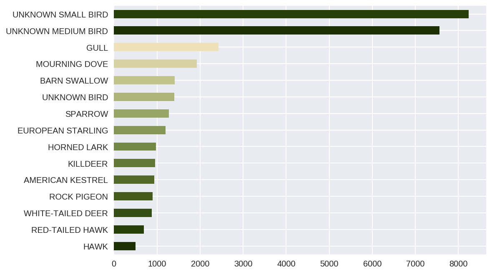
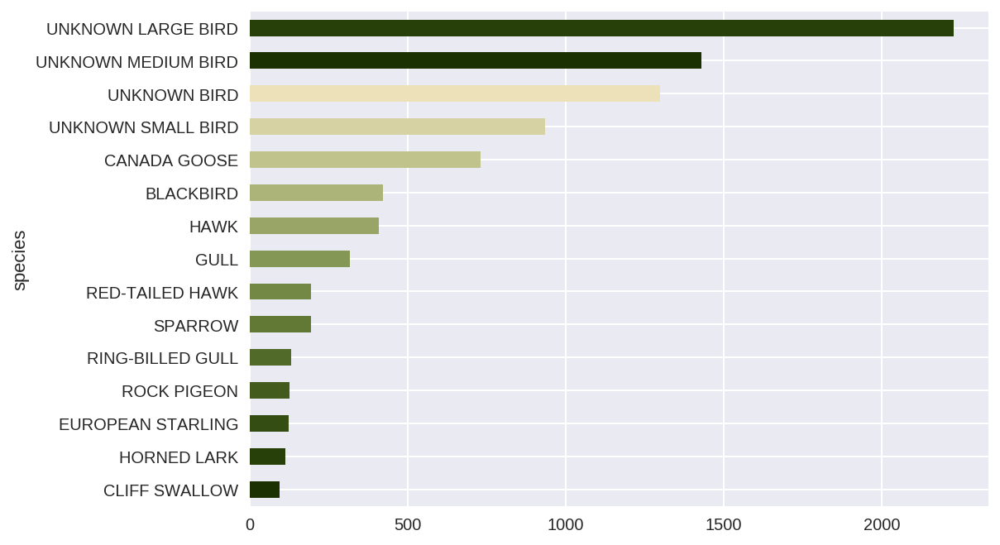
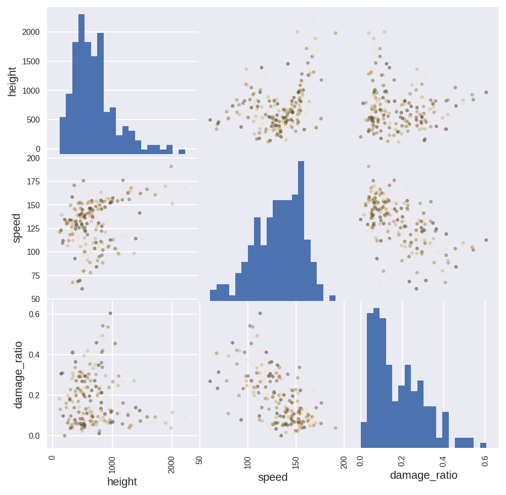

캐글에서 [야생동물 충돌로 인한 비행기 사고](https://www.kaggle.com/faa/wildlife-strikes) 데이터셋을 실습용으로 다듬은 데이터.


```python
%config InlineBackend.figure_format = 'retina'
!pip install matplotlib pandas plotnine statsmodels --upgrade > /dev/null

import pandas as pd
import numpy as np
import matplotlib.pyplot as plt


src = pd.read_csv(
    "https://s3.ap-northeast-2.amazonaws.com/data10902/messy/aircraft-strikes.csv",
    dtype={
        "record_id": np.int32,
        "year": np.int32,
        "month": np.int32,
        "day": np.int32,
        "operator_id": str,
        "operator": str,
        "aircraft": str,
        "species": str,
        "aircraft_damage": bool,
        "height": np.float32,
        "speed": np.float32,
    }
)
```

실수에 대비한 사본 만들기.


```python
df = src.copy()
```

데이터 설명:

* record_id: 고유 번호
* year, month, day: 사고 발생일
* operator_id: 운영사(항공사?) 식별코드
* operator: 운영사 이름
* aircraft: 비행기 기종
* species: 야생동물종
* aircraft_damage: 항공기 손상 여부
* height: 고도
* speed: 속도


```python
df.tail()
```


<div>
<style scoped>
    .dataframe tbody tr th:only-of-type {
        vertical-align: middle;
    }

    .dataframe tbody tr th {
        vertical-align: top;
    }

    .dataframe thead th {
        text-align: right;
    }
</style>
<table border="1" class="dataframe">
  <thead>
    <tr style="text-align: right;">
      <th></th>
      <th>record_id</th>
      <th>year</th>
      <th>month</th>
      <th>day</th>
      <th>operator_id</th>
      <th>operator</th>
      <th>aircraft</th>
      <th>species</th>
      <th>aircraft_damage</th>
      <th>height</th>
      <th>speed</th>
    </tr>
  </thead>
  <tbody>
    <tr>
      <th>174098</th>
      <td>365837</td>
      <td>2015</td>
      <td>9</td>
      <td>30</td>
      <td>FDX</td>
      <td>FEDEX EXPRESS</td>
      <td>DC-10-10</td>
      <td>UNKNOWN SMALL BIRD</td>
      <td>False</td>
      <td>2000.0</td>
      <td>210.0</td>
    </tr>
    <tr>
      <th>174099</th>
      <td>366091</td>
      <td>2015</td>
      <td>9</td>
      <td>30</td>
      <td>SWA</td>
      <td>SOUTHWEST AIRLINES</td>
      <td>B-737-700</td>
      <td>UNKNOWN SMALL BIRD</td>
      <td>False</td>
      <td>NaN</td>
      <td>NaN</td>
    </tr>
    <tr>
      <th>174100</th>
      <td>365902</td>
      <td>2015</td>
      <td>9</td>
      <td>30</td>
      <td>SWA</td>
      <td>SOUTHWEST AIRLINES</td>
      <td>B-737-700</td>
      <td>UNKNOWN SMALL BIRD</td>
      <td>False</td>
      <td>5000.0</td>
      <td>250.0</td>
    </tr>
    <tr>
      <th>174101</th>
      <td>365903</td>
      <td>2015</td>
      <td>9</td>
      <td>30</td>
      <td>BUS</td>
      <td>BUSINESS</td>
      <td>CITATIONJET</td>
      <td>TURKEY VULTURE</td>
      <td>True</td>
      <td>3000.0</td>
      <td>200.0</td>
    </tr>
    <tr>
      <th>174102</th>
      <td>366046</td>
      <td>2015</td>
      <td>9</td>
      <td>30</td>
      <td>QXE</td>
      <td>HORIZON AIR</td>
      <td>DHC8 DASH 8</td>
      <td>HERMIT THRUSH</td>
      <td>False</td>
      <td>6000.0</td>
      <td>NaN</td>
    </tr>
  </tbody>
</table>
</div>


## 데이터 살펴보기

일단 연도에 따라 사고 발생 건수의 추이를 살펴보자. 사고가 늘고 있을까, 줄고 있을까? 전체 운행 건수와 비교해보면 더 의미가 있겠지만 일단 이거라도 보자.


```python
# 다 같은색으로.

color=["#60a862"]
df["year"].value_counts().sort_index().plot.bar(color=color);

# 배경색을 고려해야한다. 

```





연중 사고가 가장 빈번한 달은?


```python
# year_month = df.groupby(by=["year", "month"])["record_id"] \
#   .aggregate(lambda x: x.value_counts().count()) \
#   .reset_index()

# (ggplot(year_month, aes('factor(month)', 'factor(year)', fill='record_id'))
#  + geom_tile(aes(width=1, height=1))
#  + theme(figure_size=(3.5, 5))
#  + scale_fill_cmap("tab20")
# )


```


    ---------------------------------------------------------------------------

    NameError                                 Traceback (most recent call last)

    <ipython-input-6-5bb031f4c3eb> in <module>()
          4  + geom_tile(aes(width=1, height=1))
          5  + theme(figure_size=(3.5, 5))
    ----> 6  + scale_fill_cmap("tab20")
          7 )
    

    NameError: name 'ggplot' is not defined


대충 시간의 흐름에 따른 패턴에 대해서 살펴보고 났더니 그 다음으로는 인명 피해가 얼마나 클지가 궁금해진다. 기체 손상이 없었다면(aircraft_damage) 아마도 인명 피해가 없었을 것이라고 생각해도 좋지 않을까?


```python
color=['#F6DCCB','#3B114C'] * 20
df["aircraft_damage"].value_counts().plot.barh(figsize=(10, 2), color=color);
```





## 어떤 동물들이 사고를 많이 당할까?

다행스럽게도 기체손상이 없는 경우가 열 배나 많다. 이제는 동물들이 걱정되기 시작했다.

가장 빈번하게 사고를 일으키는 야생동물종은?


```python
top_species = df["species"].value_counts().sort_values()

color=['#1C3102','#273F09','#344D12','#435B1D','#526A29','#627936','#738845','#859755','#98A566','#ACB479','#C1C38D','#D7D2A3','#EDE1BA'] * 20
top_species.tail(15).plot.barh(color=color);

```





이륙 전(height == 0)에 발생한 사고만 보면?


```python
color=['#1C3102','#273F09','#344D12','#435B1D','#526A29','#627936','#738845','#859755','#98A566','#ACB479','#C1C38D','#D7D2A3','#EDE1BA'] * 20
df.loc[df.height == 0, "species"].value_counts().sort_values().tail(15).plot.barh(color=color);

```





사고 당시 평균 고도를 종별로 나눠서 살펴보면 어떤 결과가 나올까?


```python
color=['#1C3102','#273F09','#344D12','#435B1D','#526A29','#627936','#738845','#859755','#98A566','#ACB479','#C1C38D','#D7D2A3','#EDE1BA'] * 20

df.loc[df["species"].isin(top_species.tail(20).index)] \
  .groupby(by="species")["height"].mean() \
  .sort_values().tail(15).plot.barh(color=color);
```





고도, 속도, 기체고장률 사이의 상관 관계는?


```python
top_aircrafts = df["aircraft"].value_counts().sort_values()

# 기종별 사고 빈도, 평균 고도, 평균 속도, 손상률
damages = df.groupby(by="aircraft")[["record_id", "aircraft_damage", "height", "speed"]].agg({
    "record_id": lambda x: len(x.unique()),
    "aircraft_damage": np.sum,
    "height": np.mean,
    "speed": np.mean,
})
damages["damage_ratio"] = damages["aircraft_damage"] / damages["record_id"]

# 사고 빈도가 50회 이상인 기종에 대한 scatter plot matrix
color=['#473306','#755922','#A48348','#D1B07A','#FCE0B7'] * 20
pd.plotting.scatter_matrix(
    damages.loc[damages["record_id"] > 50, ["height", "speed", "damage_ratio"]].sort_values("damage_ratio", ascending=False),
    figsize=(8, 8),
    range_padding=0.2,
    hist_kwds={"bins": 20, colors },
    color=color
);
```




