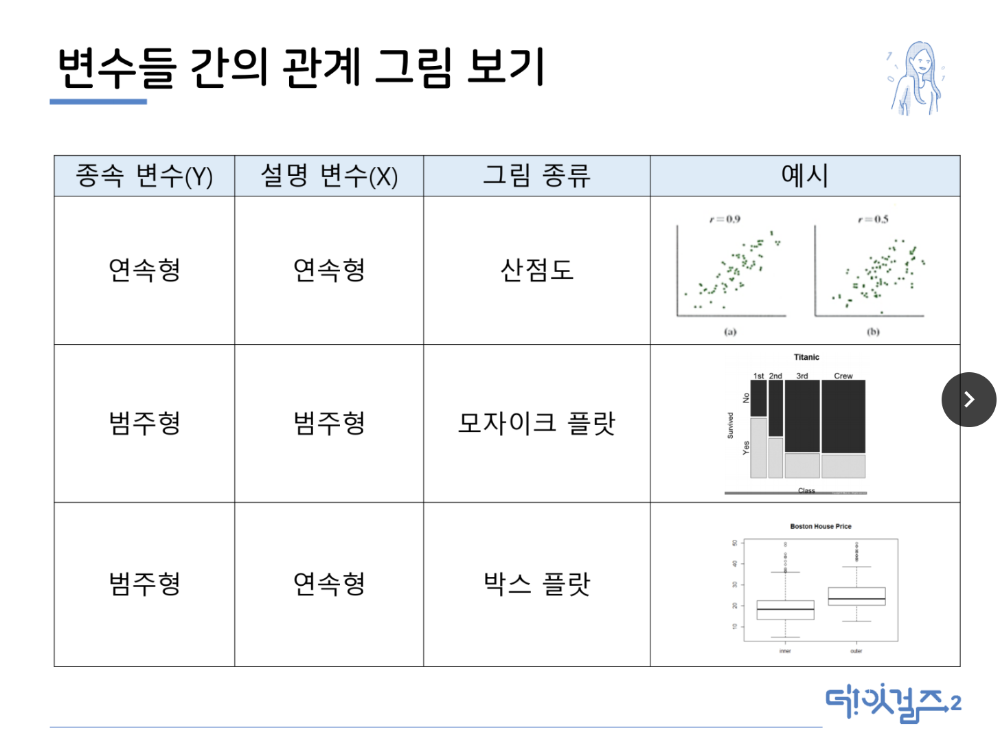
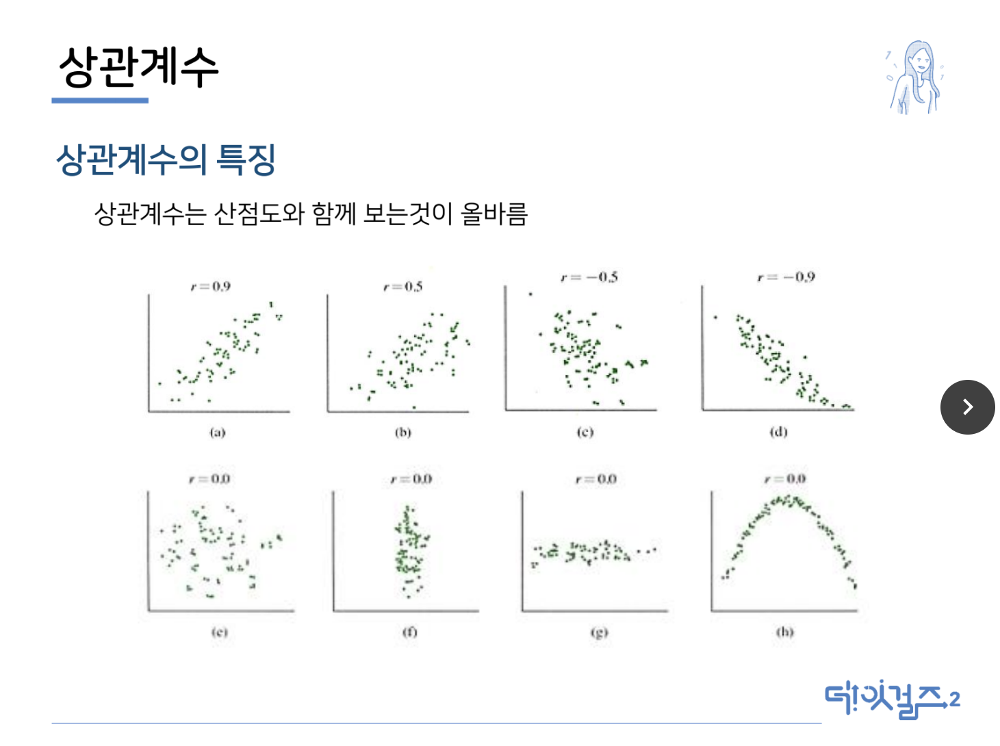
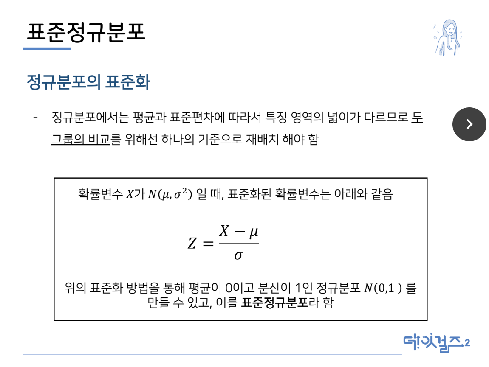
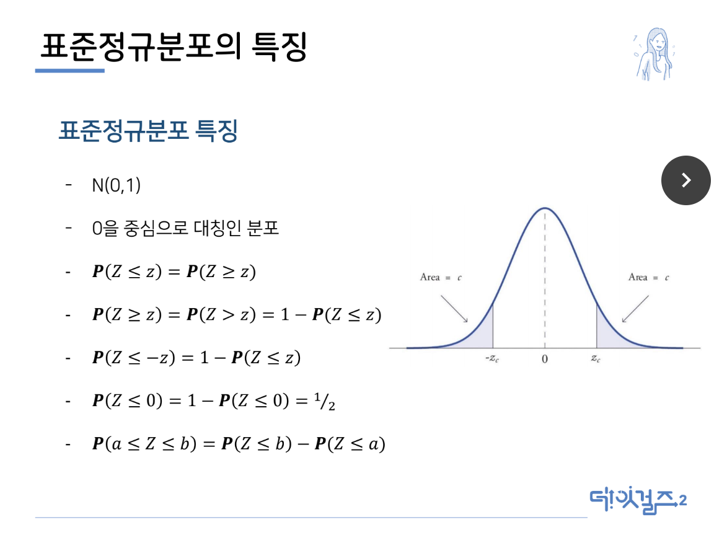
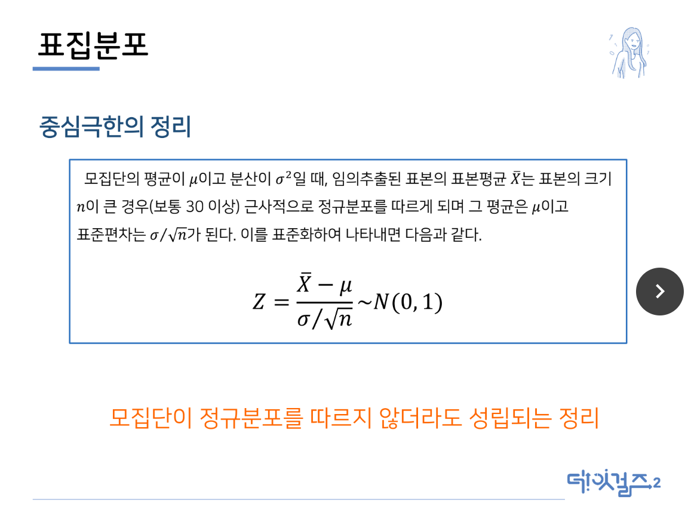
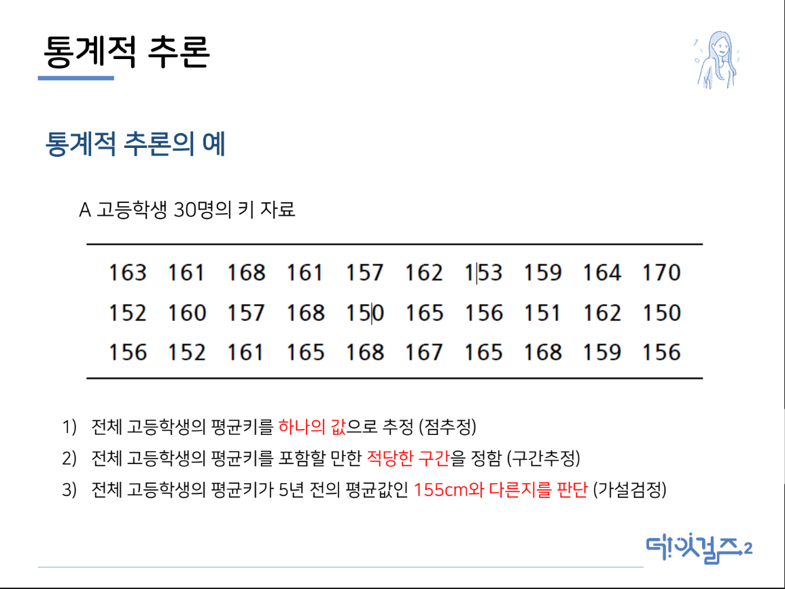
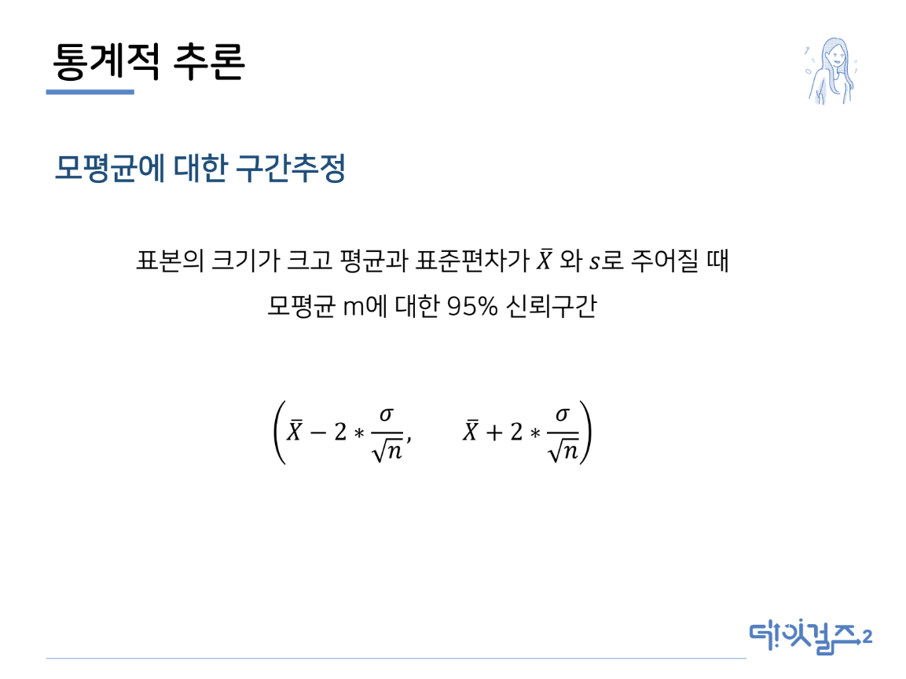

# 데이터 분석가의 JD
```
쿠팡 배송 시스템 분석 : 쿠팡에서 배송하는 모든 물건을 흐름에 대해서 데이터를 다룸
  ex. 몇 개의 수량, 얼마, 어떤 창고에서 나가고, 어떤 허브를 거쳐서 가는지, 어떤 쿠팡맨이 배송하는지 등
```

## 데이터 분석가는 무얼 하는 사람?
> 컴퓨터 공학을 전공한 사람들이 하는 것? 오해다!

> 멋진 분석 알고리즘을 개발하는 사람? 하기는 하지만, 그렇게 거창하지는 않음

* 데이터에서(코딩) + 패턴을 찾아내서(통계와 머신러닝)
  = 비즈니스 기회로, 더 나은 내일로(도메인 지식과 비즈니스)

### 데이터 분석팀의 하루
* UX 리서처 및 기획자와의 협업
  - 문제 정의, 또는 새로운 비즈니스 발굴
  - 많은 이해관계자들과의 커뮤니케이션
* 정의된 문제에 대한 데이터 추출 및 기초통계를 활용한 가설 검증
* 자잘한 데이터 추출
  - 정기보고되는 KPI 추출 또는 대시보딩( 가장 중요하게 봐야하는 정보를 모니터링)
  - 서로 다른 시스템간 데이터 검증
* 개발자와의 협업
  - 모델 구축, 모델 디플로이, 모델 모니터
* 데이터 전처리
  - 탐색적 데이터 분석, 데이터 시각화
* 데이터 분석 세미나, 새로운 분석기술 공유
* 출퇴근 시간 : 회사마다 다르지만, 쿠팡의 경우는 완전 유연 근무제

## 데이터 분석가가 얼마나 핫한가
* Data Scientist는 가장 섹시한 직업이다 from 하버드
* [원티드](wanted.co.kr)
* 넥슨 인텔리전스랩스에서만 총 4가지 분석가 포지션 채용 중(실제는 더 많을 것)

## 데이터 분석가의 JD
### Key Word
* 주요 업무 : 꼭 하실 필요는 없지만..
* 자격요건 : 이건 하셔야 해요
* 우대사항 : 들어오면 이런 일을 하실 거에요
* 가장 많이 나온 명사
```
데이터, 분석, 경험, 서비스, 관련, 활용, 이해, 능력, 기반
개발, 도출, 통계, **인사이트**, 경력 순으로 높은 출현 빈도
```
* 그로스 해커
> 데이터 분석과 유사하지만, 회사의 성장을 위해서 무엇을 해야 하는지를 중점적으로 보는 사람

* 데이터 사이언티스트
> 엔지니어링, 수학적, 시스템적인 백그라운드를 많이 요구

* 커뮤니케이션이라 함은
```
분야에 대한 정보가 없는 사람들에게도 정확하고 쉽게 전달할 수 있어야 함
분석가들끼리의 커뮤니케이션도 가능한 사람
누군가의 Disagree에 대해서 공격이 아니라 그럴 수 있구나하고 받아들일 수 있는 열린 마음
```

* 요즘 회사에서 요구하는 Task
```
광고는 클릭수가 가장 중요하듯, CTR을 높일 수 있는 능력이 있는 사람
```

## 데이터 분석가가 분석하는 데이터 분석가의 JD
```어느 정도가 되면, 자신 있게 사용할 수 있는 언어라고 말할 수 있는가?```
> 연습문제를 많이 풀어보고, 자신 있게 풀 수 있는 정도라면 오케이라고 생각

> 개인프로젝트를 많이 해보면서 일일이 찾아보지 않고도 자유롭게 구현할 수 있는 정도

* 프로그래밍 또는 분석용 언어
  - Python, R, Scala, SAS, Javascript, Pyspark, SparkR
* 데이터베이스, 쿼리언어(DB에서 데이터를 뽑아오는 언어)
  - **SQL**, MySQl, Oracle, BigQuery, Firebase, GA, Redshift, Hive, Presto
* BI tools
  - Tableau, Zeppelin
* 분석 용어
  - AB Test, KPI, Cohot, Funnel, Anomaly Detection

## 이걸 다 할 수 있어야 하나요?
~~~
DJ Patil
데이터 사이언스는 팀 스포츠입니다.
그 모든 것을 다 할 수 있는 데이터 사이언티스트는 없습니다.
~~~
```
완벽하게 하지 않으면 안된다는 생각은 하지말길.
JD의 경우도 마찬가지. 모든 것을 다 할 수 있는 사람은 없음.
```
```
내부자는 아니지만, 회사의 입장에서 생각할 떄,
  나는 이런 것을 해봤고, 본사는 이런 부분을 더 필요로할 것 같다.
는 것을 제시할 수 있으면 좋음
```

# 통계
## 도수분포표 실습
* 자료의 종류를 알아야 함
  - 알기 위해서는 엑셀에서 unique라고 치면 나옴
* 각각의 불량 종류에 속하는 관측치 개수를 알아야 함
  - countif(데이터 기준)
## 파레토그림
* 막대그래프와 상대도수를 같이 보여줌
* 엑셀에서는 상대도수와 누적상대도수를 이용해 그림

## 수치를 통한 연속형 자료의 요약
### 수치 요약
* 중심 위치의 측도 : 평균, 중앙값
* 퍼진 정도의 측도 : 분산, 표준편차, 사분위수
  - 평균과 같은 중심위치를 통해 퍼진 정도를 파악하기 힘듦
  - 퍼진 정도를 측정하기 위한 수치로 분산, 표준편차, 범위 사분위수를 사용
### 중심위치의 측도
* 평균
  - 중심위치의 측도 중 가장 많이 사용
  - 극단적으로 아주 큰 값이나 아주 작은 값에 영향을 많이 받음
* 중앙값
  - 전체 관측값을 크기 순서로 배열하였을 때 가운데 위치하는 값
  - 자료의 개수가 홀수라면, (n+1)/2
  - 자료의 개수가 짝수라면, n/2과 n/2+1 사이의 평균
* 평균, 중앙값의 비교
> 전체 관측값을 크기 순서로 배열하였을 때 가운데 위치하는 값

  - 많이 쓰이는 : 평균
  - 극단적이 값에 영향 받는 : 평균
```
평균은 전체 관측값이 골고루 반영되므로 대푯값으로서 가치가 있는 반면,
극단적인 값에 영향을 많이 받음
```
```
중앙값은 관측값의 크기보다는 관측값의 순서가 중요하므로
중앙 부분 이외의 관측값의 변화에 민감하지 않고
극단적인 관측값에 영향을 받지 않음
```
### 퍼진 정도의 측도
* 분산과 표준편차
```
관측값이 자료의 중심위치로부터 떨어진 정도를 고려함
```
  - 편차 : 각 관측값과 평균의 차이
  - 편차의 합은 0이므로 퍼진 정도를 측정하기에 올바르지 않음
  - 표본분산 : 편차의 제곱합을 n-1로 나눈 값
  - 표본분산의 값이 클수록 관측값들이 표본평균으로부터 멀리 퍼져있음을 의미
  - 표본표준편차 : 표본분산의 양의 제곱근

* 사분위수
  - 사분위수 : 전체 관측값을 작은 순서로 배열할 때 전체를 사등분하는 값
  - Q1(0.25), Q2(0.50), Q3(0.75)
  - 사분위수범위 : 제3사분위수와 제1사분위수 사이의 거리
    IQR = Q3 - Q1

## 두 변수 자료의 요약
### 변수의 정의
* 변수 : 자연 및 사회현상의 여러가지 요인
* 반응/종속 변수 : 영향을 받는 변수(y)
* 설명/독립 변수 : 영향을 주는 변수(x)

### 변수들 간의 관계 그림


### 상관계수
```
산점도에서 점들이 얼마나 직선에 가까운가의 정도를 나타내는 데 쓰이는 측도
```
#### 상관계수의 특징
* -1이상 1 이하의 수
* 표본 상관계수의 절대값의 크기는 직선관계에 가까운정도를 나타냄
* 부포는 직선관계의 방향을 나타냄
  - 양의 상관관계 : 기울기가 양수
  - 음의 상관관계 : 기울기가 음수
  - 1 : 모든 점이 정확히 기울기가 양수인 직선 위에 위치
  - -1 : 모든 점이 정확히 기울기가 음수인 직선 위에 위치
* 절대값이 1에 가까울수록 직선에 가깝게 몰려 있고 0에 가까울수록 직선의 관계가 매우 약함
* 상관계수는 산점도와 함께 보는 것이 올바름


#### 상관관계와 인과관계
* 상관계수 값이 항상 두 변수 사이의 어떤 인과관계를 의미하지 않음!
x = 살인사건의 발생건수
y = 종교집회의 횟수
1에 가까운 상관관계지만, 제 3의 변수(도시주민 수, 잠재변수)를 고려하지 않은 결과
* 두 변수의 높은 상관계수 값은 주민의 수에 따른 결과이지 결코 두 변수 사이의 높은 인과관계를 나타내는 것은 아님

### 국민 청원 데이터로 EDA 해보기
화면 캡처 해두기

## 확률 분포
### 확률
* 통계학과 확률
```
통계는 표본을 바탕으로 모집단을 추론하는 것
따라서, 확률이 없으면 의미가 없음
```
* 확률 : 근원사건들이 일어날 가능성이 모두 같을 때, 사건이 일어날 확률
* 확률의 특징
  - 확률은 0~1의 값을 갖는다.
  - 모든 사건에 대한 확률의 합은 1이다.

### 확률변수
* 확률변수 : 표본공간에서 정의된 실수로의 함수
* 이산 확률변수 : 독립적으로 발생하는 사건에 대한 확률변수
* 연속 확률변수 : 발생하는 각 사건을 단일한 독립사건으로 구분하기에는 경우의 수가 너무 많아서 범위로 표현되는 확률변수
#### 이산확률변수 - 확률분포표
발생할 사건에 대해 확률을 나열한 것
#### 연속확률변수 - 확률밀도함수
확률의 밀도가 어느 구간에 더 놓고 어느 구간에 더 낮게 분포하는지를 나타냄(영역으로 확률을 구함)

### 정규분포
여러가지 연속형 자료의 히스토그램을 그려봤을 때
```1. 가운데가 가장 많다.
2. 가운데를 기준으로 좌우대칭이다.
3. 양쪽으로 갈수록 작아진다.
```
* 키, 몸무게, 강수량, 시험점수 등 자연현상이나 사회현상과 관련된 자료의 확률밀도함수의 그래프는 대부분 정규분포를 따름
* 정규분포는 평균을 중심으로 좌우 대칭인 종 모양의 곡선을 띄고 있음
* 평균과 분산만으로 특성을 모두 다 설명가능
#### 정규분포의 특징
* 평균 = 최빈값 = 중앙값
* 평균을 중심으로 좌우대칭이다* 확률이 평균을 중심으로 +-3(시그마)안에 거의 집중되어 있음(99.73%)
* 평균 : 분포의 중심을 나타내는 위치 모수
* 시그마 : 평균으롭터 퍼져 있는 정도를 나타내는 모수
#### 정규분포에서 평균과 분산의 특징
```
평균과 분산에 따라서 정규분포의 모양이 결정됨
  * 평균이 커지면 정규분포모양은 오른쪽으로 이동
  * 시그마가 커지면 정규분포의 모양은 완만해짐
```
### 표준정규분포
```
정규분포의 표준화
  : 정규분포에서는 평균과 표준편차에 따라서 특정 영역의 넓이가 다르므로, 두 그룹의 비교를 위해선 하나의 기준으로 재배치 해야 함
```

#### 표준정규분포의 특징


### 표집분포
* 통계적 추론
```표본을 통해 모집단을 예측하려면 둘 사이의 연결고리가 필요
```
* 모집단 - 모수(모집단으로부터 계산된 값)
* 표본 - 통계량(표본으로부터 계산된 모든 값)
* 표본평균들의 평균은 모평균과 같음
* 표본평균들의 분산은 모분산/표본의 크기와 같음


## 통계적 추론
```
표본이 갖고 있는 정보를 이용하여 모수에 관한 결론을 유도하고 모수에 대한 가설의 옳고 그름을 판단하는 것
조사자의 관심에 따라 (1)모수의 추정과 (2)모수에 대한 가설검정이라는 두 가지 문제로 나눌 수 있음
```
* 모수의 추정
1. 점추정 : 모수의 값에 가까우리라고 예상되는 하나의 값을 제시
2. 구간추정 : 모수를 포함하리라고 예상되는 적절한 구간을 제시
### 통계적 추론의 예
**통계적 추론의 예 사진**


### 모평균에 대한 점추정
* 모수 : 모집단의 평균
* 자료 : 모집단에서 임의추출한 표본
* 추정량 : 표본평균
* 표준오차 : 표준편차 / 모집단의크기**0.5
### 표준편차와 표준오차
* 표준편차(Standard deciation) : 데이터의 흩어진 정도를 평가하는 도구로써, 평균으로부터 표본들의 흩어져 있는 산포도를 나타냄
* 표준오차(Standard error) : 모평균을 추정했을 시, 그 추정량은 표본으로부터 모집단을 추론한 것이기 때문에 완전하다고 할 수 없음. 따라서 그 불완전성에 대한 오차를 의미
### 모평균에 대한 구간추정


### 모평균에 대한 신뢰구간의 의미
```
표본을 계속 추출하여 신뢰구간을 계속 만들면 그 중 모평균을 포함하는 구간의 비율이 95%에 가까워지게 된다는 것

즉, 100개의 신뢰구간을 만든다면 그 중 95개의 신뢰구간이 모평균을 포함한다는 것
```
