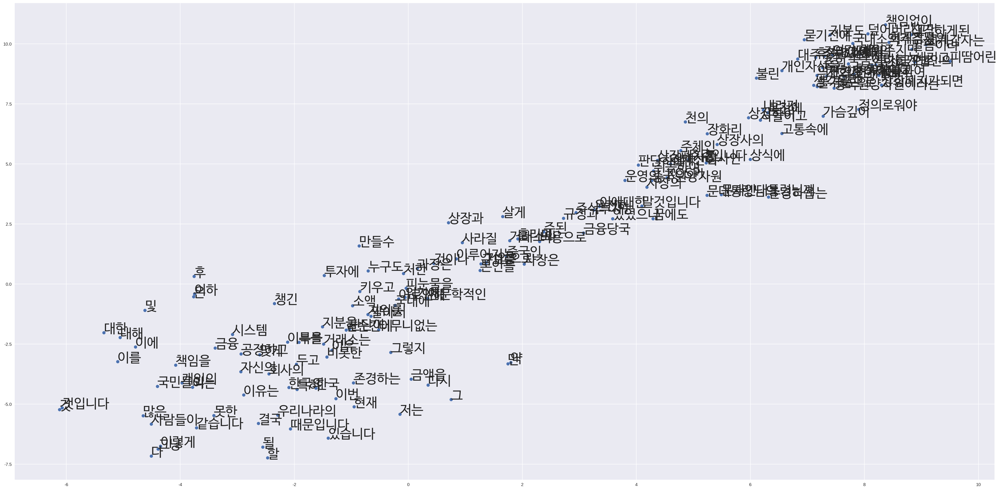

# 특정 키워드로 word2Vec 단어 유사도 보기


## Word2Vec(Word Embedding to Vector)

컴퓨터는 숫자만 인식할 수 있고 한글, 이미지는 바이너리 코드로 저장 됩니다.

* one hot encoding(예 [0000001000]) 혹은 Bag of Word에서 vector size가 매우 크고 sparse 하므로 neural net 성능이 잘 나오지 않습니다.
* `주위 단어가 비슷하면 해당 단어의 의미는 유사하다` 라는 아이디어
* 단어를 트레이닝 시킬 때 주위 단어를 label로 매치하여 최적화
* 단어를 `의미를 내포한 dense vector`로 매칭 시키는 것

* Word2Vec은 분산 된 텍스트 표현을 사용하여 개념 간 유사성을 봅니다. 
* 예를 들어, 파리와 프랑스가 베를린과 독일이 (수도와 나라) 같은 방식으로 관련되어 있음을 이해합니다.


이미지 출처 : https://opensource.googleblog.com/2013/08/learning-meaning-behind-words.html

* 단어의 임베딩과정을 실시간으로 시각화 : [word embedding visual inspector](https://ronxin.github.io/wevi/)


출처 : https://arxiv.org/pdf/1301.3781.pdf
 Tomas Mikolov, Ilya Sutskever, Kai Chen, Greg Corrado, and Jeffrey Dean. Distributed Representations of Words and Phrases and their Compositionality. In Proceedings of NIPS, 2013.


* CBOW와 Skip-Gram기법이 있다.

    * CBOW(continuous bag-of-words)는 전체 텍스트로 하나의 단어를 예측하기 때문에 작은 데이터셋일 수록 유리하다.    
    * 아래 예제에서 __ 에 들어갈 단어를 예측한다.
<pre>
1) __가 맛있다. 
2) __를 타는 것이 재미있다. 
3) 평소보다 두 __로 많이 먹어서 __가 아프다.
</pre>

    * Skip-Gram은 타겟 단어들로부터 원본 단어를 역으로 예측하는 것이다. CBOW와는 반대로 컨텍스트-타겟 쌍을 새로운 발견으로 처리하고 큰 규모의 데이터셋을 가질 때 유리하다.
    * `배`라는 단어 주변에 올 수 있는 단어를 예측한다.
    
    <pre>
    1) *배*가 맛있다. 
    2) *배*를 타는 것이 재미있다. 
    3) 평소보다 두 *배*로 많이 먹어서 *배*가 아프다.
    </pre>


## Word2Vec 참고자료
* [word2vec 모델 · 텐서플로우 문서 한글 번역본](https://tensorflowkorea.gitbooks.io/tensorflow-kr/g3doc/tutorials/word2vec/)
* [Word2Vec으로 문장 분류하기 · ratsgo's blog](https://ratsgo.github.io/natural%20language%20processing/2017/03/08/word2vec/)
* [CS224n: Natural Language Processing with Deep Learning](http://web.stanford.edu/class/cs224n/syllabus.html)
* [Word2Vec Tutorial - The Skip-Gram Model · Chris McCormick](http://mccormickml.com/2016/04/19/word2vec-tutorial-the-skip-gram-model/)

### 논문
* [Efficient Estimation of Word Representations in
Vector Space](https://arxiv.org/pdf/1301.3781v3.pdf)
* [Distributed Representations of Words and Phrases and their Compositionality](http://papers.nips.cc/paper/5021-distributed-representations-of-words-and-phrases-and-their-compositionality.pdf)

## Gensim

* [gensim: models.word2vec – Deep learning with word2vec](https://radimrehurek.com/gensim/models/word2vec.html)
* [gensim: Tutorials](https://radimrehurek.com/gensim/tutorial.html)
* [한국어와 NLTK, Gensim의 만남 - PyCon Korea 2015](https://www.lucypark.kr/docs/2015-pyconkr/)


```python
!pip install soynlp
!pip show soynlp
```

    Requirement already satisfied: soynlp in /usr/local/lib/python3.6/dist-packages (0.0.46)
    Requirement already satisfied: psutil>=5.0.1 in /usr/local/lib/python3.6/dist-packages (from soynlp) (5.4.6)
    Requirement already satisfied: numpy>=1.12.1 in /usr/local/lib/python3.6/dist-packages (from soynlp) (1.14.5)
    You are using pip version 10.0.1, however version 18.0 is available.
    You should consider upgrading via the 'pip install --upgrade pip' command.
    Name: soynlp
    Version: 0.0.46
    Summary: Unsupervised Korean Natural Language Processing Toolkits
    Home-page: https://github.com/lovit/soynlp
    Author: Lovit
    Author-email: soy.lovit@gmail.com
    License: UNKNOWN
    Location: /usr/local/lib/python3.6/dist-packages
    Requires: psutil, numpy
    Required-by: 
    You are using pip version 10.0.1, however version 18.0 is available.
    You should consider upgrading via the 'pip install --upgrade pip' command.
    


```python
!pip install gensim
!pip show gensim
```

    Requirement already satisfied: gensim in /usr/local/lib/python3.6/dist-packages (3.5.0)
    Requirement already satisfied: six>=1.5.0 in /usr/local/lib/python3.6/dist-packages (from gensim) (1.11.0)
    Requirement already satisfied: numpy>=1.11.3 in /usr/local/lib/python3.6/dist-packages (from gensim) (1.14.5)
    Requirement already satisfied: scipy>=0.18.1 in /usr/local/lib/python3.6/dist-packages (from gensim) (0.19.1)
    Requirement already satisfied: smart-open>=1.2.1 in /usr/local/lib/python3.6/dist-packages (from gensim) (1.6.0)
    Requirement already satisfied: boto3 in /usr/local/lib/python3.6/dist-packages (from smart-open>=1.2.1->gensim) (1.7.62)
    Requirement already satisfied: boto>=2.32 in /usr/local/lib/python3.6/dist-packages (from smart-open>=1.2.1->gensim) (2.49.0)
    Requirement already satisfied: bz2file in /usr/local/lib/python3.6/dist-packages (from smart-open>=1.2.1->gensim) (0.98)
    Requirement already satisfied: requests in /usr/local/lib/python3.6/dist-packages (from smart-open>=1.2.1->gensim) (2.18.4)
    Requirement already satisfied: botocore<1.11.0,>=1.10.62 in /usr/local/lib/python3.6/dist-packages (from boto3->smart-open>=1.2.1->gensim) (1.10.62)
    Requirement already satisfied: jmespath<1.0.0,>=0.7.1 in /usr/local/lib/python3.6/dist-packages (from boto3->smart-open>=1.2.1->gensim) (0.9.3)
    Requirement already satisfied: s3transfer<0.2.0,>=0.1.10 in /usr/local/lib/python3.6/dist-packages (from boto3->smart-open>=1.2.1->gensim) (0.1.13)
    Requirement already satisfied: idna<2.7,>=2.5 in /usr/local/lib/python3.6/dist-packages (from requests->smart-open>=1.2.1->gensim) (2.6)
    Requirement already satisfied: certifi>=2017.4.17 in /usr/local/lib/python3.6/dist-packages (from requests->smart-open>=1.2.1->gensim) (2018.4.16)
    Requirement already satisfied: urllib3<1.23,>=1.21.1 in /usr/local/lib/python3.6/dist-packages (from requests->smart-open>=1.2.1->gensim) (1.22)
    Requirement already satisfied: chardet<3.1.0,>=3.0.2 in /usr/local/lib/python3.6/dist-packages (from requests->smart-open>=1.2.1->gensim) (3.0.4)
    Requirement already satisfied: docutils>=0.10 in /usr/local/lib/python3.6/dist-packages (from botocore<1.11.0,>=1.10.62->boto3->smart-open>=1.2.1->gensim) (0.14)
    Requirement already satisfied: python-dateutil<3.0.0,>=2.1; python_version >= "2.7" in /usr/local/lib/python3.6/dist-packages (from botocore<1.11.0,>=1.10.62->boto3->smart-open>=1.2.1->gensim) (2.5.3)
    You are using pip version 10.0.1, however version 18.0 is available.
    You should consider upgrading via the 'pip install --upgrade pip' command.
    Name: gensim
    Version: 3.5.0
    Summary: Python framework for fast Vector Space Modelling
    Home-page: http://radimrehurek.com/gensim
    Author: Radim Rehurek
    Author-email: me@radimrehurek.com
    License: LGPLv2.1
    Location: /usr/local/lib/python3.6/dist-packages
    Requires: numpy, six, smart-open, scipy
    Required-by: 
    You are using pip version 10.0.1, however version 18.0 is available.
    You should consider upgrading via the 'pip install --upgrade pip' command.
    


```python
import pandas as pd
import numpy as np
import re
```


```python
df = pd.read_csv('https://s3.ap-northeast-2.amazonaws.com/data10902/petition/petition.csv', 
                 parse_dates=['start', 'end'])
```


```python
# 관심사별로 텍스트 데이터를 학습시키기 위한 목적도 있지만 전체 텍스트를 돌렸을 때 빠르게 결과를 얻기 위해서 샘플링 하려는 의도도 있습니다.
p = r'.*(이명박).*'
Hi_MB = df[df['title'].str.match(p) |
           df['content'].str.match(p, flags=re.MULTILINE)]

Hi_MB.shape
```


    (13014, 8)


```python
Hi_MB.head()
```


<div>
<style scoped>
    .dataframe tbody tr th:only-of-type {
        vertical-align: middle;
    }

    .dataframe tbody tr th {
        vertical-align: top;
    }

    .dataframe thead th {
        text-align: right;
    }
</style>
<table border="1" class="dataframe">
  <thead>
    <tr style="text-align: right;">
      <th></th>
      <th>article_id</th>
      <th>start</th>
      <th>end</th>
      <th>answered</th>
      <th>votes</th>
      <th>category</th>
      <th>title</th>
      <th>content</th>
    </tr>
  </thead>
  <tbody>
    <tr>
      <th>75</th>
      <td>99</td>
      <td>2017-08-20</td>
      <td>2017-09-19</td>
      <td>0</td>
      <td>2</td>
      <td>교통/건축/국토</td>
      <td>경춘선 itx 청춘 열차  승차방법 개선요구</td>
      <td>)  용산—춘천간 운행하는 전철 노선인 itx 청춘 급행열차의 승차방법을 개선\n해...</td>
    </tr>
    <tr>
      <th>83</th>
      <td>107</td>
      <td>2017-08-20</td>
      <td>2017-09-19</td>
      <td>0</td>
      <td>1248</td>
      <td>육아/교육</td>
      <td>이명박 정부가 만든 영어회화전문강사, 스포츠강사 폐지 촉구</td>
      <td>이명박 정부에서는 영어회화전문강사, 스포츠 강사 제도를 만들었습니다. 영어와 체육의...</td>
    </tr>
    <tr>
      <th>90</th>
      <td>114</td>
      <td>2017-08-20</td>
      <td>2017-08-27</td>
      <td>0</td>
      <td>1519</td>
      <td>육아/교육</td>
      <td>이명박 정부가 만든 영어회화전문강사, 스포츠 강사 폐지</td>
      <td>이명박 정부에서는 영어회화전문강사, 스포츠 강사 제도를 만들었습니다. 영어와 체육의...</td>
    </tr>
    <tr>
      <th>113</th>
      <td>137</td>
      <td>2017-08-20</td>
      <td>2017-09-19</td>
      <td>0</td>
      <td>1</td>
      <td>교통/건축/국토</td>
      <td>경춘선 itx 청춘 열차  교통카드 로 승차할수 있도록  개선요구</td>
      <td>1)  용산—춘천간 운행하는 전철 노선인 itx 청춘 급행열차의 승차방법을 개선\n...</td>
    </tr>
    <tr>
      <th>138</th>
      <td>162</td>
      <td>2017-08-21</td>
      <td>2017-09-05</td>
      <td>0</td>
      <td>1</td>
      <td>외교/통일/국방</td>
      <td>문재인정부의 대북정책은 완전히 새롭게 새판을 짜야합니다.</td>
      <td>문재인대통령님과 문재인정부는 제말을 잘듣어주어야하고,제힘을 꼭 주어야합니다.\n문재...</td>
    </tr>
  </tbody>
</table>
</div>


```python
Hi_MB.tail()
```


<div>
<style scoped>
    .dataframe tbody tr th:only-of-type {
        vertical-align: middle;
    }

    .dataframe tbody tr th {
        vertical-align: top;
    }

    .dataframe thead th {
        text-align: right;
    }
</style>
<table border="1" class="dataframe">
  <thead>
    <tr style="text-align: right;">
      <th></th>
      <th>article_id</th>
      <th>start</th>
      <th>end</th>
      <th>answered</th>
      <th>votes</th>
      <th>category</th>
      <th>title</th>
      <th>content</th>
    </tr>
  </thead>
  <tbody>
    <tr>
      <th>214577</th>
      <td>277278</td>
      <td>2018-06-20</td>
      <td>2018-07-20</td>
      <td>0</td>
      <td>4</td>
      <td>기타</td>
      <td>이명박 못잖은 거대 적폐세력의 존재를 폭로합니다 ~!!!</td>
      <td>최순실과 이명박은 울나라 현대사를 크게 혼란에 빠트리고,\n전세계에 대한민국의 국격...</td>
    </tr>
    <tr>
      <th>214648</th>
      <td>277379</td>
      <td>2018-06-20</td>
      <td>2018-07-20</td>
      <td>0</td>
      <td>3</td>
      <td>정치개혁</td>
      <td>넓은 아량의 정치, 공정 정의로운 나라 만들어 주십시오</td>
      <td>남북평화와 공정, 정의로운 촛불정부에 기대했던 촛불국민들은 남북평화에 대한 기대가 ...</td>
    </tr>
    <tr>
      <th>214762</th>
      <td>277528</td>
      <td>2018-06-20</td>
      <td>2018-07-20</td>
      <td>0</td>
      <td>4</td>
      <td>육아/교육</td>
      <td>학생자율화법을 패지하라(박근혜정부 이명박정부 한것없어달라)</td>
      <td>지금현재 학생들이 엉망인것같고\n교육부에서 학생자율화 법을 개선하기전에 건의한것같은...</td>
    </tr>
    <tr>
      <th>214784</th>
      <td>277558</td>
      <td>2018-06-20</td>
      <td>2018-07-20</td>
      <td>0</td>
      <td>0</td>
      <td>외교/통일/국방</td>
      <td>문재인  대통령님</td>
      <td>문재인  대통령님   ^^;;;;;;\n문재인  대통령님    대선  당선  후  ...</td>
    </tr>
    <tr>
      <th>214875</th>
      <td>277682</td>
      <td>2018-06-20</td>
      <td>2018-07-20</td>
      <td>0</td>
      <td>4</td>
      <td>인권/성평등</td>
      <td>지역비하댓글을 방조하는 네이버 아웃링크 법제화가 시급합니다.</td>
      <td>네이버에는 전남 강진여고생실종 기사에 눈뜨고는 못볼 지역비하 댓글이 도배질되고 있습...</td>
    </tr>
  </tbody>
</table>
</div>


```python
# 샘플로 보고 싶은 인덱스의 번호를 넣어주세요.
sample_index = 90
```


```python
sample_title = Hi_MB['title'][sample_index]
sample_title
```


    '이명박 정부가 만든 영어회화전문강사, 스포츠 강사 폐지'


```python
sample_content = Hi_MB['content'][sample_index]
sample_content
```


    '이명박 정부에서는 영어회화전문강사, 스포츠 강사 제도를 만들었습니다. 영어와 체육의 몰입 교육이 필요하다는 미명 하에 만들어낸 작품이었습니다. 그리고 교육 현장에서는 피해를 고스란히 보고 있으며, 앞으로도 지속될 경우 더 큰 피해가 초래될 것입니다. 왜냐하면, 다음과 같은 문제가 있기 때문입니다.\\n첫째, 정교사의 수업권 침해 문제가 발생되고 있습니다.\\n영어회화전문강사와 스포츠 강사들은 정교사를 돕는 보조교사로서의 제도 개념이 아닙니다. 학교 현장에서 그들은 한 학급 학생들을 데리고 학교 학생들을 단독적으로 가르치고 있습니다. 방과 후 강사들도 단독으로 학생들을 가르치는데 무엇이 문제냐고 한다면, 방과 후 수업과 정규 수업은 선택과 의무란 차이가 있다는 것을 말씀드리고 싶습니다. 영어 교과와 체육 교과는 정부에서 만드는 교육과정에 정규 과목으로서 존재합니다. 정부와 교육가들이 정한 과목들을 학생들에게 가르치라는 뜻에서 정규 수업으로 영어와 체육을 가르치고 있습니다. 그리고 이 정규 수업은 정교사에게 가르칠 권한이 주어집니다. 그런데, 영어 교사와 체육 교사와 권한을 같게 만든 것이 이명박 정부입니다. 영어와 체육을 가르치는 교사처럼 영어회화전문강사와 스포츠 강사들은 수업을 단독으로 하고 있습니다. 무려 원어민 선생님도 정교사와 같이 코티칭을 합니다. 각종 단체 및 지역 사회에서 초청된 강사님들도 단독 수업을 할 수 없습니다. 정교사가 필요한 수업이라 생각하면, 강사님께 초청을 하고, 함께 교실에 있습니다. 그러나 이들은 다릅니다. 정교사와 권한이 같으며 더 중요한 것은 책임은 없단 사실입니다. 영어 수업에서 학생들이 영어 시간에 다퉜는데 그에 대한 잘못된 조치를 취해도, 영어를 잘못 가르쳐서 민원이 발생해도, 체육 수업에 학생들이 다쳐도 그들의 책임은 없습니다. 그 책임은 모두 그 수업에 들어가보지도 못한 다른 정교사 선생님들이 맡으며 민원을 온몸으로 감수해야 합니다. 변호사 강사라는 제도를 만들어놓고 변호사의 권한은 같이 하지만, 책임은 떠맡지 않는 것과 같은 논리입니다.\\n둘째, 4차 산업혁명에 따른 초등학교 융합수업을 막아버리는 문제입니다.\\n초등학교는 융합수업을 하고 있습니다. 정부의 교육과정을 교사가 창조적으로 재조합하여 수업을 구성할 수 있게 하였습니다. 예를 들어,  STEAM 교육처럼 과학과 미술을 창조해 키네틱 아트에서 전기 개념을 알고 프로젝트 학습으로 만들어보는 창의적인 수업을 현장에서 많은 선생님들이 만들어내고 있습니다. 그런데 영어회화전문강사와 스포츠강사의 수업은 이런 융합수업을 가로막는 커다란 장벽입니다. 교대생들은 자기 전공 과목과 함께 초등 과목 교육 방법을 모두 배우며, 친구들과 창의적 수업을 구성하는 연습을 4년 내내 합니다. 그럼에도 더 필요성을 느끼기에 교원 연수, 교사 공동체 등을 만들고 교대 전문성을 더 높이길 원하고 있습니다. 그런데 영어회화전문강사와 스포츠강사는 그러지 못합니다. 영어와 체육을 다른 과목과의 연계성을 부정하고 지식 위주로만 가르치는 영어회화전문강사, 스포츠 강사제도는 4차 산업 혁명을 역행하는 제도입니다. 영어회화전문강사와 스포츠강사는 다른 과목과 연계하는 교육 전문성이 처음부터 없을뿐만 아니라 융합 수업 권한도 없기 때문입니다.\\n셋째, 이명박 정부의 목표가 오히려 퇴보되고 있습니다.\\n사교육을 줄이고 영어와 체육 전문성을 높이기 위해 이 제도의 도입 목표입니다. 그러나 현실 학교에서는 어린이, 청소년의 발달 능력을 고려하지 못한 수업을 하고 있습니다. 체육 수업에서는 운동부 코치처럼 학생들을 대하고, 생활 지도를 몰라 체벌을 가하기도 합니다. 담임과의 연계교육도 되지 않고 있으며 학부모들은 민원을 넣지만 학교에 있는 교사들이 문제를 해결하기에는 역부족인 현실입니다.\\n넷째, 학생들을 가르치는 자격 문제가 발생되고 있습니다.\\n위의 모든 문제들은 교사 자격을 학원 강사처럼 생각한 문제에서 발생한 것입니다. 이들은 교육청마다 채용 과정이 모두 우후죽순이며, 알음알음 학교 지인으로 들어가는 문제가 부지기수입니다. 토익 점수가 너무 높다며 낮춰달라는 어이없는 상황도 있었습니다. 반면, 초등 교사는 4년 동안을 초등 영어 및 체육을 포함한 초등 교육에 관해 공부하고 임용 시험을 치릅니다. 이런 공정한 과정을 통과한  현직 교사들도 교육의 전문성을 더 높이기 위해 교사 양성 및 지속적인 교육 전문성 관리에 대한 투자를 더욱 원합니다.\\n이를 전혀 고려하지 않고 정치에 놀아나는 교육을 원하지 않습니다.\\n부디, 이명박 정부의 졸속 정책인 영어회화전문강사 및 스포츠 강사 제도 폐지를 촉구합니다.'


# 텍스트 데이터 전처리 


```python
def preprocessing(text):
    # 개행문자 제거
    text = re.sub('\\\\n', ' ', text)
    # 특수문자 제거 / 특수문자나 이모티콘 등은 때로는 의미를 갖기도 하지만 여기에서는 제거했습니다.
    # text = re.sub('[?.,;:|\)*~`’!^\-_+<>@\#$%&-=#}※]', '', text)
    # text = re.sub('[0-9]', '', text)
    
    # 한글, 영문, 숫자만 남기고 모두 제거하도록 합니다.
    # text = re.sub('[^가-힣ㄱ-ㅎㅏ-ㅣa-zA-Z0-9]', ' ', text)
    
    # 한글, 영문만 남기고 모두 제거하도록 합니다.
    text = re.sub('[^가-힣ㄱ-ㅎㅏ-ㅣa-zA-Z]', ' ', text)
    return text
```


```python
sample_content = preprocessing(sample_content)
sample_content[:1000]
```


    '이명박 정부에서는 영어회화전문강사  스포츠 강사 제도를 만들었습니다  영어와 체육의 몰입 교육이 필요하다는 미명 하에 만들어낸 작품이었습니다  그리고 교육 현장에서는 피해를 고스란히 보고 있으며  앞으로도 지속될 경우 더 큰 피해가 초래될 것입니다  왜냐하면  다음과 같은 문제가 있기 때문입니다  첫째  정교사의 수업권 침해 문제가 발생되고 있습니다  영어회화전문강사와 스포츠 강사들은 정교사를 돕는 보조교사로서의 제도 개념이 아닙니다  학교 현장에서 그들은 한 학급 학생들을 데리고 학교 학생들을 단독적으로 가르치고 있습니다  방과 후 강사들도 단독으로 학생들을 가르치는데 무엇이 문제냐고 한다면  방과 후 수업과 정규 수업은 선택과 의무란 차이가 있다는 것을 말씀드리고 싶습니다  영어 교과와 체육 교과는 정부에서 만드는 교육과정에 정규 과목으로서 존재합니다  정부와 교육가들이 정한 과목들을 학생들에게 가르치라는 뜻에서 정규 수업으로 영어와 체육을 가르치고 있습니다  그리고 이 정규 수업은 정교사에게 가르칠 권한이 주어집니다  그런데  영어 교사와 체육 교사와 권한을 같게 만든 것이 이명박 정부입니다  영어와 체육을 가르치는 교사처럼 영어회화전문강사와 스포츠 강사들은 수업을 단독으로 하고 있습니다  무려 원어민 선생님도 정교사와 같이 코티칭을 합니다  각종 단체 및 지역 사회에서 초청된 강사님들도 단독 수업을 할 수 없습니다  정교사가 필요한 수업이라 생각하면  강사님께 초청을 하고  함께 교실에 있습니다  그러나 이들은 다릅니다  정교사와 권한이 같으며 더 중요한 것은 책임은 없단 사실입니다  영어 수업에서 학생들이 영어 시간에 다퉜는데 그에 대한 잘못된 조치를 취해도  영어를 잘못 가르쳐서 민원이 발생해도  체육 수업에 학생들이 다쳐도 그들의 책임은 없습니다  그 책임은 모두 그 수업에 들어가보지도 못한 다른 정교사 선생님들이 맡으며 민원을 온몸으로 감수해야 합니다  변호사 강사라는 제도를 만들어놓고 변호사의 권한은 같이 하지만  책임은 떠맡지 않는 것과 같은'


```python
# %time을 찍어주면 해당 코드를 실행할 때 걸리는 시간을 출력해 줍니다
%time sentences = Hi_MB['content'].apply(preprocessing)
```


    ---------------------------------------------------------------------------

    TypeError                                 Traceback (most recent call last)

    <ipython-input-110-e607a5e17625> in <module>()
    ----> 1 get_ipython().magic("time sentences = Hi_MB['content'].apply(preprocessing)")
    

    /usr/local/lib/python3.6/dist-packages/IPython/core/interactiveshell.py in magic(self, arg_s)
       2158         magic_name, _, magic_arg_s = arg_s.partition(' ')
       2159         magic_name = magic_name.lstrip(prefilter.ESC_MAGIC)
    -> 2160         return self.run_line_magic(magic_name, magic_arg_s)
       2161 
       2162     #-------------------------------------------------------------------------
    

    /usr/local/lib/python3.6/dist-packages/IPython/core/interactiveshell.py in run_line_magic(self, magic_name, line)
       2079                 kwargs['local_ns'] = sys._getframe(stack_depth).f_locals
       2080             with self.builtin_trap:
    -> 2081                 result = fn(*args,**kwargs)
       2082             return result
       2083 
    

    <decorator-gen-60> in time(self, line, cell, local_ns)
    

    /usr/local/lib/python3.6/dist-packages/IPython/core/magic.py in <lambda>(f, *a, **k)
        186     # but it's overkill for just that one bit of state.
        187     def magic_deco(arg):
    --> 188         call = lambda f, *a, **k: f(*a, **k)
        189 
        190         if callable(arg):
    

    /usr/local/lib/python3.6/dist-packages/IPython/core/magics/execution.py in time(self, line, cell, local_ns)
       1191         else:
       1192             st = clock2()
    -> 1193             exec(code, glob, local_ns)
       1194             end = clock2()
       1195             out = None
    

    <timed exec> in <module>()
    

    /usr/local/lib/python3.6/dist-packages/pandas/core/series.py in apply(self, func, convert_dtype, args, **kwds)
       2549             else:
       2550                 values = self.asobject
    -> 2551                 mapped = lib.map_infer(values, f, convert=convert_dtype)
       2552 
       2553         if len(mapped) and isinstance(mapped[0], Series):
    

    pandas/_libs/src/inference.pyx in pandas._libs.lib.map_infer()
    

    <ipython-input-106-ce239fa89579> in preprocessing(text)
          1 def preprocessing(text):
          2     # 개행문자 제거
    ----> 3     text = re.sub('\\\\n', ' ', text)
          4     # 특수문자 제거
          5     # 특수문자나 이모티콘 등은 때로는 의미를 갖기도 하지만 여기에서는 제거했습니다.
    

    /usr/lib/python3.6/re.py in sub(pattern, repl, string, count, flags)
        189     a callable, it's passed the match object and must return
        190     a replacement string to be used."""
    --> 191     return _compile(pattern, flags).sub(repl, string, count)
        192 
        193 def subn(pattern, repl, string, count=0, flags=0):
    

    TypeError: expected string or bytes-like object


# soynlp를 사용해 토큰화

## 텍스트 데이터 전처리 이해하기

(출처 : [트위터 한국어 형태소 분석기](https://github.com/twitter/twitter-korean-text))

**정규화 normalization (입니닼ㅋㅋ -> 입니다 ㅋㅋ, 샤릉해 -> 사랑해)**

* 한국어를 처리하는 예시입니닼ㅋㅋㅋㅋㅋ -> 한국어를 처리하는 예시입니다 ㅋㅋ

**토큰화 tokenization**

* 한국어를 처리하는 예시입니다 ㅋㅋ -> 한국어Noun, 를Josa, 처리Noun, 하는Verb, 예시Noun, 입Adjective, 니다Eomi ㅋㅋKoreanParticle

**어근화 stemming (입니다 -> 이다)**

* 한국어를 처리하는 예시입니다 ㅋㅋ -> 한국어Noun, 를Josa, 처리Noun, 하다Verb, 예시Noun, 이다Adjective, ㅋㅋKoreanParticle


**어구 추출 phrase extraction** 

* 한국어를 처리하는 예시입니다 ㅋㅋ -> 한국어, 처리, 예시, 처리하는 예시

Introductory Presentation: [Google Slides](https://docs.google.com/presentation/d/10CZj8ry03oCk_Jqw879HFELzOLjJZ0EOi4KJbtRSIeU/)


```python
from soynlp.tokenizer import RegexTokenizer

tokenizer = RegexTokenizer()
tokenizer
```


    <soynlp.tokenizer._tokenizer.RegexTokenizer at 0x7fcc440a0198>


```python
# 전처리 이전의 샘플 텍스트로 토큰화
tokened_title = tokenizer.tokenize(sample_title)
tokened_title
```


    ['이명박', '정부가', '만든', '영어회화전문강사', ',', '스포츠', '강사', '폐지']


```python
# 전처리 이후의 샘플 텍스트로 토큰화
tokened_content = tokenizer.tokenize(sample_content)
tokened_content[:10]
```


    ['이명박', '정부에서는', '영어회화전문강사', '스포츠', '강사', '제도를', '만들었습니다', '영어와', '체육의', '몰입']


```python
print(len(tokened_title))
print(len(tokened_content))
```

    8
    512
    


```python
%time tokens = sentences.apply(tokenizer.tokenize)
tokens[:3]
```

    CPU times: user 15 s, sys: 487 ms, total: 15.5 s
    Wall time: 15.5 s
    


    7     [존경하옵는, 문재인대통령님께, 저는, 중국원양자원이라는, KOSPI, 상장사의, ...
    11    [존경하는, 대통령님께, 코스피, 주식종목, 중국, 원양자원은, 현재, 계속되는, ...
    54    [지장물관련, 국토부의, 해석, 기존, 건축물의, 철거, 공사에, 관한, 사항의, ...
    Name: content, dtype: object


```python
len(tokens)
```


    10635


```python
tokens[sample_index][:10]
```


    ---------------------------------------------------------------------------

    KeyError                                  Traceback (most recent call last)

    <ipython-input-117-ca2759463a8c> in <module>()
    ----> 1 tokens[sample_index][:10]
    

    /usr/local/lib/python3.6/dist-packages/pandas/core/series.py in __getitem__(self, key)
        621         key = com._apply_if_callable(key, self)
        622         try:
    --> 623             result = self.index.get_value(self, key)
        624 
        625             if not is_scalar(result):
    

    /usr/local/lib/python3.6/dist-packages/pandas/core/indexes/base.py in get_value(self, series, key)
       2558         try:
       2559             return self._engine.get_value(s, k,
    -> 2560                                           tz=getattr(series.dtype, 'tz', None))
       2561         except KeyError as e1:
       2562             if len(self) > 0 and self.inferred_type in ['integer', 'boolean']:
    

    pandas/_libs/index.pyx in pandas._libs.index.IndexEngine.get_value()
    

    pandas/_libs/index.pyx in pandas._libs.index.IndexEngine.get_value()
    

    pandas/_libs/index.pyx in pandas._libs.index.IndexEngine.get_loc()
    

    pandas/_libs/hashtable_class_helper.pxi in pandas._libs.hashtable.Int64HashTable.get_item()
    

    pandas/_libs/hashtable_class_helper.pxi in pandas._libs.hashtable.Int64HashTable.get_item()
    

    KeyError: 90


```python
# word2vec 모델 학습에 로그를 찍을 수 있도록 합니다.
import logging

logging.basicConfig(
    format='%(asctime)s : %(levelname)s : %(message)s', 
    level=logging.INFO)
```


```python
# 초기화 및 모델 학습
from gensim.models import word2vec

# 모델 학습
model = word2vec.Word2Vec(tokens, min_count=1)

model
```

    2018-07-23 11:38:48,583 : INFO : collecting all words and their counts
    2018-07-23 11:38:48,589 : INFO : PROGRESS: at sentence #0, processed 0 words, keeping 0 word types
    2018-07-23 11:38:49,779 : INFO : PROGRESS: at sentence #10000, processed 2204292 words, keeping 321082 word types
    2018-07-23 11:38:49,896 : INFO : collected 342133 word types from a corpus of 2383499 raw words and 10635 sentences
    2018-07-23 11:38:49,897 : INFO : Loading a fresh vocabulary
    2018-07-23 11:38:51,553 : INFO : effective_min_count=1 retains 342133 unique words (100% of original 342133, drops 0)
    2018-07-23 11:38:51,554 : INFO : effective_min_count=1 leaves 2383499 word corpus (100% of original 2383499, drops 0)
    2018-07-23 11:38:52,909 : INFO : deleting the raw counts dictionary of 342133 items
    2018-07-23 11:38:52,919 : INFO : sample=0.001 downsamples 7 most-common words
    2018-07-23 11:38:52,920 : INFO : downsampling leaves estimated 2368167 word corpus (99.4% of prior 2383499)
    2018-07-23 11:38:54,686 : INFO : estimated required memory for 342133 words and 100 dimensions: 444772900 bytes
    2018-07-23 11:38:54,687 : INFO : resetting layer weights
    2018-07-23 11:38:58,252 : INFO : training model with 3 workers on 342133 vocabulary and 100 features, using sg=0 hs=0 sample=0.001 negative=5 window=5
    2018-07-23 11:38:59,288 : INFO : EPOCH 1 - PROGRESS: at 10.05% examples, 323531 words/s, in_qsize 5, out_qsize 0
    2018-07-23 11:39:00,357 : INFO : EPOCH 1 - PROGRESS: at 25.21% examples, 327544 words/s, in_qsize 5, out_qsize 0
    2018-07-23 11:39:01,371 : INFO : EPOCH 1 - PROGRESS: at 42.98% examples, 324992 words/s, in_qsize 5, out_qsize 0
    2018-07-23 11:39:02,389 : INFO : EPOCH 1 - PROGRESS: at 54.94% examples, 319658 words/s, in_qsize 5, out_qsize 0
    2018-07-23 11:39:03,411 : INFO : EPOCH 1 - PROGRESS: at 66.49% examples, 316952 words/s, in_qsize 5, out_qsize 0
    2018-07-23 11:39:04,460 : INFO : EPOCH 1 - PROGRESS: at 87.42% examples, 316261 words/s, in_qsize 5, out_qsize 0
    2018-07-23 11:39:05,490 : INFO : EPOCH 1 - PROGRESS: at 98.04% examples, 316014 words/s, in_qsize 5, out_qsize 0
    2018-07-23 11:39:05,601 : INFO : worker thread finished; awaiting finish of 2 more threads
    2018-07-23 11:39:05,625 : INFO : worker thread finished; awaiting finish of 1 more threads
    2018-07-23 11:39:05,640 : INFO : worker thread finished; awaiting finish of 0 more threads
    2018-07-23 11:39:05,642 : INFO : EPOCH - 1 : training on 2383499 raw words (2339197 effective words) took 7.4s, 316942 effective words/s
    2018-07-23 11:39:06,698 : INFO : EPOCH 2 - PROGRESS: at 10.40% examples, 326087 words/s, in_qsize 5, out_qsize 0
    2018-07-23 11:39:07,753 : INFO : EPOCH 2 - PROGRESS: at 26.61% examples, 331169 words/s, in_qsize 5, out_qsize 0
    2018-07-23 11:39:08,787 : INFO : EPOCH 2 - PROGRESS: at 43.88% examples, 328334 words/s, in_qsize 5, out_qsize 0
    2018-07-23 11:39:09,830 : INFO : EPOCH 2 - PROGRESS: at 55.68% examples, 322552 words/s, in_qsize 5, out_qsize 0
    2018-07-23 11:39:10,840 : INFO : EPOCH 2 - PROGRESS: at 68.37% examples, 321423 words/s, in_qsize 6, out_qsize 0
    2018-07-23 11:39:11,898 : INFO : EPOCH 2 - PROGRESS: at 88.97% examples, 321749 words/s, in_qsize 6, out_qsize 0
    2018-07-23 11:39:12,877 : INFO : worker thread finished; awaiting finish of 2 more threads
    2018-07-23 11:39:12,906 : INFO : EPOCH 2 - PROGRESS: at 99.62% examples, 321083 words/s, in_qsize 1, out_qsize 1
    2018-07-23 11:39:12,907 : INFO : worker thread finished; awaiting finish of 1 more threads
    2018-07-23 11:39:12,923 : INFO : worker thread finished; awaiting finish of 0 more threads
    2018-07-23 11:39:12,924 : INFO : EPOCH - 2 : training on 2383499 raw words (2339585 effective words) took 7.3s, 321625 effective words/s
    2018-07-23 11:39:13,940 : INFO : EPOCH 3 - PROGRESS: at 10.05% examples, 329988 words/s, in_qsize 5, out_qsize 0
    2018-07-23 11:39:14,979 : INFO : EPOCH 3 - PROGRESS: at 24.55% examples, 330862 words/s, in_qsize 4, out_qsize 1
    2018-07-23 11:39:15,993 : INFO : EPOCH 3 - PROGRESS: at 42.76% examples, 327211 words/s, in_qsize 5, out_qsize 0
    2018-07-23 11:39:17,008 : INFO : EPOCH 3 - PROGRESS: at 54.69% examples, 321460 words/s, in_qsize 5, out_qsize 0
    2018-07-23 11:39:18,022 : INFO : EPOCH 3 - PROGRESS: at 66.49% examples, 320733 words/s, in_qsize 5, out_qsize 0
    2018-07-23 11:39:19,078 : INFO : EPOCH 3 - PROGRESS: at 87.42% examples, 319053 words/s, in_qsize 5, out_qsize 0
    2018-07-23 11:39:20,103 : INFO : EPOCH 3 - PROGRESS: at 97.56% examples, 315972 words/s, in_qsize 5, out_qsize 0
    2018-07-23 11:39:20,280 : INFO : worker thread finished; awaiting finish of 2 more threads
    2018-07-23 11:39:20,294 : INFO : worker thread finished; awaiting finish of 1 more threads
    2018-07-23 11:39:20,311 : INFO : worker thread finished; awaiting finish of 0 more threads
    2018-07-23 11:39:20,313 : INFO : EPOCH - 3 : training on 2383499 raw words (2339362 effective words) took 7.4s, 317003 effective words/s
    2018-07-23 11:39:21,329 : INFO : EPOCH 4 - PROGRESS: at 9.46% examples, 310942 words/s, in_qsize 5, out_qsize 0
    2018-07-23 11:39:22,356 : INFO : EPOCH 4 - PROGRESS: at 21.86% examples, 318423 words/s, in_qsize 4, out_qsize 1
    2018-07-23 11:39:23,368 : INFO : EPOCH 4 - PROGRESS: at 40.49% examples, 316033 words/s, in_qsize 5, out_qsize 0
    2018-07-23 11:39:24,400 : INFO : EPOCH 4 - PROGRESS: at 52.53% examples, 310139 words/s, in_qsize 6, out_qsize 1
    2018-07-23 11:39:25,441 : INFO : EPOCH 4 - PROGRESS: at 64.48% examples, 309526 words/s, in_qsize 5, out_qsize 0
    2018-07-23 11:39:26,454 : INFO : EPOCH 4 - PROGRESS: at 84.89% examples, 309241 words/s, in_qsize 5, out_qsize 0
    2018-07-23 11:39:27,503 : INFO : EPOCH 4 - PROGRESS: at 96.16% examples, 309606 words/s, in_qsize 4, out_qsize 1
    2018-07-23 11:39:27,814 : INFO : worker thread finished; awaiting finish of 2 more threads
    2018-07-23 11:39:27,843 : INFO : worker thread finished; awaiting finish of 1 more threads
    2018-07-23 11:39:27,858 : INFO : worker thread finished; awaiting finish of 0 more threads
    2018-07-23 11:39:27,859 : INFO : EPOCH - 4 : training on 2383499 raw words (2339231 effective words) took 7.5s, 310388 effective words/s
    2018-07-23 11:39:28,891 : INFO : EPOCH 5 - PROGRESS: at 9.68% examples, 314485 words/s, in_qsize 4, out_qsize 1
    2018-07-23 11:39:29,896 : INFO : EPOCH 5 - PROGRESS: at 22.73% examples, 323728 words/s, in_qsize 6, out_qsize 0
    2018-07-23 11:39:30,909 : INFO : EPOCH 5 - PROGRESS: at 41.25% examples, 319454 words/s, in_qsize 5, out_qsize 0
    2018-07-23 11:39:31,912 : INFO : EPOCH 5 - PROGRESS: at 53.35% examples, 316796 words/s, in_qsize 4, out_qsize 1
    2018-07-23 11:39:32,913 : INFO : EPOCH 5 - PROGRESS: at 64.84% examples, 315777 words/s, in_qsize 5, out_qsize 0
    2018-07-23 11:39:33,919 : INFO : EPOCH 5 - PROGRESS: at 85.78% examples, 316414 words/s, in_qsize 5, out_qsize 0
    2018-07-23 11:39:34,958 : INFO : EPOCH 5 - PROGRESS: at 96.16% examples, 313437 words/s, in_qsize 5, out_qsize 0
    2018-07-23 11:39:35,252 : INFO : worker thread finished; awaiting finish of 2 more threads
    2018-07-23 11:39:35,295 : INFO : worker thread finished; awaiting finish of 1 more threads
    2018-07-23 11:39:35,308 : INFO : worker thread finished; awaiting finish of 0 more threads
    2018-07-23 11:39:35,310 : INFO : EPOCH - 5 : training on 2383499 raw words (2339227 effective words) took 7.4s, 314238 effective words/s
    2018-07-23 11:39:35,311 : INFO : training on a 11917495 raw words (11696602 effective words) took 37.1s, 315628 effective words/s
    


    <gensim.models.word2vec.Word2Vec at 0x7fcc1b884fd0>


```python
# 모델 이름을 지정하고 저장한다.
model_name = '1minwords'
model.save(model_name)
```

    2018-07-23 11:39:38,695 : INFO : saving Word2Vec object under 1minwords, separately None
    2018-07-23 11:39:38,698 : INFO : storing np array 'vectors' to 1minwords.wv.vectors.npy
    2018-07-23 11:39:39,022 : INFO : not storing attribute vectors_norm
    2018-07-23 11:39:39,031 : INFO : storing np array 'syn1neg' to 1minwords.trainables.syn1neg.npy
    2018-07-23 11:39:39,796 : INFO : not storing attribute cum_table
    2018-07-23 11:39:41,178 : INFO : saved 1minwords
    


```python
# 단어 사전 수
len(model.wv.vocab)
```


    342133


```python
# 단어 사전에서 상위 10개만 보기
vocab = model.wv.vocab
sorted(vocab, key=vocab.get, reverse=True)[:30]
```


    ['수',
     '있는',
     '있습니다',
     '그',
     '이',
     '년',
     '합니다',
     '하는',
     '및',
     '제',
     '할',
     '하고',
     '더',
     '대한',
     '한',
     '그리고',
     '월',
     '없는',
     '저는',
     '등',
     '것입니다',
     '일',
     '이런',
     '많은',
     '것은',
     '같은',
     '왜',
     '있다',
     '없습니다',
     '위해']


# 불용어
* 가장 자주 등장하는 단어이지만 불용어에 가깝다.


['수',
 '있는',
 '있습니다',
 '그',
 '이',
 '년',
 '합니다',
 '하는',
 '및',
 '제',
 '할',
 '하고',
 '더',
 '대한',
 '한',
 '그리고',
 '월',
 '저는',
 '없는',
 '것입니다',
 '등',
 '일',
 '많은',
 '이런',
 '것은',
 '왜',
 '같은',
 '없습니다',
 '위해']


```python
# vocab을 직접찍어 보면 dict 구조로 되어 있는 것을 볼 수 있습니다.
vocab
```


    {'존경하옵는': <gensim.models.keyedvectors.Vocab at 0x7fcc1b8da7f0>,
     '문재인대통령님께': <gensim.models.keyedvectors.Vocab at 0x7fcc1b8850f0>,
     '저는': <gensim.models.keyedvectors.Vocab at 0x7fcc1b885320>,
     '중국원양자원이라는': <gensim.models.keyedvectors.Vocab at 0x7fcc1b8852e8>,
     'KOSPI': <gensim.models.keyedvectors.Vocab at 0x7fcc1b8851d0>,
     '상장사의': <gensim.models.keyedvectors.Vocab at 0x7fcc1b885198>,
     '소액': <gensim.models.keyedvectors.Vocab at 0x7fcc1b885160>,
     '주주입니다': <gensim.models.keyedvectors.Vocab at 0x7fcc1b8852b0>,
     '중국원양자원': <gensim.models.keyedvectors.Vocab at 0x7fcc1b885278>,
     '이하': <gensim.models.keyedvectors.Vocab at 0x7fcc1b885240>,
     '중원': <gensim.models.keyedvectors.Vocab at 0x7fcc1b885128>,
     '은': <gensim.models.keyedvectors.Vocab at 0x7fcc1b885358>,
     '이번': <gensim.models.keyedvectors.Vocab at 0x7fcc1b885390>,
     '재회계감사에서': <gensim.models.keyedvectors.Vocab at 0x7fcc1b8853c8>,
     '의견거절이라는': <gensim.models.keyedvectors.Vocab at 0x7fcc1b885400>,
     '감사인': <gensim.models.keyedvectors.Vocab at 0x7fcc1b885438>,
     '판단이': <gensim.models.keyedvectors.Vocab at 0x7fcc1b885470>,
     '내려져': <gensim.models.keyedvectors.Vocab at 0x7fcc1b8854a8>,
     '꿈에도': <gensim.models.keyedvectors.Vocab at 0x7fcc1b8854e0>,
     '생각못한': <gensim.models.keyedvectors.Vocab at 0x7fcc1b885518>,
     '상장폐지를': <gensim.models.keyedvectors.Vocab at 0x7fcc1b885550>,
     '목전에': <gensim.models.keyedvectors.Vocab at 0x7fcc1b885588>,
     '두고': <gensim.models.keyedvectors.Vocab at 0x7fcc1b8855c0>,
     '있습니다': <gensim.models.keyedvectors.Vocab at 0x7fcc1b8855f8>,
     '상장폐지가되면': <gensim.models.keyedvectors.Vocab at 0x7fcc1b885630>,
     '국내에': <gensim.models.keyedvectors.Vocab at 0x7fcc1b885668>,
     '상장하여': <gensim.models.keyedvectors.Vocab at 0x7fcc1b8856a0>,
     '천문학적인': <gensim.models.keyedvectors.Vocab at 0x7fcc1b8856d8>,
     '금액을': <gensim.models.keyedvectors.Vocab at 0x7fcc1b885710>,
     '취득하여': <gensim.models.keyedvectors.Vocab at 0x7fcc1b885748>,
     '회사의': <gensim.models.keyedvectors.Vocab at 0x7fcc1b885780>,
     '규모를': <gensim.models.keyedvectors.Vocab at 0x7fcc1b8857b8>,
     '키우고': <gensim.models.keyedvectors.Vocab at 0x7fcc1b8857f0>,
     '개인자산을': <gensim.models.keyedvectors.Vocab at 0x7fcc1b885828>,
     '불린': <gensim.models.keyedvectors.Vocab at 0x7fcc1b885860>,
     '후': <gensim.models.keyedvectors.Vocab at 0x7fcc1b885898>,
     '자신의': <gensim.models.keyedvectors.Vocab at 0x7fcc1b8858d0>,
     '지분도': <gensim.models.keyedvectors.Vocab at 0x7fcc1b885908>,
     '다': <gensim.models.keyedvectors.Vocab at 0x7fcc1b885940>,
     '팔아서': <gensim.models.keyedvectors.Vocab at 0x7fcc1b885978>,
     '이득을': <gensim.models.keyedvectors.Vocab at 0x7fcc1b8859b0>,
     '챙긴': <gensim.models.keyedvectors.Vocab at 0x7fcc1b8859e8>,
     '중국인': <gensim.models.keyedvectors.Vocab at 0x7fcc1b885a20>,
     '장화리': <gensim.models.keyedvectors.Vocab at 0x7fcc1b885a58>,
     '사장은': <gensim.models.keyedvectors.Vocab at 0x7fcc1b885a90>,
     '정리매매때': <gensim.models.keyedvectors.Vocab at 0x7fcc1b885ac8>,
     '휴지조각의': <gensim.models.keyedvectors.Vocab at 0x7fcc1b885b00>,
     '비용으로': <gensim.models.keyedvectors.Vocab at 0x7fcc1b885b38>,
     '지분을': <gensim.models.keyedvectors.Vocab at 0x7fcc1b885b70>,
     '다시': <gensim.models.keyedvectors.Vocab at 0x7fcc1b885ba8>,
     '사들이고': <gensim.models.keyedvectors.Vocab at 0x7fcc1b885be0>,
     '대주주로서의': <gensim.models.keyedvectors.Vocab at 0x7fcc1b885c18>,
     '지위를': <gensim.models.keyedvectors.Vocab at 0x7fcc1b885c50>,
     '획득하여': <gensim.models.keyedvectors.Vocab at 0x7fcc1b885c88>,
     '온전히': <gensim.models.keyedvectors.Vocab at 0x7fcc1b885cc0>,
     '기업으로': <gensim.models.keyedvectors.Vocab at 0x7fcc1b885cf8>,
     '만들수': <gensim.models.keyedvectors.Vocab at 0x7fcc1b885d30>,
     '결국': <gensim.models.keyedvectors.Vocab at 0x7fcc1b885d68>,
     '한국': <gensim.models.keyedvectors.Vocab at 0x7fcc1b885da0>,
     '국민들의': <gensim.models.keyedvectors.Vocab at 0x7fcc1b885dd8>,
     '피땀어린': <gensim.models.keyedvectors.Vocab at 0x7fcc1b885e10>,
     '투자금으로': <gensim.models.keyedvectors.Vocab at 0x7fcc1b885e48>,
     '사장의': <gensim.models.keyedvectors.Vocab at 0x7fcc1b885e80>,
     '부를': <gensim.models.keyedvectors.Vocab at 0x7fcc1b885eb8>,
     '채워주지만': <gensim.models.keyedvectors.Vocab at 0x7fcc1b885ef0>,
     '이에': <gensim.models.keyedvectors.Vocab at 0x7fcc1b885f28>,
     '대해': <gensim.models.keyedvectors.Vocab at 0x7fcc1b885f60>,
     '한국의': <gensim.models.keyedvectors.Vocab at 0x7fcc1b885f98>,
     '금융당국': <gensim.models.keyedvectors.Vocab at 0x7fcc1b885fd0>,
     '및': <gensim.models.keyedvectors.Vocab at 0x7fcc1b88e048>,
     '상장과': <gensim.models.keyedvectors.Vocab at 0x7fcc1b88e080>,
     '운영의': <gensim.models.keyedvectors.Vocab at 0x7fcc1b88e0b8>,
     '주체인': <gensim.models.keyedvectors.Vocab at 0x7fcc1b88e0f0>,
     '거래소는': <gensim.models.keyedvectors.Vocab at 0x7fcc1b88e128>,
     '누구도': <gensim.models.keyedvectors.Vocab at 0x7fcc1b88e160>,
     '이에대한': <gensim.models.keyedvectors.Vocab at 0x7fcc1b88e198>,
     '책임없이': <gensim.models.keyedvectors.Vocab at 0x7fcc1b88e1d0>,
     '이를': <gensim.models.keyedvectors.Vocab at 0x7fcc1b88e208>,
     '그냥': <gensim.models.keyedvectors.Vocab at 0x7fcc1b88e240>,
     '덮어버리고만': <gensim.models.keyedvectors.Vocab at 0x7fcc1b88e278>,
     '말것입니다': <gensim.models.keyedvectors.Vocab at 0x7fcc1b88e2b0>,
     '이로인해': <gensim.models.keyedvectors.Vocab at 0x7fcc1b88e2e8>,
     '약': <gensim.models.keyedvectors.Vocab at 0x7fcc1b88e320>,
     '만': <gensim.models.keyedvectors.Vocab at 0x7fcc1b88e358>,
     '천의': <gensim.models.keyedvectors.Vocab at 0x7fcc1b88e390>,
     '국내소액주주는': <gensim.models.keyedvectors.Vocab at 0x7fcc1b88e3c8>,
     '피눈물을': <gensim.models.keyedvectors.Vocab at 0x7fcc1b88e400>,
     '흘리며': <gensim.models.keyedvectors.Vocab at 0x7fcc1b88e438>,
     '고통속에': <gensim.models.keyedvectors.Vocab at 0x7fcc1b88e470>,
     '살게': <gensim.models.keyedvectors.Vocab at 0x7fcc1b88e4a8>,
     '될': <gensim.models.keyedvectors.Vocab at 0x7fcc1b88e4e0>,
     '것입니다': <gensim.models.keyedvectors.Vocab at 0x7fcc1b88e518>,
     '주식투자는': <gensim.models.keyedvectors.Vocab at 0x7fcc1b88e550>,
     '개인의': <gensim.models.keyedvectors.Vocab at 0x7fcc1b88e588>,
     '판단하에': <gensim.models.keyedvectors.Vocab at 0x7fcc1b88e5c0>,
     '이루어지는': <gensim.models.keyedvectors.Vocab at 0x7fcc1b88e5f8>,
     '것이나': <gensim.models.keyedvectors.Vocab at 0x7fcc1b88e630>,
     '투자에': <gensim.models.keyedvectors.Vocab at 0x7fcc1b88e668>,
     '대한': <gensim.models.keyedvectors.Vocab at 0x7fcc1b88e6a0>,
     '책임을': <gensim.models.keyedvectors.Vocab at 0x7fcc1b88e6d8>,
     '묻기전에': <gensim.models.keyedvectors.Vocab at 0x7fcc1b88e710>,
     '그': <gensim.models.keyedvectors.Vocab at 0x7fcc1b88e748>,
     '과정은': <gensim.models.keyedvectors.Vocab at 0x7fcc1b88e780>,
     '규정과': <gensim.models.keyedvectors.Vocab at 0x7fcc1b88e7b8>,
     '상식에': <gensim.models.keyedvectors.Vocab at 0x7fcc1b88e7f0>,
     '맞게': <gensim.models.keyedvectors.Vocab at 0x7fcc1b88e828>,
     '공정하고': <gensim.models.keyedvectors.Vocab at 0x7fcc1b88e860>,
     '정의로워야': <gensim.models.keyedvectors.Vocab at 0x7fcc1b88e898>,
     '할': <gensim.models.keyedvectors.Vocab at 0x7fcc1b88e8d0>,
     '이는': <gensim.models.keyedvectors.Vocab at 0x7fcc1b88e908>,
     '존경하는': <gensim.models.keyedvectors.Vocab at 0x7fcc1b88e940>,
     '문대통령님의': <gensim.models.keyedvectors.Vocab at 0x7fcc1b88e978>,
     '말씀이라': <gensim.models.keyedvectors.Vocab at 0x7fcc1b88e9b0>,
     '가슴깊이': <gensim.models.keyedvectors.Vocab at 0x7fcc1b88e9e8>,
     '새기고': <gensim.models.keyedvectors.Vocab at 0x7fcc1b88ea20>,
     '있었으나': <gensim.models.keyedvectors.Vocab at 0x7fcc1b88ea58>,
     '현재': <gensim.models.keyedvectors.Vocab at 0x7fcc1b88ea90>,
     '우리나라의': <gensim.models.keyedvectors.Vocab at 0x7fcc1b88eac8>,
     '금융': <gensim.models.keyedvectors.Vocab at 0x7fcc1b88eb00>,
     '시스템': <gensim.models.keyedvectors.Vocab at 0x7fcc1b88eb38>,
     '특히': <gensim.models.keyedvectors.Vocab at 0x7fcc1b88eb70>,
     '거래소와': <gensim.models.keyedvectors.Vocab at 0x7fcc1b88eba8>,
     '회계감사는': <gensim.models.keyedvectors.Vocab at 0x7fcc1b88ebe0>,
     '그렇지': <gensim.models.keyedvectors.Vocab at 0x7fcc1b88ec18>,
     '못한': <gensim.models.keyedvectors.Vocab at 0x7fcc1b88ec50>,
     '것': <gensim.models.keyedvectors.Vocab at 0x7fcc1b884048>,
     '같습니다': <gensim.models.keyedvectors.Vocab at 0x7fcc1b884080>,
     '이렇게': <gensim.models.keyedvectors.Vocab at 0x7fcc1b8840b8>,
     '생각하게된': <gensim.models.keyedvectors.Vocab at 0x7fcc1b884128>,
     '이유는': <gensim.models.keyedvectors.Vocab at 0x7fcc1b884198>,
     '회계감사의': <gensim.models.keyedvectors.Vocab at 0x7fcc1b884240>,
     '주된': <gensim.models.keyedvectors.Vocab at 0x7fcc1b8842b0>,
     '의견거절의': <gensim.models.keyedvectors.Vocab at 0x7fcc1b884278>,
     '이유': <gensim.models.keyedvectors.Vocab at 0x7fcc1b884208>,
     '때문입니다': <gensim.models.keyedvectors.Vocab at 0x7fcc1b8841d0>,
     '신한회계법인의': <gensim.models.keyedvectors.Vocab at 0x7fcc1b884160>,
     '추측적이고': <gensim.models.keyedvectors.Vocab at 0x7fcc1b8840f0>,
     '터무니없는': <gensim.models.keyedvectors.Vocab at 0x7fcc1b8842e8>,
     '의견거절로': <gensim.models.keyedvectors.Vocab at 0x7fcc1b884358>,
     '전재산이': <gensim.models.keyedvectors.Vocab at 0x7fcc1b8843c8>,
     '한순간에': <gensim.models.keyedvectors.Vocab at 0x7fcc1b884438>,
     '물거품으로': <gensim.models.keyedvectors.Vocab at 0x7fcc1b8845c0>,
     '사라질': <gensim.models.keyedvectors.Vocab at 0x7fcc1b8845f8>,
     '위기에': <gensim.models.keyedvectors.Vocab at 0x7fcc1b884470>,
     '처한': <gensim.models.keyedvectors.Vocab at 0x7fcc1b8844a8>,
     '본인을': <gensim.models.keyedvectors.Vocab at 0x7fcc1b8844e0>,
     '비롯한': <gensim.models.keyedvectors.Vocab at 0x7fcc1b884550>,
     '많은': <gensim.models.keyedvectors.Vocab at 0x7fcc1b884588>,
     '사람들이': <gensim.models.keyedvectors.Vocab at 0x7fcc1b884518>,
     '죽음이라는': <gensim.models.keyedvectors.Vocab at 0x7fcc1b884400>,
     '극단적인': <gensim.models.keyedvectors.Vocab at 0x7fcc1b884390>,
     '선택앞에': <gensim.models.keyedvectors.Vocab at 0x7fcc1b884320>,
     '내몰려져': <gensim.models.keyedvectors.Vocab at 0x7fcc1b884630>,
     '억울함과': <gensim.models.keyedvectors.Vocab at 0x7fcc1b884668>,
     '원통함에': <gensim.models.keyedvectors.Vocab at 0x7fcc1b884710>,
     '흘리고': <gensim.models.keyedvectors.Vocab at 0x7fcc1b8847f0>,
     '기업의': <gensim.models.keyedvectors.Vocab at 0x7fcc1b884748>,
     '사업성이나': <gensim.models.keyedvectors.Vocab at 0x7fcc1b8847b8>,
     '계속': <gensim.models.keyedvectors.Vocab at 0x7fcc1b884780>,
     '존속여부를': <gensim.models.keyedvectors.Vocab at 0x7fcc1b884828>,
     '점검하는': <gensim.models.keyedvectors.Vocab at 0x7fcc1b884898>,
     '감사자인': <gensim.models.keyedvectors.Vocab at 0x7fcc1b884860>,
     '회계법인은': <gensim.models.keyedvectors.Vocab at 0x7fcc1b8846a0>,
     '오직': <gensim.models.keyedvectors.Vocab at 0x7fcc1b8846d8>,
     '밝혀진': <gensim.models.keyedvectors.Vocab at 0x7fcc1b8da4a8>,
     '사실과': <gensim.models.keyedvectors.Vocab at 0x7fcc1b8da470>,
     '그에': <gensim.models.keyedvectors.Vocab at 0x7fcc1b8da710>,
     '따른': <gensim.models.keyedvectors.Vocab at 0x7fcc1b8da438>,
     '증거만을': <gensim.models.keyedvectors.Vocab at 0x7fcc1b8da630>,
     '근거로': <gensim.models.keyedvectors.Vocab at 0x7fcc1b8da320>,
     '공정하게': <gensim.models.keyedvectors.Vocab at 0x7fcc1b8da828>,
     '존속여부에': <gensim.models.keyedvectors.Vocab at 0x7fcc1b8da780>,
     '의견을': <gensim.models.keyedvectors.Vocab at 0x7fcc1b8da5f8>,
     '내야하고': <gensim.models.keyedvectors.Vocab at 0x7fcc1b8da6d8>,
     '유추할': <gensim.models.keyedvectors.Vocab at 0x7fcc1b8da860>,
     '경우에도': <gensim.models.keyedvectors.Vocab at 0x7fcc1b8da9e8>,
     '당연히': <gensim.models.keyedvectors.Vocab at 0x7fcc1b8daa58>,
     '관련': <gensim.models.keyedvectors.Vocab at 0x7fcc1b8daa90>,
     '법이나': <gensim.models.keyedvectors.Vocab at 0x7fcc1b8daac8>,
     '판례에': <gensim.models.keyedvectors.Vocab at 0x7fcc1b8daa20>,
     '근거하여야': <gensim.models.keyedvectors.Vocab at 0x7fcc1b8da898>,
     '합니다': <gensim.models.keyedvectors.Vocab at 0x7fcc1b8da9b0>,
     '그러나': <gensim.models.keyedvectors.Vocab at 0x7fcc1b8da8d0>,
     '신한회계법인은': <gensim.models.keyedvectors.Vocab at 0x7fcc1b8da940>,
     '법또는': <gensim.models.keyedvectors.Vocab at 0x7fcc1b8da978>,
     '제도권으로': <gensim.models.keyedvectors.Vocab at 0x7fcc1b8da908>,
     '확정되지': <gensim.models.keyedvectors.Vocab at 0x7fcc1b8dab00>,
     '않은': <gensim.models.keyedvectors.Vocab at 0x7fcc1b8dab70>,
     '추정사항을': <gensim.models.keyedvectors.Vocab at 0x7fcc1b8dabe0>,
     '결정적': <gensim.models.keyedvectors.Vocab at 0x7fcc1b8dac88>,
     '로': <gensim.models.keyedvectors.Vocab at 0x7fcc1b8dacf8>,
     '명시하였는바': <gensim.models.keyedvectors.Vocab at 0x7fcc1b8dacc0>,
     '감사자의': <gensim.models.keyedvectors.Vocab at 0x7fcc1b8dac50>,
     '의견거절': <gensim.models.keyedvectors.Vocab at 0x7fcc1b8dac18>,
     '에': <gensim.models.keyedvectors.Vocab at 0x7fcc1b8daba8>,
     '참혹한': <gensim.models.keyedvectors.Vocab at 0x7fcc1b8dab38>,
     '결과로': <gensim.models.keyedvectors.Vocab at 0x7fcc1b8dad30>,
     '볼때': <gensim.models.keyedvectors.Vocab at 0x7fcc1b8dada0>,
     '명의': <gensim.models.keyedvectors.Vocab at 0x7fcc1b8dae10>,
     '국민들과': <gensim.models.keyedvectors.Vocab at 0x7fcc1b8dae80>,
     '가족들은': <gensim.models.keyedvectors.Vocab at 0x7fcc1b8daeb8>,
     '공정한': <gensim.models.keyedvectors.Vocab at 0x7fcc1b8daef0>,
     '감사결과라': <gensim.models.keyedvectors.Vocab at 0x7fcc1b8daf28>,
     '절대로': <gensim.models.keyedvectors.Vocab at 0x7fcc1b8daf98>,
     '인정할수': <gensim.models.keyedvectors.Vocab at 0x7fcc1b8dafd0>,
     '없습니다': <gensim.models.keyedvectors.Vocab at 0x7fcc1b8daf60>,
     '이런': <gensim.models.keyedvectors.Vocab at 0x7fcc1b8dae48>,
     '고통의': <gensim.models.keyedvectors.Vocab at 0x7fcc1b8dadd8>,
     '원인은': <gensim.models.keyedvectors.Vocab at 0x7fcc1b8dad68>,
     '법': <gensim.models.keyedvectors.Vocab at 0x7fcc1b8da7b8>,
     '제도나': <gensim.models.keyedvectors.Vocab at 0x7fcc440a0f28>,
     '규정에': <gensim.models.keyedvectors.Vocab at 0x7fcc440a07b8>,
     '근거를': <gensim.models.keyedvectors.Vocab at 0x7fcc440a0908>,
     '두지': <gensim.models.keyedvectors.Vocab at 0x7fcc440a0748>,
     '않고': <gensim.models.keyedvectors.Vocab at 0x7fcc440a0f98>,
     '자의적인': <gensim.models.keyedvectors.Vocab at 0x7fcc440a0a90>,
     '추측에': <gensim.models.keyedvectors.Vocab at 0x7fcc440a0be0>,
     '따라': <gensim.models.keyedvectors.Vocab at 0x7fcc440a0978>,
     '작성': <gensim.models.keyedvectors.Vocab at 0x7fcc1b97e860>,
     '발표한': <gensim.models.keyedvectors.Vocab at 0x7fcc1b97e898>,
     '감사인의': <gensim.models.keyedvectors.Vocab at 0x7fcc1b88ec88>,
     '감사보고서': <gensim.models.keyedvectors.Vocab at 0x7fcc1b88ecc0>,
     '의견': <gensim.models.keyedvectors.Vocab at 0x7fcc1b88ecf8>,
     '거절': <gensim.models.keyedvectors.Vocab at 0x7fcc1b88ed30>,
     '증권거래소에': <gensim.models.keyedvectors.Vocab at 0x7fcc1b88ed68>,
     '상장된': <gensim.models.keyedvectors.Vocab at 0x7fcc1b88eda0>,
     '중국원양자원에': <gensim.models.keyedvectors.Vocab at 0x7fcc1b88edd8>,
     '투자한': <gensim.models.keyedvectors.Vocab at 0x7fcc1b88ee10>,
     '우리': <gensim.models.keyedvectors.Vocab at 0x7fcc1b88ee48>,
     '국민': <gensim.models.keyedvectors.Vocab at 0x7fcc1b88ee80>,
     '명과': <gensim.models.keyedvectors.Vocab at 0x7fcc1b88eeb8>,
     '수많은': <gensim.models.keyedvectors.Vocab at 0x7fcc1b88eef0>,
     '부당한': <gensim.models.keyedvectors.Vocab at 0x7fcc1b88ef28>,
     '거절로': <gensim.models.keyedvectors.Vocab at 0x7fcc1b88ef60>,
     '절망에': <gensim.models.keyedvectors.Vocab at 0x7fcc1b88ef98>,
     '처하고': <gensim.models.keyedvectors.Vocab at 0x7fcc1b88efd0>,
     '삶의': <gensim.models.keyedvectors.Vocab at 0x7fcc1b890048>,
     '의욕과': <gensim.models.keyedvectors.Vocab at 0x7fcc1b890080>,
     '희망을': <gensim.models.keyedvectors.Vocab at 0x7fcc1b8900b8>,
     '모두': <gensim.models.keyedvectors.Vocab at 0x7fcc1b8900f0>,
     '잃어가고': <gensim.models.keyedvectors.Vocab at 0x7fcc1b890128>,
     '분명': <gensim.models.keyedvectors.Vocab at 0x7fcc1b890160>,
     '투자는': <gensim.models.keyedvectors.Vocab at 0x7fcc1b890198>,
     '개개인의': <gensim.models.keyedvectors.Vocab at 0x7fcc1b8901d0>,
     '책임입니다': <gensim.models.keyedvectors.Vocab at 0x7fcc1b890208>,
     '그런데': <gensim.models.keyedvectors.Vocab at 0x7fcc1b890240>,
     '최근': <gensim.models.keyedvectors.Vocab at 0x7fcc1b890278>,
     '언론을': <gensim.models.keyedvectors.Vocab at 0x7fcc1b8902b0>,
     '통해': <gensim.models.keyedvectors.Vocab at 0x7fcc1b8902e8>,
     '중대하게': <gensim.models.keyedvectors.Vocab at 0x7fcc1b890320>,
     '다루어졌듯이': <gensim.models.keyedvectors.Vocab at 0x7fcc1b890358>,
     '노후를': <gensim.models.keyedvectors.Vocab at 0x7fcc1b890390>,
     '책임지는': <gensim.models.keyedvectors.Vocab at 0x7fcc1b8903c8>,
     '국민연금': <gensim.models.keyedvectors.Vocab at 0x7fcc1b890400>,
     '역시': <gensim.models.keyedvectors.Vocab at 0x7fcc1b890438>,
     '증권': <gensim.models.keyedvectors.Vocab at 0x7fcc1b890470>,
     '시장의': <gensim.models.keyedvectors.Vocab at 0x7fcc1b8904a8>,
     '공정성과': <gensim.models.keyedvectors.Vocab at 0x7fcc1b8904e0>,
     '투명성에': <gensim.models.keyedvectors.Vocab at 0x7fcc1b890518>,
     '크게': <gensim.models.keyedvectors.Vocab at 0x7fcc1b890550>,
     '의존하고': <gensim.models.keyedvectors.Vocab at 0x7fcc1b890588>,
     '때문에': <gensim.models.keyedvectors.Vocab at 0x7fcc1b8905c0>,
     '투명성이': <gensim.models.keyedvectors.Vocab at 0x7fcc1b8905f8>,
     '확보되지': <gensim.models.keyedvectors.Vocab at 0x7fcc1b890630>,
     '않으면': <gensim.models.keyedvectors.Vocab at 0x7fcc1b890668>,
     '증권시장에': <gensim.models.keyedvectors.Vocab at 0x7fcc1b8906a0>,
     '의존하여': <gensim.models.keyedvectors.Vocab at 0x7fcc1b8906d8>,
     '국민의': <gensim.models.keyedvectors.Vocab at 0x7fcc1b890710>,
     '재산을': <gensim.models.keyedvectors.Vocab at 0x7fcc1b890748>,
     '지켜낼': <gensim.models.keyedvectors.Vocab at 0x7fcc1b890780>,
     '수': <gensim.models.keyedvectors.Vocab at 0x7fcc1b8907b8>,
     '없고': <gensim.models.keyedvectors.Vocab at 0x7fcc1b8907f0>,
     '결국에는': <gensim.models.keyedvectors.Vocab at 0x7fcc1b890828>,
     '이리저리': <gensim.models.keyedvectors.Vocab at 0x7fcc1b890860>,
     '부당하게': <gensim.models.keyedvectors.Vocab at 0x7fcc1b890898>,
     '뜯겨나가서': <gensim.models.keyedvectors.Vocab at 0x7fcc1b8908d0>,
     '몇': <gensim.models.keyedvectors.Vocab at 0x7fcc1b890908>,
     '줌': <gensim.models.keyedvectors.Vocab at 0x7fcc1b890940>,
     '안': <gensim.models.keyedvectors.Vocab at 0x7fcc1b890978>,
     '되는': <gensim.models.keyedvectors.Vocab at 0x7fcc1b8909b0>,
     '푼돈만': <gensim.models.keyedvectors.Vocab at 0x7fcc1b8909e8>,
     '국민들에게': <gensim.models.keyedvectors.Vocab at 0x7fcc1b890a20>,
     '남을': <gensim.models.keyedvectors.Vocab at 0x7fcc1b890a58>,
     '마찬가지로': <gensim.models.keyedvectors.Vocab at 0x7fcc1b890a90>,
     '은행': <gensim.models.keyedvectors.Vocab at 0x7fcc1b890ac8>,
     '보험사를': <gensim.models.keyedvectors.Vocab at 0x7fcc1b890b00>,
     '어떤': <gensim.models.keyedvectors.Vocab at 0x7fcc1b890b38>,
     '형태로든': <gensim.models.keyedvectors.Vocab at 0x7fcc1b890b70>,
     '상품에': <gensim.models.keyedvectors.Vocab at 0x7fcc1b890ba8>,
     '가입되어': <gensim.models.keyedvectors.Vocab at 0x7fcc1b890be0>,
     '있는': <gensim.models.keyedvectors.Vocab at 0x7fcc1b890c18>,
     '소비자': <gensim.models.keyedvectors.Vocab at 0x7fcc1b890c50>,
     '불공정한': <gensim.models.keyedvectors.Vocab at 0x7fcc1b890c88>,
     '질서의': <gensim.models.keyedvectors.Vocab at 0x7fcc1b890cc0>,
     '피해자가': <gensim.models.keyedvectors.Vocab at 0x7fcc1b890cf8>,
     '수밖에': <gensim.models.keyedvectors.Vocab at 0x7fcc1b890d30>,
     '심대한': <gensim.models.keyedvectors.Vocab at 0x7fcc1b890d68>,
     '피해를': <gensim.models.keyedvectors.Vocab at 0x7fcc1b890da0>,
     '입힐': <gensim.models.keyedvectors.Vocab at 0x7fcc1b890dd8>,
     '증권시장의': <gensim.models.keyedvectors.Vocab at 0x7fcc1b890e10>,
     '부당함이': <gensim.models.keyedvectors.Vocab at 0x7fcc1b890e48>,
     '금융시장에': <gensim.models.keyedvectors.Vocab at 0x7fcc1b890e80>,
     '새로운': <gensim.models.keyedvectors.Vocab at 0x7fcc1b890eb8>,
     '전례로': <gensim.models.keyedvectors.Vocab at 0x7fcc1b890ef0>,
     '남게': <gensim.models.keyedvectors.Vocab at 0x7fcc1b890f28>,
     '일을': <gensim.models.keyedvectors.Vocab at 0x7fcc1b890f60>,
     '앞두고': <gensim.models.keyedvectors.Vocab at 0x7fcc1b890f98>,
     '한': <gensim.models.keyedvectors.Vocab at 0x7fcc1b890fd0>,
     '번': <gensim.models.keyedvectors.Vocab at 0x7fcc1b892048>,
     '불공정성이': <gensim.models.keyedvectors.Vocab at 0x7fcc1b892080>,
     '뿌리내리면': <gensim.models.keyedvectors.Vocab at 0x7fcc1b8920b8>,
     '부당함은': <gensim.models.keyedvectors.Vocab at 0x7fcc1b8920f0>,
     '우리나라': <gensim.models.keyedvectors.Vocab at 0x7fcc1b892128>,
     '시장에서': <gensim.models.keyedvectors.Vocab at 0x7fcc1b892160>,
     '독버섯처럼': <gensim.models.keyedvectors.Vocab at 0x7fcc1b892198>,
     '세력을': <gensim.models.keyedvectors.Vocab at 0x7fcc1b8921d0>,
     '뻗어나갈': <gensim.models.keyedvectors.Vocab at 0x7fcc1b892208>,
     '천': <gensim.models.keyedvectors.Vocab at 0x7fcc1b892240>,
     '재산이': <gensim.models.keyedvectors.Vocab at 0x7fcc1b892278>,
     '몰수되도록': <gensim.models.keyedvectors.Vocab at 0x7fcc1b8922b0>,
     '하는': <gensim.models.keyedvectors.Vocab at 0x7fcc1b8922e8>,
     '회계': <gensim.models.keyedvectors.Vocab at 0x7fcc1b892320>,
     '감사': <gensim.models.keyedvectors.Vocab at 0x7fcc1b892358>,
     '법인의': <gensim.models.keyedvectors.Vocab at 0x7fcc1b892390>,
     '의견이': <gensim.models.keyedvectors.Vocab at 0x7fcc1b8923c8>,
     '개인': <gensim.models.keyedvectors.Vocab at 0x7fcc1b892400>,
     '투자자': <gensim.models.keyedvectors.Vocab at 0x7fcc1b892438>,
     '명들의': <gensim.models.keyedvectors.Vocab at 0x7fcc1b892470>,
     '피눈물로만': <gensim.models.keyedvectors.Vocab at 0x7fcc1b8924a8>,
     '끝나지': <gensim.models.keyedvectors.Vocab at 0x7fcc1b8924e0>,
     '않을': <gensim.models.keyedvectors.Vocab at 0x7fcc1b892518>,
     '이유가': <gensim.models.keyedvectors.Vocab at 0x7fcc1b892550>,
     '여기에': <gensim.models.keyedvectors.Vocab at 0x7fcc1b892588>,
     '기업': <gensim.models.keyedvectors.Vocab at 0x7fcc1b8925c0>,
     '기록의': <gensim.models.keyedvectors.Vocab at 0x7fcc1b8925f8>,
     '적정성이나': <gensim.models.keyedvectors.Vocab at 0x7fcc1b892630>,
     '존속': <gensim.models.keyedvectors.Vocab at 0x7fcc1b892668>,
     '여부를': <gensim.models.keyedvectors.Vocab at 0x7fcc1b8926a0>,
     '법인은': <gensim.models.keyedvectors.Vocab at 0x7fcc1b8926d8>,
     '뒷받침하는': <gensim.models.keyedvectors.Vocab at 0x7fcc1b892710>,
     '증거를': <gensim.models.keyedvectors.Vocab at 0x7fcc1b892748>,
     '장부가': <gensim.models.keyedvectors.Vocab at 0x7fcc1b892780>,
     '기록되었는지': <gensim.models.keyedvectors.Vocab at 0x7fcc1b8927b8>,
     '표명해야': <gensim.models.keyedvectors.Vocab at 0x7fcc1b8927f0>,
     '하고': <gensim.models.keyedvectors.Vocab at 0x7fcc1b892828>,
     '추정이': <gensim.models.keyedvectors.Vocab at 0x7fcc1b892860>,
     '필요할': <gensim.models.keyedvectors.Vocab at 0x7fcc1b892898>,
     '기준에서': <gensim.models.keyedvectors.Vocab at 0x7fcc1b8928d0>,
     '규정하고': <gensim.models.keyedvectors.Vocab at 0x7fcc1b892908>,
     '방법을': <gensim.models.keyedvectors.Vocab at 0x7fcc1b892940>,
     '준수해야': <gensim.models.keyedvectors.Vocab at 0x7fcc1b892978>,
     '한다고': <gensim.models.keyedvectors.Vocab at 0x7fcc1b8929b0>,
     '명시되어': <gensim.models.keyedvectors.Vocab at 0x7fcc1b8929e8>,
     '왜냐하면': <gensim.models.keyedvectors.Vocab at 0x7fcc1b892a20>,
     '자체가': <gensim.models.keyedvectors.Vocab at 0x7fcc1b892a58>,
     '사활을': <gensim.models.keyedvectors.Vocab at 0x7fcc1b892a90>,
     '결정지을': <gensim.models.keyedvectors.Vocab at 0x7fcc1b892ac8>,
     '대출': <gensim.models.keyedvectors.Vocab at 0x7fcc1b892b00>,
     '가능': <gensim.models.keyedvectors.Vocab at 0x7fcc1b892b38>,
     '여부': <gensim.models.keyedvectors.Vocab at 0x7fcc1b892b70>,
     '회사채': <gensim.models.keyedvectors.Vocab at 0x7fcc1b892ba8>,
     '발행': <gensim.models.keyedvectors.Vocab at 0x7fcc1b892be0>,
     '상장': <gensim.models.keyedvectors.Vocab at 0x7fcc1b892c18>,
     '유지와': <gensim.models.keyedvectors.Vocab at 0x7fcc1b892c50>,
     '폐지에': <gensim.models.keyedvectors.Vocab at 0x7fcc1b892c88>,
     '있어서': <gensim.models.keyedvectors.Vocab at 0x7fcc1b892cc0>,
     '결정적이기': <gensim.models.keyedvectors.Vocab at 0x7fcc1b892cf8>,
     '규정이나': <gensim.models.keyedvectors.Vocab at 0x7fcc1b892d30>,
     '법에도': <gensim.models.keyedvectors.Vocab at 0x7fcc1b892d68>,
     '추측과': <gensim.models.keyedvectors.Vocab at 0x7fcc1b892da0>,
     '예단을': <gensim.models.keyedvectors.Vocab at 0x7fcc1b892dd8>,
     '거절의': <gensim.models.keyedvectors.Vocab at 0x7fcc1b892e10>,
     '근거': <gensim.models.keyedvectors.Vocab at 0x7fcc1b892e48>,
     '명시하였는': <gensim.models.keyedvectors.Vocab at 0x7fcc1b892e80>,
     '바': <gensim.models.keyedvectors.Vocab at 0x7fcc1b892eb8>,
     '인해': <gensim.models.keyedvectors.Vocab at 0x7fcc1b892ef0>,
     '폐지로': <gensim.models.keyedvectors.Vocab at 0x7fcc1b892f28>,
     '몰수되는': <gensim.models.keyedvectors.Vocab at 0x7fcc1b892f60>,
     '결과에': <gensim.models.keyedvectors.Vocab at 0x7fcc1b892f98>,
     '비추어': <gensim.models.keyedvectors.Vocab at 0x7fcc1b892fd0>,
     '볼': <gensim.models.keyedvectors.Vocab at 0x7fcc1b894048>,
     '때': <gensim.models.keyedvectors.Vocab at 0x7fcc1b894080>,
     '너무도': <gensim.models.keyedvectors.Vocab at 0x7fcc1b8940b8>,
     '무책임하며': <gensim.models.keyedvectors.Vocab at 0x7fcc1b8940f0>,
     '법적': <gensim.models.keyedvectors.Vocab at 0x7fcc1b894128>,
     '갖추지': <gensim.models.keyedvectors.Vocab at 0x7fcc1b894160>,
     '심각하게': <gensim.models.keyedvectors.Vocab at 0x7fcc1b894198>,
     '처사로': <gensim.models.keyedvectors.Vocab at 0x7fcc1b8941d0>,
     '적법한': <gensim.models.keyedvectors.Vocab at 0x7fcc1b894208>,
     '절대': <gensim.models.keyedvectors.Vocab at 0x7fcc1b894240>,
     '인정할': <gensim.models.keyedvectors.Vocab at 0x7fcc1b894278>,
     '신한회계법인': <gensim.models.keyedvectors.Vocab at 0x7fcc1b8942b0>,
     '이': <gensim.models.keyedvectors.Vocab at 0x7fcc1b8942e8>,
     '표명한': <gensim.models.keyedvectors.Vocab at 0x7fcc1b894320>,
     '근거는': <gensim.models.keyedvectors.Vocab at 0x7fcc1b894358>,
     '가지입니다': <gensim.models.keyedvectors.Vocab at 0x7fcc1b894390>,
     '증권선물위원회의': <gensim.models.keyedvectors.Vocab at 0x7fcc1b8943c8>,
     '올': <gensim.models.keyedvectors.Vocab at 0x7fcc1b894400>,
     '해': <gensim.models.keyedvectors.Vocab at 0x7fcc1b894438>,
     '월': <gensim.models.keyedvectors.Vocab at 0x7fcc1b894470>,
     '정례': <gensim.models.keyedvectors.Vocab at 0x7fcc1b8944a8>,
     '회의에서': <gensim.models.keyedvectors.Vocab at 0x7fcc1b8944e0>,
     '회사': <gensim.models.keyedvectors.Vocab at 0x7fcc1b894518>,
     '대표이사를': <gensim.models.keyedvectors.Vocab at 0x7fcc1b894550>,
     '검찰에': <gensim.models.keyedvectors.Vocab at 0x7fcc1b894588>,
     '고발하기로': <gensim.models.keyedvectors.Vocab at 0x7fcc1b8945c0>,
     '결의한': <gensim.models.keyedvectors.Vocab at 0x7fcc1b8945f8>,
     '우발부채와': <gensim.models.keyedvectors.Vocab at 0x7fcc1b894630>,
     '소송사건이': <gensim.models.keyedvectors.Vocab at 0x7fcc1b894668>,
     '재무제표에': <gensim.models.keyedvectors.Vocab at 0x7fcc1b8946a0>,
     '미칠': <gensim.models.keyedvectors.Vocab at 0x7fcc1b8946d8>,
     '영향에': <gensim.models.keyedvectors.Vocab at 0x7fcc1b894710>,
     '대하여': <gensim.models.keyedvectors.Vocab at 0x7fcc1b894748>,
     '충분한': <gensim.models.keyedvectors.Vocab at 0x7fcc1b894780>,
     '회사에서': <gensim.models.keyedvectors.Vocab at 0x7fcc1b8947b8>,
     '제공하지': <gensim.models.keyedvectors.Vocab at 0x7fcc1b8947f0>,
     '않았다는': <gensim.models.keyedvectors.Vocab at 0x7fcc1b894828>,
     '유동부채가': <gensim.models.keyedvectors.Vocab at 0x7fcc1b894860>,
     '유동자산보다': <gensim.models.keyedvectors.Vocab at 0x7fcc1b894898>,
     'HKD': <gensim.models.keyedvectors.Vocab at 0x7fcc1b8948d0>,
     '많고': <gensim.models.keyedvectors.Vocab at 0x7fcc1b894908>,
     '억': <gensim.models.keyedvectors.Vocab at 0x7fcc1b894940>,
     '원': <gensim.models.keyedvectors.Vocab at 0x7fcc1b894978>,
     '자본금이': <gensim.models.keyedvectors.Vocab at 0x7fcc1b8949b0>,
     '잠식': <gensim.models.keyedvectors.Vocab at 0x7fcc1b8949e8>,
     '되었다는': <gensim.models.keyedvectors.Vocab at 0x7fcc1b894a20>,
     '사유의': <gensim.models.keyedvectors.Vocab at 0x7fcc1b894a58>,
     '부당함을': <gensim.models.keyedvectors.Vocab at 0x7fcc1b894a90>,
     '하나씩': <gensim.models.keyedvectors.Vocab at 0x7fcc1b894ac8>,
     '짚어보겠습니다': <gensim.models.keyedvectors.Vocab at 0x7fcc1b894b00>,
     '사유': <gensim.models.keyedvectors.Vocab at 0x7fcc1b894b38>,
     '증권선물위원회': <gensim.models.keyedvectors.Vocab at 0x7fcc1b894b70>,
     '대표이사': <gensim.models.keyedvectors.Vocab at 0x7fcc1b894ba8>,
     '고발을': <gensim.models.keyedvectors.Vocab at 0x7fcc1b894be0>,
     '달': <gensim.models.keyedvectors.Vocab at 0x7fcc1b894c18>,
     '전': <gensim.models.keyedvectors.Vocab at 0x7fcc1b894c50>,
     '일': <gensim.models.keyedvectors.Vocab at 0x7fcc1b894c88>,
     '것을': <gensim.models.keyedvectors.Vocab at 0x7fcc1b894cc0>,
     '내세웠습니다': <gensim.models.keyedvectors.Vocab at 0x7fcc1b894cf8>,
     '년부터': <gensim.models.keyedvectors.Vocab at 0x7fcc1b894d30>,
     '매년': <gensim.models.keyedvectors.Vocab at 0x7fcc1b894d68>,
     '차례씩': <gensim.models.keyedvectors.Vocab at 0x7fcc1b894da0>,
     '내부': <gensim.models.keyedvectors.Vocab at 0x7fcc1b894dd8>,
     '서류를': <gensim.models.keyedvectors.Vocab at 0x7fcc1b894e10>,
     '샅샅히': <gensim.models.keyedvectors.Vocab at 0x7fcc1b894e48>,
     '들여다보며': <gensim.models.keyedvectors.Vocab at 0x7fcc1b894e80>,
     '매': <gensim.models.keyedvectors.Vocab at 0x7fcc1b894eb8>,
     '반기와': <gensim.models.keyedvectors.Vocab at 0x7fcc1b894ef0>,
     '연말': <gensim.models.keyedvectors.Vocab at 0x7fcc1b894f28>,
     '감사를': <gensim.models.keyedvectors.Vocab at 0x7fcc1b894f60>,
     '직접': <gensim.models.keyedvectors.Vocab at 0x7fcc1b894f98>,
     '수행하고': <gensim.models.keyedvectors.Vocab at 0x7fcc1b894fd0>,
     '총': <gensim.models.keyedvectors.Vocab at 0x7fcc1b897048>,
     '차례에': <gensim.models.keyedvectors.Vocab at 0x7fcc1b897080>,
     '걸쳐': <gensim.models.keyedvectors.Vocab at 0x7fcc1b8970b8>,
     '적정하게': <gensim.models.keyedvectors.Vocab at 0x7fcc1b8970f0>,
     '작성되었다고': <gensim.models.keyedvectors.Vocab at 0x7fcc1b897128>,
     '적정': <gensim.models.keyedvectors.Vocab at 0x7fcc1b897160>,
     '표명했던': <gensim.models.keyedvectors.Vocab at 0x7fcc1b897198>,
     '감사인이': <gensim.models.keyedvectors.Vocab at 0x7fcc1b8971d0>,
     '법원의': <gensim.models.keyedvectors.Vocab at 0x7fcc1b897208>,
     '유죄': <gensim.models.keyedvectors.Vocab at 0x7fcc1b897240>,
     '판결도': <gensim.models.keyedvectors.Vocab at 0x7fcc1b897278>,
     '아니고': <gensim.models.keyedvectors.Vocab at 0x7fcc1b8972b0>,
     '검찰의': <gensim.models.keyedvectors.Vocab at 0x7fcc1b8972e8>,
     '기소도': <gensim.models.keyedvectors.Vocab at 0x7fcc1b897320>,
     '아닌': <gensim.models.keyedvectors.Vocab at 0x7fcc1b897358>,
     '검찰': <gensim.models.keyedvectors.Vocab at 0x7fcc1b897390>,
     '고발': <gensim.models.keyedvectors.Vocab at 0x7fcc1b8973c8>,
     '결의': <gensim.models.keyedvectors.Vocab at 0x7fcc1b897400>,
     '를': <gensim.models.keyedvectors.Vocab at 0x7fcc1b897438>,
     '전에': <gensim.models.keyedvectors.Vocab at 0x7fcc1b897470>,
     '증권선물위원회가': <gensim.models.keyedvectors.Vocab at 0x7fcc1b8974a8>,
     '했던': <gensim.models.keyedvectors.Vocab at 0x7fcc1b8974e0>,
     '사유로': <gensim.models.keyedvectors.Vocab at 0x7fcc1b897518>,
     '작년': <gensim.models.keyedvectors.Vocab at 0x7fcc1b897550>,
     '말': <gensim.models.keyedvectors.Vocab at 0x7fcc1b897588>,
     '기준': <gensim.models.keyedvectors.Vocab at 0x7fcc1b8975c0>,
     '작성되었던': <gensim.models.keyedvectors.Vocab at 0x7fcc1b8975f8>,
     '장부를': <gensim.models.keyedvectors.Vocab at 0x7fcc1b897630>,
     '믿지': <gensim.models.keyedvectors.Vocab at 0x7fcc1b897668>,
     '못하는': <gensim.models.keyedvectors.Vocab at 0x7fcc1b8976a0>,
     '이유라고': <gensim.models.keyedvectors.Vocab at 0x7fcc1b8976d8>,
     '장부와': <gensim.models.keyedvectors.Vocab at 0x7fcc1b897710>,
     '증빙': <gensim.models.keyedvectors.Vocab at 0x7fcc1b897748>,
     '확인하고': <gensim.models.keyedvectors.Vocab at 0x7fcc1b897780>,
     '조사': <gensim.models.keyedvectors.Vocab at 0x7fcc1b8977b8>,
     '검토한': <gensim.models.keyedvectors.Vocab at 0x7fcc1b8977f0>,
     '법인이': <gensim.models.keyedvectors.Vocab at 0x7fcc1b897828>,
     '손에': <gensim.models.keyedvectors.Vocab at 0x7fcc1b897860>,
     '넣고': <gensim.models.keyedvectors.Vocab at 0x7fcc1b897898>,
     '눈으로': <gensim.models.keyedvectors.Vocab at 0x7fcc1b8978d0>,
     '확인했던': <gensim.models.keyedvectors.Vocab at 0x7fcc1b897908>,
     '서류들은': <gensim.models.keyedvectors.Vocab at 0x7fcc1b897940>,
     '놔둔': <gensim.models.keyedvectors.Vocab at 0x7fcc1b897978>,
     '채': <gensim.models.keyedvectors.Vocab at 0x7fcc1b8979b0>,
     '상급': <gensim.models.keyedvectors.Vocab at 0x7fcc1b8979e8>,
     '감독기관의': <gensim.models.keyedvectors.Vocab at 0x7fcc1b897a20>,
     '사항을': <gensim.models.keyedvectors.Vocab at 0x7fcc1b897a58>,
     '삼은': <gensim.models.keyedvectors.Vocab at 0x7fcc1b897a90>,
     '지난': <gensim.models.keyedvectors.Vocab at 0x7fcc1b897ac8>,
     '년': <gensim.models.keyedvectors.Vocab at 0x7fcc1b897b00>,
     '동안': <gensim.models.keyedvectors.Vocab at 0x7fcc1b897b38>,
     '차례의': <gensim.models.keyedvectors.Vocab at 0x7fcc1b897b70>,
     '과정에': <gensim.models.keyedvectors.Vocab at 0x7fcc1b897ba8>,
     '입수했던': <gensim.models.keyedvectors.Vocab at 0x7fcc1b897be0>,
     '서류로는': <gensim.models.keyedvectors.Vocab at 0x7fcc1b897c18>,
     '을': <gensim.models.keyedvectors.Vocab at 0x7fcc1b897c50>,
     '표명할': <gensim.models.keyedvectors.Vocab at 0x7fcc1b897c88>,
     '없었지만': <gensim.models.keyedvectors.Vocab at 0x7fcc1b897cc0>,
     '감독기관에서': <gensim.models.keyedvectors.Vocab at 0x7fcc1b897cf8>,
     '결정을': <gensim.models.keyedvectors.Vocab at 0x7fcc1b897d30>,
     '거절을': <gensim.models.keyedvectors.Vocab at 0x7fcc1b897d68>,
     '낸': <gensim.models.keyedvectors.Vocab at 0x7fcc1b897da0>,
     '것에': <gensim.models.keyedvectors.Vocab at 0x7fcc1b897dd8>,
     '주목해주시기': <gensim.models.keyedvectors.Vocab at 0x7fcc1b897e10>,
     '바랍니다': <gensim.models.keyedvectors.Vocab at 0x7fcc1b897e48>,
     '더구나': <gensim.models.keyedvectors.Vocab at 0x7fcc1b897e80>,
     '전례를': <gensim.models.keyedvectors.Vocab at 0x7fcc1b897eb8>,
     '보았을': <gensim.models.keyedvectors.Vocab at 0x7fcc1b897ef0>,
     '대표이사가': <gensim.models.keyedvectors.Vocab at 0x7fcc1b897f28>,
     '고발되어': <gensim.models.keyedvectors.Vocab at 0x7fcc1b897f60>,
     '실제로': <gensim.models.keyedvectors.Vocab at 0x7fcc1b897f98>,
     '원의': <gensim.models.keyedvectors.Vocab at 0x7fcc1b897fd0>,
     '벌금형을': <gensim.models.keyedvectors.Vocab at 0x7fcc1b898048>,
     '선고받은': <gensim.models.keyedvectors.Vocab at 0x7fcc1b898080>,
     '셀트리온의': <gensim.models.keyedvectors.Vocab at 0x7fcc1b8980b8>,
     '경우': <gensim.models.keyedvectors.Vocab at 0x7fcc1b8980f0>,
     '의견에는': <gensim.models.keyedvectors.Vocab at 0x7fcc1b898128>,
     '전혀': <gensim.models.keyedvectors.Vocab at 0x7fcc1b898160>,
     '영향이': <gensim.models.keyedvectors.Vocab at 0x7fcc1b898198>,
     '없었던': <gensim.models.keyedvectors.Vocab at 0x7fcc1b8981d0>,
     '점에서': <gensim.models.keyedvectors.Vocab at 0x7fcc1b898208>,
     '내용입니다': <gensim.models.keyedvectors.Vocab at 0x7fcc1b898240>,
     '법인': <gensim.models.keyedvectors.Vocab at 0x7fcc1b898278>,
     '우발부채': <gensim.models.keyedvectors.Vocab at 0x7fcc1b8982b0>,
     '개인에': <gensim.models.keyedvectors.Vocab at 0x7fcc1b8982e8>,
     '소송사건을': <gensim.models.keyedvectors.Vocab at 0x7fcc1b898320>,
     '문제': <gensim.models.keyedvectors.Vocab at 0x7fcc1b898358>,
     '것으로': <gensim.models.keyedvectors.Vocab at 0x7fcc1b898390>,
     '측과': <gensim.models.keyedvectors.Vocab at 0x7fcc1b8983c8>,
     '각각': <gensim.models.keyedvectors.Vocab at 0x7fcc1b898400>,
     '회사가': <gensim.models.keyedvectors.Vocab at 0x7fcc1b898438>,
     '외국': <gensim.models.keyedvectors.Vocab at 0x7fcc1b898470>,
     '현지': <gensim.models.keyedvectors.Vocab at 0x7fcc1b8984a8>,
     '로펌을': <gensim.models.keyedvectors.Vocab at 0x7fcc1b8984e0>,
     '선임해': <gensim.models.keyedvectors.Vocab at 0x7fcc1b898518>,
     '의견서를': <gensim.models.keyedvectors.Vocab at 0x7fcc1b898550>,
     '제출받은': <gensim.models.keyedvectors.Vocab at 0x7fcc1b898588>,
     '결과': <gensim.models.keyedvectors.Vocab at 0x7fcc1b8985c0>,
     '측': <gensim.models.keyedvectors.Vocab at 0x7fcc1b8985f8>,
     '로펌에서': <gensim.models.keyedvectors.Vocab at 0x7fcc1b898630>,
     '문제가': <gensim.models.keyedvectors.Vocab at 0x7fcc1b898668>,
     '없다는': <gensim.models.keyedvectors.Vocab at 0x7fcc1b8986a0>,
     '자본잠식': <gensim.models.keyedvectors.Vocab at 0x7fcc1b8986d8>,
     '자본잠식률': <gensim.models.keyedvectors.Vocab at 0x7fcc1b898710>,
     '표명과는': <gensim.models.keyedvectors.Vocab at 0x7fcc1b898748>,
     '무관함에도': <gensim.models.keyedvectors.Vocab at 0x7fcc1b898780>,
     '불구하고': <gensim.models.keyedvectors.Vocab at 0x7fcc1b8987b8>,
     '편': <gensim.models.keyedvectors.Vocab at 0x7fcc1b8987f0>,
     'KRX': <gensim.models.keyedvectors.Vocab at 0x7fcc1b898828>,
     '한국거래소에서는': <gensim.models.keyedvectors.Vocab at 0x7fcc1b898860>,
     '이상': <gensim.models.keyedvectors.Vocab at 0x7fcc1b898898>,
     '연속': <gensim.models.keyedvectors.Vocab at 0x7fcc1b8988d0>,
     '유지될': <gensim.models.keyedvectors.Vocab at 0x7fcc1b898908>,
     '경우를': <gensim.models.keyedvectors.Vocab at 0x7fcc1b898940>,
     '폐지': <gensim.models.keyedvectors.Vocab at 0x7fcc1b898978>,
     '의': <gensim.models.keyedvectors.Vocab at 0x7fcc1b8989b0>,
     '자본잠식을': <gensim.models.keyedvectors.Vocab at 0x7fcc1b8989e8>,
     '내세우는': <gensim.models.keyedvectors.Vocab at 0x7fcc1b898a20>,
     '것은': <gensim.models.keyedvectors.Vocab at 0x7fcc1b898a58>,
     '어디에서도': <gensim.models.keyedvectors.Vocab at 0x7fcc1b898a90>,
     '찾을': <gensim.models.keyedvectors.Vocab at 0x7fcc1b898ac8>,
     '없는': <gensim.models.keyedvectors.Vocab at 0x7fcc1b898b00>,
     '처사입니다': <gensim.models.keyedvectors.Vocab at 0x7fcc1b898b38>,
     '지금도': <gensim.models.keyedvectors.Vocab at 0x7fcc1b898b70>,
     '코스닥': <gensim.models.keyedvectors.Vocab at 0x7fcc1b898ba8>,
     '시장에는': <gensim.models.keyedvectors.Vocab at 0x7fcc1b898be0>,
     '개사의': <gensim.models.keyedvectors.Vocab at 0x7fcc1b898c18>,
     '부분': <gensim.models.keyedvectors.Vocab at 0x7fcc1b898c50>,
     '자본': <gensim.models.keyedvectors.Vocab at 0x7fcc1b898c88>,
     '회사들이': <gensim.models.keyedvectors.Vocab at 0x7fcc1b898cc0>,
     '등록되어': <gensim.models.keyedvectors.Vocab at 0x7fcc1b898cf8>,
     '또한': <gensim.models.keyedvectors.Vocab at 0x7fcc1b898d30>,
     '월에는': <gensim.models.keyedvectors.Vocab at 0x7fcc1b898d68>,
     '유동부채의': <gensim.models.keyedvectors.Vocab at 0x7fcc1b898da0>,
     '유동자산': <gensim.models.keyedvectors.Vocab at 0x7fcc1b898dd8>,
     '초과액이': <gensim.models.keyedvectors.Vocab at 0x7fcc1b898e10>,
     '원에서': <gensim.models.keyedvectors.Vocab at 0x7fcc1b898e48>,
     '원으로': <gensim.models.keyedvectors.Vocab at 0x7fcc1b898e80>,
     '줄어드는': <gensim.models.keyedvectors.Vocab at 0x7fcc1b898eb8>,
     '후속': <gensim.models.keyedvectors.Vocab at 0x7fcc1b898ef0>,
     '사건이': <gensim.models.keyedvectors.Vocab at 0x7fcc1b898f28>,
     '있었습니다': <gensim.models.keyedvectors.Vocab at 0x7fcc1b898f60>,
     '감사인은': <gensim.models.keyedvectors.Vocab at 0x7fcc1b898f98>,
     '시점': <gensim.models.keyedvectors.Vocab at 0x7fcc1b898fd0>,
     '개월': <gensim.models.keyedvectors.Vocab at 0x7fcc1b89b048>,
     '뒤인': <gensim.models.keyedvectors.Vocab at 0x7fcc1b89b080>,
     '월에': <gensim.models.keyedvectors.Vocab at 0x7fcc1b89b0b8>,
     '생긴': <gensim.models.keyedvectors.Vocab at 0x7fcc1b89b0f0>,
     '사건은': <gensim.models.keyedvectors.Vocab at 0x7fcc1b89b128>,
     '전면에': <gensim.models.keyedvectors.Vocab at 0x7fcc1b89b160>,
     '내세우면서도': <gensim.models.keyedvectors.Vocab at 0x7fcc1b89b198>,
     '그보다': <gensim.models.keyedvectors.Vocab at 0x7fcc1b89b1d0>,
     '앞서': <gensim.models.keyedvectors.Vocab at 0x7fcc1b89b208>,
     '있었던': <gensim.models.keyedvectors.Vocab at 0x7fcc1b89b240>,
     '의견에': <gensim.models.keyedvectors.Vocab at 0x7fcc1b89b278>,
     '반영하지': <gensim.models.keyedvectors.Vocab at 0x7fcc1b89b2b0>,
     '맞지': <gensim.models.keyedvectors.Vocab at 0x7fcc1b89b2e8>,
     '않는': <gensim.models.keyedvectors.Vocab at 0x7fcc1b89b320>,
     '내세우면서': <gensim.models.keyedvectors.Vocab at 0x7fcc1b89b358>,
     '그마저도': <gensim.models.keyedvectors.Vocab at 0x7fcc1b89b390>,
     '형평성을': <gensim.models.keyedvectors.Vocab at 0x7fcc1b89b3c8>,
     '잃은': <gensim.models.keyedvectors.Vocab at 0x7fcc1b89b400>,
     '의견입니다': <gensim.models.keyedvectors.Vocab at 0x7fcc1b89b438>,
     '국내': <gensim.models.keyedvectors.Vocab at 0x7fcc1b89b470>,
     '주주': <gensim.models.keyedvectors.Vocab at 0x7fcc1b89b4a8>,
     '재산': <gensim.models.keyedvectors.Vocab at 0x7fcc1b89b4e0>,
     '합계': <gensim.models.keyedvectors.Vocab at 0x7fcc1b89b518>,
     '천억': <gensim.models.keyedvectors.Vocab at 0x7fcc1b89b550>,
     '원이': <gensim.models.keyedvectors.Vocab at 0x7fcc1b89b588>,
     '하루': <gensim.models.keyedvectors.Vocab at 0x7fcc1b89b5c0>,
     '아침에': <gensim.models.keyedvectors.Vocab at 0x7fcc1b89b5f8>,
     '없어질': <gensim.models.keyedvectors.Vocab at 0x7fcc1b89b630>,
     '상황에': <gensim.models.keyedvectors.Vocab at 0x7fcc1b89b668>,
     '놓인': <gensim.models.keyedvectors.Vocab at 0x7fcc1b89b6a0>,
     '중국원양자원의': <gensim.models.keyedvectors.Vocab at 0x7fcc1b89b6d8>,
     '여부는': <gensim.models.keyedvectors.Vocab at 0x7fcc1b89b710>,
     '의해': <gensim.models.keyedvectors.Vocab at 0x7fcc1b89b748>,
     '결정됩니다': <gensim.models.keyedvectors.Vocab at 0x7fcc1b89b780>,
     '의심의': <gensim.models.keyedvectors.Vocab at 0x7fcc1b89b7b8>,
     '눈초리로': <gensim.models.keyedvectors.Vocab at 0x7fcc1b89b7f0>,
     '국내의': <gensim.models.keyedvectors.Vocab at 0x7fcc1b89b828>,
     '통상적인': <gensim.models.keyedvectors.Vocab at 0x7fcc1b89b860>,
     '감사보다': <gensim.models.keyedvectors.Vocab at 0x7fcc1b89b898>,
     '훨씬': <gensim.models.keyedvectors.Vocab at 0x7fcc1b89b8d0>,
     '엄격하게': <gensim.models.keyedvectors.Vocab at 0x7fcc1b89b908>,
     '수행해왔고': <gensim.models.keyedvectors.Vocab at 0x7fcc1b89b940>,
     '엄격한': <gensim.models.keyedvectors.Vocab at 0x7fcc1b89b978>,
     '잣대에도': <gensim.models.keyedvectors.Vocab at 0x7fcc1b89b9b0>,
     '장부에서는': <gensim.models.keyedvectors.Vocab at 0x7fcc1b89b9e8>,
     '오점이': <gensim.models.keyedvectors.Vocab at 0x7fcc1b89ba20>,
     '발견되지': <gensim.models.keyedvectors.Vocab at 0x7fcc1b89ba58>,
     '않았습니다': <gensim.models.keyedvectors.Vocab at 0x7fcc1b89ba90>,
     '동안의': <gensim.models.keyedvectors.Vocab at 0x7fcc1b89bac8>,
     '감사에서': <gensim.models.keyedvectors.Vocab at 0x7fcc1b89bb00>,
     '수집했던': <gensim.models.keyedvectors.Vocab at 0x7fcc1b89bb38>,
     '증거로는': <gensim.models.keyedvectors.Vocab at 0x7fcc1b89bb70>,
     '표명을': <gensim.models.keyedvectors.Vocab at 0x7fcc1b89bba8>,
     '하지': <gensim.models.keyedvectors.Vocab at 0x7fcc1b89bbe0>,
     '못했던': <gensim.models.keyedvectors.Vocab at 0x7fcc1b89bc18>,
     '제도에': <gensim.models.keyedvectors.Vocab at 0x7fcc1b89bc50>,
     '근거하지': <gensim.models.keyedvectors.Vocab at 0x7fcc1b89bc88>,
     '표명으로': <gensim.models.keyedvectors.Vocab at 0x7fcc1b89bcc0>,
     '생계를': <gensim.models.keyedvectors.Vocab at 0x7fcc1b89bcf8>,
     '사지에': <gensim.models.keyedvectors.Vocab at 0x7fcc1b89bd30>,
     '몰아넣고': <gensim.models.keyedvectors.Vocab at 0x7fcc1b89bd68>,
     '회사는': <gensim.models.keyedvectors.Vocab at 0x7fcc1b89bda0>,
     '년간': <gensim.models.keyedvectors.Vocab at 0x7fcc1b89bdd8>,
     '선원의': <gensim.models.keyedvectors.Vocab at 0x7fcc1b89be10>,
     '파업과': <gensim.models.keyedvectors.Vocab at 0x7fcc1b89be48>,
     '어업조황의': <gensim.models.keyedvectors.Vocab at 0x7fcc1b89be80>,
     '악화': <gensim.models.keyedvectors.Vocab at 0x7fcc1b89beb8>,
     '낮은': <gensim.models.keyedvectors.Vocab at 0x7fcc1b89bef0>,
     '어가로': <gensim.models.keyedvectors.Vocab at 0x7fcc1b89bf28>,
     '좋은': <gensim.models.keyedvectors.Vocab at 0x7fcc1b89bf60>,
     '실적을': <gensim.models.keyedvectors.Vocab at 0x7fcc1b89bf98>,
     '못내었고': <gensim.models.keyedvectors.Vocab at 0x7fcc1b89bfd0>,
     '동시에': <gensim.models.keyedvectors.Vocab at 0x7fcc1b81d048>,
     '이러한': <gensim.models.keyedvectors.Vocab at 0x7fcc1b81d080>,
     '악조건속에서': <gensim.models.keyedvectors.Vocab at 0x7fcc1b81d0b8>,
     '선단수를': <gensim.models.keyedvectors.Vocab at 0x7fcc1b81d0f0>,
     '늘리는': <gensim.models.keyedvectors.Vocab at 0x7fcc1b81d128>,
     '모험을': <gensim.models.keyedvectors.Vocab at 0x7fcc1b81d160>,
     '감행해': <gensim.models.keyedvectors.Vocab at 0x7fcc1b81d198>,
     '더': <gensim.models.keyedvectors.Vocab at 0x7fcc1b81d1d0>,
     '적자폭이': <gensim.models.keyedvectors.Vocab at 0x7fcc1b81d208>,
     '늘어났습니다': <gensim.models.keyedvectors.Vocab at 0x7fcc1b81d240>,
     '어가가': <gensim.models.keyedvectors.Vocab at 0x7fcc1b81d278>,
     '회복되고': <gensim.models.keyedvectors.Vocab at 0x7fcc1b81d2b0>,
     '있고': <gensim.models.keyedvectors.Vocab at 0x7fcc1b81d2e8>,
     '늘어난': <gensim.models.keyedvectors.Vocab at 0x7fcc1b81d320>,
     '조업선단이': <gensim.models.keyedvectors.Vocab at 0x7fcc1b81d358>,
     '자리잡아': <gensim.models.keyedvectors.Vocab at 0x7fcc1b81d390>,
     '장화리사장은': <gensim.models.keyedvectors.Vocab at 0x7fcc1b81d3c8>,
     '하반기부터는': <gensim.models.keyedvectors.Vocab at 0x7fcc1b81d400>,
     '이상의': <gensim.models.keyedvectors.Vocab at 0x7fcc1b81d438>,
     '순이익을': <gensim.models.keyedvectors.Vocab at 0x7fcc1b81d470>,
     '자신하고': <gensim.models.keyedvectors.Vocab at 0x7fcc1b81d4a8>,
     '그에따른': <gensim.models.keyedvectors.Vocab at 0x7fcc1b81d4e0>,
     '순이익의': <gensim.models.keyedvectors.Vocab at 0x7fcc1b81d518>,
     '배당을': <gensim.models.keyedvectors.Vocab at 0x7fcc1b81d550>,
     '기대하고': <gensim.models.keyedvectors.Vocab at 0x7fcc1b81d588>,
     '있었으며': <gensim.models.keyedvectors.Vocab at 0x7fcc1b81d5c0>,
     '우리나라를': <gensim.models.keyedvectors.Vocab at 0x7fcc1b81d5f8>,
     '포함': <gensim.models.keyedvectors.Vocab at 0x7fcc1b81d630>,
     '전세계적으로': <gensim.models.keyedvectors.Vocab at 0x7fcc1b81d668>,
     '원양어업의': <gensim.models.keyedvectors.Vocab at 0x7fcc1b81d6a0>,
     '환경이': <gensim.models.keyedvectors.Vocab at 0x7fcc1b81d6d8>,
     '좋아지고': <gensim.models.keyedvectors.Vocab at 0x7fcc1b81d710>,
     '있으며': <gensim.models.keyedvectors.Vocab at 0x7fcc1b81d748>,
     '원양업체들의': <gensim.models.keyedvectors.Vocab at 0x7fcc1b81d780>,
     '매출및': <gensim.models.keyedvectors.Vocab at 0x7fcc1b81d7b8>,
     '이익이': <gensim.models.keyedvectors.Vocab at 0x7fcc1b81d7f0>,
     '전년대비': <gensim.models.keyedvectors.Vocab at 0x7fcc1b81d828>,
     '향상되고': <gensim.models.keyedvectors.Vocab at 0x7fcc1b81d860>,
     '와중에': <gensim.models.keyedvectors.Vocab at 0x7fcc1b81d898>,
     '부적절하고': <gensim.models.keyedvectors.Vocab at 0x7fcc1b81d8d0>,
     '정당하지': <gensim.models.keyedvectors.Vocab at 0x7fcc1b81d908>,
     '못하며': <gensim.models.keyedvectors.Vocab at 0x7fcc1b81d940>,
     '형평에': <gensim.models.keyedvectors.Vocab at 0x7fcc1b81d978>,
     '맞지않는': <gensim.models.keyedvectors.Vocab at 0x7fcc1b81d9b0>,
     '재감사': <gensim.models.keyedvectors.Vocab at 0x7fcc1b81d9e8>,
     '상장주체인': <gensim.models.keyedvectors.Vocab at 0x7fcc1b81da20>,
     '거래소에서': <gensim.models.keyedvectors.Vocab at 0x7fcc1b81da58>,
     '대한민국에': <gensim.models.keyedvectors.Vocab at 0x7fcc1b81da90>,
     '상장시킨': <gensim.models.keyedvectors.Vocab at 0x7fcc1b81dac8>,
     '이라는': <gensim.models.keyedvectors.Vocab at 0x7fcc1b81db00>,
     '회사에': <gensim.models.keyedvectors.Vocab at 0x7fcc1b81db38>,
     '발전': <gensim.models.keyedvectors.Vocab at 0x7fcc1b81db70>,
     '가능성을': <gensim.models.keyedvectors.Vocab at 0x7fcc1b81dba8>,
     '보고': <gensim.models.keyedvectors.Vocab at 0x7fcc1b81dbe0>,
     '수십년간': <gensim.models.keyedvectors.Vocab at 0x7fcc1b81dc18>,
     '성실히': <gensim.models.keyedvectors.Vocab at 0x7fcc1b81dc50>,
     '살면서': <gensim.models.keyedvectors.Vocab at 0x7fcc1b81dc88>,
     '아끼고': <gensim.models.keyedvectors.Vocab at 0x7fcc1b81dcc0>,
     '아껴서': <gensim.models.keyedvectors.Vocab at 0x7fcc1b81dcf8>,
     '모은': <gensim.models.keyedvectors.Vocab at 0x7fcc1b81dd30>,
     '소액주주들의': <gensim.models.keyedvectors.Vocab at 0x7fcc1b81dd68>,
     '소중한': <gensim.models.keyedvectors.Vocab at 0x7fcc1b81dda0>,
     '휴지조각이': <gensim.models.keyedvectors.Vocab at 0x7fcc1b81ddd8>,
     '현실에': <gensim.models.keyedvectors.Vocab at 0x7fcc1b81de10>,
     '처해': <gensim.models.keyedvectors.Vocab at 0x7fcc1b81de48>,
     '너무나도': <gensim.models.keyedvectors.Vocab at 0x7fcc1b81de80>,
     '가슴이': <gensim.models.keyedvectors.Vocab at 0x7fcc1b81deb8>,
     '아프며': <gensim.models.keyedvectors.Vocab at 0x7fcc1b81def0>,
     '삶': <gensim.models.keyedvectors.Vocab at 0x7fcc1b81df28>,
     '존폐위기에': <gensim.models.keyedvectors.Vocab at 0x7fcc1b81df60>,
     '놓여': <gensim.models.keyedvectors.Vocab at 0x7fcc1b81df98>,
     '거래소의': <gensim.models.keyedvectors.Vocab at 0x7fcc1b81dfd0>,
     '심리': <gensim.models.keyedvectors.Vocab at 0x7fcc1b820048>,
     '제도는': <gensim.models.keyedvectors.Vocab at 0x7fcc1b820080>,
     '날선': <gensim.models.keyedvectors.Vocab at 0x7fcc1b8200b8>,
     '칼날처럼': <gensim.models.keyedvectors.Vocab at 0x7fcc1b8200f0>,
     '예리해야': <gensim.models.keyedvectors.Vocab at 0x7fcc1b820128>,
     '하지만': <gensim.models.keyedvectors.Vocab at 0x7fcc1b820160>,
     '한편으로는': <gensim.models.keyedvectors.Vocab at 0x7fcc1b820198>,
     '투명성': <gensim.models.keyedvectors.Vocab at 0x7fcc1b8201d0>,
     '공정성': <gensim.models.keyedvectors.Vocab at 0x7fcc1b820208>,
     '과': <gensim.models.keyedvectors.Vocab at 0x7fcc1b820240>,
     '보편성': <gensim.models.keyedvectors.Vocab at 0x7fcc1b820278>,
     '정당성': <gensim.models.keyedvectors.Vocab at 0x7fcc1b8202b0>,
     '유지하여': <gensim.models.keyedvectors.Vocab at 0x7fcc1b8202e8>,
     '미래의': <gensim.models.keyedvectors.Vocab at 0x7fcc1b820320>,
     '성장성이': <gensim.models.keyedvectors.Vocab at 0x7fcc1b820358>,
     '인정되는': <gensim.models.keyedvectors.Vocab at 0x7fcc1b820390>,
     '기업이': <gensim.models.keyedvectors.Vocab at 0x7fcc1b8203c8>,
     '도태되거나': <gensim.models.keyedvectors.Vocab at 0x7fcc1b820400>,
     '어느한쪽이': <gensim.models.keyedvectors.Vocab at 0x7fcc1b820438>,
     '일방적으로': <gensim.models.keyedvectors.Vocab at 0x7fcc1b820470>,
     '억울하게': <gensim.models.keyedvectors.Vocab at 0x7fcc1b8204a8>,
     '피해을': <gensim.models.keyedvectors.Vocab at 0x7fcc1b8204e0>,
     '당하는': <gensim.models.keyedvectors.Vocab at 0x7fcc1b820518>,
     '일이': <gensim.models.keyedvectors.Vocab at 0x7fcc1b820550>,
     '없도록': <gensim.models.keyedvectors.Vocab at 0x7fcc1b820588>,
     '방패의': <gensim.models.keyedvectors.Vocab at 0x7fcc1b8205c0>,
     '역할도': <gensim.models.keyedvectors.Vocab at 0x7fcc1b8205f8>,
     '함께': <gensim.models.keyedvectors.Vocab at 0x7fcc1b820630>,
     '수행해야': <gensim.models.keyedvectors.Vocab at 0x7fcc1b820668>,
     '생각': <gensim.models.keyedvectors.Vocab at 0x7fcc1b8206a0>,
     '에서': <gensim.models.keyedvectors.Vocab at 0x7fcc1b8206d8>,
     '과거에': <gensim.models.keyedvectors.Vocab at 0x7fcc1b820710>,
     '일어났던': <gensim.models.keyedvectors.Vocab at 0x7fcc1b820748>,
     '일련의': <gensim.models.keyedvectors.Vocab at 0x7fcc1b820780>,
     '사건에': <gensim.models.keyedvectors.Vocab at 0x7fcc1b8207b8>,
     '대해서만': <gensim.models.keyedvectors.Vocab at 0x7fcc1b8207f0>,
     '집중하고': <gensim.models.keyedvectors.Vocab at 0x7fcc1b820828>,
     '미래에': <gensim.models.keyedvectors.Vocab at 0x7fcc1b820860>,
     '그려나갈': <gensim.models.keyedvectors.Vocab at 0x7fcc1b820898>,
     '모습들에': <gensim.models.keyedvectors.Vocab at 0x7fcc1b8208d0>,
     '대해서는': <gensim.models.keyedvectors.Vocab at 0x7fcc1b820908>,
     '상대적으로': <gensim.models.keyedvectors.Vocab at 0x7fcc1b820940>,
     '등한시': <gensim.models.keyedvectors.Vocab at 0x7fcc1b820978>,
     '특히나': <gensim.models.keyedvectors.Vocab at 0x7fcc1b8209b0>,
     '투자자들의': <gensim.models.keyedvectors.Vocab at 0x7fcc1b8209e8>,
     '권익과': <gensim.models.keyedvectors.Vocab at 0x7fcc1b820a20>,
     '입장에': <gensim.models.keyedvectors.Vocab at 0x7fcc1b820a58>,
     '가장': <gensim.models.keyedvectors.Vocab at 0x7fcc1b820a90>,
     '후순위로': <gensim.models.keyedvectors.Vocab at 0x7fcc1b820ac8>,
     '밀어놓고': <gensim.models.keyedvectors.Vocab at 0x7fcc1b820b00>,
     '의견이나': <gensim.models.keyedvectors.Vocab at 0x7fcc1b820b38>,
     '읍소에선': <gensim.models.keyedvectors.Vocab at 0x7fcc1b820b70>,
     '아랑곳하지': <gensim.models.keyedvectors.Vocab at 0x7fcc1b820ba8>,
     '않는다면': <gensim.models.keyedvectors.Vocab at 0x7fcc1b820be0>,
     '대다수의': <gensim.models.keyedvectors.Vocab at 0x7fcc1b820c18>,
     '국민들은': <gensim.models.keyedvectors.Vocab at 0x7fcc1b820c50>,
     '누굴믿고': <gensim.models.keyedvectors.Vocab at 0x7fcc1b820c88>,
     '투자를': <gensim.models.keyedvectors.Vocab at 0x7fcc1b820cc0>,
     '하겠습니까': <gensim.models.keyedvectors.Vocab at 0x7fcc1b820cf8>,
     '상장폐지제도에서': <gensim.models.keyedvectors.Vocab at 0x7fcc1b820d30>,
     '투자자보호': <gensim.models.keyedvectors.Vocab at 0x7fcc1b820d68>,
     '라고': <gensim.models.keyedvectors.Vocab at 0x7fcc1b820da0>,
     '기치에': <gensim.models.keyedvectors.Vocab at 0x7fcc1b820dd8>,
     '진정한': <gensim.models.keyedvectors.Vocab at 0x7fcc1b820e10>,
     '투자자보호를': <gensim.models.keyedvectors.Vocab at 0x7fcc1b820e48>,
     '위하여': <gensim.models.keyedvectors.Vocab at 0x7fcc1b820e80>,
     '형평성있는': <gensim.models.keyedvectors.Vocab at 0x7fcc1b820eb8>,
     '심사가': <gensim.models.keyedvectors.Vocab at 0x7fcc1b820ef0>,
     '이루어질수': <gensim.models.keyedvectors.Vocab at 0x7fcc1b820f28>,
     '있도록': <gensim.models.keyedvectors.Vocab at 0x7fcc1b820f60>,
     '간청': <gensim.models.keyedvectors.Vocab at 0x7fcc1b820f98>,
     '드립니다': <gensim.models.keyedvectors.Vocab at 0x7fcc1b820fd0>,
     '무엇보다': <gensim.models.keyedvectors.Vocab at 0x7fcc1b822048>,
     '재감사결과에': <gensim.models.keyedvectors.Vocab at 0x7fcc1b822080>,
     '정정을': <gensim.models.keyedvectors.Vocab at 0x7fcc1b8220b8>,
     '원하며': <gensim.models.keyedvectors.Vocab at 0x7fcc1b8220f0>,
     '만에하나': <gensim.models.keyedvectors.Vocab at 0x7fcc1b822128>,
     '이루어지지않는다면': <gensim.models.keyedvectors.Vocab at 0x7fcc1b822160>,
     '최소한': <gensim.models.keyedvectors.Vocab at 0x7fcc1b822198>,
     '대한민국': <gensim.models.keyedvectors.Vocab at 0x7fcc1b8221d0>,
     '국민인': <gensim.models.keyedvectors.Vocab at 0x7fcc1b822208>,
     '최소화하기위해': <gensim.models.keyedvectors.Vocab at 0x7fcc1b822240>,
     '거래소': <gensim.models.keyedvectors.Vocab at 0x7fcc1b822278>,
     '당국자분들께서': <gensim.models.keyedvectors.Vocab at 0x7fcc1b8222b0>,
     '개선기간을': <gensim.models.keyedvectors.Vocab at 0x7fcc1b8222e8>,
     '년이상': <gensim.models.keyedvectors.Vocab at 0x7fcc1b822320>,
     '부여해주시는': <gensim.models.keyedvectors.Vocab at 0x7fcc1b822358>,
     '융통성을': <gensim.models.keyedvectors.Vocab at 0x7fcc1b822390>,
     '발휘해주시기를': <gensim.models.keyedvectors.Vocab at 0x7fcc1b8223c8>,
     '년이상의': <gensim.models.keyedvectors.Vocab at 0x7fcc1b822400>,
     '개선기간': <gensim.models.keyedvectors.Vocab at 0x7fcc1b822438>,
     '부여로': <gensim.models.keyedvectors.Vocab at 0x7fcc1b822470>,
     '어떠한': <gensim.models.keyedvectors.Vocab at 0x7fcc1b8224a8>,
     '추가적인': <gensim.models.keyedvectors.Vocab at 0x7fcc1b8224e0>,
     '다른': <gensim.models.keyedvectors.Vocab at 0x7fcc1b822518>,
     '피해는': <gensim.models.keyedvectors.Vocab at 0x7fcc1b822550>,
     '없으면서': <gensim.models.keyedvectors.Vocab at 0x7fcc1b822588>,
     '약속한': <gensim.models.keyedvectors.Vocab at 0x7fcc1b8225c0>,
     '이익의': <gensim.models.keyedvectors.Vocab at 0x7fcc1b8225f8>,
     '개선이': <gensim.models.keyedvectors.Vocab at 0x7fcc1b822630>,
     '이루어지기를': <gensim.models.keyedvectors.Vocab at 0x7fcc1b822668>,
     '바랄수': <gensim.models.keyedvectors.Vocab at 0x7fcc1b8226a0>,
     '최악의': <gensim.models.keyedvectors.Vocab at 0x7fcc1b8226d8>,
     '실적이': <gensim.models.keyedvectors.Vocab at 0x7fcc1b822710>,
     '돌이킬수': <gensim.models.keyedvectors.Vocab at 0x7fcc1b822748>,
     '없게되더라도': <gensim.models.keyedvectors.Vocab at 0x7fcc1b822780>,
     '주총에서': <gensim.models.keyedvectors.Vocab at 0x7fcc1b8227b8>,
     '해임등': <gensim.models.keyedvectors.Vocab at 0x7fcc1b8227f0>,
     '안을': <gensim.models.keyedvectors.Vocab at 0x7fcc1b822828>,
     '모색해서': <gensim.models.keyedvectors.Vocab at 0x7fcc1b822860>,
     '국부의': <gensim.models.keyedvectors.Vocab at 0x7fcc1b822898>,
     '유출을': <gensim.models.keyedvectors.Vocab at 0x7fcc1b8228d0>,
     '막을': <gensim.models.keyedvectors.Vocab at 0x7fcc1b822908>,
     '있기': <gensim.models.keyedvectors.Vocab at 0x7fcc1b822940>,
     '대한민국의': <gensim.models.keyedvectors.Vocab at 0x7fcc1b822978>,
     '투자자를': <gensim.models.keyedvectors.Vocab at 0x7fcc1b8229b0>,
     '위한': <gensim.models.keyedvectors.Vocab at 0x7fcc1b8229e8>,
     '거래소라면': <gensim.models.keyedvectors.Vocab at 0x7fcc1b822a20>,
     '최소한의': <gensim.models.keyedvectors.Vocab at 0x7fcc1b822a58>,
     '억울한': <gensim.models.keyedvectors.Vocab at 0x7fcc1b822a90>,
     '막기위한': <gensim.models.keyedvectors.Vocab at 0x7fcc1b822ac8>,
     '결정은': <gensim.models.keyedvectors.Vocab at 0x7fcc1b822b00>,
     '이뤄져야할': <gensim.models.keyedvectors.Vocab at 0x7fcc1b822b38>,
     '것이라고': <gensim.models.keyedvectors.Vocab at 0x7fcc1b822b70>,
     '믿습니다': <gensim.models.keyedvectors.Vocab at 0x7fcc1b822ba8>,
     '부디': <gensim.models.keyedvectors.Vocab at 0x7fcc1b822c50>,
     '소시민의': <gensim.models.keyedvectors.Vocab at 0x7fcc1b822c88>,
     '눈물어린': <gensim.models.keyedvectors.Vocab at 0x7fcc1b822cc0>,
     '목소리에': <gensim.models.keyedvectors.Vocab at 0x7fcc1b822cf8>,
     '귀기울여': <gensim.models.keyedvectors.Vocab at 0x7fcc1b822d30>,
     '주시고': <gensim.models.keyedvectors.Vocab at 0x7fcc1b822d68>,
     '대통령님이': <gensim.models.keyedvectors.Vocab at 0x7fcc1b822da0>,
     '바라시는': <gensim.models.keyedvectors.Vocab at 0x7fcc1b822dd8>,
     '정의로운': <gensim.models.keyedvectors.Vocab at 0x7fcc1b822e10>,
     '사회에': <gensim.models.keyedvectors.Vocab at 0x7fcc1b822e48>,
     '맞는': <gensim.models.keyedvectors.Vocab at 0x7fcc1b822e80>,
     '판단을': <gensim.models.keyedvectors.Vocab at 0x7fcc1b822eb8>,
     '주실것을': <gensim.models.keyedvectors.Vocab at 0x7fcc1b822ef0>,
     '온': <gensim.models.keyedvectors.Vocab at 0x7fcc1b822f28>,
     '마음을': <gensim.models.keyedvectors.Vocab at 0x7fcc1b822f60>,
     '다해': <gensim.models.keyedvectors.Vocab at 0x7fcc1b822f98>,
     '부탁드립니다': <gensim.models.keyedvectors.Vocab at 0x7fcc1b822fd0>,
     '긴글': <gensim.models.keyedvectors.Vocab at 0x7fcc1b824048>,
     '읽어주셔서': <gensim.models.keyedvectors.Vocab at 0x7fcc1b824080>,
     '감사합니다': <gensim.models.keyedvectors.Vocab at 0x7fcc1b8240b8>,
     '대통령님께': <gensim.models.keyedvectors.Vocab at 0x7fcc1b8240f0>,
     '코스피': <gensim.models.keyedvectors.Vocab at 0x7fcc1b824128>,
     '주식종목': <gensim.models.keyedvectors.Vocab at 0x7fcc1b824160>,
     '중국': <gensim.models.keyedvectors.Vocab at 0x7fcc1b824198>,
     '원양자원은': <gensim.models.keyedvectors.Vocab at 0x7fcc1b8241d0>,
     '계속되는': <gensim.models.keyedvectors.Vocab at 0x7fcc1b824208>,
     '장': <gensim.models.keyedvectors.Vocab at 0x7fcc1b824240>,
     '대표이사의': <gensim.models.keyedvectors.Vocab at 0x7fcc1b824278>,
     '기이한': <gensim.models.keyedvectors.Vocab at 0x7fcc1b8242b0>,
     '행동에': <gensim.models.keyedvectors.Vocab at 0x7fcc1b8242e8>,
     '의하여': <gensim.models.keyedvectors.Vocab at 0x7fcc1b824320>,
     '감사의견': <gensim.models.keyedvectors.Vocab at 0x7fcc1b824358>,
     '거절이': <gensim.models.keyedvectors.Vocab at 0x7fcc1b824390>,
     '나와': <gensim.models.keyedvectors.Vocab at 0x7fcc1b8243c8>,
     '폐지를': <gensim.models.keyedvectors.Vocab at 0x7fcc1b824400>,
     '주주들이': <gensim.models.keyedvectors.Vocab at 0x7fcc1b824438>,
     '모여': <gensim.models.keyedvectors.Vocab at 0x7fcc1b824470>,
     '대표를': <gensim.models.keyedvectors.Vocab at 0x7fcc1b8244a8>,
     '규탄해야할': <gensim.models.keyedvectors.Vocab at 0x7fcc1b8244e0>,
     '이때': <gensim.models.keyedvectors.Vocab at 0x7fcc1b824518>,
     '금감원': <gensim.models.keyedvectors.Vocab at 0x7fcc1b824550>,
     '잘못이라고': <gensim.models.keyedvectors.Vocab at 0x7fcc1b824588>,
     '주장하며': <gensim.models.keyedvectors.Vocab at 0x7fcc1b8245c0>,
     '소액주주들을': <gensim.models.keyedvectors.Vocab at 0x7fcc1b8245f8>,
     '이끌고': <gensim.models.keyedvectors.Vocab at 0x7fcc1b824630>,
     '한국인': <gensim.models.keyedvectors.Vocab at 0x7fcc1b824668>,
     '사외이사': <gensim.models.keyedvectors.Vocab at 0x7fcc1b8246a0>,
     '김': <gensim.models.keyedvectors.Vocab at 0x7fcc1b8246d8>,
     '관련자들의': <gensim.models.keyedvectors.Vocab at 0x7fcc1b824710>,
     '조사를': <gensim.models.keyedvectors.Vocab at 0x7fcc1b824748>,
     '원합니다': <gensim.models.keyedvectors.Vocab at 0x7fcc1b824780>,
     '그들은': <gensim.models.keyedvectors.Vocab at 0x7fcc1b8247b8>,
     '나오기': <gensim.models.keyedvectors.Vocab at 0x7fcc1b8247f0>,
     '직전': <gensim.models.keyedvectors.Vocab at 0x7fcc1b824828>,
     '주주총회에서': <gensim.models.keyedvectors.Vocab at 0x7fcc1b824860>,
     '대표와': <gensim.models.keyedvectors.Vocab at 0x7fcc1b824898>,
     '소통이': <gensim.models.keyedvectors.Vocab at 0x7fcc1b8248d0>,
     '잘되고': <gensim.models.keyedvectors.Vocab at 0x7fcc1b824908>,
     '감사준비를': <gensim.models.keyedvectors.Vocab at 0x7fcc1b824940>,
     '잘했다': <gensim.models.keyedvectors.Vocab at 0x7fcc1b824978>,
     '앞으로': <gensim.models.keyedvectors.Vocab at 0x7fcc1b8249b0>,
     '좋아질것이다': <gensim.models.keyedvectors.Vocab at 0x7fcc1b8249e8>,
     '말하며': <gensim.models.keyedvectors.Vocab at 0x7fcc1b824a20>,
     '자본시장에': <gensim.models.keyedvectors.Vocab at 0x7fcc1b824a58>,
     '관련법률': <gensim.models.keyedvectors.Vocab at 0x7fcc1b824a90>,
     '위반': <gensim.models.keyedvectors.Vocab at 0x7fcc1b824ac8>,
     '비리에': <gensim.models.keyedvectors.Vocab at 0x7fcc1b824b00>,
     '얼룩진걸로': <gensim.models.keyedvectors.Vocab at 0x7fcc1b824b38>,
     '보이는': <gensim.models.keyedvectors.Vocab at 0x7fcc1b824b70>,
     '증선위': <gensim.models.keyedvectors.Vocab at 0x7fcc1b824ba8>,
     '고발로': <gensim.models.keyedvectors.Vocab at 0x7fcc1b824be0>,
     '검찰조사중임': <gensim.models.keyedvectors.Vocab at 0x7fcc1b824c18>,
     '연임시키면서': <gensim.models.keyedvectors.Vocab at 0x7fcc1b824c50>,
     '본인들은': <gensim.models.keyedvectors.Vocab at 0x7fcc1b824c88>,
     '스톡옵션': <gensim.models.keyedvectors.Vocab at 0x7fcc1b824cc0>,
     '거대한': <gensim.models.keyedvectors.Vocab at 0x7fcc1b824cf8>,
     '이익을': <gensim.models.keyedvectors.Vocab at 0x7fcc1b824d30>,
     '취하였습니다': <gensim.models.keyedvectors.Vocab at 0x7fcc1b824d68>,
     '대규모적자상태에서': <gensim.models.keyedvectors.Vocab at 0x7fcc1b824da0>,
     '스톡옵션을': <gensim.models.keyedvectors.Vocab at 0x7fcc1b824dd8>,
     '부여한다는': <gensim.models.keyedvectors.Vocab at 0x7fcc1b824e10>,
     '쉽게': <gensim.models.keyedvectors.Vocab at 0x7fcc1b824e48>,
     '납득할수': <gensim.models.keyedvectors.Vocab at 0x7fcc1b824e80>,
     '일들을': <gensim.models.keyedvectors.Vocab at 0x7fcc1b824eb8>,
     '관철시키는': <gensim.models.keyedvectors.Vocab at 0x7fcc1b824ef0>,
     '과정에서': <gensim.models.keyedvectors.Vocab at 0x7fcc1b824f28>,
     '좋아질거다': <gensim.models.keyedvectors.Vocab at 0x7fcc1b824f60>,
     '감사준비': <gensim.models.keyedvectors.Vocab at 0x7fcc1b824f98>,
     '등': <gensim.models.keyedvectors.Vocab at 0x7fcc1b824fd0>,
     '이용하여': <gensim.models.keyedvectors.Vocab at 0x7fcc1b827048>,
     '선취한': <gensim.models.keyedvectors.Vocab at 0x7fcc1b827080>,
     '회사내부의': <gensim.models.keyedvectors.Vocab at 0x7fcc1b8270b8>,
     '정보를': <gensim.models.keyedvectors.Vocab at 0x7fcc1b8270f0>,
     '주주모임': <gensim.models.keyedvectors.Vocab at 0x7fcc1b827128>,
     '대표라는': <gensim.models.keyedvectors.Vocab at 0x7fcc1b827160>,
     '악용한것으로': <gensim.models.keyedvectors.Vocab at 0x7fcc1b827198>,
     '보여집니다': <gensim.models.keyedvectors.Vocab at 0x7fcc1b8271d0>,
     '반대의견을': <gensim.models.keyedvectors.Vocab at 0x7fcc1b827208>,
     '주주들을': <gensim.models.keyedvectors.Vocab at 0x7fcc1b827240>,
     '카페에서': <gensim.models.keyedvectors.Vocab at 0x7fcc1b827278>,
     '강퇴시키는등': <gensim.models.keyedvectors.Vocab at 0x7fcc1b8272b0>,
     '여론을': <gensim.models.keyedvectors.Vocab at 0x7fcc1b8272e8>,
     '조작하여': <gensim.models.keyedvectors.Vocab at 0x7fcc1b827320>,
     '시세교란': <gensim.models.keyedvectors.Vocab at 0x7fcc1b827358>,
     '행위를': <gensim.models.keyedvectors.Vocab at 0x7fcc1b827390>,
     '유도하였다고': <gensim.models.keyedvectors.Vocab at 0x7fcc1b8273c8>,
     '생각됩니다': <gensim.models.keyedvectors.Vocab at 0x7fcc1b827400>,
     '현재는': <gensim.models.keyedvectors.Vocab at 0x7fcc1b827438>,
     '신한회계를': <gensim.models.keyedvectors.Vocab at 0x7fcc1b827470>,
     '소송하는': <gensim.models.keyedvectors.Vocab at 0x7fcc1b8274a8>,
     '명분으로': <gensim.models.keyedvectors.Vocab at 0x7fcc1b8274e0>,
     '주주들에게': <gensim.models.keyedvectors.Vocab at 0x7fcc1b827518>,
     '수억원의': <gensim.models.keyedvectors.Vocab at 0x7fcc1b827550>,
     '돈을': <gensim.models.keyedvectors.Vocab at 0x7fcc1b827588>,
     '모금후': <gensim.models.keyedvectors.Vocab at 0x7fcc1b8275c0>,
     '사용처를': <gensim.models.keyedvectors.Vocab at 0x7fcc1b8275f8>,
     '밝히지': <gensim.models.keyedvectors.Vocab at 0x7fcc1b827630>,
     '있으나': <gensim.models.keyedvectors.Vocab at 0x7fcc1b827668>,
     '대안이': <gensim.models.keyedvectors.Vocab at 0x7fcc1b8276a0>,
     '소액주주들은': <gensim.models.keyedvectors.Vocab at 0x7fcc1b8276d8>,
     '아무말': <gensim.models.keyedvectors.Vocab at 0x7fcc1b827710>,
     '못하고': <gensim.models.keyedvectors.Vocab at 0x7fcc1b827748>,
     '끌려다니며': <gensim.models.keyedvectors.Vocab at 0x7fcc1b827780>,
     '누군가가': <gensim.models.keyedvectors.Vocab at 0x7fcc1b8277b8>,
     '시키는': <gensim.models.keyedvectors.Vocab at 0x7fcc1b8277f0>,
     '단체행동들을': <gensim.models.keyedvectors.Vocab at 0x7fcc1b827828>,
     '하고있습니다': <gensim.models.keyedvectors.Vocab at 0x7fcc1b827860>,
     '사외이사와': <gensim.models.keyedvectors.Vocab at 0x7fcc1b827898>,
     '관련자들을': <gensim.models.keyedvectors.Vocab at 0x7fcc1b8278d0>,
     '꼭': <gensim.models.keyedvectors.Vocab at 0x7fcc1b827908>,
     '조사해주시기': <gensim.models.keyedvectors.Vocab at 0x7fcc1b827940>,
     '본글은': <gensim.models.keyedvectors.Vocab at 0x7fcc1b827978>,
     '요청하는': <gensim.models.keyedvectors.Vocab at 0x7fcc1b8279b0>,
     '글이지': <gensim.models.keyedvectors.Vocab at 0x7fcc1b8279e8>,
     '누군가를': <gensim.models.keyedvectors.Vocab at 0x7fcc1b827a20>,
     ...}


```python
# Counter로 자주 등장하는 단어 보기
from collections import Counter
dict(Counter(vocab).most_common(20))
```


    {'그': <gensim.models.keyedvectors.Vocab at 0x7fcc1b88e748>,
     '그리고': <gensim.models.keyedvectors.Vocab at 0x7fcc1b85b908>,
     '년': <gensim.models.keyedvectors.Vocab at 0x7fcc1b897b00>,
     '대한': <gensim.models.keyedvectors.Vocab at 0x7fcc1b88e6a0>,
     '더': <gensim.models.keyedvectors.Vocab at 0x7fcc1b81d1d0>,
     '등': <gensim.models.keyedvectors.Vocab at 0x7fcc1b824fd0>,
     '및': <gensim.models.keyedvectors.Vocab at 0x7fcc1b88e048>,
     '수': <gensim.models.keyedvectors.Vocab at 0x7fcc1b8907b8>,
     '없는': <gensim.models.keyedvectors.Vocab at 0x7fcc1b898b00>,
     '월': <gensim.models.keyedvectors.Vocab at 0x7fcc1b894470>,
     '이': <gensim.models.keyedvectors.Vocab at 0x7fcc1b8942e8>,
     '있는': <gensim.models.keyedvectors.Vocab at 0x7fcc1b890c18>,
     '있습니다': <gensim.models.keyedvectors.Vocab at 0x7fcc1b8855f8>,
     '저는': <gensim.models.keyedvectors.Vocab at 0x7fcc1b885320>,
     '제': <gensim.models.keyedvectors.Vocab at 0x7fcc1b828b00>,
     '하고': <gensim.models.keyedvectors.Vocab at 0x7fcc1b892828>,
     '하는': <gensim.models.keyedvectors.Vocab at 0x7fcc1b8922e8>,
     '한': <gensim.models.keyedvectors.Vocab at 0x7fcc1b890fd0>,
     '할': <gensim.models.keyedvectors.Vocab at 0x7fcc1b88e8d0>,
     '합니다': <gensim.models.keyedvectors.Vocab at 0x7fcc1b8da9b0>}


```python
# 가장 적게 등장하는 단어
min(vocab, key=vocab.get)
```


    '원양자원은'


```python
model.wv['사대강']
```


    array([-0.02974685,  0.03031765, -0.00886563,  0.0068951 , -0.07896762,
            0.02697864, -0.02826761,  0.0353268 , -0.02373253,  0.0283914 ,
           -0.00883361,  0.01139644,  0.03877569, -0.01751947, -0.0227157 ,
           -0.04307492,  0.03407667, -0.03604243, -0.01828579,  0.0339764 ,
           -0.01535902, -0.05974426,  0.0757347 , -0.00320823,  0.02341843,
           -0.00847058,  0.00965757,  0.00151008,  0.00476714, -0.04020089,
           -0.01513447,  0.01778109,  0.00377239, -0.03109217, -0.00649407,
           -0.00029794,  0.00463605, -0.01819906,  0.02584507,  0.01672093,
            0.04253114, -0.01129324,  0.0273814 , -0.00128675, -0.01060999,
            0.0215707 ,  0.04186336, -0.00277586, -0.03171841,  0.04794143,
           -0.01884192,  0.06550921,  0.01169797,  0.03649042, -0.02150491,
           -0.04013621,  0.00825352, -0.0353109 , -0.03554262,  0.00862686,
            0.00073396,  0.04709188,  0.02527291,  0.02935795, -0.03105645,
           -0.03918794,  0.00527038,  0.01929546,  0.03619782, -0.06157304,
            0.00351371, -0.04621194,  0.03181116, -0.04097128, -0.07786489,
           -0.01611143,  0.05283961, -0.02459796, -0.00639842, -0.01189632,
            0.01684834, -0.01611806,  0.00858811, -0.02769808, -0.00787146,
            0.03098405, -0.01678456,  0.01157653,  0.04454048,  0.03176129,
            0.08158058, -0.00809964,  0.01805139, -0.00772054, -0.0245107 ,
           -0.02684385, -0.03794676,  0.01825952, -0.01595289, -0.02538861],
          dtype=float32)


```python
model.wv.most_similar('사대강')
```

    2018-07-23 11:40:28,808 : INFO : precomputing L2-norms of word weight vectors
    /usr/local/lib/python3.6/dist-packages/gensim/matutils.py:737: FutureWarning: Conversion of the second argument of issubdtype from `int` to `np.signedinteger` is deprecated. In future, it will be treated as `np.int64 == np.dtype(int).type`.
      if np.issubdtype(vec.dtype, np.int):
    


    [('일을하는데', 0.9850413799285889),
     ('정치권은', 0.9844598174095154),
     ('선물마켓을', 0.9839258193969727),
     ('그사이', 0.9839118123054504),
     ('식사대접', 0.9837510585784912),
     ('공신력있는', 0.9836719632148743),
     ('이용해서', 0.9835882186889648),
     ('그나물에', 0.983584463596344),
     ('상생', 0.983537495136261),
     ('팔고나가면', 0.9834833145141602)]


```python
model.wv.most_similar('보수')
```

    /usr/local/lib/python3.6/dist-packages/gensim/matutils.py:737: FutureWarning: Conversion of the second argument of issubdtype from `int` to `np.signedinteger` is deprecated. In future, it will be treated as `np.int64 == np.dtype(int).type`.
      if np.issubdtype(vec.dtype, np.int):
    


    [('던져', 0.9888408184051514),
     ('고위공직자', 0.9883477091789246),
     ('가상화폐죽여놓고', 0.9880732893943787),
     ('가정', 0.9876578450202942),
     ('각부처의', 0.9876018762588501),
     ('저가', 0.9872835874557495),
     ('영화', 0.9871375560760498),
     ('현제', 0.9871279001235962),
     ('사퇴하세요', 0.9871174693107605),
     ('열고', 0.98677659034729)]


```python
# 유사도가 없는 단어 추출
model.wv.doesnt_match('경제 보수 진보 사대강 발전'.split())
```

    /usr/local/lib/python3.6/dist-packages/gensim/matutils.py:737: FutureWarning: Conversion of the second argument of issubdtype from `int` to `np.signedinteger` is deprecated. In future, it will be treated as `np.int64 == np.dtype(int).type`.
      if np.issubdtype(vec.dtype, np.int):
    


    '경제'


```python
# 가장 유사한 단어를 추출
model.wv.most_similar('경제')
```

    /usr/local/lib/python3.6/dist-packages/gensim/matutils.py:737: FutureWarning: Conversion of the second argument of issubdtype from `int` to `np.signedinteger` is deprecated. In future, it will be treated as `np.int64 == np.dtype(int).type`.
      if np.issubdtype(vec.dtype, np.int):
    


    [('부흥', 0.9469121694564819),
     ('받아주었다', 0.9017137289047241),
     ('일으킨것이냐고', 0.9006091356277466),
     ('이승만이', 0.9005194902420044),
     ('활성화시켜야한다고봅니다', 0.8917290568351746),
     ('지나치게', 0.8904657959938049),
     ('마지못해', 0.8881803750991821),
     ('해결문제에', 0.8874677419662476),
     ('추궁에', 0.880422055721283),
     ('야무진', 0.8781756162643433)]


```python
# 가장 유사한 단어를 추출
model.wv.most_similar('사대강')
```

    /usr/local/lib/python3.6/dist-packages/gensim/matutils.py:737: FutureWarning: Conversion of the second argument of issubdtype from `int` to `np.signedinteger` is deprecated. In future, it will be treated as `np.int64 == np.dtype(int).type`.
      if np.issubdtype(vec.dtype, np.int):
    


    [('일을하는데', 0.9850413799285889),
     ('정치권은', 0.9844598174095154),
     ('선물마켓을', 0.9839258193969727),
     ('그사이', 0.9839118123054504),
     ('식사대접', 0.9837510585784912),
     ('공신력있는', 0.9836719632148743),
     ('이용해서', 0.9835882186889648),
     ('그나물에', 0.983584463596344),
     ('상생', 0.983537495136261),
     ('팔고나가면', 0.9834833145141602)]


```python
model.wv.most_similar(positive=['사대강', '경제'], negative=['보수'])  # ?
```

    /usr/local/lib/python3.6/dist-packages/gensim/matutils.py:737: FutureWarning: Conversion of the second argument of issubdtype from `int` to `np.signedinteger` is deprecated. In future, it will be treated as `np.int64 == np.dtype(int).type`.
      if np.issubdtype(vec.dtype, np.int):
    


    [('부흥', 0.9255120158195496),
     ('유리하고', 0.9117571711540222),
     ('흙수저에겐', 0.8976972103118896),
     ('제도이다', 0.8958139419555664),
     ('금수저에겐', 0.8947100639343262),
     ('급등해서', 0.8877905607223511),
     ('학종은', 0.8845714926719666),
     ('이승만이', 0.8813759088516235),
     ('야무진', 0.8806347250938416),
     ('전환된다', 0.8713013529777527)]


# 단어 유사도


```python
model.wv.similarity('이명박', '경제')
```

    /usr/local/lib/python3.6/dist-packages/gensim/matutils.py:737: FutureWarning: Conversion of the second argument of issubdtype from `int` to `np.signedinteger` is deprecated. In future, it will be treated as `np.int64 == np.dtype(int).type`.
      if np.issubdtype(vec.dtype, np.int):
    


    0.5893573


```python
model.wv.similarity('이명박', '투자')
```

    /usr/local/lib/python3.6/dist-packages/gensim/matutils.py:737: FutureWarning: Conversion of the second argument of issubdtype from `int` to `np.signedinteger` is deprecated. In future, it will be treated as `np.int64 == np.dtype(int).type`.
      if np.issubdtype(vec.dtype, np.int):
    


    0.6131788


```python
model.wv.similarity('이명박', '사대강')
```

    /usr/local/lib/python3.6/dist-packages/gensim/matutils.py:737: FutureWarning: Conversion of the second argument of issubdtype from `int` to `np.signedinteger` is deprecated. In future, it will be treated as `np.int64 == np.dtype(int).type`.
      if np.issubdtype(vec.dtype, np.int):
    


    0.7034159


```python
model.wv.similarity('이명박', '박근혜')
```

    /usr/local/lib/python3.6/dist-packages/gensim/matutils.py:737: FutureWarning: Conversion of the second argument of issubdtype from `int` to `np.signedinteger` is deprecated. In future, it will be treated as `np.int64 == np.dtype(int).type`.
      if np.issubdtype(vec.dtype, np.int):
    


    0.98666066


```python
model.wv.similarity('이명박', '발전')
```

    /usr/local/lib/python3.6/dist-packages/gensim/matutils.py:737: FutureWarning: Conversion of the second argument of issubdtype from `int` to `np.signedinteger` is deprecated. In future, it will be treated as `np.int64 == np.dtype(int).type`.
      if np.issubdtype(vec.dtype, np.int):
    


    0.70427454


```python
model.wv.similarity('이명박', '다스')
```

    /usr/local/lib/python3.6/dist-packages/gensim/matutils.py:737: FutureWarning: Conversion of the second argument of issubdtype from `int` to `np.signedinteger` is deprecated. In future, it will be treated as `np.int64 == np.dtype(int).type`.
      if np.issubdtype(vec.dtype, np.int):
    


    0.7702132


# 단어 유사도 시각화


```python
from sklearn.manifold import TSNE
import matplotlib as mpl
import matplotlib.pyplot as plt
import gensim 
import gensim.models as g

# 그래프에서 마이너스 폰트 깨지는 문제에 대한 대처
mpl.rcParams['axes.unicode_minus'] = False

model_name = '1minwords'
model = g.Doc2Vec.load(model_name)
```

    2018-07-23 11:43:43,999 : INFO : loading Doc2Vec object from 1minwords
    2018-07-23 11:43:45,774 : INFO : loading wv recursively from 1minwords.wv.* with mmap=None
    2018-07-23 11:43:45,776 : INFO : loading vectors from 1minwords.wv.vectors.npy with mmap=None
    2018-07-23 11:43:45,867 : INFO : setting ignored attribute vectors_norm to None
    2018-07-23 11:43:45,869 : INFO : loading vocabulary recursively from 1minwords.vocabulary.* with mmap=None
    2018-07-23 11:43:45,875 : INFO : loading trainables recursively from 1minwords.trainables.* with mmap=None
    2018-07-23 11:43:45,884 : INFO : loading syn1neg from 1minwords.trainables.syn1neg.npy with mmap=None
    2018-07-23 11:43:46,051 : INFO : setting ignored attribute cum_table to None
    2018-07-23 11:43:46,053 : INFO : loaded 1minwords
    


```python
# Doc2Vec으로 만든 모델을 가져옴
vocab = list(model.wv.vocab)
# 모델의 단어를 피처로 지정해 준다.
X = model[vocab]

print('Feature의 길이 {}'.format(len(X)))
print(X[0][:10])
tsne = TSNE(n_components=2)

# 모든 단어를 그래프에 출력하면 글자가 너무 많이 겹치기 때문에 일부 단어에 대해서만 시각화
X_tsne = tsne.fit_transform(X[:150,:])
```

    /usr/local/lib/python3.6/dist-packages/ipykernel_launcher.py:3: DeprecationWarning: Call to deprecated `__getitem__` (Method will be removed in 4.0.0, use self.wv.__getitem__() instead).
      This is separate from the ipykernel package so we can avoid doing imports until
    

    Feature의 길이 342133
    [ 0.10573048  0.15361254  0.22653957  0.04320074 -0.0308319  -0.00323204
      0.01520239 -0.05690847  0.10786552  0.18180357]
    


```python
df = pd.DataFrame(X_tsne, index=vocab[:150], columns=['x', 'y'])
df.shape
```


    (150, 2)


```python
df.head(20)
```


<div>
<style scoped>
    .dataframe tbody tr th:only-of-type {
        vertical-align: middle;
    }

    .dataframe tbody tr th {
        vertical-align: top;
    }

    .dataframe thead th {
        text-align: right;
    }
</style>
<table border="1" class="dataframe">
  <thead>
    <tr style="text-align: right;">
      <th></th>
      <th>x</th>
      <th>y</th>
    </tr>
  </thead>
  <tbody>
    <tr>
      <th>존경하옵는</th>
      <td>6.316908</td>
      <td>3.622315</td>
    </tr>
    <tr>
      <th>문재인대통령님께</th>
      <td>5.488715</td>
      <td>3.722618</td>
    </tr>
    <tr>
      <th>저는</th>
      <td>-0.148031</td>
      <td>-5.419048</td>
    </tr>
    <tr>
      <th>중국원양자원이라는</th>
      <td>7.468106</td>
      <td>8.155657</td>
    </tr>
    <tr>
      <th>KOSPI</th>
      <td>4.534893</td>
      <td>4.423734</td>
    </tr>
    <tr>
      <th>상장사의</th>
      <td>5.415264</td>
      <td>5.816022</td>
    </tr>
    <tr>
      <th>소액</th>
      <td>-0.976793</td>
      <td>-0.899370</td>
    </tr>
    <tr>
      <th>주주입니다</th>
      <td>4.914891</td>
      <td>5.187783</td>
    </tr>
    <tr>
      <th>중국원양자원</th>
      <td>4.267709</td>
      <td>4.308662</td>
    </tr>
    <tr>
      <th>이하</th>
      <td>-3.750848</td>
      <td>-0.413438</td>
    </tr>
    <tr>
      <th>중원</th>
      <td>7.268659</td>
      <td>9.002685</td>
    </tr>
    <tr>
      <th>은</th>
      <td>-3.767221</td>
      <td>-0.528587</td>
    </tr>
    <tr>
      <th>이번</th>
      <td>-1.271781</td>
      <td>-4.770336</td>
    </tr>
    <tr>
      <th>재회계감사에서</th>
      <td>7.338122</td>
      <td>8.659588</td>
    </tr>
    <tr>
      <th>의견거절이라는</th>
      <td>7.166452</td>
      <td>8.682107</td>
    </tr>
    <tr>
      <th>감사인</th>
      <td>5.224267</td>
      <td>5.044833</td>
    </tr>
    <tr>
      <th>판단이</th>
      <td>-1.032626</td>
      <td>-1.873966</td>
    </tr>
    <tr>
      <th>내려져</th>
      <td>6.224901</td>
      <td>7.242505</td>
    </tr>
    <tr>
      <th>꿈에도</th>
      <td>4.292421</td>
      <td>2.723735</td>
    </tr>
    <tr>
      <th>생각못한</th>
      <td>7.111640</td>
      <td>8.272553</td>
    </tr>
  </tbody>
</table>
</div>


```python
# 그래프에 retina display 적용
%config InlineBackend.figure_format = 'retina'

# 나눔고딕 설치
!apt -qq -y install fonts-nanum > /dev/null
import matplotlib.font_manager as fm
fontpath = '/usr/share/fonts/truetype/nanum/NanumBarunGothic.ttf'
font = fm.FontProperties(fname=fontpath, size=9)
```

    
    WARNING: apt does not have a stable CLI interface. Use with caution in scripts.
    


```python
fig = plt.figure()
fig.set_size_inches(40, 20)
ax = fig.add_subplot(1, 1, 1)

ax.scatter(df['x'], df['y'])

for word, pos in df.iterrows():
    ax.annotate(word, pos, fontsize=30, fontproperties=font)

plt.show()
```




