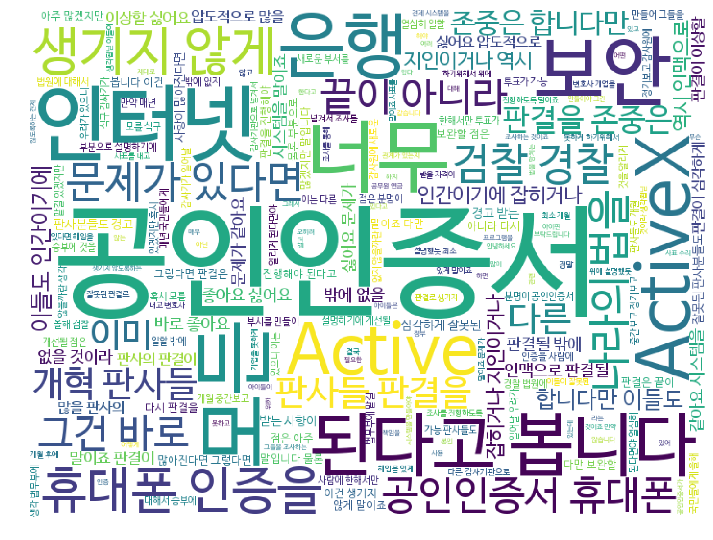

# soynlp로 자연어처리 시작하기
* https://github.com/lovit/soynlp


```python
!pip install -q 'soynlp[all]'
```

      soynlp 0.0.46 does not provide the extra 'all'
    You are using pip version 10.0.1, however version 18.0 is available.
    You should consider upgrading via the 'pip install --upgrade pip' command.
    


```python
!pip show soynlp
```

    Name: soynlp
    Version: 0.0.46
    Summary: Unsupervised Korean Natural Language Processing Toolkits
    Home-page: https://github.com/lovit/soynlp
    Author: Lovit
    Author-email: soy.lovit@gmail.com
    License: UNKNOWN
    Location: /usr/local/lib/python3.6/dist-packages
    Requires: psutil, numpy
    Required-by: 
    You are using pip version 10.0.1, however version 18.0 is available.
    You should consider upgrading via the 'pip install --upgrade pip' command.
    


```python
import pandas as pd
import numpy as np
import re
```


```python
df = pd.read_csv('https://s3.ap-northeast-2.amazonaws.com/data10902/petition/petition.csv', 
                 parse_dates=['start', 'end'])
df.shape
```


    (215154, 8)


## 자신의 관심사에 맞는 단어로 데이터를 가져옵니다.


```python
p = r'.*(공인인증서|공인 인증서|액티브X|ActiveX|Active X).*'
must_do = df[df['title'].str.match(p) |
             df['content'].str.match(p, flags=re.MULTILINE)]
must_do.shape
```


    (223, 8)


re. : 정규표현식에 있는 기능 중 하나


```python
must_do
```


<div>
<style scoped>
    .dataframe tbody tr th:only-of-type {
        vertical-align: middle;
    }

    .dataframe tbody tr th {
        vertical-align: top;
    }

    .dataframe thead th {
        text-align: right;
    }
</style>
<table border="1" class="dataframe">
  <thead>
    <tr style="text-align: right;">
      <th></th>
      <th>article_id</th>
      <th>start</th>
      <th>end</th>
      <th>answered</th>
      <th>votes</th>
      <th>category</th>
      <th>title</th>
      <th>content</th>
    </tr>
  </thead>
  <tbody>
    <tr>
      <th>584</th>
      <td>612</td>
      <td>2017-08-26</td>
      <td>2017-11-24</td>
      <td>0</td>
      <td>276</td>
      <td>교통/건축/국토</td>
      <td>공공임대리츠 아파트 네이밍 변경절차 불합리성 개선 요구합니다.</td>
      <td>2018년도에 공공임대 아파트 입주를 기다리고 있는 예비 입주자입니다.\n그런데 건...</td>
    </tr>
    <tr>
      <th>747</th>
      <td>775</td>
      <td>2017-08-28</td>
      <td>2017-09-12</td>
      <td>0</td>
      <td>4</td>
      <td>미래</td>
      <td>관공서 마다 다른 Active X 설치 시대를 역행하는 행정 서비스</td>
      <td>안녕하세요. 저는 세금을 내고 어쩌다 교통 범칙금도 내는 일반 시민 입니다.\n지금...</td>
    </tr>
    <tr>
      <th>953</th>
      <td>981</td>
      <td>2017-08-30</td>
      <td>2017-09-06</td>
      <td>0</td>
      <td>0</td>
      <td>경제민주화</td>
      <td>중소기업</td>
      <td>안녕하세요. 저는 중소기업 컨설팅회사를 운영하고 있는 대표입니다. (사업상의 이유로...</td>
    </tr>
    <tr>
      <th>956</th>
      <td>985</td>
      <td>2017-08-30</td>
      <td>2017-09-06</td>
      <td>0</td>
      <td>0</td>
      <td>경제민주화</td>
      <td>중소기업 입찰제도와 소상공인(최저임금관련)에 대한 청원</td>
      <td>안녕하세요. 저는 중소기업 컨설팅회사를 운영하고 있는 대표입니다. (사업상의 이유로...</td>
    </tr>
    <tr>
      <th>1103</th>
      <td>1132</td>
      <td>2017-08-31</td>
      <td>2017-09-15</td>
      <td>0</td>
      <td>1</td>
      <td>일자리</td>
      <td>국민신문고에 접수(8.11)했으나 아직도 행정기관끼리 핑퐁게임을 하고 있습니다.</td>
      <td>정보보안학과 4학년 재학중이며 졸업을 앞두고 있고, 정보보안과 디지털포렌식 전문가 ...</td>
    </tr>
    <tr>
      <th>1319</th>
      <td>1348</td>
      <td>2017-09-01</td>
      <td>2017-11-30</td>
      <td>0</td>
      <td>7</td>
      <td>미래</td>
      <td>암티브엑스(암+ActiveX)를 폐지해주세요.</td>
      <td>한국에서 금융권 사이트와 정부 사이트를 이용하려면 끝도 없이 깔아야 하는 Activ...</td>
    </tr>
    <tr>
      <th>12394</th>
      <td>12454</td>
      <td>2017-09-08</td>
      <td>2017-12-07</td>
      <td>0</td>
      <td>1</td>
      <td>기타</td>
      <td>공인인증서 폐지해주세요</td>
      <td>공인인증서 때문에 특히 예비군들이 피해를 많이 봅니다.\n훈련 하나 확인하는데 공인...</td>
    </tr>
    <tr>
      <th>12857</th>
      <td>12918</td>
      <td>2017-09-09</td>
      <td>2017-12-08</td>
      <td>0</td>
      <td>0</td>
      <td>기타</td>
      <td>홈페이지에 네이버계정으로 글쓰기하는 아이디어는 짱이네요^^</td>
      <td>네이버계정으로 글쓰기하는 아이디어가 짱이네요. 국민신문고도 그렇게 되면 좋겠네요. ...</td>
    </tr>
    <tr>
      <th>13322</th>
      <td>13387</td>
      <td>2017-09-11</td>
      <td>2017-12-10</td>
      <td>0</td>
      <td>1</td>
      <td>행정</td>
      <td>공인인증서 페지</td>
      <td>대선 공약이기도 한 데 공인인증서 페지 좀 해주세요.</td>
    </tr>
    <tr>
      <th>14321</th>
      <td>14405</td>
      <td>2017-09-18</td>
      <td>2017-10-18</td>
      <td>0</td>
      <td>0</td>
      <td>기타</td>
      <td>ActiveX 언제 없애 주실건가요?</td>
      <td>은행, 민원24 등의 사이트들에 공인인증서 및 각종 보안 프로그램때문에 짜증나 죽겠...</td>
    </tr>
    <tr>
      <th>15766</th>
      <td>15879</td>
      <td>2017-09-21</td>
      <td>2017-10-21</td>
      <td>0</td>
      <td>0</td>
      <td>기타</td>
      <td>공인인증서 좀 없애라</td>
      <td>뭔 놈의 공인인증서 공인인증서 공인인증서가 그리도 많느냐\n오랜만에 한국에서 돈 좀...</td>
    </tr>
    <tr>
      <th>15945</th>
      <td>16059</td>
      <td>2017-09-22</td>
      <td>2017-10-22</td>
      <td>0</td>
      <td>0</td>
      <td>기타</td>
      <td>인터넷 환경 개선 부탁 드립니다. (엑티브엑스, 공인인증서)</td>
      <td>안녕하세요. 대전에 살고 있는 사람 입니다.\n문재인 정부에 간곡하게 청원 드립니다...</td>
    </tr>
    <tr>
      <th>18053</th>
      <td>18217</td>
      <td>2017-09-29</td>
      <td>2017-10-29</td>
      <td>0</td>
      <td>2</td>
      <td>행정</td>
      <td>인터넷 보안업체와 정부&amp;금융 기관 유착 조사 요청.</td>
      <td>지난 세월 수 많은 아이티 전문가 분들이 금융과 행정 업무에 쓰이는 공인인증서와 액...</td>
    </tr>
    <tr>
      <th>18991</th>
      <td>19230</td>
      <td>2017-10-05</td>
      <td>2017-11-04</td>
      <td>0</td>
      <td>354</td>
      <td>미래</td>
      <td>국민을 괴롭히는 ActiveX 와 관련 보안프로그램은 완전히 사라져야 합니다.</td>
      <td>문정부가 내걸었던 정책 중 하나는 ActiveX의 완전 폐지였습니다. 문정부도 이제...</td>
    </tr>
    <tr>
      <th>19302</th>
      <td>19552</td>
      <td>2017-10-06</td>
      <td>2017-11-05</td>
      <td>0</td>
      <td>0</td>
      <td>성장동력</td>
      <td>중소벤처기업부장관 추첫</td>
      <td>중소벤처기업부 장관인선이 늦어져 관련 정책추진에 애로가 많을것으로 사료됩니다. 제4...</td>
    </tr>
    <tr>
      <th>19471</th>
      <td>19725</td>
      <td>2017-10-07</td>
      <td>2017-11-06</td>
      <td>0</td>
      <td>1</td>
      <td>외교/통일/국방</td>
      <td>학생예비군 제도 이렇게 개선해주세요</td>
      <td>학생예비군 제도의 치명적인 단점으로 통학거리가 먼 사람들은(특히 주로 수도권에서 충...</td>
    </tr>
    <tr>
      <th>20436</th>
      <td>20785</td>
      <td>2017-10-12</td>
      <td>2017-11-11</td>
      <td>0</td>
      <td>1</td>
      <td>행정</td>
      <td>법원은 국민을 심판, 법원 판사는 누가 심판?</td>
      <td>법원은 국민의 범죄를 심판하지만,  판사들은 누가 심판하는가??\n- 판사들의 청렴...</td>
    </tr>
    <tr>
      <th>20961</th>
      <td>21380</td>
      <td>2017-10-15</td>
      <td>2017-11-14</td>
      <td>0</td>
      <td>2</td>
      <td>외교/통일/국방</td>
      <td>대한민국 예비군 휴대폰어플 다시 살려주세요.</td>
      <td>대한민국 육군병장만기전역 현재 예비군 6년차입니다.\n얼마전까지만 하더라도 핸드폰으...</td>
    </tr>
    <tr>
      <th>21121</th>
      <td>21558</td>
      <td>2017-10-16</td>
      <td>2017-11-15</td>
      <td>0</td>
      <td>0</td>
      <td>보건복지</td>
      <td>공익침해 / 플라스틱김치통 가짜 품질인증서 18년 발급 총살하라</td>
      <td>http://blog.naver.com/kswbkj/221117331890  (블로...</td>
    </tr>
    <tr>
      <th>21236</th>
      <td>21698</td>
      <td>2017-10-16</td>
      <td>2017-11-15</td>
      <td>0</td>
      <td>0</td>
      <td>기타</td>
      <td>아이핀을 폐지 해주세요</td>
      <td>저는 해외에서 거주하고 있는 대한민국 국민입니다. 인터넷 카페에 가입하거나 다른 것...</td>
    </tr>
    <tr>
      <th>21335</th>
      <td>21863</td>
      <td>2017-10-17</td>
      <td>2017-11-16</td>
      <td>0</td>
      <td>2</td>
      <td>행정</td>
      <td>공인인증서를 없애주세요</td>
      <td>약 한달 뒤에 결혼합니다. 그래서 계약한 집에 대해서 확정일자를 받기 위해서 인터넷...</td>
    </tr>
    <tr>
      <th>21859</th>
      <td>22478</td>
      <td>2017-10-20</td>
      <td>2017-11-19</td>
      <td>0</td>
      <td>0</td>
      <td>기타</td>
      <td>대한민국 법원도 갑이라고 생각하는 나.. 비정상적인가요??랄까요.</td>
      <td>대한민국 법원도 갑질이라고 생각하는 나.. 비정상적인가요??\n- 비정상회담 패러디...</td>
    </tr>
    <tr>
      <th>21884</th>
      <td>22508</td>
      <td>2017-10-20</td>
      <td>2017-11-19</td>
      <td>0</td>
      <td>1</td>
      <td>미래</td>
      <td>액티브엑스. 플러그인. 공인인증서 폐지</td>
      <td>액티브엑스. 플러그인. 공인인증서 폐지\n저 세가지. 제발 폐지좀 시켜주세요.\n왜...</td>
    </tr>
    <tr>
      <th>21952</th>
      <td>22598</td>
      <td>2017-10-20</td>
      <td>2017-11-19</td>
      <td>0</td>
      <td>1</td>
      <td>행정</td>
      <td>대한민국 모든 기관 홈페이지에서 아이핀을 없애주세요.</td>
      <td>대한민국 청와대에도 아이핀 없이 이렇게 글을 적을 수 있는데, 왜 일반 기관의 홈페...</td>
    </tr>
    <tr>
      <th>22649</th>
      <td>23404</td>
      <td>2017-10-24</td>
      <td>2017-11-23</td>
      <td>0</td>
      <td>2</td>
      <td>기타</td>
      <td>공인인증서 통폐합</td>
      <td>현재 은행마다, 쇼핑몰마다 공인인증서를 다시 깔아야 하고 회사도 수십개가 넘어 매우...</td>
    </tr>
    <tr>
      <th>23088</th>
      <td>23909</td>
      <td>2017-10-26</td>
      <td>2017-11-25</td>
      <td>0</td>
      <td>1</td>
      <td>기타</td>
      <td>검찰, 경찰 개혁 , 법원 개혁</td>
      <td>검찰, 경찰 개혁\n- 이건 제가 볼땐 생각보다 아주 간단한건데 너무 질질 복잡하게...</td>
    </tr>
    <tr>
      <th>24611</th>
      <td>25587</td>
      <td>2017-11-02</td>
      <td>2017-12-02</td>
      <td>0</td>
      <td>6</td>
      <td>문화/예술/체육/언론</td>
      <td>유튜브, 아프리카 TV 등 개인방송의 접근성에 대한 법안 마련 촉구</td>
      <td>지금 아래의 청원이 굉장히 이슈가되고 있는 것으로 알고 있습니다.\n[청소년이란 이...</td>
    </tr>
    <tr>
      <th>29755</th>
      <td>31037</td>
      <td>2017-11-10</td>
      <td>2017-12-10</td>
      <td>0</td>
      <td>0</td>
      <td>기타</td>
      <td>비정상적인 법원.. 법원 대개혁 및 법 개혁 (판사들 은퇴 후 비리 조사 및 6개월...</td>
      <td>법원은 범죄자에게 벌을 내려야할 곳이지..  그들을 지켜야 될 곳은 아닙니다..\n...</td>
    </tr>
    <tr>
      <th>29768</th>
      <td>31051</td>
      <td>2017-11-10</td>
      <td>2017-12-10</td>
      <td>0</td>
      <td>0</td>
      <td>기타</td>
      <td>법원도 공범이 될수 있지 않을까란 생각이 문뜩 드네요(제 2 판관포청천 만들기 프로젝트)</td>
      <td>문득 법원도 공범이 될수 있지 않을까란 생각이 드네요(제 2 판관포청천 만들기 프로...</td>
    </tr>
    <tr>
      <th>43619</th>
      <td>45193</td>
      <td>2017-11-16</td>
      <td>2017-12-16</td>
      <td>0</td>
      <td>0</td>
      <td>기타</td>
      <td>공인 인증서  폐지</td>
      <td>공인 인증서 폐지 좀 합시다.\n액티브 엑스땜에 뭘 할수가 없네요.</td>
    </tr>
    <tr>
      <th>...</th>
      <td>...</td>
      <td>...</td>
      <td>...</td>
      <td>...</td>
      <td>...</td>
      <td>...</td>
      <td>...</td>
      <td>...</td>
    </tr>
    <tr>
      <th>188278</th>
      <td>236741</td>
      <td>2018-05-18</td>
      <td>2018-06-17</td>
      <td>0</td>
      <td>1</td>
      <td>행정</td>
      <td>공공아이핀 단계적 폐지 유보</td>
      <td>2014년 8월 7일 개인정보보호법에 의거하여 주민등록번호 처리가 금지되게 됩니다....</td>
    </tr>
    <tr>
      <th>188747</th>
      <td>237439</td>
      <td>2018-05-19</td>
      <td>2018-06-18</td>
      <td>0</td>
      <td>0</td>
      <td>기타</td>
      <td>INISAFE, nprotect, AhnLab safe transaction과 같은...</td>
      <td>인터넷쇼핑 사이트에서 물건을 사기 위해서 결제를 하거나, 인터넷뱅킹에서 계좌조회나 ...</td>
    </tr>
    <tr>
      <th>188967</th>
      <td>237760</td>
      <td>2018-05-20</td>
      <td>2018-06-19</td>
      <td>0</td>
      <td>243</td>
      <td>기타</td>
      <td>청원신청인 실명인증제를 건의드립니다.</td>
      <td>[논리적 근거가 부족한 청원]\n신호등 신호를 기다리는 시간을 짫게 해주세요 &gt; 국...</td>
    </tr>
    <tr>
      <th>189005</th>
      <td>237808</td>
      <td>2018-05-20</td>
      <td>2018-06-19</td>
      <td>0</td>
      <td>12</td>
      <td>안전/환경</td>
      <td>한국 인터넷 환경 선진화를 위해 공공 사이트 및 금융 기관에서의 보안 프로그램이라는...</td>
      <td>현재 한국의 인터넷 상황은 (구 : Active X)에서 (현 : exe)로 바뀌었...</td>
    </tr>
    <tr>
      <th>190779</th>
      <td>240567</td>
      <td>2018-05-22</td>
      <td>2018-06-21</td>
      <td>0</td>
      <td>6</td>
      <td>문화/예술/체육/언론</td>
      <td>네이버 다음 등 뉴스 기사에 댓글창 폐지 청원합니다</td>
      <td>네이버 다음 등 모든 뉴스 기사에 댓글을 달수없도록 강력한 조치가 필요합니다 댓글조...</td>
    </tr>
    <tr>
      <th>192104</th>
      <td>242516</td>
      <td>2018-05-24</td>
      <td>2018-06-23</td>
      <td>0</td>
      <td>0</td>
      <td>행정</td>
      <td>신용불량자 또는 사정상은행거래없는 개인 의 공인인증서발급</td>
      <td>부채가있는1000만인구의 신용불량자중 은행거래가 불가능한 사람이100만~300만인구...</td>
    </tr>
    <tr>
      <th>192107</th>
      <td>242520</td>
      <td>2018-05-24</td>
      <td>2018-06-23</td>
      <td>0</td>
      <td>22</td>
      <td>성장동력</td>
      <td>(다들 공감하실 겁니다.) 불편한 국가 공공 사이트와 은행 관련 사이트에 대한 개혁...</td>
      <td>저는 보안 프로그램을 설치해야 하는 공공 및 은행 웹사이트를 바꿔야 한다고 청원합니...</td>
    </tr>
    <tr>
      <th>192277</th>
      <td>242761</td>
      <td>2018-05-24</td>
      <td>2018-06-23</td>
      <td>0</td>
      <td>31</td>
      <td>정치개혁</td>
      <td>국회의원탄핵제도마련요청</td>
      <td>일 제대로안하고 뇌물만좋아하고 공사구분못하는 대통령도탄핵하는시대입니다.일안하겠다고 ...</td>
    </tr>
    <tr>
      <th>192741</th>
      <td>243384</td>
      <td>2018-05-25</td>
      <td>2018-06-24</td>
      <td>0</td>
      <td>3475</td>
      <td>보건복지</td>
      <td>동의 없는 임신으로 사회적 물의를 일으킨 남성을 처벌하는 법을 만들어 주세요.</td>
      <td>임신동의가 없는 관계에서 콘돔을 미착용하여 여성이 임신하게 되었을 경우, 남성을 처...</td>
    </tr>
    <tr>
      <th>192760</th>
      <td>243414</td>
      <td>2018-05-25</td>
      <td>2018-06-24</td>
      <td>0</td>
      <td>0</td>
      <td>보건복지</td>
      <td>통합연금포털 / 내보험찾기 등, 자동이체로 빼갔으면 국가에서 알아서 반환해주세요</td>
      <td>안찾아간 연금 총 액수만 4조원, 그 중 80%가 넘는 가입자들이 개시일이 됐는데도...</td>
    </tr>
    <tr>
      <th>194175</th>
      <td>245405</td>
      <td>2018-05-27</td>
      <td>2018-06-26</td>
      <td>0</td>
      <td>192</td>
      <td>성장동력</td>
      <td>공인인증서를 폐지하랬더니 공동공인인증서라니요.</td>
      <td>모든 엑티브엑스 및 기타 공공기관에 들어가면 설치되는 부분들 없애달라 은행권 공인인...</td>
    </tr>
    <tr>
      <th>194648</th>
      <td>246163</td>
      <td>2018-05-28</td>
      <td>2018-06-27</td>
      <td>0</td>
      <td>2</td>
      <td>육아/교육</td>
      <td>교직원 메일 폐지 청원</td>
      <td>저는 교직원이 아닌 한 평범한 학생입니다.\n이번에 학교에서 내준 과제를 수행하고 ...</td>
    </tr>
    <tr>
      <th>195356</th>
      <td>248230</td>
      <td>2018-05-29</td>
      <td>2018-06-28</td>
      <td>0</td>
      <td>1</td>
      <td>기타</td>
      <td>청원조건을 좀 높여주십시오</td>
      <td>이게뭡니까?\n지금 청와대 청원게시판은 자유게시판으로 거듭났습니다.\n솔직히 트위터...</td>
    </tr>
    <tr>
      <th>195544</th>
      <td>248936</td>
      <td>2018-05-29</td>
      <td>2018-06-28</td>
      <td>0</td>
      <td>3</td>
      <td>기타</td>
      <td>청와대 국민청원 익명을 반대합니다</td>
      <td>안녕하세요 이상한 청원이 올라오는걸 몇번 봐서 적어봅니다\n제가 처음으로 청원을 올...</td>
    </tr>
    <tr>
      <th>195675</th>
      <td>249194</td>
      <td>2018-05-29</td>
      <td>2018-06-28</td>
      <td>0</td>
      <td>4</td>
      <td>행정</td>
      <td>공인인증서 -&gt; 공동인증서 조삼모사? 개정해주세요</td>
      <td>이거 뭐 장난하는것도 아니고 돌려막기로 공약 이행하겠다는건데\n이럴꺼면 이명박근혜랑...</td>
    </tr>
    <tr>
      <th>196252</th>
      <td>250525</td>
      <td>2018-05-29</td>
      <td>2018-06-28</td>
      <td>0</td>
      <td>3</td>
      <td>보건복지</td>
      <td>국가 장학금 신청문제</td>
      <td>4년전에 저희 부모님들께서 이혼을 하지 않은 상태로 어머니께서 가출을 하였습니다 몇...</td>
    </tr>
    <tr>
      <th>200045</th>
      <td>258185</td>
      <td>2018-06-01</td>
      <td>2018-07-01</td>
      <td>0</td>
      <td>1</td>
      <td>인권/성평등</td>
      <td>제2의 판관포청천을 만들기위해선 과거 기준 전직(10-15년) 현직 판사들 뇌물죄조...</td>
      <td>2017년 10월부터 주구장창 썼는데..-_- 어유. 이 나라 청와대는 지금 뭐하니...</td>
    </tr>
    <tr>
      <th>200140</th>
      <td>258314</td>
      <td>2018-06-01</td>
      <td>2018-07-01</td>
      <td>0</td>
      <td>1</td>
      <td>육아/교육</td>
      <td>어린이집 복지로 신청서비스관련</td>
      <td>맞벌이부부입니다. 복지로 에서 어린이집 복지로 신청 서비스 관련입니다.\n와이프가 ...</td>
    </tr>
    <tr>
      <th>200389</th>
      <td>258642</td>
      <td>2018-06-01</td>
      <td>2018-07-01</td>
      <td>0</td>
      <td>0</td>
      <td>기타</td>
      <td>윈도우에서만 사용가능한 민원24 사이트 문제를 해결해주세요</td>
      <td>윈도우에서는 민원24사이트의 사용이 잘되는걸로 알고 있지만 이미 수년째 맥OS에서는...</td>
    </tr>
    <tr>
      <th>200489</th>
      <td>258766</td>
      <td>2018-06-01</td>
      <td>2018-07-01</td>
      <td>0</td>
      <td>6</td>
      <td>기타</td>
      <td>공인인증서폐지</td>
      <td>안녕하세요\n개인사업을 하고있는 젊은 사장입니다.\n제가 청원에 글을쓰는이유는\n공...</td>
    </tr>
    <tr>
      <th>201122</th>
      <td>259589</td>
      <td>2018-06-02</td>
      <td>2018-07-02</td>
      <td>0</td>
      <td>5</td>
      <td>행정</td>
      <td>IT 강국이라면서 정부 사이트는 수준 왜 이래요?</td>
      <td>온라인 민원처리하는데 보안 프로그램을 강제로 깔게 하지를 않나\n공인인증서 폐기할거...</td>
    </tr>
    <tr>
      <th>201464</th>
      <td>260084</td>
      <td>2018-06-02</td>
      <td>2018-07-02</td>
      <td>0</td>
      <td>234</td>
      <td>미래</td>
      <td>정부의 웹 표준 무시는 철회되어야 합니다.</td>
      <td>이미 트위터에 공개적으로 게시된 내용입니다. 관련링크 참조해주시기 바랍니다. (아래...</td>
    </tr>
    <tr>
      <th>201905</th>
      <td>260715</td>
      <td>2018-06-03</td>
      <td>2018-07-03</td>
      <td>0</td>
      <td>3</td>
      <td>정치개혁</td>
      <td>문재인대통령님보세요</td>
      <td>문재인 대통령님 대통령님께서도 서민을 위한 분이 맞으신지요?　어떨때보면\n대통령님도...</td>
    </tr>
    <tr>
      <th>204193</th>
      <td>263735</td>
      <td>2018-06-05</td>
      <td>2018-07-05</td>
      <td>0</td>
      <td>2</td>
      <td>행정</td>
      <td>공인인증서</td>
      <td>공인인증서좀 제발 폐지합시다\n폐지 한다한지가 언젠데 아직까지 이러고있습니까\n그리...</td>
    </tr>
    <tr>
      <th>206166</th>
      <td>266430</td>
      <td>2018-06-08</td>
      <td>2018-07-08</td>
      <td>0</td>
      <td>4</td>
      <td>행정</td>
      <td>제발 &lt;공공 I-PIN&gt; 제도 좀 생략해 주세요.</td>
      <td>해외 거주 중인 유학생입니다. 고로 한국에서 사용하고 있는 핸드폰은 당연히 없앴습니...</td>
    </tr>
    <tr>
      <th>207567</th>
      <td>268275</td>
      <td>2018-06-11</td>
      <td>2018-07-11</td>
      <td>0</td>
      <td>4</td>
      <td>경제민주화</td>
      <td>공인인증서 폐기해주세요! 제발!</td>
      <td>적폐중의 적폐인 공인인증서 사용을 완전히 없애주세요.\n모바일로 실시간 비밀번호 넣...</td>
    </tr>
    <tr>
      <th>207670</th>
      <td>268399</td>
      <td>2018-06-11</td>
      <td>2018-07-11</td>
      <td>0</td>
      <td>5</td>
      <td>행정</td>
      <td>공인인증서의 제도의 깔끔한 폐지를 원합니다.</td>
      <td>지난 수년간 공인인증서 제도는 발급절차의 까다로움과 사용의 불편함 때문에 대다수의 ...</td>
    </tr>
    <tr>
      <th>207673</th>
      <td>268402</td>
      <td>2018-06-11</td>
      <td>2018-07-11</td>
      <td>0</td>
      <td>21</td>
      <td>행정</td>
      <td>공인인증서의 제도의 깔끔한 폐지를 원합니다.</td>
      <td>지난 수년간 공인인증서 제도는 발급절차의 까다로움과 사용의 불편함 때문에 대다수의 ...</td>
    </tr>
    <tr>
      <th>209740</th>
      <td>270950</td>
      <td>2018-06-14</td>
      <td>2018-07-14</td>
      <td>0</td>
      <td>1</td>
      <td>미래</td>
      <td>제발 그 망할 다이렉트 X 랑 공인인증서좀 없애주세요</td>
      <td>솔직히 이거 쓰면서 편리함, 안전성이라고는 하나도 찾아보기 힘드면서, 쓰이는건 한국...</td>
    </tr>
    <tr>
      <th>213329</th>
      <td>275632</td>
      <td>2018-06-19</td>
      <td>2018-07-19</td>
      <td>0</td>
      <td>3</td>
      <td>행정</td>
      <td>청원 공인인증서 로그인 후 실명제로 변환 요청합니다.</td>
      <td>말도 안되는 내용으로 청원이 남발하고 있습니다.\n국민청원이 장난도 아니고 공인인증...</td>
    </tr>
  </tbody>
</table>
<p>223 rows × 8 columns</p>
</div>


```python
from soynlp.tokenizer import RegexTokenizer, LTokenizer, MaxScoreTokenizer

tokenizer = RegexTokenizer()
tokenizer
```


    <soynlp.tokenizer._tokenizer.RegexTokenizer at 0x7f7686c86278>


```python
# 샘플로 보고 싶은 인덱스의 번호를 넣어주세요.
sample_index = 18991
```


```python
sample_title = must_do['title'][sample_index]
sample_title
```


    '국민을 괴롭히는 ActiveX 와 관련 보안프로그램은 완전히 사라져야 합니다.'


```python
sample_content = must_do['content'][sample_index]
sample_content
```


    '문정부가 내걸었던 정책 중 하나는 ActiveX의 완전 폐지였습니다. 문정부도 이제 출범 몇 개월 차지만, ActiveX는 여전히 사라질 기미조차 보이지 않습니다.\\nActiveX는 발표 직후 브라우저의 기능을 극대화시킬 수 있는 신기술로 평가받았습니다만, 이는 벌써 십수 년도 더 된 평가입니다. 시대가 변하고 신기술이 개발됨에 따라 ActiveX는 이제 어쩔 수 없는 보안 허점투성이자 골칫덩이로 전락해버렸습니다.\\n하지만 이러한 사정을 아는지 모르는지 IT강국이라는 대한민국은 아직도 ActiveX를 버리지 못하고 있으며, 이는 전 세계에서 ActiveX 기술을 사용하는 유일한 국가라는 웃지 못할 기록을 남기게 되었습니다.\\n그뿐 아니라 정부의 정책이라며 ActiveX를 확장 프로그램과 .exe 실행파일로 대체해버리는 보안업체까지 보입니다. 이는 ActiveX와 실행파일의 본질이 같음을 알고도 정책을 따른다고 주장하는 보안업계의 기만일 뿐입니다.\\n결국 이들의 기만으로 인한 피해는 국민에게 고스란히 넘어오고 있습니다. 금융업무를 보기 위해선 기기, 운영체제 관계없이 설치하기도 싫고 설치 과정도 복잡하기만 한 보안 프로그램을 여러 개 설치해야 하고, 그렇게 설치하고도 금융시스템 접속 자체를 실패하는 경우 역시 다반사입니다. 자세히 후술 하겠지만, 이렇게 설치된 보안 프로그램이 결국 제 구실조차 하지 못한다는 건 이미 많은 사람들이 알고 있습니다.\\n송금 앱 "Toss"역시 단순히 이 문제점만을 해결했을 뿐인데도 "금융 필수 앱" 대우을 받으며 많은 사용자들에게 인기를 끌고 있으며, 한 유저가 개발한 "구라 제거기"라는 보안 프로그램 통합 제거 툴은 사람들 사이에서 널리 퍼지고 있습니다.\\n저는 보안 프로그램이 제 구실을 못하고 사람들이 위와 같은 현상을 이끌어내는 이 웃지 못할 상황이 확실히 문제라고 생각합니다. 따라서 저는 아래와 같은 사유로 ActiveX와 그 관련 보안 프로그램의 완전 폐지를 요구합니다.\\n1. ActiveX는 상당히 낡은 기술입니다.\\n이는 ActiveX에 한정된 이야기이긴 합니다만, ActiveX는 1996년에 개발되었습니다. 2017년 현재까지 21년이 지나며 ActiveX는 "웹 브라우저 퍼포먼스 저하", "낮은 접근성", "웹 브라우저 강제 종료"등 여러 문제가 거론되기 시작했고, 애드웨어와 랜섬웨어 등 바이러스의 온상이 되어 플래시와 함께 국제 웹 표준에서 모습을 감추게 되었습니다. 시간이 지남에 따라 이 구시대적 기술은 한국을 제외한 전 세계에서 퇴출됨에 이르렀습니다.\\n2. 보안업체의 미숙하고 수비적인 대처능력으로 오히려 정보기기를 위험에 빠뜨리고 있습니다.\\n보안업체의 미숙한 개발 능력으로 보안 프로그램이 오히려 정보기기의 보안을 떨어뜨린다는 사실은 널리 알려져 있습니다. 보안 프로그램의 취약점으로 기기의 보안을 지켜야 할 프로그램은 오히려 해커의 표적이 되고 있습니다. 대한민국에서 유난히 크고 작은 해킹 사건이 일어나고 있는 것 역시 이 때문입니다.\\n이 문제를 두고 실제로 저명한 웹 기술 개발 단체인 모질라재단(웹브라우저 파이어폭스의 개발사)의 한 엔지니어는 자체 보안 기능을 제외하고 모든 안티바이러스 S/W를 제거하라고 경고한 바 있습니다. (지디넷 링크)\\n3. 보안 프로그램은 사용자에게 불편함을 초래합니다.\\n은행 웹사이트에 접속하자마자 사이트는 여러 가지 보안 프로그램 설치를 요구합니다. 설치해야 하는 프로그램은 평균 세 개에서 열개까지로 이 프로그램들을 모두 일일이 설치하라는 사이트도 존재합니다.\\n이를 모두 설치하는데 과정이 복잡한 것은 당연지사며 설치에 걸리는 시간도 상당히 느립니다. 또한, 이는 보안 프로그램들이 주로 대응하는 윈도우와 안드로이드에만 한정된 이야기이며 맥OS/iOS와 리눅스 유저는 사이트에 따라 별도의 컴퓨터에 필요한 운영체제를 설치하기까지 해야 하는 불편함을 초래합니다. 이는 결론적으로 대한민국에서 윈도의 경쟁력을 높이고 맥OS와 리눅스의 접근성을 떨어뜨리는 결과를 초래합니다. 나아가 일종의 중립성을 훼손하며 사용자의 운영체제를 선택할 자유를 제한하는 것이나 마찬가지입니다.\\n4. 보안 프로그램은 정보기기의 속도를 저하시킵니다.\\n보안 프로그램은 은행 업무와 같은 특정 목적을 위해 설치되었음에도 은행 업무를 본 기기의 백그라운드 프로세스와 서비스에 상주하면서 기기의 자원을 항상 소모하고 있습니다.\\n실제로 한 보안 프로그램은 프로그램 삭제 전후를 비교해 보았을 때, 프로그램을 삭제한 이후 웹 브라우저가 훨씬 안정되는 현상이 많은 사용자들에게 보고된 바 있습니다. (한국경제 링크)\\n5. 외국의 사례로 보아도 보안을 위해 사용자에 무언가 설치를 요구하는 웹사이트는 없습니다.\\n보안 프로그램 설치를 의무화해야 한다는 주장의 근거를 살펴보면 "보안을 위해서" 하나뿐입니다. 보안 프로그램 설치 의무화를 폐지함으로써 얻는 이득이 큼은 고사하고 찬성 진영 근거인 보안 역시 흔들리기 시작한 지 오래입니다.\\n이미 보안 프로그램 설치 없이 기업의 노력만으로 보안 프로그램 이상의 효과를 볼 수 있음은 외국의 웹사이트로 증명되었습니다. 당장 각 업계 최다 회원수를 자랑하는 구글, 아마존, 스팀을 보더라도 금융결제 과정에서 무언가 보안 프로그램 설치를 요구하지는 않습니다. 하지만 그들이 해킹을 당했다는 소식은 들려오지 않았습니다.\\n현재 많은 문제를 안고 있음에도 제 역할조차 제대로 하지 못하는 ActiveX는 더 이상 존재가치가 없지만 여전히 살아 숨 쉬고 있습니다. ActiveX의 적용 범위를 생각한다면 이는 국가의 안보와도 직결되는 문제입니다. 단언컨대 문정부의 "적폐 청산" 대상임에 분명합니다.\\n따라서 ActiveX와 그를 기반으로 하거나 관련된 보안 프로그램을 정말 폐지하고, 나아가 웹사이트가 사용자에게 보안 프로그램을 설치하라고 요구하지 않도록 제도화해야 합니다.'


# 토큰화


```python
tokened_title = tokenizer.tokenize(sample_title)
tokened_title
```


    ['국민을', '괴롭히는', 'ActiveX', '와', '관련', '보안프로그램은', '완전히', '사라져야', '합니다', '.']


```python
tokened_content = tokenizer.tokenize(sample_content)
tokened_content
```


    ['문정부가',
     '내걸었던',
     '정책',
     '중',
     '하나는',
     'ActiveX',
     '의',
     '완전',
     '폐지였습니다',
     '.',
     '문정부도',
     '이제',
     '출범',
     '몇',
     '개월',
     '차지만',
     ',',
     'ActiveX',
     '는',
     '여전히',
     '사라질',
     '기미조차',
     '보이지',
     '않습니다',
     '.\\',
     'nActiveX',
     '는',
     '발표',
     '직후',
     '브라우저의',
     '기능을',
     '극대화시킬',
     '수',
     '있는',
     '신기술로',
     '평가받았습니다만',
     ',',
     '이는',
     '벌써',
     '십수',
     '년도',
     '더',
     '된',
     '평가입니다',
     '.',
     '시대가',
     '변하고',
     '신기술이',
     '개발됨에',
     '따라',
     'ActiveX',
     '는',
     '이제',
     '어쩔',
     '수',
     '없는',
     '보안',
     '허점투성이자',
     '골칫덩이로',
     '전락해버렸습니다',
     '.\\',
     'n',
     '하지만',
     '이러한',
     '사정을',
     '아는지',
     '모르는지',
     'IT',
     '강국이라는',
     '대한민국은',
     '아직도',
     'ActiveX',
     '를',
     '버리지',
     '못하고',
     '있으며',
     ',',
     '이는',
     '전',
     '세계에서',
     'ActiveX',
     '기술을',
     '사용하는',
     '유일한',
     '국가라는',
     '웃지',
     '못할',
     '기록을',
     '남기게',
     '되었습니다',
     '.\\',
     'n',
     '그뿐',
     '아니라',
     '정부의',
     '정책이라며',
     'ActiveX',
     '를',
     '확장',
     '프로그램과',
     '.',
     'exe',
     '실행파일로',
     '대체해버리는',
     '보안업체까지',
     '보입니다',
     '.',
     '이는',
     'ActiveX',
     '와',
     '실행파일의',
     '본질이',
     '같음을',
     '알고도',
     '정책을',
     '따른다고',
     '주장하는',
     '보안업계의',
     '기만일',
     '뿐입니다',
     '.\\',
     'n',
     '결국',
     '이들의',
     '기만으로',
     '인한',
     '피해는',
     '국민에게',
     '고스란히',
     '넘어오고',
     '있습니다',
     '.',
     '금융업무를',
     '보기',
     '위해선',
     '기기',
     ',',
     '운영체제',
     '관계없이',
     '설치하기도',
     '싫고',
     '설치',
     '과정도',
     '복잡하기만',
     '한',
     '보안',
     '프로그램을',
     '여러',
     '개',
     '설치해야',
     '하고',
     ',',
     '그렇게',
     '설치하고도',
     '금융시스템',
     '접속',
     '자체를',
     '실패하는',
     '경우',
     '역시',
     '다반사입니다',
     '.',
     '자세히',
     '후술',
     '하겠지만',
     ',',
     '이렇게',
     '설치된',
     '보안',
     '프로그램이',
     '결국',
     '제',
     '구실조차',
     '하지',
     '못한다는',
     '건',
     '이미',
     '많은',
     '사람들이',
     '알고',
     '있습니다',
     '.\\',
     'n',
     '송금',
     '앱',
     '"',
     'Toss',
     '"',
     '역시',
     '단순히',
     '이',
     '문제점만을',
     '해결했을',
     '뿐인데도',
     '"',
     '금융',
     '필수',
     '앱',
     '"',
     '대우을',
     '받으며',
     '많은',
     '사용자들에게',
     '인기를',
     '끌고',
     '있으며',
     ',',
     '한',
     '유저가',
     '개발한',
     '"',
     '구라',
     '제거기',
     '"',
     '라는',
     '보안',
     '프로그램',
     '통합',
     '제거',
     '툴은',
     '사람들',
     '사이에서',
     '널리',
     '퍼지고',
     '있습니다',
     '.\\',
     'n',
     '저는',
     '보안',
     '프로그램이',
     '제',
     '구실을',
     '못하고',
     '사람들이',
     '위와',
     '같은',
     '현상을',
     '이끌어내는',
     '이',
     '웃지',
     '못할',
     '상황이',
     '확실히',
     '문제라고',
     '생각합니다',
     '.',
     '따라서',
     '저는',
     '아래와',
     '같은',
     '사유로',
     'ActiveX',
     '와',
     '그',
     '관련',
     '보안',
     '프로그램의',
     '완전',
     '폐지를',
     '요구합니다',
     '.\\',
     'n',
     '1',
     '.',
     'ActiveX',
     '는',
     '상당히',
     '낡은',
     '기술입니다',
     '.\\',
     'n',
     '이는',
     'ActiveX',
     '에',
     '한정된',
     '이야기이긴',
     '합니다만',
     ',',
     'ActiveX',
     '는',
     '1996',
     '년에',
     '개발되었습니다',
     '.',
     '2017',
     '년',
     '현재까지',
     '21',
     '년이',
     '지나며',
     'ActiveX',
     '는',
     '"',
     '웹',
     '브라우저',
     '퍼포먼스',
     '저하',
     '",',
     '"',
     '낮은',
     '접근성',
     '",',
     '"',
     '웹',
     '브라우저',
     '강제',
     '종료',
     '"',
     '등',
     '여러',
     '문제가',
     '거론되기',
     '시작했고',
     ',',
     '애드웨어와',
     '랜섬웨어',
     '등',
     '바이러스의',
     '온상이',
     '되어',
     '플래시와',
     '함께',
     '국제',
     '웹',
     '표준에서',
     '모습을',
     '감추게',
     '되었습니다',
     '.',
     '시간이',
     '지남에',
     '따라',
     '이',
     '구시대적',
     '기술은',
     '한국을',
     '제외한',
     '전',
     '세계에서',
     '퇴출됨에',
     '이르렀습니다',
     '.\\',
     'n',
     '2',
     '.',
     '보안업체의',
     '미숙하고',
     '수비적인',
     '대처능력으로',
     '오히려',
     '정보기기를',
     '위험에',
     '빠뜨리고',
     '있습니다',
     '.\\',
     'n',
     '보안업체의',
     '미숙한',
     '개발',
     '능력으로',
     '보안',
     '프로그램이',
     '오히려',
     '정보기기의',
     '보안을',
     '떨어뜨린다는',
     '사실은',
     '널리',
     '알려져',
     '있습니다',
     '.',
     '보안',
     '프로그램의',
     '취약점으로',
     '기기의',
     '보안을',
     '지켜야',
     '할',
     '프로그램은',
     '오히려',
     '해커의',
     '표적이',
     '되고',
     '있습니다',
     '.',
     '대한민국에서',
     '유난히',
     '크고',
     '작은',
     '해킹',
     '사건이',
     '일어나고',
     '있는',
     '것',
     '역시',
     '이',
     '때문입니다',
     '.\\',
     'n',
     '이',
     '문제를',
     '두고',
     '실제로',
     '저명한',
     '웹',
     '기술',
     '개발',
     '단체인',
     '모질라재단',
     '(',
     '웹브라우저',
     '파이어폭스의',
     '개발사',
     ')',
     '의',
     '한',
     '엔지니어는',
     '자체',
     '보안',
     '기능을',
     '제외하고',
     '모든',
     '안티바이러스',
     'S',
     '/',
     'W',
     '를',
     '제거하라고',
     '경고한',
     '바',
     '있습니다',
     '.',
     '(',
     '지디넷',
     '링크',
     ')\\',
     'n',
     '3',
     '.',
     '보안',
     '프로그램은',
     '사용자에게',
     '불편함을',
     '초래합니다',
     '.\\',
     'n',
     '은행',
     '웹사이트에',
     '접속하자마자',
     '사이트는',
     '여러',
     '가지',
     '보안',
     '프로그램',
     '설치를',
     '요구합니다',
     '.',
     '설치해야',
     '하는',
     '프로그램은',
     '평균',
     '세',
     '개에서',
     '열개까지로',
     '이',
     '프로그램들을',
     '모두',
     '일일이',
     '설치하라는',
     '사이트도',
     '존재합니다',
     '.\\',
     'n',
     '이를',
     '모두',
     '설치하는데',
     '과정이',
     '복잡한',
     '것은',
     '당연지사며',
     '설치에',
     '걸리는',
     '시간도',
     '상당히',
     '느립니다',
     '.',
     '또한',
     ',',
     '이는',
     '보안',
     '프로그램들이',
     '주로',
     '대응하는',
     '윈도우와',
     '안드로이드에만',
     '한정된',
     '이야기이며',
     '맥',
     'OS',
     '/',
     'iOS',
     '와',
     '리눅스',
     '유저는',
     '사이트에',
     '따라',
     '별도의',
     '컴퓨터에',
     '필요한',
     '운영체제를',
     '설치하기까지',
     '해야',
     '하는',
     '불편함을',
     '초래합니다',
     '.',
     '이는',
     '결론적으로',
     '대한민국에서',
     '윈도의',
     '경쟁력을',
     '높이고',
     '맥',
     'OS',
     '와',
     '리눅스의',
     '접근성을',
     '떨어뜨리는',
     '결과를',
     '초래합니다',
     '.',
     '나아가',
     '일종의',
     '중립성을',
     '훼손하며',
     '사용자의',
     '운영체제를',
     '선택할',
     '자유를',
     '제한하는',
     '것이나',
     '마찬가지입니다',
     '.\\',
     'n',
     '4',
     '.',
     '보안',
     '프로그램은',
     '정보기기의',
     '속도를',
     '저하시킵니다',
     '.\\',
     'n',
     '보안',
     '프로그램은',
     '은행',
     '업무와',
     '같은',
     '특정',
     '목적을',
     '위해',
     '설치되었음에도',
     '은행',
     '업무를',
     '본',
     '기기의',
     '백그라운드',
     '프로세스와',
     '서비스에',
     '상주하면서',
     '기기의',
     '자원을',
     '항상',
     '소모하고',
     '있습니다',
     '.\\',
     'n',
     '실제로',
     '한',
     '보안',
     '프로그램은',
     '프로그램',
     '삭제',
     '전후를',
     '비교해',
     '보았을',
     '때',
     ',',
     '프로그램을',
     '삭제한',
     '이후',
     '웹',
     '브라우저가',
     '훨씬',
     '안정되는',
     '현상이',
     '많은',
     '사용자들에게',
     '보고된',
     '바',
     '있습니다',
     '.',
     '(',
     '한국경제',
     '링크',
     ')\\',
     'n',
     '5',
     '.',
     '외국의',
     '사례로',
     '보아도',
     '보안을',
     '위해',
     '사용자에',
     '무언가',
     '설치를',
     '요구하는',
     '웹사이트는',
     '없습니다',
     '.\\',
     'n',
     '보안',
     '프로그램',
     '설치를',
     '의무화해야',
     '한다는',
     '주장의',
     '근거를',
     '살펴보면',
     '"',
     '보안을',
     '위해서',
     '"',
     '하나뿐입니다',
     '.',
     '보안',
     '프로그램',
     '설치',
     '의무화를',
     '폐지함으로써',
     '얻는',
     '이득이',
     '큼은',
     '고사하고',
     '찬성',
     '진영',
     '근거인',
     '보안',
     '역시',
     '흔들리기',
     '시작한',
     '지',
     '오래입니다',
     '.\\',
     'n',
     '이미',
     '보안',
     '프로그램',
     '설치',
     '없이',
     '기업의',
     '노력만으로',
     '보안',
     '프로그램',
     '이상의',
     '효과를',
     '볼',
     '수',
     '있음은',
     '외국의',
     '웹사이트로',
     '증명되었습니다',
     '.',
     '당장',
     '각',
     '업계',
     '최다',
     '회원수를',
     '자랑하는',
     '구글',
     ',',
     '아마존',
     ',',
     '스팀을',
     '보더라도',
     '금융결제',
     '과정에서',
     '무언가',
     '보안',
     '프로그램',
     '설치를',
     '요구하지는',
     '않습니다',
     '.',
     '하지만',
     '그들이',
     '해킹을',
     '당했다는',
     '소식은',
     '들려오지',
     '않았습니다',
     '.\\',
     'n',
     '현재',
     '많은',
     '문제를',
     '안고',
     '있음에도',
     '제',
     '역할조차',
     '제대로',
     '하지',
     '못하는',
     'ActiveX',
     '는',
     '더',
     '이상',
     '존재가치가',
     '없지만',
     '여전히',
     '살아',
     '숨',
     '쉬고',
     '있습니다',
     '.',
     'ActiveX',
     '의',
     '적용',
     '범위를',
     '생각한다면',
     '이는',
     '국가의',
     '안보와도',
     '직결되는',
     '문제입니다',
     '.',
     '단언컨대',
     '문정부의',
     '"',
     '적폐',
     '청산',
     '"',
     '대상임에',
     '분명합니다',
     '.\\',
     'n',
     '따라서',
     'ActiveX',
     '와',
     '그를',
     '기반으로',
     '하거나',
     '관련된',
     '보안',
     '프로그램을',
     '정말',
     '폐지하고',
     ',',
     '나아가',
     '웹사이트가',
     '사용자에게',
     '보안',
     '프로그램을',
     '설치하라고',
     '요구하지',
     '않도록',
     '제도화해야',
     '합니다',
     '.']


```python
print(len(tokened_title))
print(len(tokened_content))
```

    10
    770
    

# 텍스트 데이터 전처리 
* 개행문자 제거


```python
def preprocessing(text):
    # 개행문자 제거
    text = re.sub('\\\\n', ' ', text)
    text = re.sub('공인인증서를', '공인인증서', text)
    text = re.sub('000원', ' ', text)
    return text
```


```python
# %time을 찍어주면 해당 코드를 실행할 때 걸리는 시간을 출력해 줍니다
%time sentences = must_do['content'].apply(preprocessing)
```

    CPU times: user 4.46 ms, sys: 2.06 ms, total: 6.52 ms
    Wall time: 7.23 ms
    


```python
sentences
```


    584       2018년도에 공공임대 아파트 입주를 기다리고 있는 예비 입주자입니다. 그런데 건설...
    747       안녕하세요. 저는 세금을 내고 어쩌다 교통 범칙금도 내는 일반 시민 입니다. 지금 ...
    953       안녕하세요. 저는 중소기업 컨설팅회사를 운영하고 있는 대표입니다. (사업상의 이유로...
    956       안녕하세요. 저는 중소기업 컨설팅회사를 운영하고 있는 대표입니다. (사업상의 이유로...
    1103      정보보안학과 4학년 재학중이며 졸업을 앞두고 있고, 정보보안과 디지털포렌식 전문가 ...
    1319      한국에서 금융권 사이트와 정부 사이트를 이용하려면 끝도 없이 깔아야 하는 Activ...
    12394     공인인증서 때문에 특히 예비군들이 피해를 많이 봅니다. 훈련 하나 확인하는데 공인인...
    12857     네이버계정으로 글쓰기하는 아이디어가 짱이네요. 국민신문고도 그렇게 되면 좋겠네요. ...
    13322                         대선 공약이기도 한 데 공인인증서 페지 좀 해주세요.
    14321     은행, 민원24 등의 사이트들에 공인인증서 및 각종 보안 프로그램때문에 짜증나 죽겠...
    15766     뭔 놈의 공인인증서 공인인증서 공인인증서가 그리도 많느냐 오랜만에 한국에서 돈 좀 ...
    15945     안녕하세요. 대전에 살고 있는 사람 입니다. 문재인 정부에 간곡하게 청원 드립니다....
    18053     지난 세월 수 많은 아이티 전문가 분들이 금융과 행정 업무에 쓰이는 공인인증서와 액...
    18991     문정부가 내걸었던 정책 중 하나는 ActiveX의 완전 폐지였습니다. 문정부도 이제...
    19302     중소벤처기업부 장관인선이 늦어져 관련 정책추진에 애로가 많을것으로 사료됩니다. 제4...
    19471     학생예비군 제도의 치명적인 단점으로 통학거리가 먼 사람들은(특히 주로 수도권에서 충...
    20436     법원은 국민의 범죄를 심판하지만,  판사들은 누가 심판하는가?? - 판사들의 청렴도...
    20961     대한민국 육군병장만기전역 현재 예비군 6년차입니다. 얼마전까지만 하더라도 핸드폰으로...
    21121     http://blog.naver.com/kswbkj/221117331890  (블로...
    21236     저는 해외에서 거주하고 있는 대한민국 국민입니다. 인터넷 카페에 가입하거나 다른 것...
    21335     약 한달 뒤에 결혼합니다. 그래서 계약한 집에 대해서 확정일자를 받기 위해서 인터넷...
    21859     대한민국 법원도 갑질이라고 생각하는 나.. 비정상적인가요?? - 비정상회담 패러디 ...
    21884     액티브엑스. 플러그인. 공인인증서 폐지 저 세가지. 제발 폐지좀 시켜주세요. 왜 저...
    21952     대한민국 청와대에도 아이핀 없이 이렇게 글을 적을 수 있는데, 왜 일반 기관의 홈페...
    22649     현재 은행마다, 쇼핑몰마다 공인인증서 다시 깔아야 하고 회사도 수십개가 넘어 매우 ...
    23088     검찰, 경찰 개혁 - 이건 제가 볼땐 생각보다 아주 간단한건데 너무 질질 복잡하게 ...
    24611     지금 아래의 청원이 굉장히 이슈가되고 있는 것으로 알고 있습니다. [청소년이란 이유...
    29755     법원은 범죄자에게 벌을 내려야할 곳이지..  그들을 지켜야 될 곳은 아닙니다.. 판...
    29768     문득 법원도 공범이 될수 있지 않을까란 생각이 드네요(제 2 판관포청천 만들기 프로...
    43619                  공인 인증서 폐지 좀 합시다. 액티브 엑스땜에 뭘 할수가 없네요.
                                    ...                        
    188278    2014년 8월 7일 개인정보보호법에 의거하여 주민등록번호 처리가 금지되게 됩니다....
    188747    인터넷쇼핑 사이트에서 물건을 사기 위해서 결제를 하거나, 인터넷뱅킹에서 계좌조회나 ...
    188967    [논리적 근거가 부족한 청원] 신호등 신호를 기다리는 시간을 짫게 해주세요 > 국민...
    189005    현재 한국의 인터넷 상황은 (구 : Active X)에서 (현 : exe)로 바뀌었...
    190779    네이버 다음 등 모든 뉴스 기사에 댓글을 달수없도록 강력한 조치가 필요합니다 댓글조...
    192104    부채가있는1000만인구의 신용불량자중 은행거래가 불가능한 사람이100만~300만인구...
    192107    저는 보안 프로그램을 설치해야 하는 공공 및 은행 웹사이트를 바꿔야 한다고 청원합니...
    192277    일 제대로안하고 뇌물만좋아하고 공사구분못하는 대통령도탄핵하는시대입니다.일안하겠다고 ...
    192741    임신동의가 없는 관계에서 콘돔을 미착용하여 여성이 임신하게 되었을 경우, 남성을 처...
    192760    안찾아간 연금 총 액수만 4조원, 그 중 80%가 넘는 가입자들이 개시일이 됐는데도...
    194175    모든 엑티브엑스 및 기타 공공기관에 들어가면 설치되는 부분들 없애달라 은행권 공인인...
    194648    저는 교직원이 아닌 한 평범한 학생입니다. 이번에 학교에서 내준 과제를 수행하고 그...
    195356    이게뭡니까? 지금 청와대 청원게시판은 자유게시판으로 거듭났습니다. 솔직히 트위터로 ...
    195544    안녕하세요 이상한 청원이 올라오는걸 몇번 봐서 적어봅니다 제가 처음으로 청원을 올리...
    195675    이거 뭐 장난하는것도 아니고 돌려막기로 공약 이행하겠다는건데 이럴꺼면 이명박근혜랑 ...
    196252    4년전에 저희 부모님들께서 이혼을 하지 않은 상태로 어머니께서 가출을 하였습니다 몇...
    200045    2017년 10월부터 주구장창 썼는데..-_- 어유. 이 나라 청와대는 지금 뭐하니...
    200140    맞벌이부부입니다. 복지로 에서 어린이집 복지로 신청 서비스 관련입니다. 와이프가 육...
    200389    윈도우에서는 민원24사이트의 사용이 잘되는걸로 알고 있지만 이미 수년째 맥OS에서는...
    200489    안녕하세요 개인사업을 하고있는 젊은 사장입니다. 제가 청원에 글을쓰는이유는 공인인증...
    201122    온라인 민원처리하는데 보안 프로그램을 강제로 깔게 하지를 않나 공인인증서 폐기할거라...
    201464    이미 트위터에 공개적으로 게시된 내용입니다. 관련링크 참조해주시기 바랍니다. (아래...
    201905    문재인 대통령님 대통령님께서도 서민을 위한 분이 맞으신지요?　어떨때보면 대통령님도 ...
    204193    공인인증서좀 제발 폐지합시다 폐지 한다한지가 언젠데 아직까지 이러고있습니까 그리고 ...
    206166    해외 거주 중인 유학생입니다. 고로 한국에서 사용하고 있는 핸드폰은 당연히 없앴습니...
    207567    적폐중의 적폐인 공인인증서 사용을 완전히 없애주세요. 모바일로 실시간 비밀번호 넣고...
    207670    지난 수년간 공인인증서 제도는 발급절차의 까다로움과 사용의 불편함 때문에 대다수의 ...
    207673    지난 수년간 공인인증서 제도는 발급절차의 까다로움과 사용의 불편함 때문에 대다수의 ...
    209740    솔직히 이거 쓰면서 편리함, 안전성이라고는 하나도 찾아보기 힘드면서, 쓰이는건 한국...
    213329    말도 안되는 내용으로 청원이 남발하고 있습니다. 국민청원이 장난도 아니고 공인인증서...
    Name: content, Length: 223, dtype: object


```python
%time tokens = sentences.apply(tokenizer.tokenize)
tokens[:3]
```

    CPU times: user 375 ms, sys: 678 µs, total: 375 ms
    Wall time: 379 ms
    


    584    [2018, 년도에, 공공임대, 아파트, 입주를, 기다리고, 있는, 예비, 입주자입...
    747    [안녕하세요, ., 저는, 세금을, 내고, 어쩌다, 교통, 범칙금도, 내는, 일반,...
    953    [안녕하세요, ., 저는, 중소기업, 컨설팅회사를, 운영하고, 있는, 대표입니다, ...
    Name: content, dtype: object


```python
# 그래프에 retina display 적용
%config InlineBackend.figure_format = 'retina'

# 나눔고딕 설치
!apt -qq -y install fonts-nanum > /dev/null

import matplotlib.font_manager as fm
fontpath = '/usr/share/fonts/truetype/nanum/NanumBarunGothic.ttf'
font = fm.FontProperties(fname=fontpath, size=9)
```

    
    WARNING: apt does not have a stable CLI interface. Use with caution in scripts.
    


# 워드 클라우드


```python
!pip install -q 'wordcloud[all]'
```

      wordcloud 1.4.1 does not provide the extra 'all'
    You are using pip version 10.0.1, however version 18.0 is available.
    You should consider upgrading via the 'pip install --upgrade pip' command.
    


```python
from wordcloud import WordCloud, STOPWORDS
import matplotlib.pyplot as plt
%matplotlib inline

def displayWordCloud(data = None, backgroundcolor = 'white', width=800, height=600 ):
    wordcloud = WordCloud(
                        font_path = fontpath,
                        stopwords = STOPWORDS, # 한국어는 해당이 없습니다. 한국어를 적용해 주려면 별도 처리가 필요합니다.
                        background_color = backgroundcolor,
                        width = width, height = height).generate(data)
    plt.figure(figsize = (15 , 10))
    plt.imshow(wordcloud)
    plt.axis("off")
    plt.show() 
```


```python
# 결과를 출력해 보면 불용어(STOPWORD)가 너무 많습니다.
%time displayWordCloud(' '.join(sentences))
```


    CPU times: user 2.41 s, sys: 186 ms, total: 2.6 s
    Wall time: 2.48 s
    


```python
from soynlp.noun import LRNounExtractor
```


```python
def remove_stopwords(text):
    stops = ['이러', '얘기', '발생', '끝나', '그럼', '지금','수', '있는',
             '있습니다', '그', '년도', '에', '합니다', '하는', '및', '제',
             '할', '하고', '더', '대한', '한', '그리고', '월', '저는', '없는',
             '것입니다', '등', '일', '많은', '이런', '것은', '왜', '같은',
             '없습니다', '위해', '한다', '허락', '시도', '지급', '것이', '현재',
             '또한', '사람들이', '하지만', '법원', '대법원', '그런데', '없이',
             '생각합니다', '됩니다', '제가', '때문에', '경우', '누군가에게',
             '약점을','억울한', '이러한', '입니다']
    # Stopwords 불용어 제거
    meaningful_words = [word for word in text if not word in stops]
    return ' '.join(meaningful_words)
    # 공백과 함께 반환함으로써 공백을 기준으로 끊을 수 있도록 함
```


```python
%time tokens_remove_stopwords = tokens.apply(remove_stopwords)
```

    CPU times: user 60.2 ms, sys: 2.02 ms, total: 62.3 ms
    Wall time: 64.7 ms
    


```python
tokens_remove_stopwords
```


    584       2018 년도에 공공임대 아파트 입주를 기다리고 예비 입주자입니다 . 건설중인 아파...
    747       안녕하세요 . 세금을 내고 어쩌다 교통 범칙금도 내는 일반 시민 . 세금을 내러 관...
    953       안녕하세요 . 중소기업 컨설팅회사를 운영하고 대표입니다 . ( 사업상의 이유로 인해...
    956       안녕하세요 . 중소기업 컨설팅회사를 운영하고 대표입니다 . ( 사업상의 이유로 인해...
    1103      정보보안학과 4 학년 재학중이며 졸업을 앞두고 있고 , 정보보안과 디지털포렌식 전문...
    1319      한국에서 금융권 사이트와 정부 사이트를 이용하려면 끝도 깔아야 ActiveX 를 중...
    12394     공인인증서 특히 예비군들이 피해를 많이 봅니다 . 훈련 하나 확인하는데 공인인증서가...
    12857     네이버계정으로 글쓰기하는 아이디어가 짱이네요 . 국민신문고도 그렇게 되면 좋겠네요 ...
    13322                          대선 공약이기도 데 공인인증서 페지 좀 해주세요 .
    14321     은행 , 민원 24 등의 사이트들에 공인인증서 각종 보안 프로그램때문에 짜증나 죽겠...
    15766     뭔 놈의 공인인증서 공인인증서 공인인증서가 그리도 많느냐 오랜만에 한국에서 돈 좀 ...
    15945     안녕하세요 . 대전에 살고 사람 . 문재인 정부에 간곡하게 청원 드립니다 . 인터넷...
    18053     지난 세월 아이티 전문가 분들이 금융과 행정 업무에 쓰이는 공인인증서와 액티브 엑스...
    18991     문정부가 내걸었던 정책 중 하나는 ActiveX 의 완전 폐지였습니다 . 문정부도 ...
    19302     중소벤처기업부 장관인선이 늦어져 관련 정책추진에 애로가 많을것으로 사료됩니다 . 4...
    19471     학생예비군 제도의 치명적인 단점으로 통학거리가 먼 사람들은 ( 특히 주로 수도권에서...
    20436     법원은 국민의 범죄를 심판하지만 , 판사들은 누가 심판하는가 ?? - 판사들의 청렴...
    20961     대한민국 육군병장만기전역 예비군 6 년차입니다 . 얼마전까지만 하더라도 핸드폰으로 ...
    21121     http :// blog . naver . com / ks wbkj / 221117...
    21236     해외에서 거주하고 대한민국 국민입니다 . 인터넷 카페에 가입하거나 다른 것등을 때 ...
    21335     약 한달 뒤에 결혼합니다 . 그래서 계약한 집에 대해서 확정일자를 받기 위해서 인터...
    21859     대한민국 법원도 갑질이라고 생각하는 나 .. 비정상적인가요 ?? - 비정상회담 패러...
    21884     액티브엑스 . 플러그인 . 공인인증서 폐지 저 세가지 . 제발 폐지좀 시켜주세요 ....
    21952     대한민국 청와대에도 아이핀 이렇게 글을 적을 있는데 , 일반 기관의 홈페이지에서는 ...
    22649     은행마다 , 쇼핑몰마다 공인인증서 다시 깔아야 회사도 수십개가 넘어 매우 불편합니다...
    23088     검찰 , 경찰 개혁 - 이건 볼땐 생각보다 아주 간단한건데 너무 질질 복잡하게 풀고...
    24611     아래의 청원이 굉장히 이슈가되고 것으로 알고 . [ 청소년이란 이유로 보호법을 악용...
    29755     법원은 범죄자에게 벌을 내려야할 곳이지 .. 그들을 지켜야 될 곳은 아닙니다 .. ...
    29768     문득 법원도 공범이 될수 있지 않을까란 생각이 드네요 ( 2 판관포청천 만들기 프로...
    43619                공인 인증서 폐지 좀 합시다 . 액티브 엑스땜에 뭘 할수가 없네요 .
                                    ...                        
    188278    2014 년 8 7 개인정보보호법에 의거하여 주민등록번호 처리가 금지되게 . 이후 ...
    188747    인터넷쇼핑 사이트에서 물건을 사기 위해서 결제를 하거나 , 인터넷뱅킹에서 계좌조회나...
    188967    [ 논리적 근거가 부족한 청원 ] 신호등 신호를 기다리는 시간을 짫게 해주세요 > ...
    189005    한국의 인터넷 상황은 ( 구 : Active X ) 에서 ( 현 : exe ) 로 ...
    190779    네이버 다음 모든 뉴스 기사에 댓글을 달수없도록 강력한 조치가 필요합니다 댓글조작이...
    192104    부채가있는 1000 만인구의 신용불량자중 은행거래가 불가능한 사람이 100 만 ~ ...
    192107    보안 프로그램을 설치해야 공공 은행 웹사이트를 바꿔야 한다고 청원합니다 . 국가에서...
    192277    제대로안하고 뇌물만좋아하고 공사구분못하는 대통령도탄핵하는시대입니다 . 일안하겠다고 ...
    192741    임신동의가 관계에서 콘돔을 미착용하여 여성이 임신하게 되었을 , 남성을 처벌하는 법...
    192760    안찾아간 연금 총 액수만 4 조원 , 중 80 % 가 넘는 가입자들이 개시일이 됐는...
    194175    모든 엑티브엑스 기타 공공기관에 들어가면 설치되는 부분들 없애달라 은행권 공인인증서...
    194648    교직원이 아닌 평범한 학생입니다 . 이번에 학교에서 내준 과제를 수행하고 결과를 제...
    195356    이게뭡니까 ? 청와대 청원게시판은 자유게시판으로 거듭났습니다 . 솔직히 트위터로 한...
    195544    안녕하세요 이상한 청원이 올라오는걸 몇번 봐서 적어봅니다 처음으로 청원을 올리게 되...
    195675    이거 뭐 장난하는것도 아니고 돌려막기로 공약 이행하겠다는건데 이럴꺼면 이명박근혜랑 ...
    196252    4 년전에 저희 부모님들께서 이혼을 하지 않은 상태로 어머니께서 가출을 하였습니다 ...
    200045    2017 년 10 월부터 주구장창 썼는데 ..-_- 어유 . 이 나라 청와대는 뭐하...
    200140    맞벌이부부입니다 . 복지로 에서 어린이집 복지로 신청 서비스 관련입니다 . 와이프가...
    200389    윈도우에서는 민원 24 사이트의 사용이 잘되는걸로 알고 있지만 이미 수년째 맥 OS...
    200489    안녕하세요 개인사업을 하고있는 젊은 사장입니다 . 청원에 글을쓰는이유는 공인인증서 ...
    201122    온라인 민원처리하는데 보안 프로그램을 강제로 깔게 하지를 않나 공인인증서 폐기할거라...
    201464    이미 트위터에 공개적으로 게시된 내용입니다 . 관련링크 참조해주시기 바랍니다 . (...
    201905    문재인 대통령님 대통령님께서도 서민을 위한 분이 맞으신지요 ? 어떨때보면 대통령님도...
    204193    공인인증서좀 제발 폐지합시다 폐지 한다한지가 언젠데 아직까지 이러고있습니까 공공기관...
    206166    해외 거주 중인 유학생입니다 . 고로 한국에서 사용하고 핸드폰은 당연히 없앴습니다 ...
    207567    적폐중의 적폐인 공인인증서 사용을 완전히 없애주세요 . 모바일로 실시간 비밀번호 넣...
    207670    지난 수년간 공인인증서 제도는 발급절차의 까다로움과 사용의 불편함 대다수의 국민들의...
    207673    지난 수년간 공인인증서 제도는 발급절차의 까다로움과 사용의 불편함 대다수의 국민들의...
    209740    솔직히 이거 쓰면서 편리함 , 안전성이라고는 하나도 찾아보기 힘드면서 , 쓰이는건 ...
    213329    말도 안되는 내용으로 청원이 남발하고 . 국민청원이 장난도 아니고 공인인증서 로그인...
    Name: content, Length: 223, dtype: object


```python
%%time
noun_extractor = LRNounExtractor(verbose=True)
noun_extractor.train(tokens_remove_stopwords)
my_nouns = noun_extractor.extract()
```

    used default noun predictor; Sejong corpus predictor
    used noun_predictor_sejong
    All 2398 r features was loaded
    scanning completed
    (L,R) has (4918, 2725) tokens
    building lr-graph completedCPU times: user 602 ms, sys: 15 ms, total: 617 ms
    Wall time: 616 ms
    


```python
my_nouns
```


    {'지급': NounScore(frequency=6, score=0.8914414, known_r_ratio=0.8333333333333334),
     '시도': NounScore(frequency=6, score=0.8711375, known_r_ratio=0.6666666666666666),
     '부담': NounScore(frequency=16, score=0.8746655833333333, known_r_ratio=0.8571428571428571),
     '발생': NounScore(frequency=33, score=0.9904332105263158, known_r_ratio=0.7037037037037037),
     '끝나': NounScore(frequency=8, score=0.505755, known_r_ratio=1.0),
     '얘기': NounScore(frequency=7, score=0.995316, known_r_ratio=1.0),
     '단속': NounScore(frequency=9, score=0.999809, known_r_ratio=0.75),
     '실정': NounScore(frequency=11, score=0.999189, known_r_ratio=0.2727272727272727),
     '제보': NounScore(frequency=11, score=0.9984695, known_r_ratio=1.0),
     '언론': NounScore(frequency=13, score=0.999564, known_r_ratio=0.6666666666666666),
     '규제': NounScore(frequency=22, score=0.9220978666666667, known_r_ratio=0.8333333333333334),
     '표시': NounScore(frequency=6, score=0.9890455, known_r_ratio=1.0),
     '만족': NounScore(frequency=5, score=0.995838, known_r_ratio=0.6),
     '추가': NounScore(frequency=74, score=0.9982964583333334, known_r_ratio=0.6486486486486487),
     '방송': NounScore(frequency=17, score=0.8348625, known_r_ratio=1.0),
     '범죄': NounScore(frequency=127, score=0.6845693142857142, known_r_ratio=0.5785123966942148),
     '존재': NounScore(frequency=27, score=0.901286, known_r_ratio=0.8260869565217391),
     '되야': NounScore(frequency=13, score=0.992198, known_r_ratio=0.18181818181818182),
     '포털': NounScore(frequency=19, score=0.999867, known_r_ratio=0.07142857142857142),
     '출력': NounScore(frequency=18, score=0.7158704545454545, known_r_ratio=0.6875),
     '판결': NounScore(frequency=415, score=0.6401632012578616, known_r_ratio=0.8195876288659794),
     '발급': NounScore(frequency=151, score=0.6627379868421052, known_r_ratio=0.8636363636363636),
     '공공': NounScore(frequency=84, score=0.929138857142857, known_r_ratio=0.1346153846153846),
     '보험': NounScore(frequency=27, score=0.99972, known_r_ratio=0.1111111111111111),
     '자료': NounScore(frequency=13, score=0.9985736363636364, known_r_ratio=1.0),
     '도용': NounScore(frequency=6, score=0.9976560000000001, known_r_ratio=0.6666666666666666),
     '제대': NounScore(frequency=33, score=0.995454, known_r_ratio=0.5),
     '대신': NounScore(frequency=15, score=0.999332181818182, known_r_ratio=1.0),
     '자유': NounScore(frequency=18, score=0.7373904000000001, known_r_ratio=1.0),
     '수도': NounScore(frequency=21, score=1.0, known_r_ratio=0.5),
     '주범': NounScore(frequency=7, score=0.5980975, known_r_ratio=0.6666666666666666),
     '업무': NounScore(frequency=68, score=0.9573117567567568, known_r_ratio=0.7872340425531915),
     '진학': NounScore(frequency=6, score=0.995436, known_r_ratio=0.6666666666666666),
     '비난': NounScore(frequency=5, score=0.8287283333333333, known_r_ratio=0.75),
     '실제': NounScore(frequency=32, score=0.99883, known_r_ratio=0.8888888888888888),
     '포함': NounScore(frequency=31, score=0.9958709166666666, known_r_ratio=0.9230769230769231),
     '보조': NounScore(frequency=8, score=0.989263, known_r_ratio=0.2),
     '무엇': NounScore(frequency=18, score=0.8341683333333334, known_r_ratio=0.46153846153846156),
     '타인': NounScore(frequency=12, score=0.8212207777777779, known_r_ratio=0.8181818181818182),
     '새로': NounScore(frequency=72, score=0.9991850000000001, known_r_ratio=1.0),
     '폭행': NounScore(frequency=7, score=0.7522955, known_r_ratio=1.0),
     '도로': NounScore(frequency=11, score=0.998527, known_r_ratio=1.0),
     '권력': NounScore(frequency=26, score=0.5614621176470588, known_r_ratio=0.68),
     '검토': NounScore(frequency=16, score=0.9944462999999999, known_r_ratio=1.0),
     '참조': NounScore(frequency=5, score=1.0, known_r_ratio=0.5),
     '금지': NounScore(frequency=14, score=0.6253839999999999, known_r_ratio=0.8),
     '법원': NounScore(frequency=130, score=0.8335879374999999, known_r_ratio=1.0),
     '소리': NounScore(frequency=10, score=0.5941857500000001, known_r_ratio=0.5),
     '주도': NounScore(frequency=5, score=0.9945649999999999, known_r_ratio=0.5),
     '공동': NounScore(frequency=12, score=0.999725, known_r_ratio=0.25),
     '아직': NounScore(frequency=41, score=0.5397142068965518, known_r_ratio=1.0),
     '현장': NounScore(frequency=7, score=0.9998242000000002, known_r_ratio=1.0),
     '영업': NounScore(frequency=11, score=0.504724, known_r_ratio=0.5714285714285714),
     '경우': NounScore(frequency=44, score=0.7200935714285714, known_r_ratio=0.9545454545454546),
     '과정': NounScore(frequency=44, score=0.6372367674418605, known_r_ratio=0.9772727272727273),
     '점수': NounScore(frequency=12, score=0.987236, known_r_ratio=0.9090909090909091),
     '지금': NounScore(frequency=37, score=0.7151864545454547, known_r_ratio=1.0),
     '소지': NounScore(frequency=9, score=0.9893266666666668, known_r_ratio=1.0),
     '비교': NounScore(frequency=10, score=0.9975295, known_r_ratio=0.5),
     '후원': NounScore(frequency=39, score=0.8075153333333333, known_r_ratio=0.7058823529411765),
     '제거': NounScore(frequency=9, score=0.6599195, known_r_ratio=1.0),
     '자들': NounScore(frequency=39, score=0.9946802068965517, known_r_ratio=1.0),
     '학교': NounScore(frequency=45, score=0.9040478235294118, known_r_ratio=0.85),
     '기준': NounScore(frequency=18, score=0.6763432307692308, known_r_ratio=0.9285714285714286),
     '없이': NounScore(frequency=5, score=0.505755, known_r_ratio=1.0),
     '간편': NounScore(frequency=10, score=0.9926582857142857, known_r_ratio=1.0),
     '성장': NounScore(frequency=15, score=0.6241995833333333, known_r_ratio=0.9230769230769231),
     '기관': NounScore(frequency=44, score=0.8370081842105263, known_r_ratio=0.9743589743589743),
     '과도': NounScore(frequency=5, score=0.598204, known_r_ratio=1.0),
     '판관': NounScore(frequency=87, score=0.9997962499999999, known_r_ratio=0.05970149253731343),
     '접수': NounScore(frequency=18, score=0.99795075, known_r_ratio=0.8888888888888888),
     '강국': NounScore(frequency=13, score=0.9994457142857142, known_r_ratio=0.7777777777777778),
     '논리': NounScore(frequency=10, score=0.9978613333333334, known_r_ratio=0.9),
     '현상': NounScore(frequency=9, score=0.567097, known_r_ratio=0.6666666666666666),
     '크기': NounScore(frequency=5, score=1.0, known_r_ratio=1.0),
     '비슷': NounScore(frequency=5, score=0.9965006000000001, known_r_ratio=1.0),
     '국가': NounScore(frequency=130, score=0.9267378000000001, known_r_ratio=0.684931506849315),
     '년째': NounScore(frequency=5, score=0.9990273333333334, known_r_ratio=1.0),
     '기간': NounScore(frequency=10, score=0.9150548571428573, known_r_ratio=0.875),
     '있게': NounScore(frequency=54, score=1.0, known_r_ratio=0.2),
     '마땅': NounScore(frequency=6, score=0.93070925, known_r_ratio=0.6666666666666666),
     '찬성': NounScore(frequency=6, score=0.666237, known_r_ratio=1.0),
     '기존': NounScore(frequency=10, score=0.9998649999999999, known_r_ratio=1.0),
     '별도': NounScore(frequency=14, score=0.9996077499999999, known_r_ratio=0.8888888888888888),
     '가상': NounScore(frequency=21, score=0.999185, known_r_ratio=0.09090909090909091),
     '단순': NounScore(frequency=20, score=1.0, known_r_ratio=0.21428571428571427),
     '여성': NounScore(frequency=11, score=0.7317928333333334, known_r_ratio=0.75),
     '실행': NounScore(frequency=22, score=0.9380904999999999, known_r_ratio=0.7272727272727273),
     '독점': NounScore(frequency=8, score=0.8706745, known_r_ratio=0.6666666666666666),
     '심화': NounScore(frequency=5, score=1.0, known_r_ratio=1.0),
     '물건': NounScore(frequency=8, score=0.6037241999999999, known_r_ratio=0.8333333333333334),
     '처음': NounScore(frequency=19, score=1.0, known_r_ratio=1.0),
     '세월': NounScore(frequency=5, score=0.504724, known_r_ratio=0.3333333333333333),
     '등등': NounScore(frequency=26, score=0.9585276666666668, known_r_ratio=1.0),
     '무시': NounScore(frequency=9, score=0.992629, known_r_ratio=0.5),
     '방향': NounScore(frequency=10, score=0.99860375, known_r_ratio=0.8),
     '첨부': NounScore(frequency=13, score=0.9766526666666667, known_r_ratio=0.5),
     '아웃': NounScore(frequency=9, score=0.9994460000000001, known_r_ratio=0.8),
     '정보': NounScore(frequency=53, score=0.9786174999999999, known_r_ratio=0.8888888888888888),
     '언급': NounScore(frequency=5, score=0.994294, known_r_ratio=1.0),
     '하루': NounScore(frequency=15, score=0.99972, known_r_ratio=0.5),
     '홍보': NounScore(frequency=5, score=0.75268, known_r_ratio=0.6666666666666666),
     '재수': NounScore(frequency=8, score=0.9857465, known_r_ratio=0.5),
     '결과': NounScore(frequency=36, score=0.5915982105263158, known_r_ratio=0.7037037037037037),
     '기술': NounScore(frequency=60, score=0.554633875, known_r_ratio=0.8163265306122449),
     '개선': NounScore(frequency=97, score=0.8326659999999998, known_r_ratio=0.38095238095238093),
     '회사': NounScore(frequency=30, score=0.8076098181818182, known_r_ratio=0.8461538461538461),
     '자제': NounScore(frequency=7, score=0.9693665, known_r_ratio=0.4),
     '느낌': NounScore(frequency=23, score=0.9994329999999999, known_r_ratio=0.9565217391304348),
     '억원': NounScore(frequency=7, score=0.9997771999999999, known_r_ratio=1.0),
     '생각': NounScore(frequency=256, score=0.5990810363636363, known_r_ratio=0.6285714285714286),
     '주변': NounScore(frequency=9, score=0.9997401666666668, known_r_ratio=0.8571428571428571),
     '형편': NounScore(frequency=8, score=0.999725, known_r_ratio=0.8333333333333334),
     '번호': NounScore(frequency=8, score=0.99970375, known_r_ratio=1.0),
     '공개': NounScore(frequency=37, score=0.9957628000000002, known_r_ratio=0.5882352941176471),
     '반대': NounScore(frequency=17, score=0.9357044999999999, known_r_ratio=0.8),
     '정상': NounScore(frequency=18, score=1.0, known_r_ratio=0.058823529411764705),
     '전부': NounScore(frequency=26, score=0.670354, known_r_ratio=0.75),
     '보장': NounScore(frequency=6, score=0.997796, known_r_ratio=0.5),
     '조치': NounScore(frequency=22, score=0.9978073846153847, known_r_ratio=1.0),
     '직원': NounScore(frequency=17, score=0.6783501999999999, known_r_ratio=0.7692307692307693),
     '수십': NounScore(frequency=9, score=1.0, known_r_ratio=0.2),
     '월급': NounScore(frequency=8, score=0.7171522857142857, known_r_ratio=1.0),
     '요청': NounScore(frequency=34, score=0.9928494545454547, known_r_ratio=0.4583333333333333),
     '부모': NounScore(frequency=42, score=0.8304539999999999, known_r_ratio=0.6551724137931034),
     '분들': NounScore(frequency=33, score=0.8844099545454545, known_r_ratio=1.0),
     '몇년': NounScore(frequency=5, score=0.752362, known_r_ratio=0.5),
     '철폐': NounScore(frequency=6, score=0.9882576666666667, known_r_ratio=0.75),
     '기사': NounScore(frequency=30, score=0.9993098666666668, known_r_ratio=0.8333333333333334),
     '고집': NounScore(frequency=6, score=0.989263, known_r_ratio=0.25),
     '중국': NounScore(frequency=10, score=0.999868, known_r_ratio=0.7142857142857143),
     '준비': NounScore(frequency=20, score=0.9486028181818181, known_r_ratio=0.9166666666666666),
     '저장': NounScore(frequency=7, score=0.9950065, known_r_ratio=0.8),
     '활용': NounScore(frequency=17, score=0.9934927, known_r_ratio=0.7142857142857143),
     '오류': NounScore(frequency=20, score=0.7142821818181818, known_r_ratio=0.8461538461538461),
     '장애': NounScore(frequency=8, score=0.84465225, known_r_ratio=0.6666666666666666),
     '청구': NounScore(frequency=7, score=0.997148, known_r_ratio=1.0),
     '반영': NounScore(frequency=7, score=0.99372, known_r_ratio=0.8333333333333334),
     '표준': NounScore(frequency=13, score=0.716864, known_r_ratio=0.875),
     '의심': NounScore(frequency=8, score=0.7065054999999999, known_r_ratio=0.8),
     '참여': NounScore(frequency=20, score=0.99108975, known_r_ratio=0.6153846153846154),
     '이름': NounScore(frequency=17, score=0.7936798666666667, known_r_ratio=1.0),
     '증거': NounScore(frequency=15, score=0.5930215000000001, known_r_ratio=0.8),
     '문제': NounScore(frequency=309, score=0.7945801548117156, known_r_ratio=0.8819188191881919),
     '비용': NounScore(frequency=32, score=0.6050602857142857, known_r_ratio=0.875),
     '정도': NounScore(frequency=26, score=0.9428597, known_r_ratio=0.8333333333333334),
     '지역': NounScore(frequency=11, score=0.99972, known_r_ratio=0.5),
     '안전': NounScore(frequency=65, score=0.826025195652174, known_r_ratio=0.9019607843137255),
     '사정': NounScore(frequency=7, score=0.6036161999999999, known_r_ratio=0.8333333333333334),
     '암호': NounScore(frequency=17, score=0.999605, known_r_ratio=0.08333333333333333),
     '정착': NounScore(frequency=5, score=0.876111, known_r_ratio=1.0),
     '표현': NounScore(frequency=10, score=0.998956, known_r_ratio=0.625),
     '갱신': NounScore(frequency=30, score=0.8376996086956522, known_r_ratio=0.8846153846153846),
     '엄청': NounScore(frequency=18, score=0.885745, known_r_ratio=0.07142857142857142),
     '중지': NounScore(frequency=7, score=0.99613375, known_r_ratio=0.8),
     '입보': NounScore(frequency=6, score=0.9984695, known_r_ratio=1.0),
     '심판': NounScore(frequency=16, score=0.931986125, known_r_ratio=1.0),
     '입장': NounScore(frequency=17, score=0.8895423333333334, known_r_ratio=0.8823529411764706),
     '우려': NounScore(frequency=41, score=0.9970681500000002, known_r_ratio=1.0),
     '기재': NounScore(frequency=15, score=0.9978797777777779, known_r_ratio=0.8181818181818182),
     '임금': NounScore(frequency=10, score=0.7027996, known_r_ratio=0.7142857142857143),
     '주소': NounScore(frequency=13, score=0.6204451428571429, known_r_ratio=1.0),
     '고발': NounScore(frequency=8, score=0.6540573333333333, known_r_ratio=0.42857142857142855),
     '속도': NounScore(frequency=10, score=0.990818, known_r_ratio=1.0),
     '보고': NounScore(frequency=31, score=0.9983705, known_r_ratio=0.75),
     '운영': NounScore(frequency=56, score=0.9475579999999999, known_r_ratio=0.9166666666666666),
     '확인': NounScore(frequency=90, score=0.6393103965517242, known_r_ratio=0.8923076923076924),
     '회피': NounScore(frequency=6, score=0.9857082500000001, known_r_ratio=1.0),
     '우롱': NounScore(frequency=7, score=0.9920916, known_r_ratio=1.0),
     '위치': NounScore(frequency=7, score=0.5286575, known_r_ratio=0.5),
     '우편': NounScore(frequency=5, score=0.8347246666666667, known_r_ratio=1.0),
     '제안': NounScore(frequency=15, score=0.6724587500000001, known_r_ratio=0.7272727272727273),
     '작동': NounScore(frequency=8, score=0.993489, known_r_ratio=0.8333333333333334),
     '유지': NounScore(frequency=19, score=0.9938988333333333, known_r_ratio=0.75),
     '부당': NounScore(frequency=5, score=0.9905448, known_r_ratio=1.0),
     '분명': NounScore(frequency=58, score=0.9990944210526317, known_r_ratio=0.76),
     '외국': NounScore(frequency=27, score=0.6291870769230768, known_r_ratio=0.7647058823529411),
     '민원': NounScore(frequency=43, score=0.7520436666666667, known_r_ratio=0.4),
     '대표': NounScore(frequency=21, score=0.9171156666666667, known_r_ratio=0.5),
     '설치': NounScore(frequency=139, score=0.9708965679012345, known_r_ratio=0.826530612244898),
     '심리': NounScore(frequency=8, score=0.9987426000000001, known_r_ratio=0.625),
     '소유': NounScore(frequency=6, score=0.999605, known_r_ratio=0.5),
     '의무': NounScore(frequency=40, score=0.7008231764705883, known_r_ratio=0.5151515151515151),
     '마련': NounScore(frequency=13, score=0.9947214285714285, known_r_ratio=0.7),
     '뇌물': NounScore(frequency=84, score=0.7072998636363635, known_r_ratio=0.39285714285714285),
     '증권': NounScore(frequency=7, score=1.0, known_r_ratio=0.2),
     '판매': NounScore(frequency=5, score=1.0, known_r_ratio=0.5),
     '다운': NounScore(frequency=13, score=0.6450225, known_r_ratio=0.3333333333333333),
     '현저': NounScore(frequency=5, score=0.996513, known_r_ratio=0.2),
     '행위': NounScore(frequency=7, score=0.5571048571428571, known_r_ratio=1.0),
     '편리': NounScore(frequency=29, score=0.9969102941176471, known_r_ratio=0.68),
     '제공': NounScore(frequency=46, score=0.976305, known_r_ratio=0.8421052631578947),
     '세금': NounScore(frequency=35, score=0.7639431176470588, known_r_ratio=1.0),
     '청산': NounScore(frequency=7, score=0.996962, known_r_ratio=1.0),
     '하나': NounScore(frequency=67, score=0.9643273157894737, known_r_ratio=0.7916666666666666),
     '훈련': NounScore(frequency=7, score=0.954065, known_r_ratio=0.6666666666666666),
     '도구': NounScore(frequency=6, score=0.99878025, known_r_ratio=1.0),
     '보호': NounScore(frequency=33, score=0.801716272727273, known_r_ratio=0.4230769230769231),
     '군림': NounScore(frequency=31, score=0.9936554090909091, known_r_ratio=0.7096774193548387),
     '자국': NounScore(frequency=6, score=0.999185, known_r_ratio=0.3333333333333333),
     '투입': NounScore(frequency=6, score=0.9970613333333334, known_r_ratio=0.6),
     '침해': NounScore(frequency=12, score=0.9997383333333333, known_r_ratio=0.6),
     '백신': NounScore(frequency=5, score=0.992198, known_r_ratio=0.5),
     '처리': NounScore(frequency=45, score=0.9554194814814815, known_r_ratio=0.8709677419354839),
     '절차': NounScore(frequency=51, score=0.8414508409090911, known_r_ratio=0.9565217391304348),
     '적용': NounScore(frequency=11, score=0.6785306, known_r_ratio=0.8333333333333334),
     '주장': NounScore(frequency=8, score=0.9692672499999999, known_r_ratio=1.0),
     '통화': NounScore(frequency=19, score=0.8283656250000001, known_r_ratio=1.0),
     '위협': NounScore(frequency=5, score=0.999913, known_r_ratio=0.5),
     '제시': NounScore(frequency=15, score=0.9992658461538462, known_r_ratio=1.0),
     '전산': NounScore(frequency=11, score=0.9995259999999999, known_r_ratio=0.5),
     '명의': NounScore(frequency=10, score=0.9988942222222222, known_r_ratio=1.0),
     '나아': NounScore(frequency=14, score=0.7707362857142858, known_r_ratio=0.875),
     '요구': NounScore(frequency=53, score=0.9919290645161292, known_r_ratio=0.6888888888888889),
     '공감': NounScore(frequency=16, score=0.73990775, known_r_ratio=0.6666666666666666),
     '시급': NounScore(frequency=7, score=0.9953371666666667, known_r_ratio=0.8571428571428571),
     '형태': NounScore(frequency=7, score=0.59440275, known_r_ratio=0.6666666666666666),
     '시간': NounScore(frequency=94, score=0.6857339523809524, known_r_ratio=0.8513513513513513),
     '인식': NounScore(frequency=12, score=0.7207695555555556, known_r_ratio=1.0),
     '미국': NounScore(frequency=17, score=0.7320659166666665, known_r_ratio=0.9230769230769231),
     '뭔가': NounScore(frequency=5, score=0.9988480000000001, known_r_ratio=1.0),
     '편의': NounScore(frequency=14, score=0.9996768181818182, known_r_ratio=0.7857142857142857),
     '보도': NounScore(frequency=7, score=0.9962543333333334, known_r_ratio=0.6),
     '궁금': NounScore(frequency=17, score=0.9951220000000001, known_r_ratio=0.13333333333333333),
     '요약': NounScore(frequency=5, score=0.995385, known_r_ratio=1.0),
     '입력': NounScore(frequency=19, score=0.9947282, known_r_ratio=0.9090909090909091),
     '수시': NounScore(frequency=30, score=0.9990805714285714, known_r_ratio=0.7777777777777778),
     '도입': NounScore(frequency=46, score=0.8801632352941177, known_r_ratio=0.6071428571428571),
     '않는': NounScore(frequency=61, score=1.0, known_r_ratio=0.2),
     '한달': NounScore(frequency=14, score=0.9003998, known_r_ratio=1.0),
     '매일': NounScore(frequency=9, score=0.669816, known_r_ratio=1.0),
     '방식': NounScore(frequency=20, score=0.513362, known_r_ratio=0.875),
     '정답': NounScore(frequency=7, score=0.999185, known_r_ratio=0.2),
     '이상': NounScore(frequency=94, score=0.7962775000000001, known_r_ratio=0.42424242424242425),
     '조폭': NounScore(frequency=22, score=0.999975142857143, known_r_ratio=0.5833333333333334),
     '비리': NounScore(frequency=105, score=0.9787928372093022, known_r_ratio=1.0),
     '동의': NounScore(frequency=32, score=0.605595304347826, known_r_ratio=1.0),
     '문의': NounScore(frequency=12, score=0.9945396249999999, known_r_ratio=1.0),
     '자원': NounScore(frequency=7, score=0.6462364285714285, known_r_ratio=1.0),
     '뱅킹': NounScore(frequency=13, score=0.6461921428571429, known_r_ratio=0.7777777777777778),
     '스펙': NounScore(frequency=6, score=0.8345063333333332, known_r_ratio=1.0),
     '년전': NounScore(frequency=6, score=0.9995512000000002, known_r_ratio=1.0),
     '이번': NounScore(frequency=15, score=0.9996974444444445, known_r_ratio=0.8181818181818182),
     '예산': NounScore(frequency=13, score=0.5665985, known_r_ratio=0.8888888888888888),
     '갑질': NounScore(frequency=39, score=0.7166604285714285, known_r_ratio=1.0),
     '클릭': NounScore(frequency=8, score=0.8979562000000001, known_r_ratio=1.0),
     '서면': NounScore(frequency=6, score=0.7522245, known_r_ratio=1.0),
     '버전': NounScore(frequency=12, score=0.7522711999999999, known_r_ratio=1.0),
     '기여': NounScore(frequency=12, score=0.999605, known_r_ratio=0.1),
     '국회': NounScore(frequency=50, score=0.791171125, known_r_ratio=0.2222222222222222),
     '기기': NounScore(frequency=13, score=1.0, known_r_ratio=0.5),
     '충돌': NounScore(frequency=5, score=0.9940465, known_r_ratio=1.0),
     '조사': NounScore(frequency=438, score=0.8314049115646259, known_r_ratio=0.9216300940438872),
     '지난': NounScore(frequency=27, score=0.995316, known_r_ratio=0.5),
     '번거': NounScore(frequency=20, score=1.0, known_r_ratio=1.0),
     '화폐': NounScore(frequency=8, score=0.9992032, known_r_ratio=0.8333333333333334),
     '국민': NounScore(frequency=450, score=0.6031906344086022, known_r_ratio=0.5),
     '나라': NounScore(frequency=115, score=0.9788019222222221, known_r_ratio=0.9473684210526315),
     '어플': NounScore(frequency=22, score=0.7606954444444445, known_r_ratio=1.0),
     '복지': NounScore(frequency=11, score=0.99883, known_r_ratio=1.0),
     '의견': NounScore(frequency=21, score=0.6695986666666667, known_r_ratio=0.8823529411764706),
     '결제': NounScore(frequency=35, score=0.9920426666666666, known_r_ratio=0.6521739130434783),
     '위험': NounScore(frequency=36, score=0.8102993333333333, known_r_ratio=0.65625),
     '가짜': NounScore(frequency=16, score=0.7051398000000001, known_r_ratio=0.4166666666666667),
     '모습': NounScore(frequency=22, score=0.6508030909090909, known_r_ratio=1.0),
     '가능': NounScore(frequency=176, score=0.9974680875, known_r_ratio=0.7476635514018691),
     '의문': NounScore(frequency=15, score=0.999185, known_r_ratio=0.35714285714285715),
     '노력': NounScore(frequency=24, score=0.7312321428571428, known_r_ratio=1.0),
     '감수': NounScore(frequency=11, score=0.9792673749999999, known_r_ratio=0.8),
     '당사': NounScore(frequency=33, score=0.6634249999999999, known_r_ratio=0.16129032258064516),
     '입법': NounScore(frequency=5, score=0.7521582499999999, known_r_ratio=0.8),
     '응용': NounScore(frequency=5, score=1.0, known_r_ratio=0.3333333333333333),
     '제품': NounScore(frequency=10, score=0.5581562857142857, known_r_ratio=0.875),
     '잘못': NounScore(frequency=135, score=0.9594358888888889, known_r_ratio=0.20454545454545456),
     '기회': NounScore(frequency=14, score=0.965266, known_r_ratio=1.0),
     '투표': NounScore(frequency=63, score=0.9975432272727273, known_r_ratio=0.8979591836734694),
     '전송': NounScore(frequency=5, score=0.7506185, known_r_ratio=1.0),
     '선정': NounScore(frequency=8, score=0.9965343333333333, known_r_ratio=0.75),
     '해결': NounScore(frequency=36, score=0.8908303684210527, known_r_ratio=0.7037037037037037),
     '제출': NounScore(frequency=68, score=0.6888365405405406, known_r_ratio=0.6271186440677966),
     '중복': NounScore(frequency=7, score=0.9998625, known_r_ratio=1.0),
     '해야': NounScore(frequency=119, score=0.9728708421052632, known_r_ratio=0.3877551020408163),
     '조금': NounScore(frequency=13, score=1.0, known_r_ratio=0.3333333333333333),
     '차이': NounScore(frequency=6, score=0.99883, known_r_ratio=0.6666666666666666),
     '영향': NounScore(frequency=11, score=0.6697869999999999, known_r_ratio=0.8181818181818182),
     '가격': NounScore(frequency=8, score=0.9991850000000001, known_r_ratio=0.75),
     '주말': NounScore(frequency=6, score=0.9997968, known_r_ratio=1.0),
     '장소': NounScore(frequency=6, score=0.9625210000000001, known_r_ratio=1.0),
     '구입': NounScore(frequency=5, score=0.98868025, known_r_ratio=0.8),
     '답답': NounScore(frequency=14, score=0.9884528333333332, known_r_ratio=0.46153846153846156),
     '강화': NounScore(frequency=8, score=0.990209, known_r_ratio=0.6),
     '구조': NounScore(frequency=7, score=0.9986554, known_r_ratio=0.7142857142857143),
     '어린': NounScore(frequency=16, score=1.0, known_r_ratio=0.5),
     '연구': NounScore(frequency=12, score=0.992198, known_r_ratio=0.25),
     '재산': NounScore(frequency=44, score=0.5946259999999999, known_r_ratio=1.0),
     '혁명': NounScore(frequency=6, score=0.8761144999999999, known_r_ratio=0.8),
     '확실': NounScore(frequency=10, score=0.9988330000000001, known_r_ratio=0.4444444444444444),
     '제약': NounScore(frequency=7, score=0.9006187999999999, known_r_ratio=1.0),
     '메뉴': NounScore(frequency=5, score=0.9864245, known_r_ratio=1.0),
     '전반': NounScore(frequency=5, score=0.99972, known_r_ratio=0.4),
     '보게': NounScore(frequency=6, score=1.0, known_r_ratio=1.0),
     '대체': NounScore(frequency=23, score=0.9932824285714287, known_r_ratio=0.6363636363636364),
     '목적': NounScore(frequency=23, score=0.6752906874999999, known_r_ratio=0.8),
     '회신': NounScore(frequency=11, score=0.8757032499999999, known_r_ratio=1.0),
     '기억': NounScore(frequency=8, score=0.52576625, known_r_ratio=0.8),
     '검증': NounScore(frequency=7, score=0.7522932499999999, known_r_ratio=0.5714285714285714),
     '부족': NounScore(frequency=7, score=1.0, known_r_ratio=0.8571428571428571),
     '이득': NounScore(frequency=5, score=0.87556975, known_r_ratio=1.0),
     '쇼핑': NounScore(frequency=7, score=0.994224, known_r_ratio=1.0),
     '세계': NounScore(frequency=21, score=0.999747, known_r_ratio=0.4444444444444444),
     '시대': NounScore(frequency=29, score=0.9783367083333334, known_r_ratio=0.8888888888888888),
     '통합': NounScore(frequency=18, score=0.9950488333333333, known_r_ratio=0.6),
     '전체': NounScore(frequency=6, score=0.9996625, known_r_ratio=0.5),
     '유해': NounScore(frequency=28, score=1.0, known_r_ratio=0.5),
     '해킹': NounScore(frequency=21, score=0.6003428461538461, known_r_ratio=0.9285714285714286),
     '정산': NounScore(frequency=19, score=0.504724, known_r_ratio=0.1111111111111111),
     '이익': NounScore(frequency=8, score=0.504724, known_r_ratio=0.8),
     '충분': NounScore(frequency=20, score=0.95434725, known_r_ratio=0.2222222222222222),
     '접근': NounScore(frequency=17, score=0.873502, known_r_ratio=0.5333333333333333),
     '진행': NounScore(frequency=127, score=0.981793153846154, known_r_ratio=0.8125),
     '정신': NounScore(frequency=35, score=0.7875851428571429, known_r_ratio=0.28),
     '복잡': NounScore(frequency=30, score=0.9969620000000001, known_r_ratio=0.7692307692307693),
     '행태': NounScore(frequency=7, score=0.9990065000000001, known_r_ratio=1.0),
     '인권': NounScore(frequency=13, score=0.7519545, known_r_ratio=1.0),
     '지원': NounScore(frequency=40, score=0.8712487777777779, known_r_ratio=0.5142857142857142),
     '여론': NounScore(frequency=17, score=0.6695443333333332, known_r_ratio=1.0),
     '대출': NounScore(frequency=5, score=0.5050676666666666, known_r_ratio=1.0),
     '서로': NounScore(frequency=21, score=0.9981293333333334, known_r_ratio=0.75),
     '수집': NounScore(frequency=7, score=0.9987933333333333, known_r_ratio=0.6),
     '먼저': NounScore(frequency=14, score=0.997334, known_r_ratio=0.5),
     '납부': NounScore(frequency=7, score=0.9902963333333333, known_r_ratio=0.6),
     '행사': NounScore(frequency=14, score=0.9961530000000001, known_r_ratio=0.8181818181818182),
     '무죄': NounScore(frequency=10, score=0.7928404, known_r_ratio=1.0),
     '법률': NounScore(frequency=14, score=0.7873752857142857, known_r_ratio=0.7777777777777778),
     '불편': NounScore(frequency=99, score=0.8538288775510204, known_r_ratio=0.6125),
     '피해': NounScore(frequency=54, score=0.6822559166666667, known_r_ratio=0.5333333333333333),
     '감소': NounScore(frequency=6, score=0.992305, known_r_ratio=1.0),
     '미래': NounScore(frequency=32, score=0.8642047083333333, known_r_ratio=1.0),
     '평가': NounScore(frequency=65, score=0.9958103513513515, known_r_ratio=0.74),
     '방문': NounScore(frequency=31, score=0.9917976842105264, known_r_ratio=0.7037037037037037),
     '다름': NounScore(frequency=6, score=0.9995925, known_r_ratio=1.0),
     '발견': NounScore(frequency=38, score=0.999971, known_r_ratio=0.08333333333333333),
     '대안': NounScore(frequency=7, score=0.8016156000000001, known_r_ratio=0.7142857142857143),
     '전화': NounScore(frequency=78, score=0.9510539743589743, known_r_ratio=0.9285714285714286),
     '피씨': NounScore(frequency=5, score=0.999818, known_r_ratio=0.75),
     '청렴': NounScore(frequency=37, score=0.8764387499999999, known_r_ratio=0.16),
     '제한': NounScore(frequency=18, score=0.9920296666666667, known_r_ratio=0.9),
     '퇴출': NounScore(frequency=6, score=0.75049, known_r_ratio=1.0),
     '채점': NounScore(frequency=13, score=0.7639765555555557, known_r_ratio=1.0),
     '연관': NounScore(frequency=19, score=0.999185, known_r_ratio=0.05263157894736842),
     '계획': NounScore(frequency=6, score=0.8337218333333332, known_r_ratio=1.0),
     '발행': NounScore(frequency=16, score=0.9966056666666666, known_r_ratio=0.75),
     '악용': NounScore(frequency=13, score=0.9435435, known_r_ratio=0.9090909090909091),
     '년차': NounScore(frequency=6, score=0.999158, known_r_ratio=0.5),
     '해당': NounScore(frequency=160, score=0.9997283333333332, known_r_ratio=0.17647058823529413),
     '견적': NounScore(frequency=28, score=0.6461914285714286, known_r_ratio=0.875),
     '단체': NounScore(frequency=18, score=0.6790600000000001, known_r_ratio=0.7272727272727273),
     '보증': NounScore(frequency=24, score=0.6495373333333333, known_r_ratio=0.4),
     '구매': NounScore(frequency=11, score=0.9880285555555557, known_r_ratio=0.9),
     '한국': NounScore(frequency=81, score=0.6656155714285715, known_r_ratio=0.9545454545454546),
     '제폰': NounScore(frequency=6, score=0.999886, known_r_ratio=1.0),
     '고양': NounScore(frequency=6, score=0.9991850000000001, known_r_ratio=0.6),
     '실험': NounScore(frequency=13, score=0.7528775, known_r_ratio=0.8571428571428571),
     '장관': NounScore(frequency=5, score=0.9999565, known_r_ratio=1.0),
     '제정': NounScore(frequency=7, score=0.9943686666666668, known_r_ratio=1.0),
     '파괴': NounScore(frequency=6, score=0.9962922000000001, known_r_ratio=0.8333333333333334),
     '수리': NounScore(frequency=57, score=0.795139125, known_r_ratio=0.9696969696969697),
     '의도': NounScore(frequency=6, score=0.9842715999999999, known_r_ratio=0.8333333333333334),
     '카드': NounScore(frequency=24, score=0.9993835714285714, known_r_ratio=0.5384615384615384),
     '기능': NounScore(frequency=26, score=0.6380613333333333, known_r_ratio=0.84),
     '원서': NounScore(frequency=5, score=0.999605, known_r_ratio=0.4),
     '그만': NounScore(frequency=12, score=0.9995985000000001, known_r_ratio=0.3333333333333333),
     '집안': NounScore(frequency=6, score=0.6785854, known_r_ratio=1.0),
     '엄격': NounScore(frequency=6, score=0.9974073999999999, known_r_ratio=1.0),
     '송금': NounScore(frequency=7, score=0.8165486666666667, known_r_ratio=0.5),
     '자녀': NounScore(frequency=15, score=0.9988863333333334, known_r_ratio=0.2),
     '뉴스': NounScore(frequency=9, score=0.7650344285714287, known_r_ratio=1.0),
     '실시': NounScore(frequency=22, score=0.9907421250000001, known_r_ratio=0.7272727272727273),
     '불가': NounScore(frequency=71, score=0.8506472857142856, known_r_ratio=0.21875),
     '삭제': NounScore(frequency=12, score=0.9252221428571428, known_r_ratio=0.875),
     '접속': NounScore(frequency=26, score=0.9597369999999998, known_r_ratio=0.875),
     '할지': NounScore(frequency=9, score=0.96814575, known_r_ratio=1.0),
     '오후': NounScore(frequency=7, score=0.9996466666666667, known_r_ratio=1.0),
     '취약': NounScore(frequency=20, score=0.9987167142857143, known_r_ratio=0.4666666666666667),
     '은행': NounScore(frequency=156, score=0.5770015901639344, known_r_ratio=0.7721518987341772),
     '감사': NounScore(frequency=152, score=0.8652927142857143, known_r_ratio=0.04697986577181208),
     '개혁': NounScore(frequency=43, score=0.9968560000000001, known_r_ratio=1.0),
     '민간': NounScore(frequency=27, score=0.99972, known_r_ratio=0.2),
     '견제': NounScore(frequency=47, score=0.995436, known_r_ratio=0.6923076923076923),
     '약간': NounScore(frequency=10, score=0.9804901999999999, known_r_ratio=1.0),
     '예술': NounScore(frequency=6, score=1.0, known_r_ratio=0.4),
     '대화': NounScore(frequency=12, score=0.9992805714285715, known_r_ratio=0.875),
     '상관': NounScore(frequency=6, score=0.999674, known_r_ratio=1.0),
     '해커': NounScore(frequency=9, score=0.999867, known_r_ratio=0.3333333333333333),
     '예전': NounScore(frequency=11, score=0.9996744285714286, known_r_ratio=1.0),
     '신체': NounScore(frequency=13, score=0.93776, known_r_ratio=0.125),
     '하게': NounScore(frequency=23, score=1.0, known_r_ratio=0.25),
     '사례': NounScore(frequency=17, score=0.809147142857143, known_r_ratio=0.8235294117647058),
     '취지': NounScore(frequency=8, score=0.9995123333333332, known_r_ratio=1.0),
     '설립': NounScore(frequency=11, score=0.75049, known_r_ratio=0.5714285714285714),
     '최소': NounScore(frequency=43, score=0.9997075, known_r_ratio=0.8),
     '여권': NounScore(frequency=10, score=0.917347, known_r_ratio=1.0),
     '이해': NounScore(frequency=31, score=0.9966700000000003, known_r_ratio=0.6538461538461539),
     '만원': NounScore(frequency=31, score=0.6750741250000001, known_r_ratio=0.7272727272727273),
     '시행': NounScore(frequency=22, score=0.9932524, known_r_ratio=0.6666666666666666),
     '계속': NounScore(frequency=39, score=0.9964948888888888, known_r_ratio=0.8181818181818182),
     '내용': NounScore(frequency=46, score=0.6089555199999999, known_r_ratio=0.8333333333333334),
     '위함': NounScore(frequency=11, score=0.9993308333333334, known_r_ratio=0.8571428571428571),
     '무관': NounScore(frequency=5, score=1.0, known_r_ratio=0.75),
     '근거': NounScore(frequency=24, score=0.6863655714285715, known_r_ratio=0.9545454545454546),
     '설정': NounScore(frequency=11, score=0.8579544285714286, known_r_ratio=0.875),
     '하지': NounScore(frequency=46, score=1.0, known_r_ratio=0.5),
     '안내': NounScore(frequency=8, score=0.75268125, known_r_ratio=0.6666666666666666),
     '전문': NounScore(frequency=27, score=0.8855252352941176, known_r_ratio=0.85),
     '대책': NounScore(frequency=8, score=0.7875368571428571, known_r_ratio=1.0),
     '고객': NounScore(frequency=18, score=0.7902301111111112, known_r_ratio=0.6428571428571429),
     '폐기': NounScore(frequency=20, score=0.9938840000000001, known_r_ratio=0.8333333333333334),
     '수립': NounScore(frequency=44, score=0.9997870909090909, known_r_ratio=0.5116279069767442),
     '허용': NounScore(frequency=8, score=0.9912196666666667, known_r_ratio=1.0),
     '간단': NounScore(frequency=12, score=0.9991331111111111, known_r_ratio=0.8181818181818182),
     '금액': NounScore(frequency=16, score=0.7619866153846153, known_r_ratio=0.8666666666666667),
     '그들': NounScore(frequency=76, score=0.6961788400000001, known_r_ratio=1.0),
     '실패': NounScore(frequency=9, score=0.81350775, known_r_ratio=0.8),
     '부탁': NounScore(frequency=40, score=0.999867, known_r_ratio=0.029411764705882353),
     '벌금': NounScore(frequency=45, score=0.5307865789473682, known_r_ratio=0.48717948717948717),
     '노조': NounScore(frequency=5, score=0.505755, known_r_ratio=0.6),
     '여부': NounScore(frequency=14, score=0.8523758181818182, known_r_ratio=1.0),
     '시험': NounScore(frequency=43, score=0.763701090909091, known_r_ratio=0.6470588235294118),
     '합당': NounScore(frequency=9, score=1.0, known_r_ratio=1.0),
     '작년': NounScore(frequency=11, score=0.99995125, known_r_ratio=1.0),
     '가정': NounScore(frequency=27, score=0.9379187499999999, known_r_ratio=0.6666666666666666),
     '지정': NounScore(frequency=5, score=0.9967889999999999, known_r_ratio=0.5),
     '노출': NounScore(frequency=21, score=0.8763579230769232, known_r_ratio=0.8666666666666667),
     '대비': NounScore(frequency=7, score=0.9958816, known_r_ratio=1.0),
     '차단': NounScore(frequency=13, score=0.9149298333333334, known_r_ratio=0.6666666666666666),
     '수사': NounScore(frequency=24, score=0.8505177272727273, known_r_ratio=0.6470588235294118),
     '이들': NounScore(frequency=110, score=0.7905142980769231, known_r_ratio=1.0),
     '다음': NounScore(frequency=12, score=1.0, known_r_ratio=0.5),
     '고소': NounScore(frequency=7, score=0.988308, known_r_ratio=0.8),
     '판단': NounScore(frequency=37, score=0.793154294117647, known_r_ratio=0.5666666666666667),
     '아동': NounScore(frequency=7, score=0.999913, known_r_ratio=0.3333333333333333),
     '나타': NounScore(frequency=7, score=0.713405, known_r_ratio=0.25),
     '공정': NounScore(frequency=132, score=0.9961182432432433, known_r_ratio=0.3217391304347826),
     '비판': NounScore(frequency=5, score=0.62850975, known_r_ratio=1.0),
     '시청': NounScore(frequency=8, score=0.9952765, known_r_ratio=0.6666666666666666),
     '장려': NounScore(frequency=8, score=0.9958649999999999, known_r_ratio=0.8571428571428571),
     '부여': NounScore(frequency=11, score=0.9932342000000001, known_r_ratio=0.8333333333333334),
     '사표': NounScore(frequency=194, score=0.999605, known_r_ratio=0.75),
     '투명': NounScore(frequency=9, score=0.996513, known_r_ratio=0.2857142857142857),
     '효율': NounScore(frequency=14, score=0.999913, known_r_ratio=0.16666666666666666),
     '고지': NounScore(frequency=11, score=0.9922590000000001, known_r_ratio=0.75),
     '자격': NounScore(frequency=105, score=0.9865725128205128, known_r_ratio=0.4642857142857143),
     '참고': NounScore(frequency=8, score=0.9977046666666666, known_r_ratio=1.0),
     '인간': NounScore(frequency=40, score=0.9176103333333333, known_r_ratio=0.975),
     '놀이': NounScore(frequency=11, score=0.999605, known_r_ratio=0.1),
     '김치': NounScore(frequency=11, score=0.999605, known_r_ratio=0.5),
     '파악': NounScore(frequency=8, score=0.9918771428571429, known_r_ratio=1.0),
     '오래': NounScore(frequency=19, score=0.5, known_r_ratio=0.3076923076923077),
     '신경': NounScore(frequency=7, score=0.5052395, known_r_ratio=1.0),
     '것들': NounScore(frequency=19, score=0.9170795, known_r_ratio=1.0),
     '세상': NounScore(frequency=22, score=0.7144359999999998, known_r_ratio=0.8125),
     '검색': NounScore(frequency=11, score=0.8546142857142857, known_r_ratio=0.875),
     '도박': NounScore(frequency=11, score=0.834543, known_r_ratio=1.0),
     '교육': NounScore(frequency=58, score=0.7876898571428571, known_r_ratio=0.22580645161290322),
     '명시': NounScore(frequency=11, score=0.9978748571428573, known_r_ratio=0.7),
     '다양': NounScore(frequency=19, score=1.0, known_r_ratio=0.8888888888888888),
     '관계': NounScore(frequency=43, score=0.900062388888889, known_r_ratio=0.9230769230769231),
     '시작': NounScore(frequency=16, score=0.9859372499999999, known_r_ratio=0.8),
     '정치': NounScore(frequency=18, score=0.9776595, known_r_ratio=0.3333333333333333),
     '지식': NounScore(frequency=5, score=0.8343646666666666, known_r_ratio=1.0),
     '로펌': NounScore(frequency=104, score=0.9152449122807017, known_r_ratio=0.6867469879518072),
     '배려': NounScore(frequency=5, score=0.6293895, known_r_ratio=1.0),
     '공약': NounScore(frequency=12, score=0.937783625, known_r_ratio=0.8888888888888888),
     '개월': NounScore(frequency=183, score=0.9988017826086958, known_r_ratio=0.34328358208955223),
     '가야': NounScore(frequency=8, score=0.997727, known_r_ratio=0.5),
     '법안': NounScore(frequency=8, score=0.5182597142857143, known_r_ratio=1.0),
     '장치': NounScore(frequency=17, score=0.9286636000000001, known_r_ratio=0.9375),
     '안녕': NounScore(frequency=34, score=1.0, known_r_ratio=0.7647058823529411),
     '이전': NounScore(frequency=18, score=0.9997392222222223, known_r_ratio=1.0),
     '보안': NounScore(frequency=271, score=0.6520538679245284, known_r_ratio=0.5096153846153846),
     '카페': NounScore(frequency=17, score=0.9992456666666668, known_r_ratio=1.0),
     '일본': NounScore(frequency=8, score=0.6689254, known_r_ratio=1.0),
     '사건': NounScore(frequency=20, score=0.9443911111111112, known_r_ratio=0.9),
     '저하': NounScore(frequency=13, score=0.9998683333333332, known_r_ratio=1.0),
     '엑스': NounScore(frequency=10, score=0.6385938, known_r_ratio=1.0),
     '사항': NounScore(frequency=48, score=0.9535991304347826, known_r_ratio=0.9787234042553191),
     '역사': NounScore(frequency=8, score=0.9984695, known_r_ratio=1.0),
     '청원': NounScore(frequency=129, score=0.6464067173913043, known_r_ratio=0.5168539325842697),
     '사회': NounScore(frequency=64, score=0.8339534500000001, known_r_ratio=0.4878048780487805),
     '사기': NounScore(frequency=23, score=0.870212, known_r_ratio=0.4),
     '제외': NounScore(frequency=10, score=0.9978157142857143, known_r_ratio=1.0),
     '발달': NounScore(frequency=9, score=0.9982653333333333, known_r_ratio=1.0),
     '이외': NounScore(frequency=16, score=0.9998753125, known_r_ratio=1.0),
     '자체': NounScore(frequency=40, score=0.9982460967741936, known_r_ratio=0.8157894736842105),
     '공범': NounScore(frequency=15, score=0.9999417857142857, known_r_ratio=1.0),
     '연결': NounScore(frequency=11, score=0.993955, known_r_ratio=1.0),
     '우선': NounScore(frequency=16, score=0.9995082, known_r_ratio=1.0),
     '형성': NounScore(frequency=27, score=0.989263, known_r_ratio=0.125),
     '억울': NounScore(frequency=16, score=0.9947676666666666, known_r_ratio=0.25),
     '마음': NounScore(frequency=14, score=0.997693, known_r_ratio=0.5),
     '년간': NounScore(frequency=67, score=0.6785587999999999, known_r_ratio=1.0),
     '사용': NounScore(frequency=279, score=0.7980710465116277, known_r_ratio=0.6142857142857143),
     '유출': NounScore(frequency=14, score=0.9007474, known_r_ratio=0.8333333333333334),
     '중심': NounScore(frequency=11, score=0.999752, known_r_ratio=0.7777777777777778),
     '스스': NounScore(frequency=10, score=0.99883, known_r_ratio=0.6),
     '구성': NounScore(frequency=6, score=0.995592, known_r_ratio=0.16666666666666666),
     '성인': NounScore(frequency=14, score=0.5163365, known_r_ratio=0.6666666666666666),
     '깨끗': NounScore(frequency=43, score=0.9914949750000002, known_r_ratio=0.9302325581395349),
     '일일': NounScore(frequency=7, score=0.9991850000000001, known_r_ratio=0.42857142857142855),
     '취소': NounScore(frequency=6, score=1.0, known_r_ratio=0.6),
     '시장': NounScore(frequency=5, score=0.7525464999999999, known_r_ratio=1.0),
     '차원': NounScore(frequency=10, score=0.9997161, known_r_ratio=1.0),
     '분야': NounScore(frequency=7, score=0.9995651666666667, known_r_ratio=1.0),
     '문자': NounScore(frequency=9, score=0.87481325, known_r_ratio=0.6666666666666666),
     '최선': NounScore(frequency=6, score=0.504724, known_r_ratio=0.4),
     '일원': NounScore(frequency=5, score=0.999725, known_r_ratio=0.3333333333333333),
     '입학': NounScore(frequency=8, score=0.9841679999999999, known_r_ratio=0.6),
     '메일': NounScore(frequency=35, score=0.7110137142857142, known_r_ratio=0.9545454545454546),
     '부처': NounScore(frequency=18, score=0.9996578333333334, known_r_ratio=0.8571428571428571),
     '폐지': NounScore(frequency=57, score=0.9399778666666667, known_r_ratio=0.7142857142857143),
     '단계': NounScore(frequency=10, score=0.7907943749999999, known_r_ratio=1.0),
     '관련': NounScore(frequency=68, score=0.8434001538461539, known_r_ratio=0.4642857142857143),
     '입찰': NounScore(frequency=56, score=0.7095535172413794, known_r_ratio=0.8285714285714286),
     '걱정': NounScore(frequency=28, score=0.9212392499999998, known_r_ratio=0.4444444444444444),
     '특성': NounScore(frequency=6, score=0.999185, known_r_ratio=0.3333333333333333),
     '공식': NounScore(frequency=7, score=0.999913, known_r_ratio=0.5),
     '파일': NounScore(frequency=21, score=0.8755385, known_r_ratio=0.8888888888888888),
     '강제': NounScore(frequency=24, score=0.99502, known_r_ratio=0.5882352941176471),
     '사이': NounScore(frequency=115, score=0.99971675, known_r_ratio=0.05194805194805195),
     '형식': NounScore(frequency=17, score=0.98752175, known_r_ratio=0.5714285714285714),
     '소요': NounScore(frequency=6, score=0.9985682499999999, known_r_ratio=0.8),
     '정확': NounScore(frequency=15, score=0.9984502222222223, known_r_ratio=0.6),
     '발표': NounScore(frequency=11, score=0.9882261428571429, known_r_ratio=0.875),
     '가지': NounScore(frequency=46, score=0.99883, known_r_ratio=1.0),
     '구축': NounScore(frequency=17, score=0.9970055, known_r_ratio=0.8888888888888888),
     '부서': NounScore(frequency=43, score=0.9470608157894738, known_r_ratio=1.0),
     '말씀': NounScore(frequency=17, score=0.504724, known_r_ratio=0.5),
     '행정': NounScore(frequency=74, score=0.7589576315789472, known_r_ratio=0.475),
     '조속': NounScore(frequency=5, score=1.0, known_r_ratio=0.4),
     '최고': NounScore(frequency=25, score=0.999867, known_r_ratio=0.3333333333333333),
     '인정': NounScore(frequency=11, score=0.9857828, known_r_ratio=0.7142857142857143),
     '당연': NounScore(frequency=33, score=1.0, known_r_ratio=0.0967741935483871),
     '할수': NounScore(frequency=28, score=0.7111628571428571, known_r_ratio=0.875),
     '공간': NounScore(frequency=7, score=0.801863, known_r_ratio=0.8333333333333334),
     '전국': NounScore(frequency=12, score=0.999818, known_r_ratio=0.42857142857142855),
     '방지': NounScore(frequency=9, score=0.9943566666666667, known_r_ratio=0.8571428571428571),
     '법적': NounScore(frequency=14, score=0.999759375, known_r_ratio=0.8888888888888888),
     '국내': NounScore(frequency=15, score=0.999747, known_r_ratio=0.6666666666666666),
     '의미': NounScore(frequency=12, score=0.8523848749999999, known_r_ratio=0.6666666666666666),
     '고려': NounScore(frequency=7, score=0.5982103999999999, known_r_ratio=0.7142857142857143),
     '결혼': NounScore(frequency=7, score=0.901095, known_r_ratio=0.7142857142857143),
     '일정': NounScore(frequency=11, score=0.6705033333333333, known_r_ratio=1.0),
     '일들': NounScore(frequency=7, score=0.8345364999999999, known_r_ratio=1.0),
     '수준': NounScore(frequency=16, score=0.9994283076923077, known_r_ratio=0.8125),
     '질문': NounScore(frequency=7, score=0.7703541428571429, known_r_ratio=1.0),
     '고민': NounScore(frequency=13, score=0.9570818333333334, known_r_ratio=1.0),
     '규정': NounScore(frequency=11, score=0.7674951428571429, known_r_ratio=0.7),
     '유리': NounScore(frequency=11, score=0.9960815000000001, known_r_ratio=1.0),
     '설명': NounScore(frequency=95, score=0.965698011235955, known_r_ratio=0.978021978021978),
     '도움': NounScore(frequency=10, score=0.7795908888888889, known_r_ratio=1.0),
     '감찰': NounScore(frequency=7, score=0.504724, known_r_ratio=0.16666666666666666),
     '역할': NounScore(frequency=6, score=0.58727, known_r_ratio=1.0),
     '상황': NounScore(frequency=36, score=0.5276040454545454, known_r_ratio=0.6470588235294118),
     '최근': NounScore(frequency=15, score=0.999784, known_r_ratio=1.0),
     '대처': NounScore(frequency=8, score=0.9902413333333334, known_r_ratio=1.0),
     '때문': NounScore(frequency=19, score=1.0, known_r_ratio=0.11764705882352941),
     '직장': NounScore(frequency=19, score=0.7520882499999999, known_r_ratio=0.4),
     '사무': NounScore(frequency=10, score=0.6703716666666666, known_r_ratio=0.375),
     '자신': NounScore(frequency=48, score=0.9714783428571429, known_r_ratio=0.7446808510638298),
     '알수': NounScore(frequency=8, score=0.997334, known_r_ratio=0.6666666666666666),
     '아래': NounScore(frequency=21, score=0.9904041538461539, known_r_ratio=1.0),
     '합격': NounScore(frequency=21, score=0.5983644, known_r_ratio=0.5),
     '산업': NounScore(frequency=12, score=0.9995925, known_r_ratio=1.0),
     '내역': NounScore(frequency=5, score=0.7280745, known_r_ratio=0.4),
     '확대': NounScore(frequency=13, score=0.9940888000000001, known_r_ratio=0.7142857142857143),
     '보유': NounScore(frequency=5, score=0.992198, known_r_ratio=0.6666666666666666),
     '서명': NounScore(frequency=5, score=0.7519545, known_r_ratio=1.0),
     '우리': NounScore(frequency=183, score=0.5154079019607843, known_r_ratio=0.4112903225806452),
     '금융': NounScore(frequency=66, score=0.9173960000000001, known_r_ratio=0.1935483870967742),
     '매출': NounScore(frequency=14, score=0.9998145384615384, known_r_ratio=1.0),
     '차지': NounScore(frequency=8, score=0.9849264999999999, known_r_ratio=1.0),
     '발전': NounScore(frequency=22, score=0.9039315625, known_r_ratio=0.9411764705882353),
     '등록': NounScore(frequency=32, score=0.9415505263157895, known_r_ratio=0.76),
     '명확': NounScore(frequency=9, score=0.9986052000000001, known_r_ratio=0.8333333333333334),
     '관리': NounScore(frequency=43, score=0.9883749285714286, known_r_ratio=0.6666666666666666),
     '대등': NounScore(frequency=10, score=0.9972103999999999, known_r_ratio=1.0),
     '반복': NounScore(frequency=7, score=0.8972370000000002, known_r_ratio=1.0),
     '장난': NounScore(frequency=18, score=0.8349799999999999, known_r_ratio=0.2),
     '해외': NounScore(frequency=30, score=0.9995865714285713, known_r_ratio=1.0),
     '정시': NounScore(frequency=33, score=0.9992951428571429, known_r_ratio=0.5833333333333334),
     '혜택': NounScore(frequency=8, score=0.5666226249999999, known_r_ratio=1.0),
     '첫째': NounScore(frequency=5, score=0.9978326666666667, known_r_ratio=1.0),
     '모두': NounScore(frequency=50, score=0.8189962727272726, known_r_ratio=1.0),
     '관심': NounScore(frequency=7, score=0.7519545, known_r_ratio=1.0),
     '심각': NounScore(frequency=57, score=0.9970729423076924, known_r_ratio=0.9122807017543859),
     '포기': NounScore(frequency=6, score=0.9919974, known_r_ratio=1.0),
     '자세': NounScore(frequency=8, score=0.9861907999999999, known_r_ratio=0.625),
     '신청': NounScore(frequency=56, score=0.5754831538461537, known_r_ratio=0.65),
     '미숙': NounScore(frequency=5, score=0.9984396, known_r_ratio=1.0),
     '가족': NounScore(frequency=15, score=0.9996965, known_r_ratio=0.8),
     '지불': NounScore(frequency=5, score=0.9976309999999999, known_r_ratio=0.8),
     '지출': NounScore(frequency=13, score=0.533467625, known_r_ratio=0.8),
     '분노': NounScore(frequency=16, score=0.9944024000000001, known_r_ratio=1.0),
     '시점': NounScore(frequency=6, score=0.9995403333333334, known_r_ratio=1.0),
     '상태': NounScore(frequency=15, score=0.6890675, known_r_ratio=0.9333333333333333),
     '무리': NounScore(frequency=5, score=0.9986423333333333, known_r_ratio=0.6),
     '사료': NounScore(frequency=5, score=1.0, known_r_ratio=0.25),
     '적폐': NounScore(frequency=35, score=0.8880117999999999, known_r_ratio=0.5),
     '신뢰': NounScore(frequency=8, score=0.9782394999999999, known_r_ratio=0.25),
     '변경': NounScore(frequency=24, score=0.8728434166666666, known_r_ratio=0.75),
     '강력': NounScore(frequency=15, score=0.9972467500000001, known_r_ratio=0.8),
     '압박': NounScore(frequency=6, score=0.504724, known_r_ratio=0.6666666666666666),
     '동일': NounScore(frequency=23, score=0.9913194000000001, known_r_ratio=1.0),
     '태도': NounScore(frequency=7, score=0.99946875, known_r_ratio=1.0),
     '연락': NounScore(frequency=21, score=0.6860701052631579, known_r_ratio=0.95),
     '의사': NounScore(frequency=15, score=0.9989729, known_r_ratio=1.0),
     '철저': NounScore(frequency=8, score=0.9982565, known_r_ratio=0.2857142857142857),
     '당장': NounScore(frequency=13, score=0.9998133333333333, known_r_ratio=1.0),
     '연령': NounScore(frequency=14, score=0.875770375, known_r_ratio=0.5714285714285714),
     '서류': NounScore(frequency=52, score=0.9154681153846155, known_r_ratio=0.8666666666666667),
     '욕설': NounScore(frequency=12, score=0.9173960000000001, known_r_ratio=1.0),
     '당시': NounScore(frequency=7, score=0.9998195, known_r_ratio=1.0),
     '지문': NounScore(frequency=13, score=0.7026981999999999, known_r_ratio=1.0),
     '판정': NounScore(frequency=10, score=0.9002928000000001, known_r_ratio=1.0),
     '작업': NounScore(frequency=10, score=0.8582168571428571, known_r_ratio=1.0),
     '기만': NounScore(frequency=6, score=0.9947986666666667, known_r_ratio=0.75),
     '나이': NounScore(frequency=18, score=0.9792533333333333, known_r_ratio=0.2727272727272727),
     '특별': NounScore(frequency=24, score=1.0, known_r_ratio=0.13636363636363635),
     '게시': NounScore(frequency=17, score=0.9965112500000001, known_r_ratio=0.26666666666666666),
     '유도': NounScore(frequency=11, score=0.9930575000000001, known_r_ratio=0.8888888888888888),
     '변화': NounScore(frequency=19, score=0.9000123333333333, known_r_ratio=1.0),
     '대상': NounScore(frequency=26, score=0.9990814444444445, known_r_ratio=0.8181818181818182),
     '지방': NounScore(frequency=9, score=1.0, known_r_ratio=1.0),
     '진로': NounScore(frequency=5, score=0.99972, known_r_ratio=1.0),
     '삼성': NounScore(frequency=16, score=0.9990180000000001, known_r_ratio=0.42857142857142855),
     '영어': NounScore(frequency=5, score=0.5280725, known_r_ratio=1.0),
     '효과': NounScore(frequency=8, score=0.9982424, known_r_ratio=0.8333333333333334),
     '이후': NounScore(frequency=16, score=0.9997998333333333, known_r_ratio=1.0),
     '부과': NounScore(frequency=9, score=0.9948200000000001, known_r_ratio=0.75),
     '제도': NounScore(frequency=59, score=0.5510083589743591, known_r_ratio=0.9069767441860465),
     '해소': NounScore(frequency=7, score=0.9944062500000002, known_r_ratio=0.8),
     '명칭': NounScore(frequency=6, score=0.999614, known_r_ratio=1.0),
     '비율': NounScore(frequency=27, score=0.8435360000000001, known_r_ratio=1.0),
     '건강': NounScore(frequency=17, score=0.9605704615384615, known_r_ratio=0.8125),
     '처벌': NounScore(frequency=26, score=0.600208, known_r_ratio=0.8571428571428571),
     '눈치': NounScore(frequency=11, score=0.99963375, known_r_ratio=1.0),
     '왕따': NounScore(frequency=10, score=0.99856825, known_r_ratio=1.0),
     '낭비': NounScore(frequency=10, score=0.9952415714285714, known_r_ratio=0.7777777777777778),
     '중요': NounScore(frequency=18, score=0.9992198, known_r_ratio=0.7142857142857143),
     '문재': NounScore(frequency=26, score=0.999605, known_r_ratio=0.08333333333333333),
     '취직': NounScore(frequency=13, score=0.5414293076923077, known_r_ratio=1.0),
     '지인': NounScore(frequency=40, score=0.974599, known_r_ratio=0.975),
     '회원': NounScore(frequency=25, score=0.999185, known_r_ratio=0.07692307692307693),
     '비롯': NounScore(frequency=23, score=0.9973764545454546, known_r_ratio=1.0),
     '고용': NounScore(frequency=13, score=1.0, known_r_ratio=0.8181818181818182),
     '초래': NounScore(frequency=5, score=0.9907305, known_r_ratio=0.4),
     '통과': NounScore(frequency=11, score=0.9988775999999999, known_r_ratio=0.625),
     '전형': NounScore(frequency=11, score=0.7026448000000001, known_r_ratio=0.7142857142857143),
     '사안': NounScore(frequency=9, score=0.9378428750000001, known_r_ratio=0.8888888888888888),
     '부정': NounScore(frequency=14, score=0.8347856666666668, known_r_ratio=0.2727272727272727),
     '진료': NounScore(frequency=5, score=0.9998024999999999, known_r_ratio=0.5),
     '폭력': NounScore(frequency=8, score=0.99972, known_r_ratio=0.25),
     '현재': NounScore(frequency=16, score=0.591025875, known_r_ratio=1.0),
     '수익': NounScore(frequency=14, score=0.64118, known_r_ratio=1.0),
     '서버': NounScore(frequency=11, score=0.9861930000000001, known_r_ratio=1.0),
     '위해': NounScore(frequency=77, score=0.9982565, known_r_ratio=0.0625),
     '경제': NounScore(frequency=17, score=0.7640612499999999, known_r_ratio=0.3076923076923077),
     '선택': NounScore(frequency=13, score=0.9942068, known_r_ratio=0.45454545454545453),
     '정부': NounScore(frequency=104, score=0.8205042786885245, known_r_ratio=0.9242424242424242),
     '박탈': NounScore(frequency=44, score=0.9973595000000001, known_r_ratio=1.0),
     '번째': NounScore(frequency=6, score=0.9614575000000001, known_r_ratio=1.0),
     '작성': NounScore(frequency=19, score=0.8951274, known_r_ratio=0.7692307692307693),
     '개인': NounScore(frequency=118, score=0.9428843243243242, known_r_ratio=0.5068493150684932),
     '명령': NounScore(frequency=6, score=0.8001263999999999, known_r_ratio=1.0),
     '본인': NounScore(frequency=111, score=0.6646928421052631, known_r_ratio=0.6440677966101694),
     '공부': NounScore(frequency=32, score=0.9925278571428572, known_r_ratio=0.56),
     '중단': NounScore(frequency=12, score=0.928708142857143, known_r_ratio=0.875),
     '재판': NounScore(frequency=10, score=0.7505258333333332, known_r_ratio=1.0),
     '증가': NounScore(frequency=7, score=0.9968776666666667, known_r_ratio=1.0),
     '까다': NounScore(frequency=14, score=1.0, known_r_ratio=1.0),
     '제재': NounScore(frequency=14, score=0.999605, known_r_ratio=0.9166666666666666),
     '상당': NounScore(frequency=16, score=0.9997283333333332, known_r_ratio=0.1875),
     '소모': NounScore(frequency=6, score=0.9936363333333333, known_r_ratio=0.75),
     '영상': NounScore(frequency=16, score=0.6146042222222222, known_r_ratio=1.0),
     '계좌': NounScore(frequency=12, score=0.977445, known_r_ratio=1.0),
     '능력': NounScore(frequency=14, score=0.7796896666666666, known_r_ratio=1.0),
     '하다': NounScore(frequency=11, score=0.998819, known_r_ratio=1.0),
     '연계': NounScore(frequency=6, score=0.998052, known_r_ratio=1.0),
     '공유': NounScore(frequency=10, score=0.9964578, known_r_ratio=1.0),
     '자동': NounScore(frequency=20, score=0.9172248333333334, known_r_ratio=0.6666666666666666),
     '조작': NounScore(frequency=16, score=0.922350846153846, known_r_ratio=1.0),
     '실태': NounScore(frequency=6, score=0.999605, known_r_ratio=0.3333333333333333),
     '법제': NounScore(frequency=7, score=0.505755, known_r_ratio=0.16666666666666666),
     '수단': NounScore(frequency=18, score=0.7276837333333332, known_r_ratio=0.8823529411764706),
     '위반': NounScore(frequency=5, score=0.50003525, known_r_ratio=1.0),
     '회의': NounScore(frequency=5, score=0.998527, known_r_ratio=0.6666666666666666),
     '현대': NounScore(frequency=18, score=0.999867, known_r_ratio=0.2),
     '사태': NounScore(frequency=5, score=0.8334743333333333, known_r_ratio=0.75),
     '입맛': NounScore(frequency=15, score=0.9985038, known_r_ratio=1.0),
     '개발': NounScore(frequency=26, score=0.7476626000000002, known_r_ratio=0.7142857142857143),
     '거짓': NounScore(frequency=39, score=0.9447248888888888, known_r_ratio=0.84375),
     '신고': NounScore(frequency=35, score=0.9949953749999999, known_r_ratio=0.8571428571428571),
     '인맥': NounScore(frequency=43, score=0.987309475, known_r_ratio=1.0),
     '권유': NounScore(frequency=7, score=0.9522499999999999, known_r_ratio=0.6),
     '지지': NounScore(frequency=10, score=1.0, known_r_ratio=0.25),
     '군대': NounScore(frequency=6, score=0.9996433333333333, known_r_ratio=1.0),
     '생활': NounScore(frequency=20, score=0.6507360999999999, known_r_ratio=0.7142857142857143),
     '병원': NounScore(frequency=20, score=0.6125854, known_r_ratio=0.8823529411764706),
     '저들': NounScore(frequency=5, score=0.9993214, known_r_ratio=1.0),
     '포착': NounScore(frequency=7, score=1.0, known_r_ratio=0.16666666666666666),
     '공인': NounScore(frequency=431, score=0.504724, known_r_ratio=0.0026109660574412533),
     '필요': NounScore(frequency=163, score=0.9804604782608696, known_r_ratio=0.6715328467153284),
     '홈페': NounScore(frequency=48, score=1.0, known_r_ratio=0.3157894736842105),
     '상주': NounScore(frequency=7, score=0.9751257142857143, known_r_ratio=1.0),
     '조회': NounScore(frequency=12, score=0.99742725, known_r_ratio=0.5),
     '활동': NounScore(frequency=8, score=0.563527, known_r_ratio=0.75),
     '부분': NounScore(frequency=62, score=0.9021994038461538, known_r_ratio=0.9454545454545454),
     '입시': NounScore(frequency=12, score=0.999736, known_r_ratio=0.3333333333333333),
     '정책': NounScore(frequency=54, score=0.8175589166666667, known_r_ratio=0.9473684210526315),
     '이용': NounScore(frequency=130, score=0.8479352702702703, known_r_ratio=0.7115384615384616),
     '업체': NounScore(frequency=25, score=0.6178176666666668, known_r_ratio=0.8571428571428571),
     '사람': NounScore(frequency=174, score=0.5594271599999999, known_r_ratio=0.6578947368421053),
     '검찰청': NounScore(frequency=60, score=0.9998674615384616, known_r_ratio=0.8666666666666667),
     '메모리': NounScore(frequency=9, score=0.9996834285714286, known_r_ratio=1.0),
     '선생님': NounScore(frequency=10, score=0.9996993333333334, known_r_ratio=0.42857142857142855),
     '보증인': NounScore(frequency=12, score=0.937835625, known_r_ratio=1.0),
     '신청서': NounScore(frequency=7, score=0.9893166666666667, known_r_ratio=1.0),
     '문제들': NounScore(frequency=6, score=0.62833925, known_r_ratio=1.0),
     '학생들': NounScore(frequency=39, score=0.8808552000000001, known_r_ratio=0.8620689655172413),
     '대학들': NounScore(frequency=7, score=0.9994578000000001, known_r_ratio=1.0),
     '보험사': NounScore(frequency=6, score=0.9871202, known_r_ratio=1.0),
     '수사대': NounScore(frequency=6, score=0.9974566666666668, known_r_ratio=1.0),
     '이메일': NounScore(frequency=11, score=0.8341871666666667, known_r_ratio=1.0),
     '사이트': NounScore(frequency=92, score=0.6481111269841271, known_r_ratio=0.9),
     '뇌물죄': NounScore(frequency=34, score=0.9998589285714286, known_r_ratio=1.0),
     '공수처': NounScore(frequency=45, score=0.9992350000000001, known_r_ratio=1.0),
     '시스템': NounScore(frequency=178, score=0.568014700729927, known_r_ratio=0.9383561643835616),
     '문재인': NounScore(frequency=24, score=0.504724, known_r_ratio=0.3333333333333333),
     '기업들': NounScore(frequency=11, score=0.9993214, known_r_ratio=1.0),
     '친구들': NounScore(frequency=6, score=0.8352073333333333, known_r_ratio=0.75),
     '핸드폰': NounScore(frequency=40, score=0.5993803076923077, known_r_ratio=0.8387096774193549),
     '소비자': NounScore(frequency=18, score=0.5219791, known_r_ratio=0.9090909090909091),
     '상대평': NounScore(frequency=5, score=0.997334, known_r_ratio=0.4),
     '문제점': NounScore(frequency=9, score=0.9171678333333334, known_r_ratio=1.0),
     '신체적': NounScore(frequency=7, score=0.99979375, known_r_ratio=0.8),
     '전세자': NounScore(frequency=5, score=0.9783646666666668, known_r_ratio=1.0),
     '시민들': NounScore(frequency=6, score=0.999185, known_r_ratio=1.0),
     '대다수': NounScore(frequency=12, score=0.8525663636363636, known_r_ratio=1.0),
     '담당자': NounScore(frequency=26, score=0.9977828181818182, known_r_ratio=0.7857142857142857),
     '본인들': NounScore(frequency=6, score=0.8759979999999999, known_r_ratio=1.0),
     '악영향': NounScore(frequency=5, score=0.75227025, known_r_ratio=1.0),
     '콘텐츠': NounScore(frequency=7, score=0.9984695, known_r_ratio=1.0),
     '포청천': NounScore(frequency=21, score=0.999545, known_r_ratio=1.0),
     '부정적': NounScore(frequency=7, score=0.999725, known_r_ratio=0.14285714285714285),
     '사업자': NounScore(frequency=8, score=0.6298175, known_r_ratio=1.0),
     '대기업': NounScore(frequency=44, score=0.7789110714285714, known_r_ratio=0.875),
     '범죄자': NounScore(frequency=37, score=0.8950457777777778, known_r_ratio=0.5),
     '병무청': NounScore(frequency=5, score=0.9998165000000001, known_r_ratio=1.0),
     '청와대': NounScore(frequency=68, score=0.9948254230769231, known_r_ratio=0.9629629629629629),
     '합리적': NounScore(frequency=9, score=0.999725, known_r_ratio=0.25),
     '불필요': NounScore(frequency=18, score=1.0, known_r_ratio=1.0),
     '감사원': NounScore(frequency=86, score=0.8212348000000002, known_r_ratio=1.0),
     '인증서': NounScore(frequency=63, score=0.9991365833333332, known_r_ratio=1.0),
     '민원인': NounScore(frequency=6, score=0.9998908, known_r_ratio=1.0),
     '공무원': NounScore(frequency=132, score=0.6705719411764706, known_r_ratio=0.3333333333333333),
     '중립적': NounScore(frequency=8, score=0.999590857142857, known_r_ratio=0.875),
     '예비군': NounScore(frequency=17, score=0.6996140000000001, known_r_ratio=0.7777777777777778),
     '해커들': NounScore(frequency=5, score=0.9993, known_r_ratio=1.0),
     '업로드': NounScore(frequency=6, score=0.994434, known_r_ratio=0.5),
     '어머니': NounScore(frequency=10, score=0.8130346666666666, known_r_ratio=1.0),
     '공정성': NounScore(frequency=62, score=0.8107609508196721, known_r_ratio=1.0),
     '대부분': NounScore(frequency=32, score=0.7702190476190476, known_r_ratio=1.0),
     '수수료': NounScore(frequency=14, score=0.8690472727272727, known_r_ratio=1.0),
     '생체인': NounScore(frequency=5, score=1.0, known_r_ratio=0.3333333333333333),
     '가능성': NounScore(frequency=17, score=0.8139888750000001, known_r_ratio=0.9411764705882353),
     '한마디': NounScore(frequency=7, score=0.99883, known_r_ratio=0.8),
     '공기업': NounScore(frequency=5, score=0.87611575, known_r_ratio=0.8),
     '이용자': NounScore(frequency=16, score=0.8104488, known_r_ratio=0.9090909090909091),
     '필요성': NounScore(frequency=15, score=0.9992206666666666, known_r_ratio=1.0),
     '재인증': NounScore(frequency=6, score=0.50498175, known_r_ratio=1.0),
     '투명성': NounScore(frequency=6, score=0.8346073333333334, known_r_ratio=1.0),
     '어느정': NounScore(frequency=8, score=0.505755, known_r_ratio=0.5714285714285714),
     '활성화': NounScore(frequency=11, score=0.9985682499999999, known_r_ratio=0.6666666666666666),
     '들어가': NounScore(frequency=45, score=0.505755, known_r_ratio=0.04),
     '의결권': NounScore(frequency=14, score=0.5459290833333333, known_r_ratio=1.0),
     '구시대': NounScore(frequency=5, score=0.999867, known_r_ratio=0.2),
     '무분별': NounScore(frequency=8, score=0.9970111428571428, known_r_ratio=0.875),
     '사업비': NounScore(frequency=5, score=0.999605, known_r_ratio=0.5),
     '받아야': NounScore(frequency=18, score=0.992198, known_r_ratio=1.0),
     '일자리': NounScore(frequency=7, score=0.9980910000000001, known_r_ratio=1.0),
     '전세계': NounScore(frequency=10, score=0.9997113333333334, known_r_ratio=1.0),
     '국세청': NounScore(frequency=53, score=0.9995885000000001, known_r_ratio=1.0),
     '위험성': NounScore(frequency=8, score=0.7027224000000001, known_r_ratio=1.0),
     '윈도우': NounScore(frequency=19, score=0.9319448333333334, known_r_ratio=1.0),
     '식약청': NounScore(frequency=8, score=0.9997761428571428, known_r_ratio=1.0),
     '법무부': NounScore(frequency=48, score=0.9996107804878049, known_r_ratio=1.0),
     '온라인': NounScore(frequency=45, score=0.9007172666666666, known_r_ratio=0.8823529411764706),
     '않을까': NounScore(frequency=66, score=0.5409705128205129, known_r_ratio=0.8125),
     '어려움': NounScore(frequency=11, score=0.8581032857142857, known_r_ratio=1.0),
     '객관적': NounScore(frequency=9, score=0.99964675, known_r_ratio=0.5714285714285714),
     '경찰청': NounScore(frequency=14, score=0.6697226666666666, known_r_ratio=1.0),
     '상담원': NounScore(frequency=8, score=0.9981418333333334, known_r_ratio=0.75),
     '무책임': NounScore(frequency=11, score=0.9974660000000001, known_r_ratio=1.0),
     '자신들': NounScore(frequency=13, score=0.9995624615384616, known_r_ratio=1.0),
     '사회적': NounScore(frequency=19, score=0.999725, known_r_ratio=0.2),
     '행정적': NounScore(frequency=5, score=0.999725, known_r_ratio=0.5),
     '관공서': NounScore(frequency=16, score=0.52864575, known_r_ratio=1.0),
     '은행들': NounScore(frequency=7, score=0.9005438, known_r_ratio=1.0),
     '손바닥': NounScore(frequency=6, score=0.999725, known_r_ratio=0.16666666666666666),
     '사교육': NounScore(frequency=10, score=0.7522599999999999, known_r_ratio=0.5),
     '가짜임': NounScore(frequency=5, score=0.9005088000000001, known_r_ratio=1.0),
     '페이지': NounScore(frequency=8, score=0.9994149999999999, known_r_ratio=1.0),
     '거주자': NounScore(frequency=6, score=1.0, known_r_ratio=1.0),
     '친환경': NounScore(frequency=10, score=1.0, known_r_ratio=0.14285714285714285),
     '가입자': NounScore(frequency=11, score=0.9992669999999999, known_r_ratio=0.6666666666666666),
     '바꿔야': NounScore(frequency=6, score=0.978997, known_r_ratio=1.0),
     '경쟁력': NounScore(frequency=7, score=0.5048712857142856, known_r_ratio=1.0),
     '의법조': NounScore(frequency=6, score=0.817389, known_r_ratio=0.5),
     '자전거': NounScore(frequency=10, score=0.9988480000000001, known_r_ratio=1.0),
     '자녀들': NounScore(frequency=12, score=0.9992418333333334, known_r_ratio=1.0),
     '로그인': NounScore(frequency=52, score=0.8258486857142857, known_r_ratio=0.9459459459459459),
     '피해자': NounScore(frequency=26, score=0.8835118125000001, known_r_ratio=0.6956521739130435),
     '강압적': NounScore(frequency=7, score=0.999725, known_r_ratio=0.5714285714285714),
     '공익침': NounScore(frequency=8, score=0.995316, known_r_ratio=0.875),
     '무성의': NounScore(frequency=5, score=0.992198, known_r_ratio=0.5),
     '합법적': NounScore(frequency=7, score=0.9997250000000001, known_r_ratio=0.8571428571428571),
     '조폭들': NounScore(frequency=6, score=0.9174318333333332, known_r_ratio=1.0),
     '면접제': NounScore(frequency=18, score=0.505755, known_r_ratio=0.5),
     '있는것': NounScore(frequency=5, score=0.8761432499999999, known_r_ratio=0.8),
     '컴퓨터': NounScore(frequency=71, score=0.860166076923077, known_r_ratio=0.9811320754716981),
     '아파트': NounScore(frequency=12, score=0.5948812499999999, known_r_ratio=0.6666666666666666),
     '있는지': NounScore(frequency=62, score=0.93776, known_r_ratio=1.0),
     '대통령': NounScore(frequency=70, score=0.6727893846153846, known_r_ratio=0.2765957446808511),
     '유튜브': NounScore(frequency=10, score=0.8220903333333333, known_r_ratio=1.0),
     '등기소': NounScore(frequency=9, score=0.59465525, known_r_ratio=1.0),
     '불합격': NounScore(frequency=11, score=0.9982208, known_r_ratio=1.0),
     '재발급': NounScore(frequency=5, score=0.6681633333333332, known_r_ratio=1.0),
     '스마트': NounScore(frequency=92, score=0.996513, known_r_ratio=0.02631578947368421),
     '지속적': NounScore(frequency=7, score=0.999725, known_r_ratio=0.5714285714285714),
     '불친절': NounScore(frequency=9, score=0.9982565, known_r_ratio=0.6666666666666666),
     '적극적': NounScore(frequency=5, score=0.999725, known_r_ratio=0.4),
     '자극적': NounScore(frequency=12, score=0.999137, known_r_ratio=0.09090909090909091),
     '한해서': NounScore(frequency=40, score=0.995534, known_r_ratio=1.0),
     '현실적': NounScore(frequency=8, score=0.999725, known_r_ratio=0.2857142857142857),
     '교직원': NounScore(frequency=9, score=0.9995259999999999, known_r_ratio=1.0),
     '공문서': NounScore(frequency=11, score=0.999605, known_r_ratio=0.4),
     '이야기': NounScore(frequency=17, score=0.9888948333333333, known_r_ratio=0.75),
     '개인적': NounScore(frequency=7, score=0.9997250000000001, known_r_ratio=0.5),
     '입시제': NounScore(frequency=6, score=0.505755, known_r_ratio=0.6),
     '아이핀': NounScore(frequency=65, score=0.5687413636363635, known_r_ratio=0.9705882352941176),
     '의무화': NounScore(frequency=9, score=0.98274525, known_r_ratio=0.8),
     '필터링': NounScore(frequency=7, score=0.8708125, known_r_ratio=0.8),
     '취약점': NounScore(frequency=8, score=0.8757225, known_r_ratio=1.0),
     '중독성': NounScore(frequency=5, score=0.7521365, known_r_ratio=1.0),
     '목소리': NounScore(frequency=7, score=0.9994564285714286, known_r_ratio=1.0),
     '아이들': NounScore(frequency=113, score=0.9249979589041095, known_r_ratio=1.0),
     '나이스': NounScore(frequency=10, score=0.9996816666666667, known_r_ratio=1.0),
     '대입제': NounScore(frequency=16, score=0.505755, known_r_ratio=0.26666666666666666),
     '모바일': NounScore(frequency=20, score=0.9993715000000001, known_r_ratio=0.6666666666666666),
     '보건소': NounScore(frequency=14, score=0.9131433636363636, known_r_ratio=1.0),
     '사람들': NounScore(frequency=64, score=0.83786235, known_r_ratio=0.9523809523809523),
     '국민들': NounScore(frequency=171, score=0.9797819013157895, known_r_ratio=1.0),
     '기술적': NounScore(frequency=5, score=0.999725, known_r_ratio=0.5),
     '아이디': NounScore(frequency=18, score=0.6883029285714287, known_r_ratio=1.0),
     '트위터': NounScore(frequency=5, score=0.7638674999999999, known_r_ratio=1.0),
     '로펌들': NounScore(frequency=8, score=0.9993670000000001, known_r_ratio=1.0),
     '자체적': NounScore(frequency=7, score=0.999725, known_r_ratio=0.5714285714285714),
     '어른들': NounScore(frequency=32, score=0.9601375999999999, known_r_ratio=1.0),
     '불가능': NounScore(frequency=31, score=0.9982845238095239, known_r_ratio=0.7777777777777778),
     '간소화': NounScore(frequency=12, score=0.9929370000000001, known_r_ratio=1.0),
     '서비스': NounScore(frequency=51, score=0.8520870740740741, known_r_ratio=0.8709677419354839),
     '하기위': NounScore(frequency=38, score=0.995454, known_r_ratio=1.0),
     '교육청': NounScore(frequency=5, score=0.999809, known_r_ratio=1.0),
     '휴대폰': NounScore(frequency=77, score=0.8582370714285715, known_r_ratio=1.0),
     '누군가': NounScore(frequency=5, score=0.9980910000000001, known_r_ratio=1.0),
     '효율성': NounScore(frequency=7, score=0.646115, known_r_ratio=1.0),
     '정상적': NounScore(frequency=6, score=0.9998625, known_r_ratio=0.3333333333333333),
     '용작두': NounScore(frequency=10, score=0.9989075000000002, known_r_ratio=1.0),
     '기본적': NounScore(frequency=6, score=0.999725, known_r_ratio=0.16666666666666666),
     '판사들': NounScore(frequency=357, score=0.8466941525423727, known_r_ratio=0.963265306122449),
     '불편함': NounScore(frequency=24, score=0.7357928095238095, known_r_ratio=1.0),
     '단톡방': NounScore(frequency=6, score=0.9997847499999999, known_r_ratio=1.0),
     '선진국': NounScore(frequency=5, score=0.87590725, known_r_ratio=0.8),
     '지자체': NounScore(frequency=6, score=0.9884471666666667, known_r_ratio=1.0),
     '암호화': NounScore(frequency=12, score=0.505755, known_r_ratio=0.16666666666666666),
     '사용자': NounScore(frequency=59, score=0.9072596829268291, known_r_ratio=0.803921568627451),
     '인터넷': NounScore(frequency=126, score=0.808084870967742, known_r_ratio=1.0),
     '학부모': NounScore(frequency=10, score=0.9791646666666667, known_r_ratio=0.5),
     '일반적': NounScore(frequency=7, score=0.999725, known_r_ratio=0.14285714285714285),
     '당사자': NounScore(frequency=28, score=0.978822076923077, known_r_ratio=0.9629629629629629),
     '부모님': NounScore(frequency=17, score=0.9996396666666666, known_r_ratio=0.375),
     '범죄자들': NounScore(frequency=17, score=0.9999175, known_r_ratio=0.47058823529411764),
     '동사무소': NounScore(frequency=8, score=0.681105, known_r_ratio=1.0),
     '비밀번호': NounScore(frequency=24, score=0.9313273333333334, known_r_ratio=0.9),
     '개인정보': NounScore(frequency=27, score=0.9895864615384616, known_r_ratio=1.0),
     '수시전형': NounScore(frequency=5, score=0.9996839999999999, known_r_ratio=1.0),
     '서울보증': NounScore(frequency=17, score=0.9997113333333334, known_r_ratio=0.6),
     '다운로드': NounScore(frequency=7, score=0.8337363333333333, known_r_ratio=0.75),
     '업무처리': NounScore(frequency=7, score=0.9987196, known_r_ratio=1.0),
     '회원가입': NounScore(frequency=17, score=0.6699878333333333, known_r_ratio=0.75),
     '발급절차': NounScore(frequency=5, score=0.9992556, known_r_ratio=1.0),
     '대한민국': NounScore(frequency=116, score=0.8114370238095238, known_r_ratio=1.0),
     '대입전형': NounScore(frequency=5, score=0.8346073333333334, known_r_ratio=1.0),
     '연말정산': NounScore(frequency=19, score=0.7023227000000001, known_r_ratio=0.9090909090909091),
     '가정폭력': NounScore(frequency=9, score=0.9007552000000001, known_r_ratio=1.0),
     '주사이트': NounScore(frequency=7, score=0.9282917142857142, known_r_ratio=1.0),
     '공무원들': NounScore(frequency=10, score=0.5908455, known_r_ratio=1.0),
     '유관기관': NounScore(frequency=10, score=0.9987306, known_r_ratio=0.625),
     '금융기관': NounScore(frequency=14, score=0.6494206666666666, known_r_ratio=0.8571428571428571),
     '통화기능': NounScore(frequency=6, score=0.9757124999999999, known_r_ratio=1.0),
     '어르신들': NounScore(frequency=5, score=0.6705033333333333, known_r_ratio=1.0),
     '대통령님': NounScore(frequency=43, score=0.7479134074074075, known_r_ratio=0.9642857142857143),
     '엘지전자': NounScore(frequency=13, score=0.997334, known_r_ratio=1.0),
     '운영체제': NounScore(frequency=9, score=0.984218625, known_r_ratio=1.0),
     '여러가지': NounScore(frequency=12, score=0.99883, known_r_ratio=0.5),
     '공공기관': NounScore(frequency=34, score=0.952629238095238, known_r_ratio=1.0),
     '사용자들': NounScore(frequency=12, score=0.9998237, known_r_ratio=1.0),
     '스마트폰': NounScore(frequency=88, score=0.7117600156249999, known_r_ratio=0.9552238805970149),
     '업데이트': NounScore(frequency=8, score=0.996278, known_r_ratio=1.0),
     '은행업무': NounScore(frequency=8, score=0.97899, known_r_ratio=0.6),
     '주민센터': NounScore(frequency=5, score=0.9992685, known_r_ratio=1.0),
     '고등학교': NounScore(frequency=7, score=0.9997935, known_r_ratio=1.0),
     '중소기업': NounScore(frequency=31, score=0.8345005, known_r_ratio=0.2857142857142857),
     '고객센터': NounScore(frequency=5, score=0.9996625, known_r_ratio=1.0),
     '한달이내': NounScore(frequency=6, score=0.9755725000000001, known_r_ratio=1.0),
     '국민청원': NounScore(frequency=28, score=0.813949375, known_r_ratio=0.8888888888888888),
     '비정상적': NounScore(frequency=9, score=0.999137, known_r_ratio=0.2222222222222222),
     '휴대전화': NounScore(frequency=10, score=0.6222348, known_r_ratio=0.625),
     '정시확대': NounScore(frequency=16, score=0.9990264285714285, known_r_ratio=1.0),
     '장학재단': NounScore(frequency=7, score=0.9997535, known_r_ratio=1.0),
     '우리나라': NounScore(frequency=78, score=0.9994967037037036, known_r_ratio=1.0),
     '번거로움': NounScore(frequency=5, score=0.6036161999999999, known_r_ratio=1.0),
     '본인확인': NounScore(frequency=6, score=0.5052395, known_r_ratio=1.0),
     '정시비율': NounScore(frequency=7, score=0.8014925999999999, known_r_ratio=1.0),
     '학교장터': NounScore(frequency=6, score=0.9996908, known_r_ratio=1.0),
     '프로그램': NounScore(frequency=180, score=0.5193685338983051, known_r_ratio=0.8740740740740741),
     '이의제기': NounScore(frequency=24, score=0.9908874999999999, known_r_ratio=1.0),
     '가정교육': NounScore(frequency=6, score=0.99970575, known_r_ratio=1.0),
     '웹사이트': NounScore(frequency=25, score=0.7259566111111111, known_r_ratio=0.9473684210526315),
     '은행거래': NounScore(frequency=5, score=0.997334, known_r_ratio=1.0),
     '청소년들': NounScore(frequency=7, score=0.9994566666666667, known_r_ratio=1.0),
     '판사분들': NounScore(frequency=37, score=0.5190909459459458, known_r_ratio=1.0),
     '바이러스': NounScore(frequency=11, score=0.7989884, known_r_ratio=1.0),
     '초등학교': NounScore(frequency=7, score=0.8762955, known_r_ratio=1.0),
     '최저임금': NounScore(frequency=20, score=0.504724, known_r_ratio=0.875),
     '행정처리': NounScore(frequency=11, score=0.9902764285714286, known_r_ratio=0.875),
     '관리본부': NounScore(frequency=7, score=0.9998535, known_r_ratio=1.0),
     '사이트들': NounScore(frequency=7, score=0.87596125, known_r_ratio=1.0),
     '개인방송': NounScore(frequency=8, score=0.75225875, known_r_ratio=1.0),
     '경제생활': NounScore(frequency=6, score=0.6697226666666666, known_r_ratio=1.0),
     '직장인들': NounScore(frequency=7, score=1.0, known_r_ratio=1.0),
     '청원자들': NounScore(frequency=9, score=0.929067, known_r_ratio=1.0),
     '실시심사': NounScore(frequency=6, score=0.999656, known_r_ratio=1.0),
     '마찬가지': NounScore(frequency=7, score=0.9991756666666666, known_r_ratio=0.5),
     '보안업체': NounScore(frequency=8, score=0.9990706666666668, known_r_ratio=0.8571428571428571),
     '전화통화': NounScore(frequency=5, score=0.9991225, known_r_ratio=1.0),
     '부모님들': NounScore(frequency=7, score=0.9995481666666667, known_r_ratio=1.0),
     '브라우저': NounScore(frequency=18, score=0.9130291666666669, known_r_ratio=1.0),
     '연금자산': NounScore(frequency=6, score=0.8347948333333332, known_r_ratio=1.0),
     '피티입찰': NounScore(frequency=8, score=0.8348789999999999, known_r_ratio=1.0),
     '주민번호': NounScore(frequency=16, score=0.983576, known_r_ratio=1.0),
     '암호화폐': NounScore(frequency=7, score=0.998667, known_r_ratio=1.0),
     '클러스터': NounScore(frequency=6, score=0.9992175, known_r_ratio=1.0),
     '피해자들': NounScore(frequency=6, score=0.8343646666666666, known_r_ratio=1.0),
     '점심시간': NounScore(frequency=6, score=0.99986, known_r_ratio=1.0),
     '신용카드': NounScore(frequency=8, score=0.76299575, known_r_ratio=1.0),
     '소상공인': NounScore(frequency=14, score=0.59834525, known_r_ratio=0.6666666666666666),
     '가상화폐': NounScore(frequency=19, score=0.7292208333333333, known_r_ratio=1.0),
     '진두지휘': NounScore(frequency=6, score=0.997796, known_r_ratio=1.0),
     '전자서명': NounScore(frequency=13, score=0.7028009999999999, known_r_ratio=1.0),
     '국민신문고': NounScore(frequency=8, score=0.99972, known_r_ratio=1.0),
     '연대보증인': NounScore(frequency=26, score=0.9734963684210527, known_r_ratio=1.0),
     '소프트웨어': NounScore(frequency=10, score=0.9997558, known_r_ratio=1.0),
     '우리아이들': NounScore(frequency=11, score=0.8759440000000001, known_r_ratio=1.0),
     '인감증명서': NounScore(frequency=5, score=0.999605, known_r_ratio=1.0),
     '국회의원들': NounScore(frequency=14, score=0.7522955, known_r_ratio=1.0),
     '프로그램들': NounScore(frequency=17, score=0.7520113333333334, known_r_ratio=1.0),
     '판관포청천': NounScore(frequency=63, score=0.5819835312499999, known_r_ratio=1.0),
     '평가시스템': NounScore(frequency=10, score=0.6461528571428571, known_r_ratio=1.0),
     '플라스틱김': NounScore(frequency=18, score=0.817389, known_r_ratio=0.625),
     '현금영수증': NounScore(frequency=6, score=0.8343646666666666, known_r_ratio=1.0),
     '공무원분들': NounScore(frequency=6, score=0.8346073333333334, known_r_ratio=1.0),
     '익스플로러': NounScore(frequency=11, score=0.927838181818182, known_r_ratio=1.0),
     '민간아이핀': NounScore(frequency=7, score=0.649539, known_r_ratio=1.0),
     '성년후견인': NounScore(frequency=11, score=0.9007805999999998, known_r_ratio=0.7142857142857143),
     '공인인증서': NounScore(frequency=403, score=0.9872093548387098, known_r_ratio=0.8611111111111112),
     '국가장학금': NounScore(frequency=13, score=0.5580272857142857, known_r_ratio=1.0),
     '중소기업들': NounScore(frequency=13, score=0.9996376923076924, known_r_ratio=1.0),
     '인증서폐기': NounScore(frequency=5, score=0.992512, known_r_ratio=1.0),
     '공공아이핀': NounScore(frequency=15, score=0.6496016666666667, known_r_ratio=1.0),
     '범용인증서': NounScore(frequency=8, score=0.9996050000000001, known_r_ratio=1.0),
     '도로명주소': NounScore(frequency=8, score=0.735239875, known_r_ratio=1.0),
     '미성년자들': NounScore(frequency=6, score=0.8761144999999999, known_r_ratio=1.0),
     '자격증발급': NounScore(frequency=11, score=0.9997212500000001, known_r_ratio=0.8),
     '품질인증서': NounScore(frequency=15, score=0.999605, known_r_ratio=1.0),
     '보안프로그램': NounScore(frequency=54, score=0.6126002432432432, known_r_ratio=0.925),
     '어플리케이션': NounScore(frequency=5, score=0.9997233333333333, known_r_ratio=1.0),
     '서울보증보험': NounScore(frequency=8, score=0.987768, known_r_ratio=1.0),
     '한국정보인증': NounScore(frequency=5, score=0.9997835, known_r_ratio=1.0),
     '공인인증서폐기': NounScore(frequency=5, score=0.992512, known_r_ratio=1.0),
     ...}


```python
# 추출된 명사를 찍어봅니다.
%time displayWordCloud(' '.join(tokens_remove_stopwords))
```





    CPU times: user 1.95 s, sys: 176 ms, total: 2.13 s
    Wall time: 2.01 s
    
