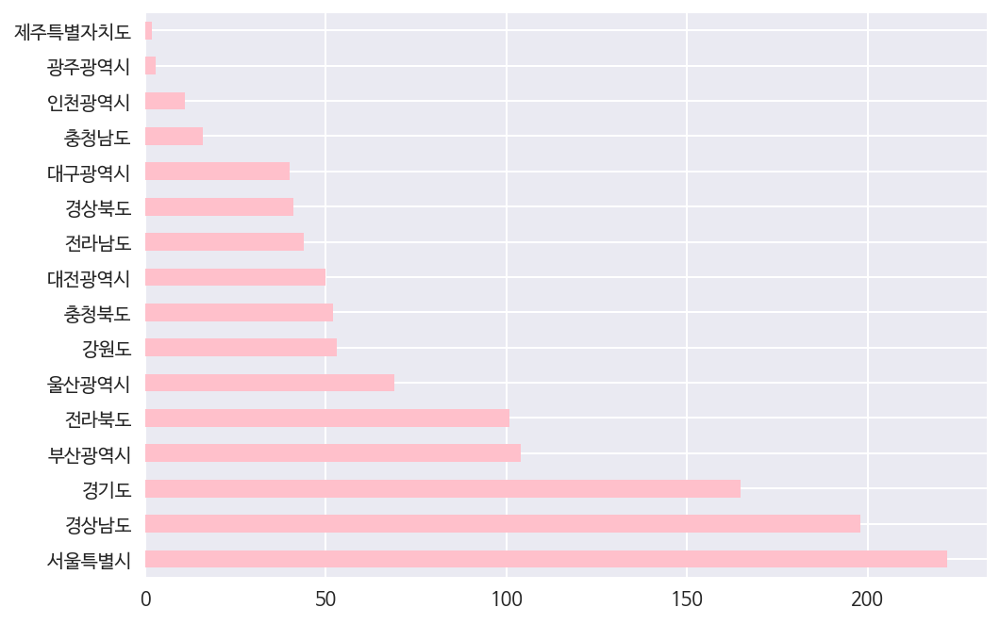
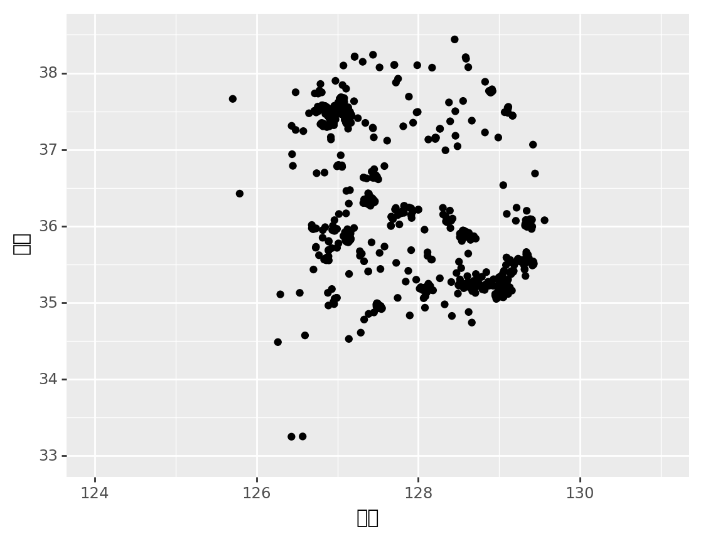

공공데이터포털의 [전국도서관표준데이터](https://www.data.go.kr/dataset/15013109/standard.do) 일부를 실습용으로 가공하였습니다.

# 사전 준비


```python
# 나눔글꼴 설치
!apt install fonts-nanum

# Plotnine 패키지 설치
!pip install plotnine

# 기본 글꼴 변경
import matplotlib as mpl
mpl.font_manager._rebuild()
mpl.pyplot.rc('font', family='NanumBarunGothic')

# 레티나 디스플레이 지원
%config InlineBackend.figure_format = 'retina'
```

    Reading package lists... Done
    Building dependency tree       
    Reading state information... Done
    fonts-nanum is already the newest version (20161025-1).
    0 upgraded, 0 newly installed, 0 to remove and 0 not upgraded.
    Requirement already satisfied: plotnine in /usr/local/lib/python3.6/dist-packages (0.3.0)
    Requirement already satisfied: mizani>=0.4.1 in /usr/local/lib/python3.6/dist-packages (from plotnine) (0.4.6)
    Requirement already satisfied: scipy>=1.0.0 in /usr/local/lib/python3.6/dist-packages (from plotnine) (1.1.0)
    Requirement already satisfied: numpy in /usr/local/lib/python3.6/dist-packages (from plotnine) (1.14.5)
    Requirement already satisfied: patsy>=0.4.1 in /usr/local/lib/python3.6/dist-packages (from plotnine) (0.5.0)
    Requirement already satisfied: matplotlib>=2.1.0 in /usr/local/lib/python3.6/dist-packages (from plotnine) (2.1.2)
    Requirement already satisfied: statsmodels>=0.8.0 in /usr/local/lib/python3.6/dist-packages (from plotnine) (0.8.0)
    Requirement already satisfied: six in /usr/local/lib/python3.6/dist-packages (from plotnine) (1.11.0)
    Requirement already satisfied: pandas>=0.21.0 in /usr/local/lib/python3.6/dist-packages (from plotnine) (0.22.0)
    Requirement already satisfied: palettable in /usr/local/lib/python3.6/dist-packages (from mizani>=0.4.1->plotnine) (3.1.1)
    Requirement already satisfied: python-dateutil>=2.1 in /usr/local/lib/python3.6/dist-packages (from matplotlib>=2.1.0->plotnine) (2.5.3)
    Requirement already satisfied: cycler>=0.10 in /usr/local/lib/python3.6/dist-packages (from matplotlib>=2.1.0->plotnine) (0.10.0)
    Requirement already satisfied: pytz in /usr/local/lib/python3.6/dist-packages (from matplotlib>=2.1.0->plotnine) (2018.5)
    Requirement already satisfied: pyparsing!=2.0.4,!=2.1.2,!=2.1.6,>=2.0.1 in /usr/local/lib/python3.6/dist-packages (from matplotlib>=2.1.0->plotnine) (2.2.0)


데이터 읽어오기.


```python
import pandas as pd
import numpy as np
from plotnine import *

src = pd.read_csv('https://s3.ap-northeast-2.amazonaws.com/data10902/messy/library.csv')
```

데이터 복사본 만들기. 중간에 데이터가 망가지면 이 셀부터 다시 실행하면 됩니다 :)


```python
df = src.copy()
df.head()
```


<div>
<style scoped>
    .dataframe tbody tr th:only-of-type {
        vertical-align: middle;
    }

    .dataframe tbody tr th {
        vertical-align: top;
    }

    .dataframe thead th {
        text-align: right;
    }
</style>
<table border="1" class="dataframe">
  <thead>
    <tr style="text-align: right;">
      <th></th>
      <th>key</th>
      <th>도서관명</th>
      <th>전화번호</th>
      <th>위경도</th>
      <th>좌석수</th>
      <th>도서</th>
      <th>연속간행물</th>
      <th>비도서</th>
      <th>휴관일</th>
    </tr>
  </thead>
  <tbody>
    <tr>
      <th>0</th>
      <td>0</td>
      <td>한밭도서관(대전광역시)</td>
      <td>042-270-7420</td>
      <td>36.309678,127.409648</td>
      <td>656</td>
      <td>802933</td>
      <td>530</td>
      <td>123515</td>
      <td>매주 월요일</td>
    </tr>
    <tr>
      <th>1</th>
      <td>1</td>
      <td>충주시립도서관(충청북도)</td>
      <td>043-850-3971</td>
      <td>37.160015,127.450014</td>
      <td>517</td>
      <td>378786</td>
      <td>117</td>
      <td>10175</td>
      <td>매주 월요일</td>
    </tr>
    <tr>
      <th>2</th>
      <td>2</td>
      <td>김해도서관(경상남도)</td>
      <td>055-320-5510</td>
      <td>35.233151,128.874325</td>
      <td>1202</td>
      <td>322150</td>
      <td>195</td>
      <td>17470</td>
      <td>매주 월요일 및 국가지정공휴일</td>
    </tr>
    <tr>
      <th>3</th>
      <td>3</td>
      <td>강릉시립중앙도서관(강원도)</td>
      <td>033-660-3279</td>
      <td>37.773104,128.912992</td>
      <td>464</td>
      <td>316468</td>
      <td>24</td>
      <td>6072</td>
      <td>월요일 및 국가지정 공휴일</td>
    </tr>
    <tr>
      <th>4</th>
      <td>4</td>
      <td>하안도서관(경기도)</td>
      <td>02-2680-2874</td>
      <td>37.467855,126.873710</td>
      <td>806</td>
      <td>315548</td>
      <td>916</td>
      <td>30410</td>
      <td>매주 금요일, 국가지정공휴일</td>
    </tr>
  </tbody>
</table>
</div>


```python
import re
```

# 데이터 살펴보기

시도별 도서관 수는?


```python
cities = df['도서관명'].str.extract(r'\(([^)]+)\)$', expand=False).value_counts()
# r'\((.+?)\)$'로 표현할 수도 있음 r'(\w{3,8})\
cities.plot.barh(color='pink')
```


    <matplotlib.axes._subplots.AxesSubplot at 0x7f2f231a9c50>





소장자료수(도서, 연속간행물, 비도서를 모두 합한 값)가 가장 많은 도서관은?


```python
df['자료수'] = df['도서'] + df['연속간행물'] + df['비도서']
df.sort_values(by='자료수', ascending=False).head()
```


<div>
<style scoped>
    .dataframe tbody tr th:only-of-type {
        vertical-align: middle;
    }

    .dataframe tbody tr th {
        vertical-align: top;
    }

    .dataframe thead th {
        text-align: right;
    }
</style>
<table border="1" class="dataframe">
  <thead>
    <tr style="text-align: right;">
      <th></th>
      <th>key</th>
      <th>도서관명</th>
      <th>전화번호</th>
      <th>위경도</th>
      <th>좌석수</th>
      <th>도서</th>
      <th>연속간행물</th>
      <th>비도서</th>
      <th>휴관일</th>
      <th>자료수</th>
    </tr>
  </thead>
  <tbody>
    <tr>
      <th>0</th>
      <td>0</td>
      <td>한밭도서관(대전광역시)</td>
      <td>042-270-7420</td>
      <td>36.309678,127.409648</td>
      <td>656</td>
      <td>802933</td>
      <td>530</td>
      <td>123515</td>
      <td>매주 월요일</td>
      <td>926978</td>
    </tr>
    <tr>
      <th>9</th>
      <td>9</td>
      <td>석수도서관(경기도)</td>
      <td>031-8045-6106</td>
      <td>37.411601,126.902654</td>
      <td>2000</td>
      <td>302086</td>
      <td>277</td>
      <td>88169</td>
      <td>매주 월요일, 국가지정공휴일</td>
      <td>390532</td>
    </tr>
    <tr>
      <th>1</th>
      <td>1</td>
      <td>충주시립도서관(충청북도)</td>
      <td>043-850-3971</td>
      <td>37.160015,127.450014</td>
      <td>517</td>
      <td>378786</td>
      <td>117</td>
      <td>10175</td>
      <td>매주 월요일</td>
      <td>389078</td>
    </tr>
    <tr>
      <th>5</th>
      <td>5</td>
      <td>경기도립성남도서관(경기도)</td>
      <td>031-730-3500</td>
      <td>37.446635,127.150098</td>
      <td>799</td>
      <td>311395</td>
      <td>142</td>
      <td>42467</td>
      <td>매주월요일, 국가지정공휴일</td>
      <td>354004</td>
    </tr>
    <tr>
      <th>4</th>
      <td>4</td>
      <td>하안도서관(경기도)</td>
      <td>02-2680-2874</td>
      <td>37.467855,126.873710</td>
      <td>806</td>
      <td>315548</td>
      <td>916</td>
      <td>30410</td>
      <td>매주 금요일, 국가지정공휴일</td>
      <td>346874</td>
    </tr>
  </tbody>
</table>
</div>


일요일에 쉬는 도서관은?

< 애란쌤 ver. >


```python
pattern = r'(일요일|주말|[\b\s,]일[\b\s,])'
# a = set(df['휴관일'])
# b = set(df['휴관일'][df['휴관일'].str.contains(pattern)])
# a-b를 통해 확인할 수 있음
df.loc[df['휴관일'].str.contains(pattern)][['도서관명', '휴관일']].head()
```

    /usr/local/lib/python3.6/dist-packages/ipykernel_launcher.py:5: UserWarning: This pattern has match groups. To actually get the groups, use str.extract.
      """


<div>
<style scoped>
    .dataframe tbody tr th:only-of-type {
        vertical-align: middle;
    }

    .dataframe tbody tr th {
        vertical-align: top;
    }

    .dataframe thead th {
        text-align: right;
    }
</style>
<table border="1" class="dataframe">
  <thead>
    <tr style="text-align: right;">
      <th></th>
      <th>도서관명</th>
      <th>휴관일</th>
    </tr>
  </thead>
  <tbody>
    <tr>
      <th>30</th>
      <td>유원대학교 도서관(충청북도)</td>
      <td>토요일+일요일+공휴일</td>
    </tr>
    <tr>
      <th>82</th>
      <td>삼례분관(전라북도)</td>
      <td>일요일, 법정공휴일</td>
    </tr>
    <tr>
      <th>187</th>
      <td>중리초등복합시설도서관(경상남도)</td>
      <td>매주 일요일</td>
    </tr>
    <tr>
      <th>189</th>
      <td>고산분관(전라북도)</td>
      <td>일요일, 법정공휴일</td>
    </tr>
    <tr>
      <th>193</th>
      <td>완주군립중앙(전라북도)</td>
      <td>일요일, 법정공휴일</td>
    </tr>
  </tbody>
</table>
</div>


```python
df[df['휴관일'].str.contains('일요일')].head()
```


<div>
<style scoped>
    .dataframe tbody tr th:only-of-type {
        vertical-align: middle;
    }

    .dataframe tbody tr th {
        vertical-align: top;
    }

    .dataframe thead th {
        text-align: right;
    }
</style>
<table border="1" class="dataframe">
  <thead>
    <tr style="text-align: right;">
      <th></th>
      <th>key</th>
      <th>도서관명</th>
      <th>전화번호</th>
      <th>위경도</th>
      <th>좌석수</th>
      <th>도서</th>
      <th>연속간행물</th>
      <th>비도서</th>
      <th>휴관일</th>
      <th>자료수</th>
    </tr>
  </thead>
  <tbody>
    <tr>
      <th>30</th>
      <td>30</td>
      <td>유원대학교 도서관(충청북도)</td>
      <td>043-740-1072</td>
      <td>36.193769,127.799035</td>
      <td>422</td>
      <td>182438</td>
      <td>8491</td>
      <td>5146</td>
      <td>토요일+일요일+공휴일</td>
      <td>196075</td>
    </tr>
    <tr>
      <th>82</th>
      <td>82</td>
      <td>삼례분관(전라북도)</td>
      <td>063)290-2644</td>
      <td>35.920524,127.093269</td>
      <td>150</td>
      <td>106799</td>
      <td>35</td>
      <td>602</td>
      <td>일요일, 법정공휴일</td>
      <td>107436</td>
    </tr>
    <tr>
      <th>187</th>
      <td>187</td>
      <td>중리초등복합시설도서관(경상남도)</td>
      <td>055-225-7492</td>
      <td>35.255584,128.520138</td>
      <td>200</td>
      <td>63110</td>
      <td>24</td>
      <td>0</td>
      <td>매주 일요일</td>
      <td>63134</td>
    </tr>
    <tr>
      <th>189</th>
      <td>189</td>
      <td>고산분관(전라북도)</td>
      <td>063)290-2620</td>
      <td>35.976403,127.205523</td>
      <td>180</td>
      <td>62358</td>
      <td>50</td>
      <td>10509</td>
      <td>일요일, 법정공휴일</td>
      <td>72917</td>
    </tr>
    <tr>
      <th>193</th>
      <td>193</td>
      <td>완주군립중앙(전라북도)</td>
      <td>063)290-2656</td>
      <td>35.904742,127.162237</td>
      <td>150</td>
      <td>61769</td>
      <td>32</td>
      <td>342</td>
      <td>일요일, 법정공휴일</td>
      <td>62143</td>
    </tr>
  </tbody>
</table>
</div>


< 소령 & 진영님 ver. >


```python
dataset = list(zip(df['도서관명'], df['휴관일']))

for i in range(len(dataset)):
  if ('일요일' or '주말' or '매주 일' or ', 일') in dataset[i][1]:
    print(dataset[i])
```

    ('유원대학교 도서관(충청북도)', '토요일+일요일+공휴일')
    ('삼례분관(전라북도)', '일요일, 법정공휴일')
    ('중리초등복합시설도서관(경상남도)', '매주 일요일')
    ('고산분관(전라북도)', '일요일, 법정공휴일')
    ('완주군립중앙(전라북도)', '일요일, 법정공휴일')
    ('구갈희망누리도서관(경기도)', '매주 일요일')
    ('둔산영어도서관(전라북도)', '일요일, 법정공휴일')
    ('도봉구청사 행복작은도서관(서울특별시)', '매주토, 일요일')
    ('북서울중학교 도서관(서울특별시)', '매주토,일요일')
    ('방아다리문학도서관(서울특별시)', '일요일, 법정공휴일')
    ('목마도서관(서울특별시)', '일요일, 법정공휴일')
    ('개울도서관(서울특별시)', '일요일, 법정공휴일')
    ('동화마을작은도서관(대전광역시)', '매주 일요일')
    ('웅남평생교육센터(경상남도)', '매주일요일+국가지정공휴일')
    ('쌍문3동 공립 작은도서관(서울특별시)', '매주토, 일요일')
    ('창5동 공립 작은도서관(서울특별시)', '매주토, 일요일')
    ('남산평생교육센터(경상남도)', '매주일요일+국가지정공휴일')
    ('노원문화원(서울특별시)', '법정공휴일, 일요일')
    ('금빛마을 작은 도서관(경상남도)', '일요일')
    ('동읍평생교육센터(경상남도)', '매주일요일+국가지정공휴일')
    ('인헌동 보물섬 작은도서관(서울특별시)', '매주 토/일요일/국가지정공휴일')
    ('수락작은도서관(서울특별시)', '법정공휴일, 일요일')
    ('쌍문2동 공립 작은도서관(서울특별시)', '매주토, 일요일')
    ('중계사랑북카페(서울특별시)', '법정공휴일, 일요일')
    ('이수초등학교도서관(충청북도)', '토요일+일요일+공휴일')
    ('신길1동공립작은도서관(서울특별시)', '매주토,일요일')
    ('한울작은도서관(서울특별시)', '법정공휴일, 일요일')
    ('가재울작은도서관(서울특별시)', '법정공휴일, 일요일')
    ('책사랑북카페(서울특별시)', '법정공휴일, 일요일')
    ('논현정보도서관(서울특별시)', '일요일, 법정공휴일')
    ('사림평생교육센터(경상남도)', '매주일요일+국가지정공휴일')
    ('봉림작은도서관(경상남도)', '매주일요일+국가지정공휴일')
    ('명서2평생교육센터(경상남도)', '매주일요일+국가지정공휴일')
    ('하늘작은도서관(서울특별시)', '법정공휴일, 일요일')
    ('봉곡평생교육센터(경상남도)', '매주일요일+국가지정공휴일')
    ('소풍 작은도서관(울산광역시)', '매주 토요일, 일요일, 법정공휴일')
    ('장유대우작은도서관(경상남도)', '매주월,일요일,국가지정공휴일')
    ('무거동 마을문고(울산광역시)', '매주 토요일, 일요일, 법정공휴일')
    ('중앙평생교육센터(경상남도)', '매주일요일+국가지정공휴일')
    ('책이랑친구랑작은도서관(서울특별시)', '법정공휴일, 일요일')
    ('은천동 한울작은도서관(서울특별시)', '매주 토/일요일/국가지정공휴일')
    ('도봉1동 공립 작은도서관(서울특별시)', '매주토, 일요일')
    ('부용초등학교 부용햇살글마을(충청북도)', '토요일+일요일+공휴일')
    ('신월평생교육센터(경상남도)', '매주일요일+국가지정공휴일')
    ('소계평생교육센터(경상남도)', '매주일요일+국가지정공휴일')
    ('안민청솔마을도서관(경상남도)', '매주일요일+국가지정공휴일')
    ('책드림도서관(충청북도)', '토요일+일요일+공휴일')
    ('학마을 글샘터(충청북도)', '토요일+일요일+공휴일')
    ('창1동 공립 작은도서관(서울특별시)', '매주토, 일요일')
    ('영동고등학교 도서관(충청북도)', '토요일+일요일+공휴일')
    ('책누리작은도서관(서울특별시)', '법정공휴일, 일요일')
    ('자여마을도서관(경상남도)', '매주일요일+국가지정공휴일')
    ('영동초등학교 도서관(충청북도)', '토요일+일요일+공휴일')
    ('쌍문1동 공립 작은도서관(서울특별시)', '매주토, 일요일')
    ('창4동 공립 작은도서관(서울특별시)', '매주토, 일요일')
    ('작은도서관 책마을(울산광역시)', '매주토, 일요일')
    ('방학2동 공립 작은도서관(서울특별시)', '매주토, 일요일')
    ('천주평생교육센터(경상남도)', '매주일요일+국가지정공휴일')
    ('도봉2동 공립 작은도서관(서울특별시)', '매주토, 일요일')
    ('상남평생교육센터(경상남도)', '매주일요일+국가지정공휴일')
    ('책나무그늘 작은도서관(부산광역시)', '매주 일요일')
    ('은행나무작은도서관(울산광역시)', '매주 토,일요일,국가지정공휴일')
    ('명곡평생교육센터(경상남도)', '매주일요일+국가지정공휴일')
    ('용잠마을도서관(경상남도)', '매주일요일+국가지정공휴일')
    ('파랑새작은도서관(서울특별시)', '법정공휴일, 일요일')
    ('초장동꿈터작은도서관(부산광역시)', '일요일, 공휴일')
    ('꿈꾸는작은도서관(서울특별시)', '법정공휴일, 일요일')
    ('해솔작은도서관(서울특별시)', '법정공휴일, 일요일')
    ('신길6동공립작은도서관(서울특별시)', '매주토,일요일')
    ('남현동 우리작은도서관(서울특별시)', '매주 토/일요일/국가지정공휴일')
    ('신정4동 마을문고(울산광역시)', '매주 토요일, 일요일, 법정공휴일')
    ('반디작은도서관(서울특별시)', '법정공휴일, 일요일')
    ('도란도란작은도서관(서울특별시)', '법정공휴일, 일요일')
    ('방학1동 공립 작은도서관(서울특별시)', '매주토, 일요일')
    ('책이랑(경기도)', '매주 일요일, 국가지정공휴일')
    ('삼호 작은도서관(울산광역시)', '매주 토요일, 일요일, 법정공휴일')
    ('영등포동공립작은도서관(서울특별시)', '매주토,일요일')
    ('창2동 공립 작은도서관(서울특별시)', '매주토, 일요일')
    ('신길2동(분소)공립작은도서관(서울특별시)', '매주토,일요일')
    ('진주여성회 달팽이어린이 도서관(경상남도)', '일요일')
    ('가온작은도서관(서울특별시)', '법정공휴일, 일요일')
    ('젤미작은도서관(경상남도)', '매주월,일요일,국가지정공휴일')
    ('북구 어린이 도서관(대구광역시)', '일요일, 법정공휴일')
    ('대림1동공립작은도서관(서울특별시)', '매주토,일요일')
    ('영등포구지부공립작은도서관(서울특별시)', '매주토,일요일')
    ('황간중학교 도서관(충청북도)', '토요일+일요일+공휴일')
    ('쌍문4동 공립 작은도서관(서울특별시)', '매주토, 일요일')
    ('월산주공작은도서관(경상남도)', '매주월,일요일,국가지정공휴일')
    ('황간초등학교 월류글터도서실(충청북도)', '토요일+일요일+공휴일')
    ('푸른마을(경기도)', '매주 일요일, 국가지정공휴일')
    ('수진2동(경기도)', '매주 일요일, 국가지정공휴일')
    ('대림3동공립작은도서관(서울특별시)', '매주토,일요일')
    ('전북대병원작은도서관(전라북도)', '매주토요일, 매주일요일, 법정공휴일')
    ('인후비전작은도서관(전라북도)', '매주토요일, 매주일요일, 법정공휴일')
    ('하늘달팽이(경기도)', '매주 일요일, 국가지정공휴일')
    ('팔룡평생교육센터(경상남도)', '매주일요일+국가지정공휴일')
    ('안민마을도서관(경상남도)', '매주일요일+국가지정공휴일')
    ('노송작은도서관(전라북도)', '매주토요일, 매주일요일, 법정공휴일')
    ('반딧불이도서관(경상남도)', '매주일요일+국가지정공휴일')
    ('호도애(경기도)', '매주 일요일, 국가지정공휴일')
    ('대동한마음작은도서관(경상남도)', '매주월,일요일,국가지정공휴일')
    ('추풍령초등학교학교도서관(충청북도)', '토요일+일요일+공휴일')
    ('이야기동동 작은도서관(부산광역시)', '매주 토, 일요일 및 국가지정 공휴일')
    ('팔복작은도서관(전라북도)', '매주토요일, 매주일요일, 법정공휴일')
    ('책고래작은도서관(경상남도)', '매주월,일요일,국가지정공휴일')
    ('열린작은도서관(서울특별시)', '법정공휴일, 일요일')
    ('전주작은도서관(전라북도)', '매주토요일, 매주일요일, 법정공휴일')
    ('황간고등학교월류문화센터(충청북도)', '토요일+일요일+공휴일')
    ('신정3동 마을문고(울산광역시)', '매주 토요일, 일요일, 법정공휴일')
    ('달내작은도서관(서울특별시)', '법정공휴일, 일요일')
    ('디딤돌 문고(경상남도)', '일요일')
    ('삼계푸르지오작은도서관(경상남도)', '매주월,일요일,국가지정공휴일')
    ('용문중학교 도서관(충청북도)', '토요일+일요일+공휴일')
    ('꿈자람책놀이터(서울특별시)', '일요일')
    ('호성작은도서관(전라북도)', '매주토요일, 매주일요일, 법정공휴일')
    ('구룡초등학교 도담도서관(충청북도)', '토요일+일요일+공휴일')
    ('용화초등학교(충청북도)', '토요일+일요일+공휴일')
    ('신길5동공립작은도서관(서울특별시)', '매주토,일요일')
    ('창3동 공립 작은도서관(서울특별시)', '매주토, 일요일')
    ('덕산작은도서관(경상남도)', '매주월,일요일,국가지정공휴일')
    ('푸른숲작은도서관(서울특별시)', '법정공휴일, 일요일')
    ('판교이지더원(경기도)', '매주 일요일, 국가지정공휴일')
    ('대현동 마을문고(울산광역시)', '매주 토요일, 일요일, 법정공휴일')
    ('학산초등학교 도서관(충청북도)', '토요일+일요일+공휴일')
    ('성현동 파랑새작은도서관(서울특별시)', '매주 토/일요일/국가지정공휴일')
    ('삼산동 마을문고(울산광역시)', '매주 토요일, 일요일, 법정공휴일')
    ('푸르미 작은도서관(경상남도)', '일요일')
    ('청소년문화센터 작은도서관(경상남도)', '일요일')
    ('영신중학교 도서관(충청북도)', '토요일+일요일+공휴일')
    ('상계숲속작은도서관(서울특별시)', '법정공휴일, 일요일')
    ('문래동공립작은도서관(서울특별시)', '매주토,일요일')
    ('양강초등학교도서실(충청북도)', '토요일+일요일+공휴일')
    ('상동작은도서관(전라북도)', '일요일, 공휴일')
    ('도림동공립작은도서관(서울특별시)', '매주토,일요일')
    ('불암동작은도서관(경상남도)', '매주월,일요일,국가지정공휴일')
    ('선암동 마을문고(울산광역시)', '매주 토요일, 일요일, 법정공휴일')
    ('범천2동작은도서관(부산광역시)', '매주 토요일·일요일, 국가지정공휴일')
    ('신흥1동(경기도)', '매주 일요일, 국가지정공휴일')
    ('소정꿈나무작은도서관(부산광역시)', '매주 토, 일요일 및 국가지정 공휴일')
    ('대림2동공립작은도서관(서울특별시)', '매주토,일요일')
    ('꿈자람 작은도서관(서울특별시)', '일요일, 법정공휴일')
    ('삼계로얄작은도서관(경상남도)', '매주월,일요일,국가지정공휴일')
    ('초안산숲속작은도서관(서울특별시)', '법정공휴일, 일요일')
    ('자양4동새마을작은도서관(서울특별시)', '매주 토요일, 일요일, 공휴일')
    ('옥현주공2단지문고(울산광역시)', '매주 토요일, 일요일, 법정공휴일')
    ('책향기 작은도서관(서울특별시)', '일요일')
    ('난향동 뜰안에작은도서관(서울특별시)', '매주 토/일요일/국가지정공휴일')
    ('대우도서실(부산광역시)', '매주 토, 일요일 및 국가지정 공휴일')
    ('석전동새마을문고(경상남도)', '매주일요일+국가지정공휴일')
    ('초강초등학교 도서관(충청북도)', '토요일+일요일+공휴일')
    ('진례작은도서관(경상남도)', '매주월,일요일,국가지정공휴일')
    ('우리작은도서관(경상남도)', '매주월,일요일,국가지정공휴일')
    ('도촌동(경기도)', '매주 일요일, 국가지정공휴일')
    ('글혜윰작은도서관(경상남도)', '매주월,일요일,국가지정공휴일')
    ('청룡동 숯고을작은도서관(서울특별시)', '매주 토/일요일/국가지정공휴일')
    ('초전푸르지오1단지 도서관(경상남도)', '일요일')
    ('자양2동새마을작은도서관(서울특별시)', '매주 토요일, 일요일, 공휴일')
    ('도란도란쉼터 작은도서관(서울특별시)', '일요일')
    ('화양동새마을작은도서관(서울특별시)', '매주 토요일, 일요일, 공휴일')
    ('양정1동작은도서관(부산광역시)', '매주 토요일·일요일, 국가지정공휴일')
    ('추풍령중학교도서관(충청북도)', '토요일+일요일+공휴일')
    ('만평주민도서관(대구광역시)', '일요일, 공휴일')
    ('아름널(경기도)', '매주 일요일, 국가지정공휴일')
    ('꿈드리작은도서관(전라북도)', '매주토요일, 매주일요일, 법정공휴일')
    ('영동산업과학고등학교 도서관(충청북도)', '토요일+일요일+공휴일')
    ('한국작은도서관(경상남도)', '매주월,일요일,국가지정공휴일')
    ('대포천작은도서관(경상남도)', '매주월,일요일,국가지정공휴일')
    ('글벗누리 작은도서관(서울특별시)', '일요일')
    ('들꽃이야기 작은도서관(부산광역시)', '매주 일요일')
    ('하늘빛작은도서관(경상남도)', '매주월,일요일,국가지정공휴일')
    ('내발산 작은도서관(서울특별시)', '일요일')
    ('한내도서관(서울특별시)', '법정공휴일, 일요일')
    ('옥현으뜸마을 작은도서관(울산광역시)', '매주 토요일, 일요일, 법정공휴일')
    ('달마을작은도서관(서울특별시)', '일요일, 법정공휴일')
    ('꿈드림 작은도서관(부산광역시)', '매주 토, 일요일 및 국가지정 공휴일')
    ('팔판작은도서관(경상남도)', '매주월,일요일,국가지정공휴일')
    ('수암동 마을문고(울산광역시)', '매주 토요일, 일요일, 법정공휴일')
    ('시호미래작은도서관(경상남도)', '매주월,일요일,국가지정공휴일')
    ('신사동 해오름작은도서관(서울특별시)', '매주 토/일요일/국가지정공휴일')
    ('새빛작은도서관(서울특별시)', '매주 일요일')
    ('글누리작은도서관(부산광역시)', '매주 토, 일요일 및 국가지정 공휴일')
    ('무지개빛(전라북도)', '일요일, 법정공휴일')
    ('여의동공립작은도서관(서울특별시)', '매주토,일요일')
    ('배다리 작은도서관(서울특별시)', '일요일')
    ('달동 마을문고(울산광역시)', '매주 토요일, 일요일, 법정공휴일')
    ('고맙습니다 작은도서관(서울특별시)', '일요일, 법정공휴일')
    ('판타스틱큐브(경기도)', '매주 토,일요일,국가지정공휴일')
    ('신길4동공립작은도서관(서울특별시)', '매주토,일요일')
    ('합성2동새마을문고(경상남도)', '매주일요일+국가지정공휴일')
    ('영등포본동공립작은도서관(서울특별시)', '매주토,일요일')
    ('책마루 작은도서관(서울특별시)', '일요일')
    ('책나무도서관(침산동)(대구광역시)', '일요일, 법정공휴일')
    ('수명산 작은도서관(서울특별시)', '일요일')
    ('태평1동(경기도)', '매주 일요일, 국가지정공휴일')
    ('신미주(경기도)', '매주 일요일, 국가지정공휴일')
    ('예드림문고(서울특별시)', '매주 일요일')
    ('상촌중학교 학습정보실(충청북도)', '토요일+일요일+공휴일')
    ('아리향기 작은도서관(서울특별시)', '일요일')
    ('난곡동 책사랑 작은도서관(서울특별시)', '매주 토/일요일/국가지정공휴일')
    ('이안나누리작은도서관(경상남도)', '매주월,일요일,국가지정공휴일')
    ('꿈터 작은도서관(서울특별시)', '일요일')
    ('내외작은도서관(경상남도)', '매주월,일요일,국가지정공휴일')
    ('구암마을 작은도서관(서울특별시)', '일요일')
    ('자양1동새마을작은도서관(서울특별시)', '매주 토요일, 일요일, 공휴일')
    ('대동다숲새마을문고(경상남도)', '매주일요일+국가지정공휴일')
    ('분성아이파크작은도서관(경상남도)', '매주월,일요일,국가지정공휴일')
    ('미성동 책의향기작은도서관(서울특별시)', '매주 토/일요일/국가지정공휴일')
    ('연지동작은도서관(부산광역시)', '매주 토요일·일요일, 국가지정공휴일')
    ('양산초등학교 비봉글샘터(충청북도)', '토요일+일요일+공휴일')
    ('해오름작은도서관(울산광역시)', '매주 토,일요일,국가지정공휴일')
    ('서림동 글사랑작은도서관(서울특별시)', '매주 토/일요일/국가지정공휴일')
    ('청림동 푸른숲작은도서관(서울특별시)', '매주 토/일요일/국가지정공휴일')
    ('이화마을 작은도서관(서울특별시)', '일요일, 법정공휴일')
    ('봉림평생교육센터(경상남도)', '매주일요일+국가지정공휴일')
    ('생각열매 작은도서관(서울특별시)', '일요일')
    ('신정2동 마을문고(울산광역시)', '매주 토요일, 일요일, 법정공휴일')
    ('당감1동작은도서관(부산광역시)', '매주 토요일·일요일, 국가지정공휴일')
    ('삼성동 샛별작은도서관(서울특별시)', '매주 토/일요일/국가지정공휴일')
    ('당산1동공립작은도서관(서울특별시)', '매주토,일요일')
    ('가좌3 주공 작은 도서관(경상남도)', '일요일')
    ('리첼작은도서관(경상남도)', '매주월,일요일,국가지정공휴일')
    ('감만꿈터(부산광역시)', '매주 일요일')
    ('늘푸름작은도서관(울산광역시)', '매주 토,일요일,국가지정공휴일')
    ('활천행복작은도서관(경상남도)', '매주월,일요일,국가지정공휴일')
    ('이현 High Class 웰가 새마을문고(경상남도)', '일요일')
    ('위브 글마루 도서관(경상남도)', '일요일')
    ('신림동 굴렁쇠작은도서관(서울특별시)', '매주 토/일요일/국가지정공휴일')
    ('영동인터넷고등학교 도서관(충청북도)', '토요일+일요일+공휴일')
    ('보라매동 다사랑작은도서관(서울특별시)', '매주 토/일요일/국가지정공휴일')
    ('소리작은도서관(경상남도)', '매주월,일요일,국가지정공휴일')
    ('책읽는 푸른마을도서관(경상남도)', '일요일')
    ('신원동 울타리작은도서관(서울특별시)', '매주 토/일요일/국가지정공휴일')
    ('북조아 작은 도서관(부산광역시)', '매주 일요일')
    ('자양3동새마을작은도서관(서울특별시)', '매주 토요일, 일요일, 공휴일')
    ('해뜰 작은도서관(서울특별시)', '일요일')
    ('서동골책놀이터문고(부산광역시)', '매주 토, 일요일 및 국가지정 공휴일')
    ('율하e편한작은도서관(경상남도)', '매주월,일요일,국가지정공휴일')
    ('남외푸르지오문고(울산광역시)', '매주토, 일요일')
    ('옥현주공1단지 책마루(울산광역시)', '매주 토요일, 일요일, 법정공휴일')
    ('금광2동(경기도)', '매주 일요일, 국가지정공휴일')
    ('신길3동공립작은도서관(서울특별시)', '매주토,일요일')
    ('초록향기 작은도서관(서울특별시)', '일요일')
    ('한신책사랑작은도서관(경상남도)', '매주월,일요일,국가지정공휴일')
    ('볏고을 작은도서관(서울특별시)', '일요일')
    ('양평1동공립작은도서관(서울특별시)', '매주토,일요일')
    ('북면작은도서관(전라북도)', '일요일, 공휴일')
    ('가지산작은도서관(울산광역시)', '매주 토,일요일,국가지정공휴일')
    ('금정산 SK VIEW 북카페(부산광역시)', '매주 토, 일요일 및 국가지정 공휴일')
    ('부림희망작은도서관(경상남도)', '매주일요일+국가지정공휴일')
    ('대동푸른뜰작은도서관(경상남도)', '매주월,일요일,국가지정공휴일')
    ('낙성동 우듬지작은도서관(서울특별시)', '매주 토/일요일/국가지정공휴일')
    ('등마루골 작은도서관(서울특별시)', '일요일')
    ('능동새마을작은도서관(서울특별시)', '매주 토요일, 일요일, 공휴일')
    ('상촌초등학교 도서관(충청북도)', '토요일+일요일+공휴일')
    ('구서작은도서관(부산광역시)', '매주 토, 일요일 및 국가지정 공휴일')
    ('채움 작은도서관(서울특별시)', '일요일')
    ('양정2동작은도서관(부산광역시)', '매주 토요일·일요일, 국가지정공휴일')
    ('옹달샘작은도서관(전라북도)', '일요일, 공휴일')
    ('책나무도서관(복현동)(대구광역시)', '일요일, 법정공휴일')
    ('송정 작은도서관(서울특별시)', '일요일')
    ('목화마을공립작은도서관(서울특별시)', '매주토,일요일')
    ('U보라작은도서관(경상남도)', '매주월,일요일,국가지정공휴일')
    ('서원동 어울작은도서관(서울특별시)', '매주 토/일요일/국가지정공휴일')
    ('온새미로도서관(경상남도)', '일요일')
    ('큰마음 작은도서관(서울특별시)', '일요일')
    ('일동한신꿈나무작은도서관(경상남도)', '매주월,일요일,국가지정공휴일')
    ('평생학습센터 작은도서관(경상남도)', '일요일')
    ('홍파랑 북카페(서울특별시)', '일요일, 법정공휴일')
    ('옹달샘 작은도서관(서울특별시)', '일요일')
    ('당산2동공립작은도서관(서울특별시)', '매주토,일요일')
    ('주촌디딤돌작은도서관(경상남도)', '매주월,일요일,국가지정공휴일')
    ('될성푸른나무(경기도)', '매주 일요일, 국가지정공휴일')
    ('글마당작은도서관(전라북도)', '매주토요일, 매주일요일, 법정공휴일')
    ('구의2동새마을작은도서관(서울특별시)', '매주 토요일, 일요일, 공휴일')
    ('옹기종기 작은도서관(서울특별시)', '일요일')
    ('도리샘 작은도서관(서울특별시)', '일요일')
    ('양평2동공립작은도서관(서울특별시)', '매주토,일요일')
    ('조은마음도서관(경상남도)', '일요일')
    ('행운동 마루작은도서관(서울특별시)', '매주 토/일요일/국가지정공휴일')
    ('심천중학교 도서관(충청북도)', '토요일+일요일+공휴일')
    ('떡갈나무숲작은도서관(경상남도)', '매주월,일요일,국가지정공휴일')
    ('책의숲(울산광역시)', '매주토, 일요일')
    ('닥밭골 작은 도서관(부산광역시)', '일요일, 공휴일')
    ('가야2동책누리북카페(부산광역시)', '매주 토요일·일요일, 국가지정공휴일')
    ('단장골북카페(울산광역시)', '매주토, 일요일')
    ('예일솔로몬문고(부산광역시)', '매주 토, 일요일 및 국가지정 공휴일')
    ('정수중학교 도서관(충청북도)', '토요일+일요일+공휴일')
    ('문화의집작은도서관(전라북도)', '일요일, 공휴일')
    ('수성작은도서관(전라북도)', '일요일, 공휴일')
    ('무지개뜨는언덕(경기도)', '매주 일요일, 국가지정공휴일')
    ('어울림 작은도서관(부산광역시)', '일요일, 공휴일')
    ('구의1동새마을작은도서관(서울특별시)', '매주 토요일, 일요일, 공휴일')
    ('신길7동공립작은도서관(서울특별시)', '매주토,일요일')
    ('꿈꾸는작은도서관(전라북도)', '일요일, 공휴일')
    ('우아문화의집 작은도서관(전라북도)', '매주토요일, 매주일요일, 법정공휴일')
    ('성현(경기도)', '매주 일요일, 국가지정공휴일')
    ('아차산아래작은도서관놀자(서울특별시)', '매주 일요일')
    ('수목토작은도서관(전라북도)', '일요일, 공휴일')
    ('중앙동 새싹작은도서관(서울특별시)', '매주 토/일요일/국가지정공휴일')
    ('송도바다 작은도서관(부산광역시)', '일요일, 공휴일')
    ('경남혁신 꿈꾸는 도서관(경상남도)', '일요일')
    ('역마을 작은도서관(서울특별시)', '일요일')
    ('혜화마을 북카페(서울특별시)', '일요일, 법정공휴일')
    ('부암1동책마루작은도서관(부산광역시)', '매주 토요일·일요일, 국가지정공휴일')
    ('초산작은도서관(전라북도)', '일요일, 공휴일')
    ('중곡3동새마을작은도서관(서울특별시)', '매주 토요일, 일요일, 공휴일')
    ('굴화 작은도서관(울산광역시)', '매주 토요일, 일요일, 법정공휴일')
    ('상봉동 새마을 작은도서관(경상남도)', '일요일')
    ('군자동새마을작은도서관(서울특별시)', '매주 토요일, 일요일, 공휴일')
    ('중흥샘이깊은작은도서관(경상남도)', '매주월,일요일,국가지정공휴일')
    ('느티나무작은도서관(울산광역시)', '매주 토,일요일,국가지정공휴일')
    ('다문화작은도서관(전라북도)', '일요일, 공휴일')
    ('중곡4동새마을작은도서관(서울특별시)', '매주 토요일, 일요일, 공휴일')
    ('초전 해모로 루비채 2단지 북카페(경상남도)', '일요일')
    ('꿈밭장애인작은도서관(전라북도)', '매주토요일, 매주일요일, 법정공휴일')
    ('당감4동사랑방마실작은도서관(부산광역시)', '매주 토요일·일요일, 국가지정공휴일')
    ('꿈이 있는 도서관(대구광역시)', '일요일, 법정공휴일')
    ('개금2동행복마을작은도서관(부산광역시)', '매주 일요일, 국가지정공휴일')
    ('지양마을 작은도서관(서울특별시)', '일요일, 법정공휴일')
    ('대학동 녹두작은도서관(서울특별시)', '매주 토/일요일/국가지정공휴일')
    ('중곡2동새마을작은도서관(서울특별시)', '매주 토요일, 일요일, 공휴일')
    ('신월도서관(울산광역시)', '매주토, 일요일')
    ('아낌없이 주는나무(전라북도)', '일요일, 법정공휴일')
    ('고부작은도서관(전라북도)', '일요일, 공휴일')
    ('광장동새마을작은도서관(서울특별시)', '매주 토요일, 일요일, 공휴일')
    ('중곡1동새마을작은도서관(서울특별시)', '매주 토요일, 일요일, 공휴일')
    ('꽃마을 작은도서관(부산광역시)', '일요일, 공휴일')
    ('학성작은도서관(울산광역시)', '매주토, 일요일')
    ('방그리나 작은도서관(서울특별시)', '일요일')
    ('범서작은도서관(울산광역시)', '매주 토,일요일,국가지정공휴일')
    ('유곡푸르지오책마루도서관(울산광역시)', '매주토, 일요일')
    ('개금1동책사랑쉼터(부산광역시)', '매주 토요일·일요일, 국가지정공휴일')
    ('가람작은도서관(서울특별시)', '일요일')
    ('한새마을 작은도서관(부산광역시)', '일요일, 공휴일')
    ('초록에뜰 작은도서관(경상남도)', '일요일')
    ('책향기작은도서관(전라북도)', '일요일, 공휴일')
    ('신흥3동(경기도)', '매주 일요일, 국가지정공휴일')
    ('향기나는 작은도서관(부산광역시)', '일요일, 공휴일')
    ('다사랑작은도서관(전라남도)', '매주 일요일')
    ('어깨동무도서관(울산광역시)', '매주토, 일요일')
    ('꿈너비(경기도)', '매주 일요일, 국가지정공휴일')
    ('세토 작은도서관(대구광역시)', '일요일, 공휴일')
    ('상교작은도서관(전라북도)', '일요일, 공휴일')
    ('학산면청소년공부방(충청북도)', '토요일+일요일+공휴일')
    ('감골작은도서관(전라북도)', '일요일, 공휴일')
    ('우암작은도서관(울산광역시)', '매주토, 일요일')
    ('나침반(경기도)', '매주 일요일, 국가지정공휴일')
    ('명주골작은도서관(전라북도)', '매주토요일, 매주일요일, 법정공휴일')
    ('초록동작은도서관(서울특별시)', '일요일')
    ('실버작은도서관(전라북도)', '일요일, 공휴일')
    ('올리움 작은도서관(경상남도)', '일요일')
    ('하늘빛(경기도)', '매주 일요일, 국가지정공휴일')
    ('매곡초등학교 매화골 도서관(충청북도)', '토요일+일요일+공휴일')
    ('참좋은 작은도서관(경상남도)', '일요일')
    ('신흥(경기도)', '매주 일요일, 국가지정공휴일')
    ('페다고지(울산광역시)', '매주토, 일요일')
    ('아이파크1 작은도서관(울산광역시)', '매주 토요일, 일요일, 법정공휴일')
    ('이땅바다작은도서관(부산광역시)', '매주 토, 일요일 및 국가지정 공휴일')
    ('큰뿌리독서원(부산광역시)', '매주 토, 일요일 및 국가지정 공휴일')
    ('간납대작은도서관(전라북도)', '매주토요일, 매주일요일, 법정공휴일')
    ('전포2동북카페(부산광역시)', '매주 토요일·일요일, 국가지정공휴일')
    ('롯데캐슬(경기도)', '매주 일요일, 국가지정공휴일')
    ('다난작은도서관(울산광역시)', '매주토, 일요일')
    ('에일린의뜰문고(울산광역시)', '매주토, 일요일')
    ('꿈틀꿈틀작은도서관(울산광역시)', '매주토, 일요일')
    ('개금2동책마루(부산광역시)', '매주 토요일·일요일, 국가지정공휴일')
    ('다독다독 작은도서관(울산광역시)', '매주 토요일, 일요일, 법정공휴일')
    ('해송작은도서관(울산광역시)', '매주토, 일요일')
    ('아이파크2 작은도서관(울산광역시)', '매주 토요일, 일요일, 법정공휴일')
    ('작천정작은도서관(울산광역시)', '매주 토,일요일,국가지정공휴일')
    ('짬짬이 작은도서관(부산광역시)', '일요일, 공휴일')
    ('화성그랜드파크 도서관 함지원(대구광역시)', '일요일, 법정공휴일')
    ('무거위브자이작은도서관(울산광역시)', '매주 토요일, 일요일, 법정공휴일')
    ('토마토 작은도서관(부산광역시)', '매주 일요일')
    ('글로벌 작은도서관(부산광역시)', '일요일, 공휴일')
    ('브니엘 학습관 문고(부산광역시)', '매주 일요일')
    ('초읍동책사랑방(부산광역시)', '매주 토요일·일요일, 국가지정공휴일')
    ('전포1동밭개마을(부산광역시)', '매주 토요일·일요일, 국가지정공휴일')
    ('은광작은도서관(대구광역시)', '일요일, 법정공휴일')
    ('심천구세군(충청북도)', '토요일+일요일+공휴일')
    ('별이난마을도서관(대구광역시)', '일요일, 공휴일')
    ('궁촌작은도서관(충청북도)', '토요일+일요일+공휴일')
    ('수정중앙(경기도)', '매주 일요일, 국가지정공휴일')
    ('주곡작은도서관(충청북도)', '토요일+일요일+공휴일')
    ('가야1동가얏골미니도서관(부산광역시)', '매주 토요일·일요일, 국가지정공휴일')
    ('우정혁신LH2차책사랑(울산광역시)', '매주토, 일요일')
    ('작은여울 도서관(부산광역시)', '매주 일요일')
    ('중원아사모(경기도)', '매주 일요일, 국가지정공휴일')
    ('에뜰3차아름도서관(울산광역시)', '매주토, 일요일')
    ('해망마을도서관(전라남도)', '매주 일요일')
    ('꿈꾸는작은도서관(대구광역시)', '일요일, 법정공휴일')
    ('작은도서관옹달샘(부산광역시)', '매주 토, 일요일 및 국가지정 공휴일')
    ('참사랑도서관(부산광역시)', '매주 일요일')
    ('공덕작은도서관(부산광역시)', '매주 토, 일요일 및 국가지정 공휴일')
    ('말하는 영어도서관(대전광역시)', '일요일')
    ('당감2동북카페(부산광역시)', '매주 토요일·일요일, 국가지정공휴일')


# 데이터 다듬기

"위도"와 "경도" 분리하기.


```python
df['위도'] = df['위경도'].str.extract(r'([\d\.]+),').astype(np.float32)
df['경도'] = df['위경도'].str.extract(r'.+,(.+)').astype(np.float32)
df.head()
```

    /usr/local/lib/python3.6/dist-packages/ipykernel_launcher.py:1: FutureWarning: currently extract(expand=None) means expand=False (return Index/Series/DataFrame) but in a future version of pandas this will be changed to expand=True (return DataFrame)
      """Entry point for launching an IPython kernel.
    /usr/local/lib/python3.6/dist-packages/ipykernel_launcher.py:2: FutureWarning: currently extract(expand=None) means expand=False (return Index/Series/DataFrame) but in a future version of pandas this will be changed to expand=True (return DataFrame)


<div>
<style scoped>
    .dataframe tbody tr th:only-of-type {
        vertical-align: middle;
    }

    .dataframe tbody tr th {
        vertical-align: top;
    }

    .dataframe thead th {
        text-align: right;
    }
</style>
<table border="1" class="dataframe">
  <thead>
    <tr style="text-align: right;">
      <th></th>
      <th>key</th>
      <th>도서관명</th>
      <th>전화번호</th>
      <th>위경도</th>
      <th>좌석수</th>
      <th>도서</th>
      <th>연속간행물</th>
      <th>비도서</th>
      <th>휴관일</th>
      <th>자료수</th>
      <th>위도</th>
      <th>경도</th>
    </tr>
  </thead>
  <tbody>
    <tr>
      <th>0</th>
      <td>0</td>
      <td>한밭도서관(대전광역시)</td>
      <td>042-270-7420</td>
      <td>36.309678,127.409648</td>
      <td>656</td>
      <td>802933</td>
      <td>530</td>
      <td>123515</td>
      <td>매주 월요일</td>
      <td>926978</td>
      <td>36.309677</td>
      <td>127.409645</td>
    </tr>
    <tr>
      <th>1</th>
      <td>1</td>
      <td>충주시립도서관(충청북도)</td>
      <td>043-850-3971</td>
      <td>37.160015,127.450014</td>
      <td>517</td>
      <td>378786</td>
      <td>117</td>
      <td>10175</td>
      <td>매주 월요일</td>
      <td>389078</td>
      <td>37.160015</td>
      <td>127.450012</td>
    </tr>
    <tr>
      <th>2</th>
      <td>2</td>
      <td>김해도서관(경상남도)</td>
      <td>055-320-5510</td>
      <td>35.233151,128.874325</td>
      <td>1202</td>
      <td>322150</td>
      <td>195</td>
      <td>17470</td>
      <td>매주 월요일 및 국가지정공휴일</td>
      <td>339815</td>
      <td>35.233150</td>
      <td>128.874329</td>
    </tr>
    <tr>
      <th>3</th>
      <td>3</td>
      <td>강릉시립중앙도서관(강원도)</td>
      <td>033-660-3279</td>
      <td>37.773104,128.912992</td>
      <td>464</td>
      <td>316468</td>
      <td>24</td>
      <td>6072</td>
      <td>월요일 및 국가지정 공휴일</td>
      <td>322564</td>
      <td>37.773106</td>
      <td>128.912994</td>
    </tr>
    <tr>
      <th>4</th>
      <td>4</td>
      <td>하안도서관(경기도)</td>
      <td>02-2680-2874</td>
      <td>37.467855,126.873710</td>
      <td>806</td>
      <td>315548</td>
      <td>916</td>
      <td>30410</td>
      <td>매주 금요일, 국가지정공휴일</td>
      <td>346874</td>
      <td>37.467854</td>
      <td>126.873711</td>
    </tr>
  </tbody>
</table>
</div>


(잠깐 재미로) 지도 그려보기.


```python
(
    ggplot(aes(x='경도', y='위도'), df) +
    geom_point() +
    xlim([124, 131]) +
    ylim([33, 38.5])
)
```





    <ggplot: (8740020916793)>


"도서관명"과 "지역" 분리하기.


```python
df['시/도'] = df['도서관명'].str.extract(r'\(([^)]+)\)$', expand=False)
df['도서관명'] = df['도서관명'].str.split('(', expand=True)[0]
                                                # [0] 대신 .iloc[:,0]으로 써도 됨
df.head()
```


<div>
<style scoped>
    .dataframe tbody tr th:only-of-type {
        vertical-align: middle;
    }

    .dataframe tbody tr th {
        vertical-align: top;
    }

    .dataframe thead th {
        text-align: right;
    }
</style>
<table border="1" class="dataframe">
  <thead>
    <tr style="text-align: right;">
      <th></th>
      <th>key</th>
      <th>도서관명</th>
      <th>전화번호</th>
      <th>위경도</th>
      <th>좌석수</th>
      <th>도서</th>
      <th>연속간행물</th>
      <th>비도서</th>
      <th>휴관일</th>
      <th>자료수</th>
      <th>위도</th>
      <th>경도</th>
      <th>시/도</th>
    </tr>
  </thead>
  <tbody>
    <tr>
      <th>0</th>
      <td>0</td>
      <td>한밭도서관</td>
      <td>042-270-7420</td>
      <td>36.309678,127.409648</td>
      <td>656</td>
      <td>802933</td>
      <td>530</td>
      <td>123515</td>
      <td>매주 월요일</td>
      <td>926978</td>
      <td>36.309677</td>
      <td>127.409645</td>
      <td>대전광역시</td>
    </tr>
    <tr>
      <th>1</th>
      <td>1</td>
      <td>충주시립도서관</td>
      <td>043-850-3971</td>
      <td>37.160015,127.450014</td>
      <td>517</td>
      <td>378786</td>
      <td>117</td>
      <td>10175</td>
      <td>매주 월요일</td>
      <td>389078</td>
      <td>37.160015</td>
      <td>127.450012</td>
      <td>충청북도</td>
    </tr>
    <tr>
      <th>2</th>
      <td>2</td>
      <td>김해도서관</td>
      <td>055-320-5510</td>
      <td>35.233151,128.874325</td>
      <td>1202</td>
      <td>322150</td>
      <td>195</td>
      <td>17470</td>
      <td>매주 월요일 및 국가지정공휴일</td>
      <td>339815</td>
      <td>35.233150</td>
      <td>128.874329</td>
      <td>경상남도</td>
    </tr>
    <tr>
      <th>3</th>
      <td>3</td>
      <td>강릉시립중앙도서관</td>
      <td>033-660-3279</td>
      <td>37.773104,128.912992</td>
      <td>464</td>
      <td>316468</td>
      <td>24</td>
      <td>6072</td>
      <td>월요일 및 국가지정 공휴일</td>
      <td>322564</td>
      <td>37.773106</td>
      <td>128.912994</td>
      <td>강원도</td>
    </tr>
    <tr>
      <th>4</th>
      <td>4</td>
      <td>하안도서관</td>
      <td>02-2680-2874</td>
      <td>37.467855,126.873710</td>
      <td>806</td>
      <td>315548</td>
      <td>916</td>
      <td>30410</td>
      <td>매주 금요일, 국가지정공휴일</td>
      <td>346874</td>
      <td>37.467854</td>
      <td>126.873711</td>
      <td>경기도</td>
    </tr>
  </tbody>
</table>
</div>


```python
temp = df.loc[df['위경도'].str.len() == 20]['위경도']
df['위도2'] = temp.str.slice(0,9).astype(np.float32)
df['경도2'] = temp.str.slice(10,).astype(np.float32)
df.head()
```


<div>
<style scoped>
    .dataframe tbody tr th:only-of-type {
        vertical-align: middle;
    }

    .dataframe tbody tr th {
        vertical-align: top;
    }

    .dataframe thead th {
        text-align: right;
    }
</style>
<table border="1" class="dataframe">
  <thead>
    <tr style="text-align: right;">
      <th></th>
      <th>key</th>
      <th>도서관명</th>
      <th>전화번호</th>
      <th>위경도</th>
      <th>좌석수</th>
      <th>도서</th>
      <th>연속간행물</th>
      <th>비도서</th>
      <th>휴관일</th>
      <th>자료수</th>
      <th>위도</th>
      <th>경도</th>
      <th>시/도</th>
      <th>위도2</th>
      <th>경도2</th>
    </tr>
  </thead>
  <tbody>
    <tr>
      <th>0</th>
      <td>0</td>
      <td>한밭도서관</td>
      <td>042-270-7420</td>
      <td>36.309678,127.409648</td>
      <td>656</td>
      <td>802933</td>
      <td>530</td>
      <td>123515</td>
      <td>매주 월요일</td>
      <td>926978</td>
      <td>36.309677</td>
      <td>127.409645</td>
      <td>대전광역시</td>
      <td>36.309677</td>
      <td>127.409645</td>
    </tr>
    <tr>
      <th>1</th>
      <td>1</td>
      <td>충주시립도서관</td>
      <td>043-850-3971</td>
      <td>37.160015,127.450014</td>
      <td>517</td>
      <td>378786</td>
      <td>117</td>
      <td>10175</td>
      <td>매주 월요일</td>
      <td>389078</td>
      <td>37.160015</td>
      <td>127.450012</td>
      <td>충청북도</td>
      <td>37.160015</td>
      <td>127.450012</td>
    </tr>
    <tr>
      <th>2</th>
      <td>2</td>
      <td>김해도서관</td>
      <td>055-320-5510</td>
      <td>35.233151,128.874325</td>
      <td>1202</td>
      <td>322150</td>
      <td>195</td>
      <td>17470</td>
      <td>매주 월요일 및 국가지정공휴일</td>
      <td>339815</td>
      <td>35.233150</td>
      <td>128.874329</td>
      <td>경상남도</td>
      <td>35.233150</td>
      <td>128.874329</td>
    </tr>
    <tr>
      <th>3</th>
      <td>3</td>
      <td>강릉시립중앙도서관</td>
      <td>033-660-3279</td>
      <td>37.773104,128.912992</td>
      <td>464</td>
      <td>316468</td>
      <td>24</td>
      <td>6072</td>
      <td>월요일 및 국가지정 공휴일</td>
      <td>322564</td>
      <td>37.773106</td>
      <td>128.912994</td>
      <td>강원도</td>
      <td>37.773106</td>
      <td>128.912994</td>
    </tr>
    <tr>
      <th>4</th>
      <td>4</td>
      <td>하안도서관</td>
      <td>02-2680-2874</td>
      <td>37.467855,126.873710</td>
      <td>806</td>
      <td>315548</td>
      <td>916</td>
      <td>30410</td>
      <td>매주 금요일, 국가지정공휴일</td>
      <td>346874</td>
      <td>37.467854</td>
      <td>126.873711</td>
      <td>경기도</td>
      <td>37.467854</td>
      <td>126.873711</td>
    </tr>
  </tbody>
</table>
</div>


관찰 단위(observational units)에 따라 표 두 개(도서관, 소장자료)로 분리하기.


```python
# 도서관명, 전화번호, 좌석수, 휴관일, 위도, 경도, 지역
libraries = df[['key', '도서관명', '시/도', '좌석수', '휴관일', '위도', '경도', '전화번호']]
collections = df[['key', '도서', '연속간행물', '비도서']]
```


```python
libraries.head()
```


<div>
<style scoped>
    .dataframe tbody tr th:only-of-type {
        vertical-align: middle;
    }

    .dataframe tbody tr th {
        vertical-align: top;
    }

    .dataframe thead th {
        text-align: right;
    }
</style>
<table border="1" class="dataframe">
  <thead>
    <tr style="text-align: right;">
      <th></th>
      <th>key</th>
      <th>도서관명</th>
      <th>시/도</th>
      <th>좌석수</th>
      <th>휴관일</th>
      <th>위도</th>
      <th>경도</th>
      <th>전화번호</th>
    </tr>
  </thead>
  <tbody>
    <tr>
      <th>0</th>
      <td>0</td>
      <td>한밭도서관</td>
      <td>대전광역시</td>
      <td>656</td>
      <td>매주 월요일</td>
      <td>36.309677</td>
      <td>127.409645</td>
      <td>042-270-7420</td>
    </tr>
    <tr>
      <th>1</th>
      <td>1</td>
      <td>충주시립도서관</td>
      <td>충청북도</td>
      <td>517</td>
      <td>매주 월요일</td>
      <td>37.160015</td>
      <td>127.450012</td>
      <td>043-850-3971</td>
    </tr>
    <tr>
      <th>2</th>
      <td>2</td>
      <td>김해도서관</td>
      <td>경상남도</td>
      <td>1202</td>
      <td>매주 월요일 및 국가지정공휴일</td>
      <td>35.233150</td>
      <td>128.874329</td>
      <td>055-320-5510</td>
    </tr>
    <tr>
      <th>3</th>
      <td>3</td>
      <td>강릉시립중앙도서관</td>
      <td>강원도</td>
      <td>464</td>
      <td>월요일 및 국가지정 공휴일</td>
      <td>37.773106</td>
      <td>128.912994</td>
      <td>033-660-3279</td>
    </tr>
    <tr>
      <th>4</th>
      <td>4</td>
      <td>하안도서관</td>
      <td>경기도</td>
      <td>806</td>
      <td>매주 금요일, 국가지정공휴일</td>
      <td>37.467854</td>
      <td>126.873711</td>
      <td>02-2680-2874</td>
    </tr>
  </tbody>
</table>
</div>


```python
collections.head()
```


<div>
<style scoped>
    .dataframe tbody tr th:only-of-type {
        vertical-align: middle;
    }

    .dataframe tbody tr th {
        vertical-align: top;
    }

    .dataframe thead th {
        text-align: right;
    }
</style>
<table border="1" class="dataframe">
  <thead>
    <tr style="text-align: right;">
      <th></th>
      <th>key</th>
      <th>도서</th>
      <th>연속간행물</th>
      <th>비도서</th>
    </tr>
  </thead>
  <tbody>
    <tr>
      <th>0</th>
      <td>0</td>
      <td>802933</td>
      <td>530</td>
      <td>123515</td>
    </tr>
    <tr>
      <th>1</th>
      <td>1</td>
      <td>378786</td>
      <td>117</td>
      <td>10175</td>
    </tr>
    <tr>
      <th>2</th>
      <td>2</td>
      <td>322150</td>
      <td>195</td>
      <td>17470</td>
    </tr>
    <tr>
      <th>3</th>
      <td>3</td>
      <td>316468</td>
      <td>24</td>
      <td>6072</td>
    </tr>
    <tr>
      <th>4</th>
      <td>4</td>
      <td>315548</td>
      <td>916</td>
      <td>30410</td>
    </tr>
  </tbody>
</table>
</div>


칼럼 제목에 담긴 데이터(범주형 데이터)를 변수로 만들기.


```python
collections = collections.melt(id_vars='key',
                               value_vars=['도서', '연속간행물', '비도서'],
                               var_name='종류',
                               value_name='수량')
```


```python
collections.head()
```


<div>
<style scoped>
    .dataframe tbody tr th:only-of-type {
        vertical-align: middle;
    }

    .dataframe tbody tr th {
        vertical-align: top;
    }

    .dataframe thead th {
        text-align: right;
    }
</style>
<table border="1" class="dataframe">
  <thead>
    <tr style="text-align: right;">
      <th></th>
      <th>key</th>
      <th>종류</th>
      <th>수량</th>
    </tr>
  </thead>
  <tbody>
    <tr>
      <th>0</th>
      <td>0</td>
      <td>도서</td>
      <td>802933</td>
    </tr>
    <tr>
      <th>1</th>
      <td>1</td>
      <td>도서</td>
      <td>378786</td>
    </tr>
    <tr>
      <th>2</th>
      <td>2</td>
      <td>도서</td>
      <td>322150</td>
    </tr>
    <tr>
      <th>3</th>
      <td>3</td>
      <td>도서</td>
      <td>316468</td>
    </tr>
    <tr>
      <th>4</th>
      <td>4</td>
      <td>도서</td>
      <td>315548</td>
    </tr>
  </tbody>
</table>
</div>


```python
collections[collections['key'] == 1]
```


<div>
<style scoped>
    .dataframe tbody tr th:only-of-type {
        vertical-align: middle;
    }

    .dataframe tbody tr th {
        vertical-align: top;
    }

    .dataframe thead th {
        text-align: right;
    }
</style>
<table border="1" class="dataframe">
  <thead>
    <tr style="text-align: right;">
      <th></th>
      <th>key</th>
      <th>종류</th>
      <th>수량</th>
    </tr>
  </thead>
  <tbody>
    <tr>
      <th>1</th>
      <td>1</td>
      <td>도서</td>
      <td>378786</td>
    </tr>
    <tr>
      <th>1172</th>
      <td>1</td>
      <td>연속간행물</td>
      <td>117</td>
    </tr>
    <tr>
      <th>2343</th>
      <td>1</td>
      <td>비도서</td>
      <td>10175</td>
    </tr>
  </tbody>
</table>
</div>


```python
collections.sort_values(by='key')
```


<div>
<style scoped>
    .dataframe tbody tr th:only-of-type {
        vertical-align: middle;
    }

    .dataframe tbody tr th {
        vertical-align: top;
    }

    .dataframe thead th {
        text-align: right;
    }
</style>
<table border="1" class="dataframe">
  <thead>
    <tr style="text-align: right;">
      <th></th>
      <th>key</th>
      <th>종류</th>
      <th>수량</th>
    </tr>
  </thead>
  <tbody>
    <tr>
      <th>0</th>
      <td>0</td>
      <td>도서</td>
      <td>802933</td>
    </tr>
    <tr>
      <th>1171</th>
      <td>0</td>
      <td>연속간행물</td>
      <td>530</td>
    </tr>
    <tr>
      <th>2342</th>
      <td>0</td>
      <td>비도서</td>
      <td>123515</td>
    </tr>
    <tr>
      <th>1</th>
      <td>1</td>
      <td>도서</td>
      <td>378786</td>
    </tr>
    <tr>
      <th>1172</th>
      <td>1</td>
      <td>연속간행물</td>
      <td>117</td>
    </tr>
    <tr>
      <th>2343</th>
      <td>1</td>
      <td>비도서</td>
      <td>10175</td>
    </tr>
    <tr>
      <th>2</th>
      <td>2</td>
      <td>도서</td>
      <td>322150</td>
    </tr>
    <tr>
      <th>1173</th>
      <td>2</td>
      <td>연속간행물</td>
      <td>195</td>
    </tr>
    <tr>
      <th>2344</th>
      <td>2</td>
      <td>비도서</td>
      <td>17470</td>
    </tr>
    <tr>
      <th>3</th>
      <td>3</td>
      <td>도서</td>
      <td>316468</td>
    </tr>
    <tr>
      <th>1174</th>
      <td>3</td>
      <td>연속간행물</td>
      <td>24</td>
    </tr>
    <tr>
      <th>2345</th>
      <td>3</td>
      <td>비도서</td>
      <td>6072</td>
    </tr>
    <tr>
      <th>4</th>
      <td>4</td>
      <td>도서</td>
      <td>315548</td>
    </tr>
    <tr>
      <th>1175</th>
      <td>4</td>
      <td>연속간행물</td>
      <td>916</td>
    </tr>
    <tr>
      <th>2346</th>
      <td>4</td>
      <td>비도서</td>
      <td>30410</td>
    </tr>
    <tr>
      <th>1176</th>
      <td>5</td>
      <td>연속간행물</td>
      <td>142</td>
    </tr>
    <tr>
      <th>2347</th>
      <td>5</td>
      <td>비도서</td>
      <td>42467</td>
    </tr>
    <tr>
      <th>5</th>
      <td>5</td>
      <td>도서</td>
      <td>311395</td>
    </tr>
    <tr>
      <th>2348</th>
      <td>6</td>
      <td>비도서</td>
      <td>27471</td>
    </tr>
    <tr>
      <th>6</th>
      <td>6</td>
      <td>도서</td>
      <td>311332</td>
    </tr>
    <tr>
      <th>1177</th>
      <td>6</td>
      <td>연속간행물</td>
      <td>487</td>
    </tr>
    <tr>
      <th>2349</th>
      <td>7</td>
      <td>비도서</td>
      <td>23384</td>
    </tr>
    <tr>
      <th>7</th>
      <td>7</td>
      <td>도서</td>
      <td>304433</td>
    </tr>
    <tr>
      <th>1178</th>
      <td>7</td>
      <td>연속간행물</td>
      <td>476</td>
    </tr>
    <tr>
      <th>2350</th>
      <td>8</td>
      <td>비도서</td>
      <td>14455</td>
    </tr>
    <tr>
      <th>8</th>
      <td>8</td>
      <td>도서</td>
      <td>303448</td>
    </tr>
    <tr>
      <th>1179</th>
      <td>8</td>
      <td>연속간행물</td>
      <td>138</td>
    </tr>
    <tr>
      <th>2351</th>
      <td>9</td>
      <td>비도서</td>
      <td>88169</td>
    </tr>
    <tr>
      <th>9</th>
      <td>9</td>
      <td>도서</td>
      <td>302086</td>
    </tr>
    <tr>
      <th>1180</th>
      <td>9</td>
      <td>연속간행물</td>
      <td>277</td>
    </tr>
    <tr>
      <th>...</th>
      <td>...</td>
      <td>...</td>
      <td>...</td>
    </tr>
    <tr>
      <th>3503</th>
      <td>1161</td>
      <td>비도서</td>
      <td>0</td>
    </tr>
    <tr>
      <th>1161</th>
      <td>1161</td>
      <td>도서</td>
      <td>1100</td>
    </tr>
    <tr>
      <th>2332</th>
      <td>1161</td>
      <td>연속간행물</td>
      <td>0</td>
    </tr>
    <tr>
      <th>3504</th>
      <td>1162</td>
      <td>비도서</td>
      <td>0</td>
    </tr>
    <tr>
      <th>2333</th>
      <td>1162</td>
      <td>연속간행물</td>
      <td>0</td>
    </tr>
    <tr>
      <th>1162</th>
      <td>1162</td>
      <td>도서</td>
      <td>1100</td>
    </tr>
    <tr>
      <th>3505</th>
      <td>1163</td>
      <td>비도서</td>
      <td>0</td>
    </tr>
    <tr>
      <th>1163</th>
      <td>1163</td>
      <td>도서</td>
      <td>1100</td>
    </tr>
    <tr>
      <th>2334</th>
      <td>1163</td>
      <td>연속간행물</td>
      <td>0</td>
    </tr>
    <tr>
      <th>3506</th>
      <td>1164</td>
      <td>비도서</td>
      <td>0</td>
    </tr>
    <tr>
      <th>1164</th>
      <td>1164</td>
      <td>도서</td>
      <td>1060</td>
    </tr>
    <tr>
      <th>2335</th>
      <td>1164</td>
      <td>연속간행물</td>
      <td>0</td>
    </tr>
    <tr>
      <th>2336</th>
      <td>1165</td>
      <td>연속간행물</td>
      <td>0</td>
    </tr>
    <tr>
      <th>3507</th>
      <td>1165</td>
      <td>비도서</td>
      <td>0</td>
    </tr>
    <tr>
      <th>1165</th>
      <td>1165</td>
      <td>도서</td>
      <td>1000</td>
    </tr>
    <tr>
      <th>2337</th>
      <td>1166</td>
      <td>연속간행물</td>
      <td>0</td>
    </tr>
    <tr>
      <th>3508</th>
      <td>1166</td>
      <td>비도서</td>
      <td>0</td>
    </tr>
    <tr>
      <th>1166</th>
      <td>1166</td>
      <td>도서</td>
      <td>1000</td>
    </tr>
    <tr>
      <th>3509</th>
      <td>1167</td>
      <td>비도서</td>
      <td>153</td>
    </tr>
    <tr>
      <th>1167</th>
      <td>1167</td>
      <td>도서</td>
      <td>1000</td>
    </tr>
    <tr>
      <th>2338</th>
      <td>1167</td>
      <td>연속간행물</td>
      <td>0</td>
    </tr>
    <tr>
      <th>2339</th>
      <td>1168</td>
      <td>연속간행물</td>
      <td>0</td>
    </tr>
    <tr>
      <th>3510</th>
      <td>1168</td>
      <td>비도서</td>
      <td>0</td>
    </tr>
    <tr>
      <th>1168</th>
      <td>1168</td>
      <td>도서</td>
      <td>1000</td>
    </tr>
    <tr>
      <th>3511</th>
      <td>1169</td>
      <td>비도서</td>
      <td>0</td>
    </tr>
    <tr>
      <th>2340</th>
      <td>1169</td>
      <td>연속간행물</td>
      <td>0</td>
    </tr>
    <tr>
      <th>1169</th>
      <td>1169</td>
      <td>도서</td>
      <td>744</td>
    </tr>
    <tr>
      <th>1170</th>
      <td>1170</td>
      <td>도서</td>
      <td>427</td>
    </tr>
    <tr>
      <th>2341</th>
      <td>1170</td>
      <td>연속간행물</td>
      <td>0</td>
    </tr>
    <tr>
      <th>3512</th>
      <td>1170</td>
      <td>비도서</td>
      <td>0</td>
    </tr>
  </tbody>
</table>
<p>3513 rows × 3 columns</p>
</div>


휴관일은 어떻게 하면 좋을까?


```python
df['휴관일'].unique()
```


    array(['매주 월요일', '매주 월요일 및 국가지정공휴일', '월요일 및 국가지정 공휴일', '매주 금요일, 국가지정공휴일',
           '매주월요일, 국가지정공휴일', '매주 월요일, 법정공휴일', '매주월요일+국가지정공휴일',
           '매주 월요일, 국가지정공휴일', '공휴일', '법정공휴일', '매주월요일, 법정공휴일', '매주월요일,국가지정공휴일',
           '월요일', '매주 월요일 국가지정 공휴일', '매주월요일 국가지정공휴일', '매주 월요일 및 국가지정 공휴일',
           '월요일, 법정공휴일', '월요일, 공휴일', '토요일+일요일+공휴일', '매주 월요일 및 법정공휴일', '매주월요일',
           '일요일, 법정공휴일', '매주 일요일', '토,일,공휴일', '매주토, 일요일', '매주토,일요일', '없음',
           '법정공휴일, 주말', '국가지정공휴일', '매주일요일+국가지정공휴일', '법정공휴일, 일요일', '일요일',
           '매주 토/일요일/국가지정공휴일', '매주 토요일, 일요일, 법정공휴일', '매주월,일요일,국가지정공휴일',
           '매주 토,일요일,국가지정공휴일', '토요일, 법정공휴일', '일요일, 공휴일', '매주 주말, 국가지정공휴일',
           '매주 일요일, 국가지정공휴일', '매주토요일, 매주일요일, 법정공휴일', '매주 토, 일요일 및 국가지정 공휴일',
           '주말, 법정공휴일', '매주 일, 월요일/ 법정 공휴일', '토, 일, 공휴일', '토 일 공휴일',
           '매주 토요일·일요일, 국가지정공휴일', '매주 토요일, 일요일, 공휴일', '토, 일, 법정공휴일'],
          dtype=object)


```python
df_holiday = df['휴관일'].str.extractall(r'([월화수목금토]|주말|공휴일|일요일|[\s,]일)')
# df.loc[df['휴관일'].str.contains(pattern)][['도서관명', '휴관일']].head()
df_holiday
```


<div>
<style scoped>
    .dataframe tbody tr th:only-of-type {
        vertical-align: middle;
    }

    .dataframe tbody tr th {
        vertical-align: top;
    }

    .dataframe thead th {
        text-align: right;
    }
</style>
<table border="1" class="dataframe">
  <thead>
    <tr style="text-align: right;">
      <th></th>
      <th></th>
      <th>0</th>
    </tr>
    <tr>
      <th></th>
      <th>match</th>
      <th></th>
    </tr>
  </thead>
  <tbody>
    <tr>
      <th>0</th>
      <th>0</th>
      <td>월</td>
    </tr>
    <tr>
      <th>1</th>
      <th>0</th>
      <td>월</td>
    </tr>
    <tr>
      <th rowspan="2" valign="top">2</th>
      <th>0</th>
      <td>월</td>
    </tr>
    <tr>
      <th>1</th>
      <td>공휴일</td>
    </tr>
    <tr>
      <th rowspan="2" valign="top">3</th>
      <th>0</th>
      <td>월</td>
    </tr>
    <tr>
      <th>1</th>
      <td>공휴일</td>
    </tr>
    <tr>
      <th rowspan="2" valign="top">4</th>
      <th>0</th>
      <td>금</td>
    </tr>
    <tr>
      <th>1</th>
      <td>공휴일</td>
    </tr>
    <tr>
      <th rowspan="2" valign="top">5</th>
      <th>0</th>
      <td>월</td>
    </tr>
    <tr>
      <th>1</th>
      <td>공휴일</td>
    </tr>
    <tr>
      <th rowspan="2" valign="top">6</th>
      <th>0</th>
      <td>월</td>
    </tr>
    <tr>
      <th>1</th>
      <td>공휴일</td>
    </tr>
    <tr>
      <th rowspan="2" valign="top">7</th>
      <th>0</th>
      <td>월</td>
    </tr>
    <tr>
      <th>1</th>
      <td>공휴일</td>
    </tr>
    <tr>
      <th rowspan="2" valign="top">8</th>
      <th>0</th>
      <td>월</td>
    </tr>
    <tr>
      <th>1</th>
      <td>공휴일</td>
    </tr>
    <tr>
      <th rowspan="2" valign="top">9</th>
      <th>0</th>
      <td>월</td>
    </tr>
    <tr>
      <th>1</th>
      <td>공휴일</td>
    </tr>
    <tr>
      <th>10</th>
      <th>0</th>
      <td>공휴일</td>
    </tr>
    <tr>
      <th rowspan="2" valign="top">11</th>
      <th>0</th>
      <td>금</td>
    </tr>
    <tr>
      <th>1</th>
      <td>공휴일</td>
    </tr>
    <tr>
      <th>12</th>
      <th>0</th>
      <td>공휴일</td>
    </tr>
    <tr>
      <th rowspan="2" valign="top">13</th>
      <th>0</th>
      <td>월</td>
    </tr>
    <tr>
      <th>1</th>
      <td>공휴일</td>
    </tr>
    <tr>
      <th rowspan="2" valign="top">14</th>
      <th>0</th>
      <td>월</td>
    </tr>
    <tr>
      <th>1</th>
      <td>공휴일</td>
    </tr>
    <tr>
      <th rowspan="2" valign="top">15</th>
      <th>0</th>
      <td>월</td>
    </tr>
    <tr>
      <th>1</th>
      <td>공휴일</td>
    </tr>
    <tr>
      <th rowspan="2" valign="top">16</th>
      <th>0</th>
      <td>월</td>
    </tr>
    <tr>
      <th>1</th>
      <td>공휴일</td>
    </tr>
    <tr>
      <th>...</th>
      <th>...</th>
      <td>...</td>
    </tr>
    <tr>
      <th>1152</th>
      <th>1</th>
      <td>공휴일</td>
    </tr>
    <tr>
      <th rowspan="3" valign="top">1154</th>
      <th>0</th>
      <td>토</td>
    </tr>
    <tr>
      <th>1</th>
      <td>일</td>
    </tr>
    <tr>
      <th>2</th>
      <td>공휴일</td>
    </tr>
    <tr>
      <th>1155</th>
      <th>0</th>
      <td>월</td>
    </tr>
    <tr>
      <th rowspan="2" valign="top">1156</th>
      <th>0</th>
      <td>토</td>
    </tr>
    <tr>
      <th>1</th>
      <td>공휴일</td>
    </tr>
    <tr>
      <th>1157</th>
      <th>0</th>
      <td>공휴일</td>
    </tr>
    <tr>
      <th rowspan="3" valign="top">1158</th>
      <th>0</th>
      <td>토</td>
    </tr>
    <tr>
      <th>1</th>
      <td>일</td>
    </tr>
    <tr>
      <th>2</th>
      <td>공휴일</td>
    </tr>
    <tr>
      <th rowspan="3" valign="top">1160</th>
      <th>0</th>
      <td>토</td>
    </tr>
    <tr>
      <th>1</th>
      <td>,일</td>
    </tr>
    <tr>
      <th>2</th>
      <td>공휴일</td>
    </tr>
    <tr>
      <th>1161</th>
      <th>0</th>
      <td>공휴일</td>
    </tr>
    <tr>
      <th rowspan="3" valign="top">1162</th>
      <th>0</th>
      <td>토</td>
    </tr>
    <tr>
      <th>1</th>
      <td>,일</td>
    </tr>
    <tr>
      <th>2</th>
      <td>공휴일</td>
    </tr>
    <tr>
      <th>1163</th>
      <th>0</th>
      <td>공휴일</td>
    </tr>
    <tr>
      <th>1164</th>
      <th>0</th>
      <td>일</td>
    </tr>
    <tr>
      <th rowspan="3" valign="top">1166</th>
      <th>0</th>
      <td>토</td>
    </tr>
    <tr>
      <th>1</th>
      <td>일</td>
    </tr>
    <tr>
      <th>2</th>
      <td>공휴일</td>
    </tr>
    <tr>
      <th>1167</th>
      <th>0</th>
      <td>일요일</td>
    </tr>
    <tr>
      <th rowspan="2" valign="top">1168</th>
      <th>0</th>
      <td>주말</td>
    </tr>
    <tr>
      <th>1</th>
      <td>공휴일</td>
    </tr>
    <tr>
      <th rowspan="3" valign="top">1169</th>
      <th>0</th>
      <td>토</td>
    </tr>
    <tr>
      <th>1</th>
      <td>일요일</td>
    </tr>
    <tr>
      <th>2</th>
      <td>공휴일</td>
    </tr>
    <tr>
      <th>1170</th>
      <th>0</th>
      <td>공휴일</td>
    </tr>
  </tbody>
</table>
<p>2358 rows × 1 columns</p>
</div>


```python
df_lib = libraries[['key', '도서관명']]
df_holiday = pd.concat([df_lib, df_holiday])
df_holiday.tail()

#cleaned_df

```


<div>
<style scoped>
    .dataframe tbody tr th:only-of-type {
        vertical-align: middle;
    }

    .dataframe tbody tr th {
        vertical-align: top;
    }

    .dataframe thead th {
        text-align: right;
    }
</style>
<table border="1" class="dataframe">
  <thead>
    <tr style="text-align: right;">
      <th></th>
      <th>key</th>
      <th>경도</th>
      <th>경도2</th>
      <th>도서</th>
      <th>도서관명</th>
      <th>비도서</th>
      <th>시/도</th>
      <th>연속간행물</th>
      <th>위경도</th>
      <th>위도</th>
      <th>위도2</th>
      <th>자료수</th>
      <th>전화번호</th>
      <th>좌석수</th>
      <th>휴관일</th>
      <th>0</th>
    </tr>
  </thead>
  <tbody>
    <tr>
      <th>(1168, 1)</th>
      <td>NaN</td>
      <td>NaN</td>
      <td>NaN</td>
      <td>NaN</td>
      <td>NaN</td>
      <td>NaN</td>
      <td>NaN</td>
      <td>NaN</td>
      <td>NaN</td>
      <td>NaN</td>
      <td>NaN</td>
      <td>NaN</td>
      <td>NaN</td>
      <td>NaN</td>
      <td>NaN</td>
      <td>공휴일</td>
    </tr>
    <tr>
      <th>(1169, 0)</th>
      <td>NaN</td>
      <td>NaN</td>
      <td>NaN</td>
      <td>NaN</td>
      <td>NaN</td>
      <td>NaN</td>
      <td>NaN</td>
      <td>NaN</td>
      <td>NaN</td>
      <td>NaN</td>
      <td>NaN</td>
      <td>NaN</td>
      <td>NaN</td>
      <td>NaN</td>
      <td>NaN</td>
      <td>토</td>
    </tr>
    <tr>
      <th>(1169, 1)</th>
      <td>NaN</td>
      <td>NaN</td>
      <td>NaN</td>
      <td>NaN</td>
      <td>NaN</td>
      <td>NaN</td>
      <td>NaN</td>
      <td>NaN</td>
      <td>NaN</td>
      <td>NaN</td>
      <td>NaN</td>
      <td>NaN</td>
      <td>NaN</td>
      <td>NaN</td>
      <td>NaN</td>
      <td>일요일</td>
    </tr>
    <tr>
      <th>(1169, 2)</th>
      <td>NaN</td>
      <td>NaN</td>
      <td>NaN</td>
      <td>NaN</td>
      <td>NaN</td>
      <td>NaN</td>
      <td>NaN</td>
      <td>NaN</td>
      <td>NaN</td>
      <td>NaN</td>
      <td>NaN</td>
      <td>NaN</td>
      <td>NaN</td>
      <td>NaN</td>
      <td>NaN</td>
      <td>공휴일</td>
    </tr>
    <tr>
      <th>(1170, 0)</th>
      <td>NaN</td>
      <td>NaN</td>
      <td>NaN</td>
      <td>NaN</td>
      <td>NaN</td>
      <td>NaN</td>
      <td>NaN</td>
      <td>NaN</td>
      <td>NaN</td>
      <td>NaN</td>
      <td>NaN</td>
      <td>NaN</td>
      <td>NaN</td>
      <td>NaN</td>
      <td>NaN</td>
      <td>공휴일</td>
    </tr>
  </tbody>
</table>
</div>


```python
df['도서관명'] = df['도서관명'].str.split('(', expand=True)[0]
```

    /usr/local/lib/python3.6/dist-packages/ipykernel_launcher.py:3: SettingWithCopyWarning:
    A value is trying to be set on a copy of a slice from a DataFrame

    See the caveats in the documentation: http://pandas.pydata.org/pandas-docs/stable/indexing.html#indexing-view-versus-copy
      This is separate from the ipykernel package so we can avoid doing imports until


    array(['월', '매주 금요일, 국가지정공휴일', '공휴일', '법정공휴일', '토요일+일요일+공휴일',
           '일요일, 법정공휴일', '매주 일요일', '토,일,공휴일', '매주토, 일요일', '매주토,일요일', '없음',
           '법정공휴일, 주말', '국가지정공휴일', '매주일요일+국가지정공휴일', '법정공휴일, 일요일', '일요일',
           '매주 토/일요일/국가지정공휴일', '매주 토요일, 일요일, 법정공휴일', '매주 토,일요일,국가지정공휴일',
           '토요일, 법정공휴일', '일요일, 공휴일', '매주 주말, 국가지정공휴일', '매주 일요일, 국가지정공휴일',
           '매주토요일, 매주일요일, 법정공휴일', '매주 토, 일요일 및 국가지정 공휴일', '주말, 법정공휴일',
           '토, 일, 공휴일', '토 일 공휴일', '매주 토요일·일요일, 국가지정공휴일', '매주 토요일, 일요일, 공휴일',
           '토, 일, 법정공휴일'], dtype=object)


# 데이터 다시 살펴보기

시도별 도서관 수는?


```python
libraries['시/도'].value_counts()
```


    서울특별시      222
    경상남도       198
    경기도        165
    부산광역시      104
    전라북도       101
    울산광역시       69
    강원도         53
    충청북도        52
    대전광역시       50
    전라남도        44
    경상북도        41
    대구광역시       40
    충청남도        16
    인천광역시       11
    광주광역시        3
    제주특별자치도      2
    Name: 시/도, dtype: int64


```python
libraries.groupby(by='시/도')['시/도'].count()
```


    시/도
    강원도         53
    경기도        165
    경상남도       198
    경상북도        41
    광주광역시        3
    대구광역시       40
    대전광역시       50
    부산광역시      104
    서울특별시      222
    울산광역시       69
    인천광역시       11
    전라남도        44
    전라북도       101
    제주특별자치도      2
    충청남도        16
    충청북도        52
    Name: 시/도, dtype: int64


소장자료수(도서, 연속간행물, 비도서를 모두 합한 값)가 가장 많은 도서관은?


```python
collections.sort_values(by='자료수')
```


    ---------------------------------------------------------------------------

    KeyError                                  Traceback (most recent call last)

    /usr/local/lib/python3.6/dist-packages/pandas/core/indexes/base.py in get_loc(self, key, method, tolerance)
       2524             try:
    -> 2525                 return self._engine.get_loc(key)
       2526             except KeyError:


    pandas/_libs/index.pyx in pandas._libs.index.IndexEngine.get_loc()


    pandas/_libs/index.pyx in pandas._libs.index.IndexEngine.get_loc()


    pandas/_libs/hashtable_class_helper.pxi in pandas._libs.hashtable.PyObjectHashTable.get_item()


    pandas/_libs/hashtable_class_helper.pxi in pandas._libs.hashtable.PyObjectHashTable.get_item()


    KeyError: '자료수'


    During handling of the above exception, another exception occurred:


    KeyError                                  Traceback (most recent call last)

    <ipython-input-129-1326f6854f36> in <module>()
    ----> 1 collections.sort_values(by='자료수')


    /usr/local/lib/python3.6/dist-packages/pandas/core/frame.py in sort_values(self, by, axis, ascending, inplace, kind, na_position)
       3617
       3618             by = by[0]
    -> 3619             k = self.xs(by, axis=other_axis).values
       3620             if k.ndim == 2:
       3621


    /usr/local/lib/python3.6/dist-packages/pandas/core/generic.py in xs(self, key, axis, level, drop_level)
       2333
       2334         if axis == 1:
    -> 2335             return self[key]
       2336
       2337         self._consolidate_inplace()


    /usr/local/lib/python3.6/dist-packages/pandas/core/frame.py in __getitem__(self, key)
       2137             return self._getitem_multilevel(key)
       2138         else:
    -> 2139             return self._getitem_column(key)
       2140
       2141     def _getitem_column(self, key):


    /usr/local/lib/python3.6/dist-packages/pandas/core/frame.py in _getitem_column(self, key)
       2144         # get column
       2145         if self.columns.is_unique:
    -> 2146             return self._get_item_cache(key)
       2147
       2148         # duplicate columns & possible reduce dimensionality


    /usr/local/lib/python3.6/dist-packages/pandas/core/generic.py in _get_item_cache(self, item)
       1840         res = cache.get(item)
       1841         if res is None:
    -> 1842             values = self._data.get(item)
       1843             res = self._box_item_values(item, values)
       1844             cache[item] = res


    /usr/local/lib/python3.6/dist-packages/pandas/core/internals.py in get(self, item, fastpath)
       3841
       3842             if not isna(item):
    -> 3843                 loc = self.items.get_loc(item)
       3844             else:
       3845                 indexer = np.arange(len(self.items))[isna(self.items)]


    /usr/local/lib/python3.6/dist-packages/pandas/core/indexes/base.py in get_loc(self, key, method, tolerance)
       2525                 return self._engine.get_loc(key)
       2526             except KeyError:
    -> 2527                 return self._engine.get_loc(self._maybe_cast_indexer(key))
       2528
       2529         indexer = self.get_indexer([key], method=method, tolerance=tolerance)


    pandas/_libs/index.pyx in pandas._libs.index.IndexEngine.get_loc()


    pandas/_libs/index.pyx in pandas._libs.index.IndexEngine.get_loc()


    pandas/_libs/hashtable_class_helper.pxi in pandas._libs.hashtable.PyObjectHashTable.get_item()


    pandas/_libs/hashtable_class_helper.pxi in pandas._libs.hashtable.PyObjectHashTable.get_item()


    KeyError: '자료수'


일요일에 쉬는 도서관은?

# 데이터 저장하기

다듬어진 데이터를 파일로 저장하기


```python
with open('library.csv', 'w') as f:
 df.to_csv(f)

from google.colab import files
files.download('library.csv')
```
