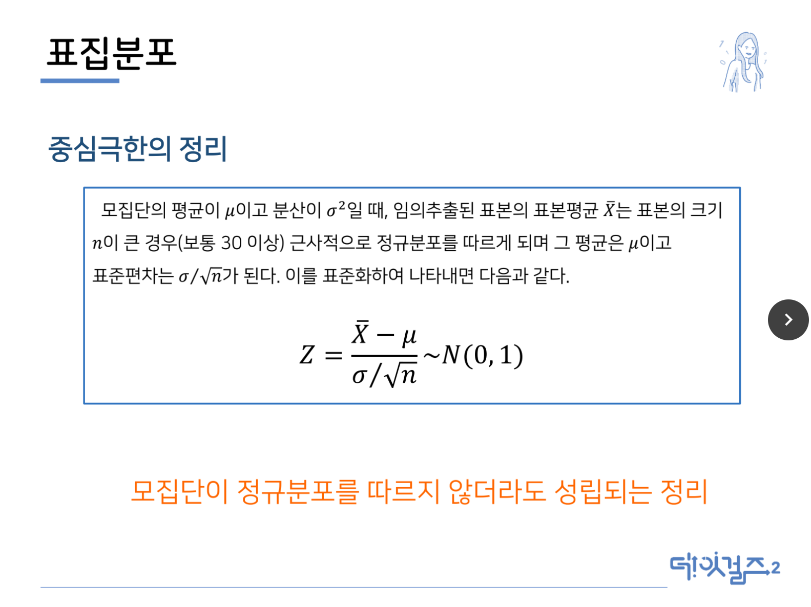
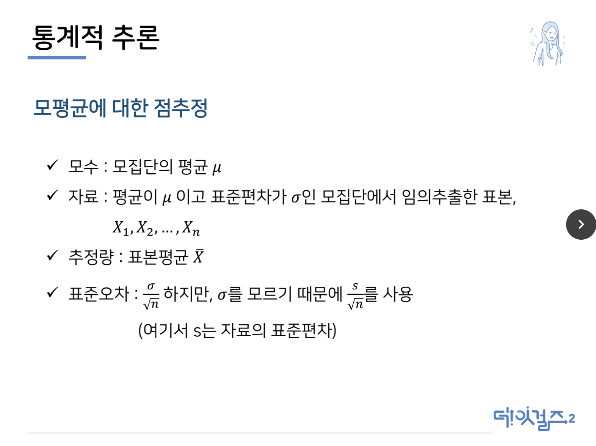
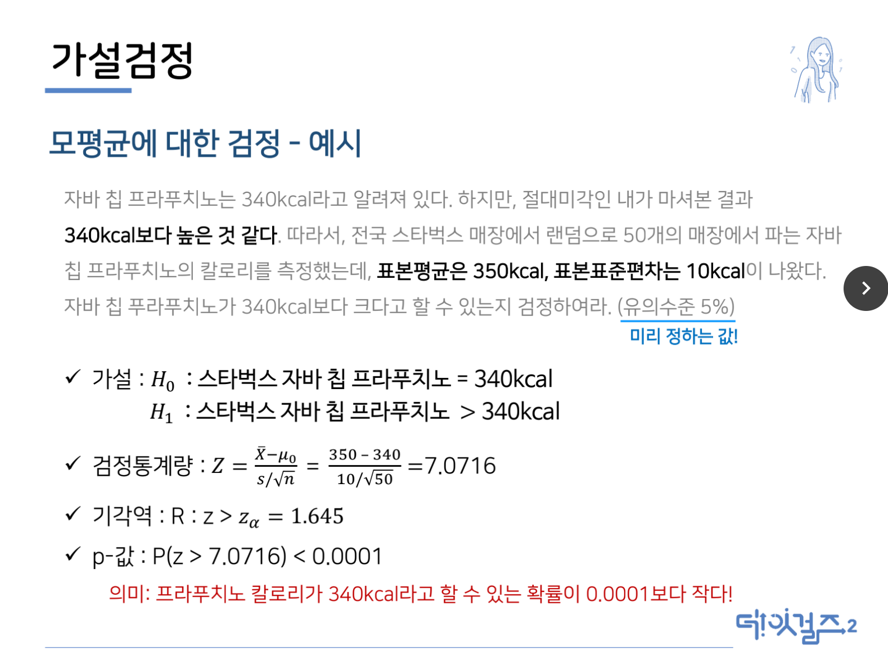

# 통계학

## 회귀분석은 통계학의 꽃이다!

```
매출액 = 1.5*티비광고비 +3*유투브광고비 + 2*페북광고비 -0.5*월요일 + 2.5*일요일
```

회귀분석을 하기 위해서는 몇 가지를 미리 알고 있어야 함

1. 정규분포(확률분포)
2. 통계적 추정
3. 검정

## 확률분포

통계학과 확률

```
통계는 표본을 바탕으로 모집단을 추론하는 것
따라서, 확률이 없으면 의미가 없음
```

* 확률 : 근원사건들이 일어날 가능성이 모두 같을 떄, 사건이 일어날 확률
* 확률의 특징
  * 확률은 0~1의 값을 갖는다.
  * 모든 사건에 대한 확률의 합은 1이다.

이산확률변수 - 확률분포표

> 발생할 사건에 대해 확률을 나열한 것

연속확률변수 - 확률밀도함수

> 확률의 밀도가 어느 구간에 더 높고 어느 구간에 더 낮게 분포하는지를 나타냄
>
> 영역으로 확률을 구함

## 정규분포

* 키, 몸무게, 강수량, 시험 점수 등 자연현상이나 사회현상과 관련된 연속확률변수의 확률밀도함수의 그래프는 정규분포와 비슷한 형태
* 정규분포는 평균을 중심으로 좌우 대칭인 종 모양의 곡선을 띄고 있음
* 평균과 분산만으로 특성을 모두 다 설명가능
* 정규분포의 특징

```
평균 = 최빈값 = 중앙값
평균을 중심으로 자우대칭
확률이 m을 중심으로 +-2s안에 거의 집중되어 있음(95.4%)
    m : 분포의 중심을 나타내는 위치 모수
    s : 평균으로부터 퍼져있는 정도를 나타내는 모수
```

>  이번 수학 시험점수의 평균은 60점 (총 100명) 표준편차 5점
>
> 나는 75점 (평균보다는 높음)
>
> 학생 중 95명 정도는 50~70점을 맞았을 것.
>
> 75점은 상위 2.5% 왜? - 직접 해보기

**평균과 분산에 따라 정규분포 모양은 달라지므로 비교하기 곤란**

## 표준정규분포

정규분포의 표준화

```
정규분포에서는 평균과 표준편차에 따라서 특정 영역의 넓이가 다르므로 두 그룹의 비교를 위해선 하나의 기준으로 재배치 해야 함
```

* NORMSDIST(Z)는 z값의 확률을 RETURN
  * NORMSDIST(0) = 0.5
  * NORMSDIST(1) = 0.84
  * NORMSDIST(1.65) = 0.95
* NORMSINV(X)는 확률이 x가 나오는 Z값을 RETURN
  * NORMSINV(0.5) = 0
  * NORMSINV(0.84) = 1
  * NORMSINV(0.95) = 1.645

## 표집분포

통계적 추론 : 표본을 통해 모집단을 예측하려면 둘 사이의 연결고리가 필요

* 모집단(population)
  * 모수(parameters) : 모집단으로부터 계산된 값.
  * 전수조사를 하지 않는 한, 절대 알 수 없는 미지의 수
* 표본(sample)
  * 통계량(statistics) : 표본으로부터 계산된 모든 값
  * 일반적으로 통계량을 가지고 모수를 추정함

> 표본평균들의 평균은 모평균과 같음
>
> 표본평균들의 분산은 (모분산/표본의크기)와 같음

## 중심극한의 정리



**보통 100 이상이 되어야 n이 크다고 말함**

## 실습

log(참여인원(votes))로 중심극한의 정리 확인

1. log(참여인원(votes))의 평균과 분산을 구하고 히스토그램 그리기
2. log(참여인원(votes)) 중 랜덤하게 100개의 표본을 추출한 후 평균 구하기
   1. rand()함수를 이용해 random number 생성
   2. rank(값, 데이터, [오름차순])함수를 이용해 ranking 부여
   3. query문을 이용해 100개 추출 = average(query(범위, “select votes where rank < 101"))
3. 값만 복사한 후, 2번 과정을 50번 재시도(복사하면, 값이 바뀌어 있음)
4. 표본평균들의 평균과 분산 히스토그램 그리기
5. 모수와 통계량을 비교하고, 중심극한의 정리를 따르는지 확인

## 통계적 추론

```
표본이 갖고 있는 정보를 이용하여 모수에 관한 결론을 유도하고 모수에 대한 가설의 옳고 그름을 판단하는 것

조사자의 관심에 따라

1. 모수의 추정
2. 모수에 대한 가설검정

이라는 두 가지 문제로 나눌 수 있음
```

> 1. 점추정 : 전체 고등학생의 평균키를 하나의 값으로 추정
> 2. 구간추정 : 전체 고등학생의 평균키를 포함할 만한 적당한 구간을 정함
> 3. 가설검정 : 전체 고등학생의 평균키가 5년 전의 평균값인 155cm와 다른지를 판단



* 표준편차(standard deviation) : 데이터의 흩어진 정도를 평가하는 도구로써, 평균으로부터 표본들의 흩어져 있는 산포도를 나타냄
* 표준오차 (standard error) : 모평균을 추정했을 시, 그 추정량은 표본으로부터 모집단을 추론한 것이기 때문에 완전하다고 할 수 없다. 따라서, 그 불완전성에 대한 오차를 의미함
* 신뢰구간 = (표본의 평균 - 2\*표준오차, 표본의 평균 + 2\*표준오차)

> 점추정
>
> * 모평균 추정 <- 표본의 평균
> * 표준오차 <- 표본의 표준편차/(표본의 개수)

## 가설검정

```
스타벅스의 자바 칩 프라푸치노는 Tall/355ml(12floz)에 340kcal라고 알려져 있다. 하지만,절대미각인 내가 마셔본 결과 340kcal보다 높은 것 같다. 따라서, 전국 스타벅스 매장에서
랜덤으로 50개의 매장에서 파는 자바 칩 프라푸치노의 칼로리를 측정했다.
```

```
✓ 모집단 : 스타벅스의 자바 칩 프라푸치노
✓ 표본집단 : 무작위로 선택된 50개의 매장의 프라푸치노
✓ 모수 : 340kcal
✓ 통계량 : 50개 자바 칩 프라푸치노의 평균 칼로리
```

```
검정하고 싶은 가설 : 스타벅스의 자바 칩 프라푸치노는 340kcal보다 높다.
```

> 1. 50개의 프라푸치노의 평균 = 350
> 2. 50개의 프라푸치노의 표준편차 = 10
>
> => 프라푸치노의 칼로리는 340일까?

따라서

1. 자바 칩 프라푸치노의 칼로리가 340kcal가 아니라고 주장하기 위해선, 자바칩 프라푸치노의 칼로리가 340kcal라고 하기엔 나오기 힘들 정도로 큰 값이 나오면 된다.
2. 즉, 충분히 큰 값인 c에 대해 Xത ≥ c 의 형태를 가질 때, 자바 칩 프라푸치노의 칼로리가 340kcal보다 높다고 할 수 있다.

충분히 큰 c의 기준은?

- c는 μ(푸라푸치노 칼로리)= 340이라면 거의 나오지 않을 정도의 값을 가져야 함

- 5%의 확률이 거의 나오지 않을 정도의 확률이라고 했을 때, 아래의 식에서 c보다 큰 경우를 ‘충분히’ 큰 경우라고 함

  ​					P[Xത ≥ c] = 0.05

- Xത가 c보다 큰 경우에 이를 ‘충분히’ 큰 값이라 보고 μ(푸라푸치노의 칼로리)가 340보다 크다고 주장할 수 있음

## 가설검정

> 가설검정 단계
>
> 1. 가설을 수립
>
> 2. 유의수준을 결정(내가 정하는 것) : 모수의 추정이 맞지 않을 확률을 결정
>
>    일반적으로 유의수준은 5%로 설정
>
> 3. 기각역 설정 : 가설의 기각여부를 결정하는 범위계산
>
>    유의수준이 결정되면 자동적으로 계산됨
>
> 4. 통계량의 계산 : 표본의 통계량을 이용해 가설검정
>
> 5. 의사결정 : 기각을 할지, 못 할지 결정

가설의 정의

```
주어진 사실 혹은 조사하고자 하는 사실이 어떠하다는 주장이나 추측
```

* 귀무가설(Null Hypothesis, H0)
  * 연구자가 증명하고자 하는 실험가설과 반대되는 입자, 증명되기 전까지는 효과도 없고 차이도 없다는 영가설
  * 효과/차이가 없다.
  * 깔라만시가 다이어트에 효과가 없다.
* 대립가설(Alternative Hypothesis, H1)
  * 귀무가설의 반대로 연구자가 실험을 통해 규명하고자 하는 가설
  * 효과/차이가 있다/크다/작다.
  * 깔라만시가 다이어트에 효과가 있다.

### 양측검정 & 단측검정

```
양측검정(two-side test) : 대립가설이 어떤 특정 모수랑 같지 않음을 검정
```

>  ex) 대립가설 : 스타벅스 자바 칩 프라푸치노의 칼로리는 340kcal가 아니다.

```
단측검정(one-side test) : 대립가설이 어떤 특정 모수 이상이거나 이하를 검정
```

>  ex1) 대립가설 : 스타벅스 자바 칩 프라푸치노의 칼로리는 340kcal보다 크다.
>
>  ex2) 대립가설 : 스타벅스 자바 칩 프라푸치노의 칼로리는 340kcal보다 작다.

### 유의수준 & 기각역

- 유의수준(α) : 귀무가설이 실제로 참일 때, 귀무가설에 대한 판단의 오류 수준데이터로부터 얻어지는 값이 아니라, 가설검정을 하기전에 미리 정해야 하는 값
  - 일반적으로 5%로 설정
- 기각역∶ 귀무가설을 기각하게 되는 영역

>  기각역에 **검정통계량**이 포함되는 경우 : 귀무가설 기각, 대립가설 채택
>
> 채택역에 **검정통계량**이 포함되는 경우 : 귀무가설 채택, 대립가설 기각

### 모평균에 대한 검정

```
표본의 크기가 클 때 모평균 μ에 대한 가설 H0 ∶ μ = μ0를 검정하기 위한 검정통계량은 다음과 같음
```

>  Z = (Xത − μ0) / (s/ n)

```
검정통계량의 분포는 H0가 하에서 N(0, 1)을 따른다. 각 대립가설에 대하여 유의수준 α를 갖는 기각역은 다음과 같다.
```



### 검정통계량 & 유의확률

* 검정통계량 : 가설검정을 위해 사용되는 주요 표본 통계량
* 유의확률(p-value) : 귀무가설(null hypothesis, H0)이 맞다는 전제 하에, 통계값(statistics)이 실제로 관측된 값 이상일 확률

```
왜 유의수준은 10%, 20%가 아니라, 5%로 결정하는 것일까?
```


